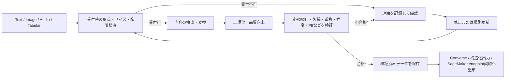

# FM入力用のデータ検証・処理Pipeline

## このページの位置づけ

| 項目 | 内容 |
|---|---|
| 対応Task | `D1-03`: FM入力用のデータ検証・処理Pipelineを実装する |
| 対応Skills | `1.3.1〜1.3.4` |
| 対象読者 | AIP-C01の学習者、およびFMへ渡すデータの取り込み、検証、変換を設計する人 |
| このページで分かること | Text、Image、Audio、Tabular dataをFMが利用できる形へ処理する流れ、品質検証、入力契約の違い、入力品質を高めるAWSサービスの機能を整理する。 |
| 前提知識 | FMの推論では、利用するAPIまたはモデルが定める入力形式を満たす必要があること |
| 対応する補足ページ | [`01-03-data-validation-and-processing.md`](../supplimental-pages/01-03-data-validation-and-processing.md) |

## まず全体像

Task 1.3は、FMへデータを渡す直前のJSON整形だけを扱うTaskではない。元データを受け取り、品質を検査し、モダリティに応じて内容を抽出・変換し、推論先が要求する契約へ整形するまでを扱う。

AWSの各サービスが提供する機能を処理段階へ対応付けると、全体は次のように整理できる。実際の構成では、ファイル形式やサイズのように抽出前に確認できる検査と、抽出した内容に対する検査を分ける。

図の要点は、原本、抽出結果、検証結果、推論用payloadを一つのデータとして扱わないことである。不合格データは理由とともに分けて扱い、修正後に同じ検査へ戻せるようにする。AWS Glue Data QualityのETL統合は不合格レコードの特定と隔離を支援し、Amazon CloudWatchへ結果を公開できる。

## Skill 1.3.1: FMが利用する前にデータ品質を検証する

入力検証では、まず「処理できるデータか」を確認し、その後に「用途に必要な品質か」を確認する。規則はデータ契約として明示する。

| 検証対象 | 確認内容 | AWS公式機能との対応 |
|---|---|---|
| 必須項目・欠損 | 必須列や必須属性が存在し、値が空またはNULLでないか | AWS Glue Data Qualityの`IsComplete`、`Completeness`。SageMaker Data Wranglerの欠損値の補完、indicator列の追加、行削除 |
| 文字列と文字コード | APIが受け付ける文字列か、想定する言語・書式か | Amazon ComprehendのリアルタイムPII検出はUTF-8テキストを受け取る。Data Wranglerは文字列の書式変更や妥当性検証を提供する |
| 形式・型・サイズ | 拡張子だけでなく、実体の形式、MIME type、列型、ファイル・request sizeが利用先の条件内か | BDAはモダリティと同期・非同期処理ごとに対応形式と上限を定める。Glue Data Qualityには`FileSize`や型検査がある |
| 重複 | ID、行、ファイルが一意か、同じ内容を再取り込みしていないか | `IsUnique`、`Uniqueness`、`DistinctValuesCount`、checksumを使う`FileUniqueness`と`FileMatch` |
| 更新日・鮮度 | 業務上許容する期間内のデータか | `DataFreshness`は列値、`FileFreshness`はAmazon S3上のファイルの鮮度を検査する |
| PII | 個人を識別できる情報が含まれるか、用途上許可された扱いか | Amazon ComprehendのPII検出は位置、種類、信頼度を返す。PII検出の対象は英語またはスペイン語のtext文書であり、一般のentity検出と対応言語を同一視しない。検出と利用可否の判断・マスキングは別の処理である |

AWS Glue Data QualityはData Quality Definition Language（DQDL）で規則を記述し、規則ごとの成否とData Quality scoreを返す。Data Catalogに登録済みのデータを継続評価する経路と、AWS Glue ETL job内で流れるデータを能動的に評価する経路がある。ETL job側は不合格レコードを特定できるため、読み込み前の除外や隔離に利用できる。結果はAmazon S3へ出力でき、Amazon EventBridgeとAmazon CloudWatchにも統合できる。

Data Quality scoreは合格した規則の割合である。したがって、必須の規則が一つ失敗しても平均scoreだけで許可する、といった意味ではない。各規則の結果と、処理を継続する条件はjob側で定義する。

## Skill 1.3.2: モダリティごとの処理を構成する

Text、Image、Audio、Tabular dataは、保存方法だけでなく、内容を機械可読にする処理が異なる。

| モダリティ | 主な処理 | AWSサービスで確認できる機能 | 主な出力 |
|---|---|---|---|
| Text・文書 | 文字抽出、段落・表・entityの抽出、言語やPIIの検出、正規化 | BDAの文書処理、Amazon Comprehend、Lambda、SageMaker Processing/Data Wrangler | 正規化したtext、構造化field、metadata |
| Image | 形式・解像度検査、OCR、visual content抽出、または画像を直接embedding | Knowledge BasesのBDA経路はOCRとvisual contentをtext表現へ変換する。Nova Multimodal Embeddingsは中間のtext変換なしで扱う | text表現またはmultimodal embedding、元画像参照 |
| Audio | 形式・sample rate・言語検査、音声認識、segmentとtimestampの保持 | BDAまたはAmazon Transcribeでtranscriptionを作る。Multimodal Knowledge BasesではBDAによるtext化とnative multimodal embeddingを選べる | transcript、segment、timestamp、またはembedding |
| Tabular | schema・型・必須列・欠損・一意性・鮮度の検査、列の変換 | AWS Glue Data Quality、SageMaker Data Wrangler、SageMaker Processing | 検証済みの行と列、品質結果、変換済みdataset |

Bedrock Data Automation（BDA）はdocument、image、video、audioから情報を抽出し、structured formatへ変換する。標準出力はモダリティに応じた一般的な結果を返す。document、image、audioではblueprintを使うcustom outputにより、抽出したいfieldを定義できる。BDAは表形式dataset全般の品質検査サービスではないため、Tabular dataの列・行の検証にはAWS Glue Data QualityやData Wranglerが対応する。

Amazon Bedrock Knowledge Basesのmultimodal処理には二つの経路がある。Nova Multimodal Embeddingsは画像、音声、動画を中間textへ変換せずembeddingにする。BDA経路は、audioを自動音声認識で転記し、videoからscene summaryとtranscriptを作り、imageからOCRとvisual contentを抽出してtext表現にする。その後、選択したembedding modelでvector化し、元ファイル参照、timestamp、content typeなどのmetadataと保存する。

Multimodal Knowledge Basesは、取り込み時とquery時に同じembedding modelを使う。BDA経路の検索queryはtextであり、Nova Multimodal Embeddings経路はtext queryに加えてimage queryを扱える。音声中の発話をtextで検索する場合はBDA経路がspeech transcriptionを提供する。

## Skill 1.3.3: 推論先が要求する入力形式へ変換する

Amazon Bedrockで新しいapplicationを作る場合、公式資料は`bedrock-runtime` endpointを推奨している。このendpointではConverse、Invoke、Chat Completions、ResponsesなどのAPIを利用できる。以下ではTask 1.3が求める入力整形に関係するConverseとstructured outputsを扱う。

### Amazon Bedrock Converse API

Converse APIは、messageを扱うBedrock modelに共通する会話用インターフェースである。requestでは`modelId`を指定し、`messages`に`role`と`content`を持つMessage objectを並べる。`role`は`user`または`assistant`で、`content`はtext、image、document、videoなどのContentBlockから成る。会話の文脈を維持する場合は、それまでのmessageを後続requestへ含める。

Converseはmodel間で共通の形式を提供するが、すべてのmodelが同じContentBlockを処理できることを意味しない。利用するmodelの対応機能を確認する。imageやdocumentなどはbytesまたはAmazon S3 URIで渡せる。S3 URIを使う場合は、呼び出しroleに対象objectの`GetObject`権限が必要である。

### JSON Schemaによるstructured outputs

Amazon Bedrockのstructured outputsは、modelの応答を利用者が指定したJSON Schemaへ適合させる機能である。Converseでは`outputConfig.textFormat`にschemaを指定する。これは入力dataのtransport formatではなく、下流処理が読む出力の構造を制約する設定である。

Bedrockは対応するJSON Schema Draft 2020-12のsubsetに対してschemaを検証する。未対応機能を含むschemaは400 errorになる。recursive schema、external `$ref`、数値の`minimum`や`maximum`、文字列の`minLength`や`maxLength`などは、2026-09-22に確認した公式資料では未対応である。対応modelも変わり得るため、利用前にmodel一覧で確認する。

### Amazon SageMaker AI endpoint payload

SageMaker AIの`InvokeEndpoint`では、request bodyのbytesがmodel containerへ変更されずに渡される。呼び出し側は`ContentType`に`application/json`、`text/csv`、`image/jpeg`など、containerが期待するMIME typeを指定する。containerがdeserializeできるbody schemaと、clientがdeserializeできるresponse schemaを両者で合わせる必要がある。

つまり、SageMaker endpointにはBedrock Converseのような全model共通の会話schemaが自動で付くわけではない。built-in algorithmでは定義済み形式を使い、独自containerではinference codeが受理する形式を契約として定義する。

## Skill 1.3.4: 入力品質を高める

品質向上は、値を無条件に書き換えることではない。原本を保ち、適用した変換を追跡できる形で、用途に必要な表現へ整える。

- Textでは、空白、大小文字、日付などの表記揺れや文字列書式の統一、不要なmarkupの除去、言語の識別、entity抽出などを行う。Amazon Comprehendは人、組織、場所、日付などのentityと信頼度を返す。
- Tabular dataでは、Data Wranglerの変換を使って欠損値の補完、削除、indicator追加、型変換、文字列検証などを行える。変換flowはSageMaker Processing jobとして実行できる。
- Imageやdocumentでは、BDAがOCR、分類、抽出、正規化、検証を含むdocument processingを一つのAPI駆動型interfaceで扱う。custom outputでは期待fieldをblueprintに定義する。
- Audioでは、BDAまたはAmazon Transcribeで音声をtextへ変換し、言語、segment、timestampを後続処理へ引き継ぐ。Amazon Transcribeの対応言語と機能はbatch、streaming、redactionなどで異なる。
- 重複排除では、業務IDによる一意性とfile checksumによる同一性を区別する。Glue Data Qualityは列の一意性とfile uniquenessの双方に対応する規則を持つ。

抽出や自動認識の結果には信頼度や誤りがあり得る。BDAはvisual groundingやconfidence scoreを提供し、Amazon Comprehendもentityごとのscoreを返す。これらは後続の検証やreview判断に使えるが、scoreだけで用途上の正しさが保証されるわけではない。

## 変更され得る対応状況と制約

以下は2026-09-22にAWS公式資料で確認した内容である。実装時には同じ公式ページで再確認する。

- BDAはdocument、image、video、audioを扱う。対応形式と上限はモダリティ、同期・非同期API、console経由かAPI経由かで異なる。たとえばdocumentの同期処理と非同期処理ではpage数・file size・DOCX対応が同一ではない。
- BDAのimage、audio、videoにはそれぞれfile size、resolutionまたはduration、formatなどの条件がある。固定の「BDA共通上限」として扱わない。
- BDAのfile処理にはcross-Region inference profileが必要である。requestと結果がprimary Regionの外へ移動する場合がある一方、公式資料では同じgeography内に留まり、保存dataはsource Regionのみに置かれると説明されている。data residency要件とIAM resourceを確認する。
- Multimodal Knowledge Basesの処理方式はRegion availabilityが異なる。公式の比較ページでは、Nova Multimodal Embeddings経路とBDA経路の利用Regionが別に示されている。
- Multimodal retrievalは、2026-09-22時点ではAmazon S3 data sourceに限定される。custom data sourceは10 MB以下のbase64 inline contentを扱えるが、Confluence、SharePoint、Salesforce、Web Crawlerのdata sourceではmultimodal fileがingestion時にskipされる。
- AWS Glue Data Qualityはnested型またはlist型をそのまま評価できないため、検査前にflattenが必要である。
- SageMaker AI endpointのpayload上限はendpoint方式で異なる。containerが受け付けるMIME typeとschemaもmodel実装ごとに異なる。

## 用語

| 用語 | このページでの意味 |
|---|---|
| モダリティ | Text、Image、Audio、Tabularなど、情報の表現形式 |
| データ契約 | 必須field、型、文字コード、size、schema、品質規則など、処理間で合意する条件 |
| 隔離（quarantine） | 不合格dataを正常経路へ混ぜず、理由とともに修正・確認待ちとして保持すること |
| 正規化 | 意味を保ちながら、表記、型、単位、空白などを一貫した形へ変換すること |
| ContentBlock | ConverseのMessage内でtext、image、documentなどのcontentを表す要素 |
| structured outputs | modelの応答を指定したJSON Schemaまたはtool definitionへ適合させるBedrock機能 |
| payload | 推論APIへ送るrequest body。SageMaker AIではcontainerが期待する形式に合わせる |

## このページの要点

- Skill 1.3.1は、必須項目、文字列・型、size、重複、欠損、鮮度、PIIを明示的な規則で検証し、結果を観測して不合格dataを分離する。
- Skill 1.3.2は、Text、Image、Audio、Tabularで異なる抽出処理を使いながら、抽出、正規化、検証、保存、再処理という管理可能な流れへそろえる。
- Skill 1.3.3では、Converseの会話message、Bedrock structured outputsのJSON Schema、SageMaker container固有payloadを混同しない。
- Skill 1.3.4は、正規化、entity・言語・PII検出、欠損処理、重複排除によって、FMへ渡すdataの一貫性を高める。

## 公式資料

- [AIP-C01 Content Domain 1](https://docs.aws.amazon.com/aws-certification/latest/ai-professional-01/ai-professional-01-domain1.html) — Task 1.3とSkills 1.3.1〜1.3.4
- [What is Bedrock Data Automation?](https://docs.aws.amazon.com/bedrock/latest/userguide/bda.html) — multimodal contentの抽出、structured output、safeguard
- [How Bedrock Data Automation works](https://docs.aws.amazon.com/bedrock/latest/userguide/bda-how-it-works.html) — standard output、custom output、blueprint、project
- [Prerequisites for using Bedrock Data Automation](https://docs.aws.amazon.com/bedrock/latest/userguide/bda-limits.html) — modality別の対応形式、size、duration、languageなどの条件
- [Cross Region support required for Bedrock Data Automation](https://docs.aws.amazon.com/bedrock/latest/userguide/bda-cris.html) — cross-Region処理、geography、source Regionでの保存
- [Build a knowledge base for multimodal content](https://docs.aws.amazon.com/bedrock/latest/userguide/kb-multimodal.html) — multimodal ingestion、processing、metadata、retrievalの流れ
- [Choosing your multimodal processing approach](https://docs.aws.amazon.com/bedrock/latest/userguide/kb-multimodal-choose-approach.html) — Nova Multimodal EmbeddingsとBDAの違い、Region、file type、data source
- [AWS Glue Data Quality](https://docs.aws.amazon.com/glue/latest/dg/glue-data-quality.html) — DQDL、Data CatalogとETLの違い、隔離、監視、制約
- [Evaluating data quality with AWS Glue Studio](https://docs.aws.amazon.com/glue/latest/dg/data-quality-gs-studio.html) — rule作成、job設定、実行、結果monitoringの流れ
- [DQDL rule type reference](https://docs.aws.amazon.com/glue/latest/dg/dqdl-rule-types.html) — 完全性、一意性、鮮度、file検査のrule type
- [Transform Data with SageMaker Data Wrangler](https://docs.aws.amazon.com/sagemaker/latest/dg/data-wrangler-transform.html) — 欠損、文字列、型、列・行の変換
- [Inference using Converse API](https://docs.aws.amazon.com/bedrock/latest/userguide/conversation-inference.html) — Message、role、ContentBlock、S3 content、会話履歴
- [Making inference requests](https://docs.aws.amazon.com/bedrock/latest/userguide/inference.html) — Bedrock Runtimeの推論APIとendpoint
- [Get validated JSON results from models](https://docs.aws.amazon.com/bedrock/latest/userguide/structured-output.html) — JSON Schema、strict tool use、対応subsetと制約
- [Model Hosting FAQs](https://docs.aws.amazon.com/sagemaker/latest/dg/hosting-faqs.html) — endpoint payload、MIME type、containerの入出力契約
- [Detecting PII entities](https://docs.aws.amazon.com/comprehend/latest/dg/how-pii.html) — PIIの検出とredaction
- [Entities](https://docs.aws.amazon.com/comprehend/latest/dg/how-entities.html) — entity type、confidence score、処理方式
- [Supported languages and language-specific features](https://docs.aws.amazon.com/transcribe/latest/dg/supported-languages.html) — batch・streamingと機能ごとの言語対応

最終確認日: 2026-09-22
