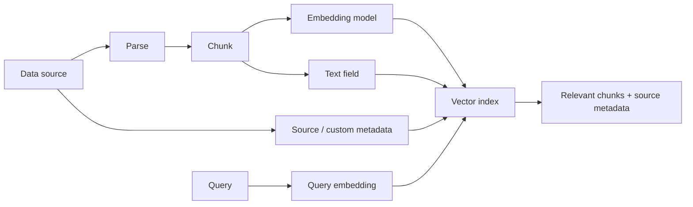

# Vector Storeを設計・実装する

## このページの位置づけ

| 項目 | 内容 |
|---|---|
| 対応Task | `D1-04`: Vector Storeを設計・実装する |
| 対応Skills | `1.4.1〜1.4.5` |
| 対象読者 | AIP-C01の学習者、およびFM拡張用の検索基盤を設計・運用する人 |
| このページで分かること | Vector Store、Metadata、Index、データソース接続、同期と削除を一つの仕組みとして構成する方法を、AWS公式資料の範囲で整理する。 |
| 前提知識 | Embeddingがデータを固定次元の数値Vectorへ変換し、類似したVectorを検索できること |
| 対応する補足ページ | [`01-04-vector-store-design.md`](../supplimental-pages/01-04-vector-store-design.md) |

## まず全体像

Vector StoreはEmbeddingだけを保存する箱ではない。元文書から作られたChunk、そのVector、出典やアクセス範囲を表すMetadataを対応付け、Query Vectorに近い情報を検索できるようにする。Amazon Bedrock Knowledge Basesでは、取り込み時に文書を解析してChunkへ分割し、Embedding modelでVectorへ変換し、選択したVector StoreのIndexへ書き込む。

図の前半が取り込み、後半が検索である。検索結果を原文へ結び付け、Metadataで絞り込むには、Vector、Chunk本文、Metadataの対応を壊さずに更新する必要がある。

## Skill 1.4.1: FM拡張用のVector Storeを構成する

AIP-C01のTask 1.4は、従来のKeyword検索だけでは扱いにくい意味的な近さを検索するため、FM拡張用のVector database architectureを作ることを求めている。公式試験ガイドは、Amazon Bedrock Knowledge Bases、Amazon OpenSearch Service、Amazon RDSとAmazon S3文書Repository、Amazon DynamoDBとVector databaseの組み合わせを例示している。

2026-09-22時点のAmazon Bedrock Knowledge Basesには、次の二つの管理方式がある。

| 管理方式 | Amazon Bedrockが管理する範囲 | 利用者が管理する主な範囲 |
|---|---|---|
| Bedrock Managed Knowledge Base | Data ingestion、Indexing、Storage、Retrieval infrastructure。既定ではEmbeddingとRerankingにもService-managed modelを使う | Data source、IAM、任意の独自Embedding／Reranking model、検索利用側のApplication |
| Customer-managed Knowledge Base | Knowledge Base APIと設定された取り込み・検索処理 | Vector Storeと関連Infrastructure、Index schema、接続、Capacity。Multimodal dataの解析なども構成する |

Customer-managed Knowledge BaseがVectorの保存先として公式に対応するのは、Amazon OpenSearch Serverless、Amazon OpenSearch Service Managed Clusters、Amazon Neptune、Amazon Aurora（RDS）、Amazon S3 Vectors、Pinecone、Redis Enterprise Cloud、MongoDB Atlasである。Third-party storeを使う場合、利用者はそのServiceの利用条件とData transferにも責任を持つ。

Amazon S3 Vectorsは、InfrastructureをProvisioningせずにVector bucket内の複数Vector indexへ保存・検索でき、公式資料は頻度の低いQuery workloadに適したCost-effectiveなStoreとして説明している。Bedrock Knowledge Baseで使えるのはAmazon BedrockとAmazon S3 Vectorsの両方が利用できるRegionである。

Amazon Aurora PostgreSQLを使う場合は、対応するAurora PostgreSQL version、RDS Data API、Secrets Managerで管理するUser、および`pgvector` 0.5.0以降が必要である。Knowledge BaseとAurora clusterは同じAWS accountに置く。Tableには少なくとも主Key、Vector、Chunk本文、Bedrock管理Metadataを持たせ、Custom metadataを使う場合はJSONB列とGIN Indexを追加できる。

## Skill 1.4.2: 検索精度とContextを支えるMetadataを定義する

Metadataは検索対象を絞る属性と、取得したChunkを元の資料へ結び付ける属性を保持する。Task 1.4は、文書のTimestamp、Author、Domain classificationなどをMetadata frameworkの例として挙げている。

Amazon Bedrock Knowledge Basesでは、S3 data sourceの各文書に同名の`.metadata.json` sidecar fileを置き、MetadataをChunkへ関連付けられる。対応するMetadata typeは`STRING`、`NUMBER`、`BOOLEAN`、`STRING_LIST`である。CSVでは列をContentまたはMetadataとして指定できるが、Content fieldは一つで、CSV列由来のMetadata値は文字列として保存される。

Schemaには、検索で必要になる意味を型と一緒に定める。たとえば文書ID、Version、Department、公開範囲、作成日、有効期限、出典を使う場合、日付を文字列にするか数値Timestampにするか、複数の公開Groupを`STRING_LIST`にするかを取り込み前に決める。StoreごとにMetadataの格納方法と上限が異なるためである。

AuroraではCustom metadataを一つのJSONB列へ格納してGIN Indexを作る構成が推奨されている。Amazon S3 VectorsではMetadataは既定でFilter可能で、文字列、Boolean、数値を扱う。Bedrock Knowledge Basesとの組み合わせでは、1 Vector当たりのCustom metadataは合計1 KB、35 Keyまでであり、超過するとIngestion jobが失敗する。

Metadata filterは検索精度やContext awarenessを高めるが、認証そのものではない。Customer-managed connectorの文書を同期すると、`bedrock:Retrieve`権限を持つ主体は同期済みDataを取得できる。Managed Knowledge BaseのACL-aware filteringも、Applicationが認証済みのUser identity contextを渡す前提であり、単独の認証・認可境界ではない。

## Skill 1.4.3: Dimension、Index、Shard、近似検索を整合させる

Vector fieldのDimensionは、Embedding modelが出力するDimensionと一致させる。2026-09-22時点で、例としてTitan Text Embeddings V2は256、512、1024次元を選べる。OpenSearch Serverless、Aurora、Neptune AnalyticsなどではIndex作成時にDimensionを設定するため、Embedding modelまたはDimensionを変える場合は既存IndexとのCompatibilityを確認する必要がある。

Amazon OpenSearch Serviceでは、`knn_vector` fieldを持つk-NN Indexを作成する。Approximate k-NNはHNSW（Hierarchical Navigable Small World）などのAlgorithmを使い、大規模Dataで検索を高速化する。Bedrock Knowledge Bases用のOpenSearch Managed Clusterでは`faiss` engineが必要で、`nmslib`は対応しない。Knowledge Base setup文書は、浮動小数点VectorにはL2、Binary VectorにはHammingを示している。Binary Vectorを保存できるKnowledge Bases対応StoreはOpenSearch ServerlessとOpenSearch Managed Clusterである。

OpenSearchのIndexはPrimary shardへ分割され、Replicaを持てる。ShardはData nodeへIndexを分散する単位である。大きすぎるShardは障害からのRecoveryを難しくし、小さすぎるShardを多数作るとCPUとMemoryを消費する。Primary shard数は既存Indexで容易に変えられないため、最初のIndexing前に検討する。

AIP-C01のTask 1.4は、専門DomainごとのMulti-indexと階層IndexをScale時のArchitecture例に挙げている。OpenSearchでは一つのIndexに複数の`knn_vector` fieldを定義でき、複数IndexをQuery対象にできる。一方、Indexを分ける単位やQuery routingはWorkload固有であり、Bedrock Knowledge Basesが一律のMulti-index構成を自動選択するわけではない。

## Skill 1.4.4: Data source connectorと権限境界を構成する

2026-09-22時点で、Amazon Bedrock Knowledge BasesのUnstructured data sourceとして、Amazon S3、Confluence、Custom data source、Google Drive、Microsoft OneDrive、Microsoft SharePoint、Web Crawlerが公式資料に列挙されている。Managed Knowledge BaseはS3、SharePoint、Confluence、Google Drive、OneDrive、Web Crawler向けConnectorを提供し、Web Crawler以外ではDocument-level ACL filteringを利用できる。

Customer-managed Knowledge BaseのConnector文書には、S3、Confluence、SharePoint、Salesforce、Web Crawler、Custom data sourceが掲載されている。ただし、2026-09-30からConfluence、SharePoint、Salesforce、Web Crawlerの新しいConnectorをCustomer-managed Knowledge Baseへ作成できなくなる予定である。既存ConnectorはData ingestionとRetrievalを含めて動作を継続する。AWSは、これらのConnectorが必要な新規ApplicationにManaged Knowledge Baseを案内している。

Connectorには少なくとも二つの権限境界がある。

1. 取り込み境界: BedrockのService roleがData sourceを読み、Embedding model、Vector Store、KMS key、Secrets Manager secretへ必要なActionだけを実行できるようにする。
2. 検索境界: ApplicationがEnd userを認証し、Knowledge Baseへの`Retrieve`権限を制御する。Metadata filterには確認済みIdentityから導いた属性を使い、Document-level ACLには確認済みのUser identity contextを渡す。

Web CrawlerはDocument-level ACLを対応しない。Index化されたContentはKnowledge BaseへAccessできるUserから取得可能になるため、権限別ContentをCrawlする用途ではこの制約を考慮する。

## Skill 1.4.5: 同期、削除、再Index化を管理する

最初の取り込みではData sourceの対象ContentをIndex化する。その後のBedrock Knowledge BasesのSyncはIncrementalであり、前回のSync以降に追加、変更、削除された文書だけを処理する。同期を停止した場合は、再度`StartIngestionJob`を実行して残りを取り込める。Jobの`status`、`statistics`、Sync history、Warningから結果を確認できる。

Managed Knowledge BaseではOn-demand、Daily、Weekly、MonthlyのSync scheduleを選択できる。Customer-managed Knowledge Baseでは`StartIngestionJob`による同期を開始する。S3とCustom data sourceは`KnowledgeBaseDocuments` APIによる直接の追加、更新、削除にも対応する。S3で直接変更した内容は元のS3 objectへ反映されないため、次回Syncで上書きされないようS3側にも同じ変更を反映する必要がある。また、Direct ingestionと`StartIngestionJob`を同時に実行しない。

Data sourceの`dataDeletionPolicy`では、Data source削除時にVector embeddingを`DELETE`するか`RETAIN`するかを指定する。既定は`DELETE`である。`RETAIN`を選ぶと、削除したData sourceのContentがVector Storeに残り、Retrievalに使われ続ける場合がある。削除が検索結果へ反映されたことまで確認する必要がある。

公式のKnowledge Bases文書は、削除された文書を示すApplication独自の論理削除Recordを`tombstone`というAPIまたは必須Schemaとして規定していない。Knowledge Basesでは、Syncで検知した削除、`DeleteKnowledgeBaseDocuments`、またはData deletion policyによって削除を扱う。

Amazon OpenSearch Serviceは`_reindex`、Index alias、SnapshotのRestoreを対応する。新しいSchema、Dimension、Shard構成へ移す場合、別IndexへRe-indexし、検証後にAliasを切り替えられる。切替後に問題があれば旧IndexへAliasを戻すか、保存済みSnapshotを別名IndexとしてRestoreできる。ただし、これはOpenSearchの機能であり、Bedrock Knowledge Bases全体に共通する自動Rollback機能ではない。

## Regionと提供状況

2026-09-22時点でManaged Knowledge Baseは`us-east-1`、`us-west-2`、`eu-west-1`、`eu-west-2`、`eu-central-1`、`ap-northeast-1`、`ap-southeast-2`、`us-gov-west-1`に対応する。AWS GovCloud (US-West)ではS3以外のConnector、Document-level ACL、Service-managed modelなどに制限がある。

Customer-managed Knowledge Baseでは、Knowledge Bases、Embedding model、Vector Store、Data source connectorのRegion対応がそれぞれ異なる。たとえばTitan Text Embeddings V2は2026-09-22時点でAsia Pacific (Tokyo)を含む複数Regionに対応する。構成を決めるときは、個々のServiceではなく必要な全ComponentのRegion対応を確認する。

## 重要な条件と制約

- Embedding modelの出力DimensionとVector IndexのDimensionを一致させる。
- Metadataの型、上限、Filter用IndexはStoreごとに異なる。取り込み前にSchemaを確定する。
- Metadata filterまたはACL-aware retrievalだけをEnd user認証の代わりにしない。
- Incremental syncのJob完了だけでなく、追加・更新・削除がQuery結果へ反映されたことを確認する。Aurora以外のStoreでは、Sync完了後に新しいVectorがQuery可能になるまで数分かかる場合がある。
- Connector、Vector Store、Embedding model、Region、Preview表示は変更され得る。このページの一覧は2026-09-22に確認した。

## 用語

| 用語 | このページでの意味 |
|---|---|
| Vector Store | Embedding Vectorと対応するChunk、Metadataを保存し、類似検索するStore |
| Dimension | 一つのEmbedding Vectorに含まれる数値要素の数 |
| Index | 検索可能な形でVectorと関連Fieldを組織する単位 |
| Shard | OpenSearch IndexをData nodeへ分散する単位 |
| Approximate k-NN | 全Vectorの厳密比較を避け、高速に近傍候補を探す検索方式 |
| Multi-index | Domain、Tenant、Schema、Lifecycleなどの境界で複数Indexを使う構成 |
| Full sync | 対象Data全体を走査・構築する同期。初回取り込みや全面再構築で現れる |
| Incremental sync | 前回以降の追加、変更、削除だけを処理する同期 |
| Tombstone | 削除済みであることを示す論理Marker。Knowledge Basesの必須API用語ではない |
| Re-index | 元Dataまたは既存Indexから、別のIndexを再構築する処理 |

## このページの要点

- Store選定は管理範囲、既存Database、QueryとMetadata、可用性、Scale、Regionをまとめて扱う。
- Metadataは検索精度だけでなく、出典、版、鮮度、公開範囲を検索時へ引き継ぐ契約である。
- Dimension、Index、Shard、Approximate search、Multi-indexは検索性能と再構築方法へ影響する。
- Connectorの読取権限、ApplicationのEnd user認証、Retrieval時のFilterを別の境界として設計する。
- 初回取り込み、Incremental sync、削除、Re-index、検証、RollbackまでをIndex lifecycleとして管理する。

## 公式資料

- [AIP-C01 Content Domain 1](https://docs.aws.amazon.com/aws-certification/latest/ai-professional-01/ai-professional-01-domain1.html) — Task 1.4とSkills 1.4.1〜1.4.5
- [Amazon Bedrock Knowledge Bases](https://docs.aws.amazon.com/bedrock/latest/userguide/knowledge-base.html) — Managed／Customer-managed Knowledge Base、Connector、管理範囲
- [Turning data into a knowledge base](https://docs.aws.amazon.com/bedrock/latest/userguide/kb-how-data.html) — 対応Data source、Vector Store、Ingestion処理
- [Prerequisites for using a vector store](https://docs.aws.amazon.com/bedrock/latest/userguide/knowledge-base-setup.html) — 対応Store、Dimension、Field、Metadata、権限要件
- [Include metadata in a data source](https://docs.aws.amazon.com/bedrock/latest/userguide/kb-metadata.html) — Metadata Schema、CSV、Data type
- [Connect a data source](https://docs.aws.amazon.com/bedrock/latest/userguide/data-source-connectors.html) — Connector、Data deletion policy、移行予定
- [Document-level access controls](https://docs.aws.amazon.com/bedrock/latest/userguide/kb-managed-ds-sharepoint-acl.html) — ACL filteringとApplication認証の責務境界
- [Sync your data](https://docs.aws.amazon.com/bedrock/latest/userguide/kb-data-source-sync-ingest.html) — Incremental sync、Job状態、反映遅延
- [Sync a managed data source](https://docs.aws.amazon.com/bedrock/latest/userguide/kb-managed-sync.html) — Sync scheduleと変更検知
- [Ingest changes directly](https://docs.aws.amazon.com/bedrock/latest/userguide/kb-direct-ingestion.html) — S3／Custom data sourceの直接追加・更新・削除
- [Supported AWS Regions for Managed Knowledge Bases](https://docs.aws.amazon.com/bedrock/latest/userguide/kb-managed-regions.html) — Managed Knowledge BaseのRegionとGovCloudの制限
- [Supported models and Regions](https://docs.aws.amazon.com/bedrock/latest/userguide/knowledge-base-supported.html) — Embedding model、Dimension、Region
- [Vector search in Amazon OpenSearch Service](https://docs.aws.amazon.com/opensearch-service/latest/developerguide/vector-search.html) — k-NN、Approximate search、Distance metric
- [Choosing the number of shards](https://docs.aws.amazon.com/opensearch-service/latest/developerguide/bp-sharding.html) — Shard設計と制約
- [Using Aurora PostgreSQL as a Knowledge Base](https://docs.aws.amazon.com/AmazonRDS/latest/AuroraUserGuide/AuroraPostgreSQL.VectorDB.html) — pgvector、Table、Index、権限
- [Importing and managing packages in OpenSearch Service](https://docs.aws.amazon.com/opensearch-service/latest/developerguide/custom-packages.html) — Re-indexとIndex aliasの切替例
- [Restoring data from snapshots](https://docs.aws.amazon.com/opensearch-service/latest/developerguide/managedomains-snapshot-restore.html) — Snapshot restoreとAliasの注意点

最終確認日: 2026-09-22
