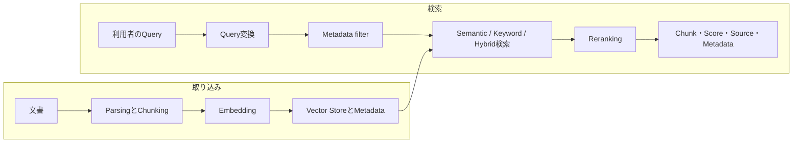

# FM拡張用のRetrievalを設計する

## このページの位置づけ

| 項目 | 内容 |
|---|---|
| 対応Task | `D1-05`: FM拡張用のRetrievalを設計する |
| 対応Skills | `1.5.1〜1.5.6` |
| このページで分かること | 文書の分割、Embedding、Vector Store、検索、Metadata filter、Reranking、Query変換、検索インターフェースを、AWS公式資料に沿って一連のRetrievalとして理解する。 |
| 前提知識 | Retrieval-Augmented Generation（RAG）は、外部データから取得した情報をFoundation Model（FM）の入力コンテキストへ追加して回答生成を補う方式である。 |
| 対応する補足ページ | [`01-05-retrieval-for-rag.md`](../supplimental-pages/01-05-retrieval-for-rag.md) |

## まず全体像

Retrievalには、文書を検索可能にする取り込み経路と、利用者の質問から関連情報を返す検索経路がある。Amazon Bedrock Knowledge Basesでは、取り込み時に文書をChunkへ分割し、Embeddingへ変換してVector Storeへ格納する。検索時には質問を検索表現へ変換し、必要に応じてMetadata filterを適用して候補を取得し、Rerankingで順序を付け直してFMまたは呼び出し元へ返す。

図は処理の責務を示す。ChunkingとEmbeddingは検索単位と比較表現を作り、Filterは検索対象を絞り、検索方式は候補を集め、Rerankingは候補の順序を再評価する。`Retrieve`を使うと、この結果を生成処理から分離して利用できる。

## Skill 1.5.1: 文書を検索単位へ分割する

Amazon Bedrock Knowledge Basesは、取り込み時にコンテンツをChunkへ分割し、各ChunkをEmbeddingへ変換してVector indexへ書き込む。元文書との対応関係も保持する。

| 方式 | AWS公式資料に示される動作 | 主な設定・制約 |
|---|---|---|
| Fixed-size chunking | 最大トークン数を基準に分割する | Chunk当たりの最大トークン数と、隣接ChunkのOverlap率を設定する |
| Default chunking（文境界を保持） | 約300トークンのText chunkへ分割し、完全な文が途中で切れないよう文境界を尊重する | AWS資料では独立した「Sentence chunking」ではなくDefault chunkingとして記載される |
| Semantic chunking | 文同士の意味的な差を用いて境界を決める | 最大トークン数、周辺文を評価へ含めるBuffer size、分割点を決めるBreakpoint percentile thresholdを設定する。FM利用による追加料金がある |
| Hierarchical chunking | 小さいChild chunkを検索し、最終結果では対応する広いParent chunkへ置き換える | ParentとChildの最大トークン数、Overlap token数を設定する。2階層を扱う |
| No chunking | 一つの文書全体を一つのChunkとして扱う | 事前にファイルを分割できる。文書ページ番号のCitation表示と、そのページ番号MetadataによるFilterは利用できない |

Parsed contentではページやSectionなどの論理境界を尊重し、最大トークン数に余裕があっても境界をまたいで結合しない場合がある。Text chunkingの設定はText文書に適用される。Audio、Video、ImageのChunkingはMultimodal embedding model側、またはBedrock Data AutomationでTextへ変換した後のText chunkingとして処理される。

Hierarchical chunkingでは、`numberOfResults`は検索するChild chunk数に対応する。同じParentを持つ複数のChildがParentへ置き換わるため、最終結果数は指定値より少なくなることがある。S3 vector bucketではHierarchical chunkingは推奨されず、ParentとChildを合わせて8,000トークンを超えるような設定ではMetadata size制限に達する可能性がある。

## Skill 1.5.2: Embeddingを選び、構成する

Embedding modelは文書やQueryを数値Vectorへ変換する。類似度の計算と検索そのものはEmbedding modelではなくVector Storeが行う。文書取り込み時とQuery時には、互換性のあるModel、Dimension、Vector typeを使う必要がある。

2026-09-22に確認したAmazon Bedrock Knowledge BasesのText embedding候補には、Amazon Titan Embeddings G1 - Text、Amazon Titan Text Embeddings V2、Cohere Embed English v3、Cohere Embed Multilingual v3がある。Multimodal向けにはAmazon Titan Multimodal Embeddings G1、Cohere Embed v3（Multimodal）、Amazon Nova Multimodal Embeddingsも掲載されている。

| 選定項目 | 公式仕様で確認する内容 |
|---|---|
| DimensionとVector type | Titan Text Embeddings V2は256、512、1,024次元のFloatまたはBinary、Titan G1 Textは1,536次元のFloat、Cohere English／Multilingualは1,024次元のFloatまたはBinaryをKnowledge Basesで扱える |
| 言語 | Titan Text Embeddings V2はEnglish向けに最適化され、100以上の言語対応はPreviewと記載される。異なる言語間で文書とQueryを照合するCross-language queryは結果が劣る可能性がある |
| Modality | Text専用Modelと、Text・Imageなどを同じVector空間へ表すMultimodal modelでは、入力と用途が異なる |
| 入力上限 | Titan Text Embeddings V2は最大8,192トークンまたは50,000文字を受け付けるが、RetrievalではParagraphやSectionなど論理単位への分割が案内されている |
| LatencyとBatch | Titan Text Embeddingsは検索時向けのLatency-optimized invocationと、Indexing向けのThroughput-optimized batch jobを提供する |
| Quota | BedrockのEmbedding modelはTokens Per MinuteではなくRequests Per MinuteでThrottlingされる |
| 品質と費用 | Model、Dimension、言語、Modalityごとの検索評価と、Bedrockの現行料金を確認する。Semantic chunking、Embedding、Rerankingには別々の処理と料金が関係する |

Amazon OpenSearch ServerlessとOpenSearch Managed Clustersは、Knowledge Basesの対応Storeの中でBinary vectorを保存できる。Store側のVector dimensionはEmbedding modelの出力Dimensionと一致させる。

## Skill 1.5.3: Vector searchの格納方式を構成する

| 構成 | AWS公式資料で確認できる役割と条件 |
|---|---|
| Amazon OpenSearch Service | `knn_vector` fieldへDense vectorを保存し、k-NNまたはApproximate k-NNで類似Vectorを検索する。Cosine similarity、Euclidean distance、Dot productなどの距離計算を扱える |
| Amazon Aurora PostgreSQL-Compatible Edition + `pgvector` | Relational dataとVectorをPostgreSQLで扱える。Bedrock Knowledge Basesとの接続では対応Aurora PostgreSQL version、RDS Data API、Secrets Manager、`pgvector` 0.5.0以上が必要で、HNSW index、Text index、必要に応じMetadata indexを作成する |
| Amazon Bedrock Managed Knowledge Base | Amazon BedrockがStorage、Indexing、Retrieval infrastructureを管理する。既定ではService-managed embeddingを使い、Model選択、Dimension設定、EmbeddingのService quota管理を利用者へ要求しない。Customer managed KMS keyも指定できる |

Customer-managedなBedrock Knowledge Baseでは、OpenSearch Serverless、OpenSearch Managed Clusters、Aurora、S3 Vectors、Neptune Analytics、Pinecone、Redis Enterprise Cloud、MongoDB Atlasなど、公式ページに掲載されたStoreを接続できる。選択可能なStoreはEmbeddingのVector typeとDimension、Region、Knowledge BasesのFeature対応に依存する。

Managed Knowledge BaseでCustom embeddingへ切り替える場合は、新しいKnowledge Baseの作成が必要である。Custom text embeddingは1,024次元、Float32を指定する。Managed embeddingではManaged rerankerを利用できるが、Custom embeddingではCustom rerankingまたはReranking無効化を使う。

## Skill 1.5.4: 検索、Filter、Rerankingを構成する

### Semantic、Keyword、Hybrid検索

- Semantic searchはQueryとChunkのVector embeddingを比較する。
- Keyword searchはRaw text中の語を検索する。
- Hybrid searchはVector embeddingとRaw textの両方を検索する。

Customer-managed Knowledge Basesで指定できる`overrideSearchType`は`SEMANTIC`または`HYBRID`である。未指定ならAmazon BedrockがVector Store構成に合う方式を決める。Hybrid searchは、Filter可能なText fieldを持つAmazon RDS、Amazon OpenSearch Serverless、MongoDB vector storeでサポートされる。それ以外のStoreまたは必要なText fieldがないStoreではSemantic searchが使われる。

Fully managed Knowledge BaseのRetrievalは常にHybrid searchであり、Semantic-onlyは選べない。APIではCustomer-managed構成の`vectorSearchConfiguration`ではなく`managedSearchConfiguration`を使う。

### Metadata filter

Metadata filterは、Embedding類似度やKeyword一致を計算する対象を文書属性で制限する。Knowledge Basesは`equals`、`notEquals`、大小比較、`in`、`notIn`、`startsWith`、`stringContains`、`listContains`などの演算子と、`andAll`、`orAll`による組み合わせを提供する。ただし演算子の対応状況はStoreで異なる。Managed Knowledge Baseでは`startsWith`と`stringContains`を利用できない。

S3 data sourceでは、文書に対応する`.metadata.json` sidecarを用意できる。CSVでは一つのContent fieldへChunkingとEmbeddingを適用し、指定した列をMetadataとして各Chunkへ関連付ける。CSV列由来のMetadata valueはStringとして保存される。Metadataの個数やサイズにはKnowledge BasesのQuotaがある。

### RerankingとScore

Amazon BedrockのReranker modelは、Queryに対するChunkの関連性をScore化して候補を並べ替える。`Rerank` APIを直接使うほか、`Retrieve`または`RetrieveAndGenerate`へReranking configurationを追加できる。Reranking後の順序はKnowledge Basesの既定Rankingを上書きする。Rerankerが扱うのはText dataである。

`Retrieve` responseには取得したContent、Source location、Metadataとともに関連度`score`が含まれる。`numberOfResults`は返す最大数であり、実際の結果数は少ない場合がある。公式APIはScoreを返すが、用途共通の合格Thresholdを定義していない。

## Skill 1.5.5: Queryを検索しやすい形へ変換する

試験ガイドは、Query expansion、Query decomposition、Query transformationをRetrieval改善の対象に挙げている。

- Query expansionは、Amazon Bedrockなどを使って、元Queryへ関連語や別表現を加えた検索Queryを作る。
- Query decompositionは、複数の論点を持つ複雑なQueryを小さいSub-queryへ分割する。
- Query rewriteは、利用者の表現を検索対象の用語、構文、制約に合うQueryへ書き換えるQuery transformationの一種である。

Amazon Bedrock Knowledge Basesの`RetrieveAndGenerate`では、`queryTransformationConfiguration`の`QUERY_DECOMPOSITION`を有効にできる。複数のQueryがKnowledge Baseへ実行され、複雑または広い質問の取得を補う。試験ガイドは、LambdaによるDecompositionとStep FunctionsによるTransformationも実装例として示している。

2026-09-22時点のKnowledge Bases設定資料で、組み込み`queryTransformationConfiguration`として明示されている種類はQuery decompositionである。Expansionや一般的なRewriteは、FMとアプリケーション処理を組み合わせたQuery handlingとして区別する。

## Skill 1.5.6: 一貫したRetrieval interfaceを公開する

Knowledge Basesは次のAPIを提供する。

- `Retrieve`: Queryに関連するSource chunkを配列で返し、生成処理と分離できる。
- `RetrieveAndGenerate`: RetrievalとModel invocationを結合し、Source chunkへのCitationを含む自然言語応答を生成する。
- `AgenticRetrieveStream`: 複雑なQueryをSub-queryへ分解し、反復検索と十分性評価を行い、重複排除したChunkとTrace eventをStreamで返す。

これらをアプリケーションのREST API、FMのFunction calling、MCP toolから呼び出せる。Amazon BedrockのClient-side tool useでは、アプリケーションがToolの名前、説明、Input schemaをModelへ渡し、Modelが返したTool callをアプリケーションが実行して結果をModelへ返す。

Amazon Bedrock AgentCore GatewayのManaged Knowledge Bases connectorは、`Retrieve`と`AgenticRetrieveStream`をMCP toolとして公開する。既定の`Retrieve` Input schemaでAgentが指定できるのは`retrievalQuery.text`であり、Knowledge Base IDや検索設定は管理者側に置かれる。`numberOfResults`、Metadata filter、Search type、RerankingなどをAgentから設定させる場合はParameter overrideで公開する。

`Retrieve`の結果は、少なくとも次の意味を持つFieldとして扱える。

| Field | 内容 |
|---|---|
| `content` | 取得したText、Image、Row、Audio、Videoなどの内容 |
| `location` | S3、Web、Confluenceなど元Sourceの場所 |
| `score` | Queryに対する関連度Score |
| `metadata` | Source fileへ関連付けられた属性 |

## 変更されやすい対応状況

2026-09-22時点で、Embedding model、Reranker、Managed Knowledge Base、Vector Store、Regionの対応はFeatureごとに異なる。たとえばTitan Text Embeddings V2、Cohere Embed English v3、Cohere Embed Multilingual v3はTokyo RegionでKnowledge Bases用Text embeddingとして掲載されている。一方、Parsing、Reranking、Multimodal、Managed Knowledge Baseの対応は同じ一覧とは限らない。

実装時は、Knowledge BasesのSupported models and Regions、RerankingのSupported Regions/models、選択するVector StoreのRegion表をそれぞれ確認する。Cross-Region inferenceを使うとDataが複数Region間で共有され得る点も確認が必要である。

## 重要な条件と制約

- Chunking、Embedding model、Dimension、Vector type、Storeは取り込み時の互換性を保つ必要がある。
- Hierarchical chunkingでは、ChildからParentへの置換により返却数が`numberOfResults`より少なくなることがある。
- Hybrid search、Metadata filter演算子、Binary vectorの対応はStoreによって異なる。
- Managed Knowledge BaseとCustomer-managed Knowledge Baseでは、検索設定名、検索方式、Rerankingの既定動作が異なる。
- GuardrailsはLLMへの入力と生成応答へ適用され、Knowledge Basesが実行時に取得したReference自体には適用されない。
- Model、Region、料金、Quota、Feature提供状況は変更されるため、実装時に公式の対応表を再確認する。

## 用語

| 用語 | このページでの意味 |
|---|---|
| Chunk | 検索、Embedding、FMへのContext追加の単位となる文書断片 |
| Embedding | TextやImageなどの意味的特徴を表す数値Vector |
| Semantic search | Queryと文書のEmbedding類似度で検索する方式 |
| Hybrid search | Semantic searchとRaw textの検索を組み合わせる方式 |
| Metadata filter | Sourceの属性を条件に検索対象を制限する処理 |
| Reranking | 初段検索の候補を、Queryとの関連性でScore化し直して並べ替える処理 |
| Query decomposition | 複雑な質問を検索可能な複数のSub-queryへ分ける処理 |
| Retrieval interface | Queryと設定を受け、Content、Source、Score、Metadataなどを返すAPIまたはTool契約 |

## このページの要点

- Retrieval品質は、Chunking、Embedding、Store、検索方式、Filter、Reranking、Query変換という複数の段階で構成される。
- Default、Fixed-size、Semantic、HierarchicalのChunkingは、境界の決め方と取得時に返すContextが異なる。
- Semantic、Keyword、Hybrid検索、Metadata filter、Rerankingは役割が異なり、StoreとManaged方式によって利用可能な設定も異なる。
- `Retrieve`、REST、Function calling、MCP toolのいずれで公開しても、Query inputとContent・Source・Score・MetadataのOutput contractを一貫させられる。

## 公式資料

- [AIP-C01 Content Domain 1](https://docs.aws.amazon.com/aws-certification/latest/ai-professional-01/ai-professional-01-domain1.html) — Task 1.5とSkills 1.5.1〜1.5.6
- [Knowledge Base chunking and parsing](https://docs.aws.amazon.com/bedrock/latest/userguide/kb-chunking-parsing.html) — Default、Fixed-size、Semantic、Hierarchical、No chunking
- [Configure and customize queries and response generation](https://docs.aws.amazon.com/bedrock/latest/userguide/kb-test-config.html) — Search type、Metadata filter、Reranking、Query decomposition
- [Include metadata in a data source](https://docs.aws.amazon.com/bedrock/latest/userguide/kb-metadata.html) — CSVとSidecar metadata、対応Data type
- [Amazon Titan Text Embeddings models](https://docs.aws.amazon.com/bedrock/latest/userguide/titan-embedding-models.html) — Dimension、言語、入力上限、Latency／Batch
- [Supported models and Regions for Amazon Bedrock knowledge bases](https://docs.aws.amazon.com/bedrock/latest/userguide/knowledge-base-supported.html) — Embedding model、Vector type、Dimension、Region
- [Prerequisites for using a vector store you created](https://docs.aws.amazon.com/bedrock/latest/userguide/knowledge-base-setup.html) — 対応Store、Vector field、Dimension、Binary vector
- [Vector search](https://docs.aws.amazon.com/opensearch-service/latest/developerguide/vector-search.html) — OpenSearchのVector field、検索方式、距離Metric
- [Using Aurora PostgreSQL as a Knowledge Base for Amazon Bedrock](https://docs.aws.amazon.com/AmazonRDS/latest/AuroraUserGuide/AuroraPostgreSQL.VectorDB.html) — `pgvector`、Data API、Index、Metadata column
- [Create a managed knowledge base](https://docs.aws.amazon.com/bedrock/latest/userguide/kb-managed-create.html) — Managed store、Managed／Custom embedding、制約
- [Query a knowledge base and retrieve data](https://docs.aws.amazon.com/bedrock/latest/userguide/kb-test-retrieve.html) — `Retrieve`、Managed search、Score、Reranking
- [Improve query responses with a reranker model](https://docs.aws.amazon.com/bedrock/latest/userguide/rerank.html) — Rerankerの動作と利用経路
- [Retrieving information using Knowledge Bases](https://docs.aws.amazon.com/bedrock/latest/userguide/kb-how-retrieval.html) — Retrieval APIと生成処理の分離
- [Use a tool to complete a model response](https://docs.aws.amazon.com/bedrock/latest/userguide/tool-use.html) — Function callingとTool実行主体
- [Managed Knowledge Bases as an AgentCore connector target](https://docs.aws.amazon.com/bedrock-agentcore/latest/devguide/gateway-target-connector-managed-kb.html) — MCP toolのSchemaとResponse

最終確認日: 2026-09-22
