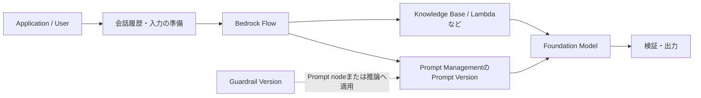

# Prompt engineeringとGovernanceを実装する

## このページの位置づけ

| 項目 | 内容 |
|---|---|
| 対応Task | `D1-06`: Prompt engineeringとGovernanceを実装する |
| 対応Skills | `1.6.1〜1.6.6` |
| このページで分かること | Modelへの指示、会話Context、Promptの管理と品質保証、反復改善、複数段のPrompt systemを、AWS公式資料の範囲で整理する。Amazon Bedrock Prompt Management、Flows、Guardrailsの役割とVersionの扱いも説明する。 |
| 前提知識 | FMへの推論Request、System／User message、Retrieval-Augmented Generation（RAG）の基本 |
| 対応する補足ページ | [`01-06-prompt-engineering-and-governance.md`](../supplimental-pages/01-06-prompt-engineering-and-governance.md) |

## まず全体像

Task 1.6は、単一のPrompt文を工夫するだけのTaskではない。Modelの振る舞いと出力を指示し、会話Contextを維持し、PromptをVersion管理してテストし、承認と監査を経て展開し、必要なら以前の版へ戻せる仕組みまでを対象にする。複雑な処理では、前処理、Prompt、Retrieval、条件分岐、後処理をFlowとして接続し、Guardrailを適用する。

AWS公式資料で確認できる主な関係は次のとおりである。

図では、Prompt、Flow、Guardrailを別の管理対象として示している。Prompt Managementは再利用可能なTemplateとそのVersionを管理する。FlowsはNode間でデータを渡し、順序や条件分岐を構成する。Guardrailsは入力やModel応答を設定済みPolicyで評価する。会話履歴の保存期間、User確認、業務上の承認状態などは、これらだけで自動的に決まるものではなく、ApplicationとGovernanceの設計に含まれる。

## Skill 1.6.1: Model instruction frameworkを作る

AIP-C01試験ガイドは、Modelの振る舞いと出力を制御する指示Frameworkを作ることを求める。例として、Prompt ManagementによるRole定義、GuardrailsによるResponsible AIの統制、Responseを整形するTemplate設定が挙げられている。

AWSのPrompt engineering資料は、Promptの構成要素としてTaskまたはInstruction、TaskのContext、Demonstration example、Modelへ処理させるInput textを挙げている。指示は単純、明確、完全にし、期待する出力形式や長さなどを明示する。D1-06で扱う構造へ対応付けると次のようになる。

| 構成要素 | Promptで指定する内容 | AWS公式機能との関係 |
|---|---|---|
| Role・Task | Modelが担う役割と実行する作業 | System messageやPrompt templateのInstructionとして表現する |
| 制約 | 使用できる情報、禁止事項、長さ、選択肢など | 明確なInstructionと出力指標で表現する。Safety policyはGuardrailも併用できる |
| Context | 判断に使う参照情報、Domain、会話の履歴 | Prompt variableやMessageとして渡す。ModelはRequestをまたいで自動的に前回を記憶しない |
| 出力Schema | 必須Field、型、列挙値、追加Fieldの可否 | Prompt内の形式指定に加え、対応ModelではStructured outputsへJSON Schemaを指定できる |
| 拒否条件 | 対象外、根拠不足、Policy違反時の扱い | PromptのInstructionと、GuardrailのBlocked message／Filterで扱う |

Amazon BedrockのStructured outputsでは、推論Requestへ対応するJSON Schemaを指定する。BedrockはSchemaを検証し、未対応のSchema機能なら400 errorを返す。初めてのSchemaはGrammarのCompileに数分かかる場合があり、成功したGrammarは最初のAccessから24時間Cacheされる。対応API、Model、JSON Schema機能には制約があるため、Promptへ「JSONで返す」と書く方法と同一ではない。

GuardrailsはContent filters、Denied topics、Word filters、Sensitive information filters、Contextual grounding checks、Automated Reasoning checksを提供する。入力PromptとModel応答を評価でき、`ApplyGuardrail` APIではFMを呼び出さずにGuardrailだけを適用できる。Guardrailを使っても、Application固有の必須Field検証や業務上の認可判断が不要になるわけではない。

## Skill 1.6.2: Contextを保つ対話Systemを作る

AIP-C01試験ガイドは、Contextを維持してUser interactionを改善する仕組みを求める。例として、Step FunctionsによるClarification workflow、Amazon ComprehendによるIntent recognition、DynamoDBによるConversation history storageが挙げられている。

BedrockのPrompt engineering資料は、APIで利用するModelが、前の対話を現在のPromptへ含めない限り過去のRequestを記憶しないと説明している。そのためApplicationは、継続に必要なMessageまたは要約を次のRequestへ含める。保持する履歴、要約する時点、保存期間、削除、アクセス制御はApplication側で定める。

Intentや必須情報が不明な場合は、回答を推測して進める代わりに確認を求める処理を構成できる。Bedrock FlowsのAgent nodeはMulti-turn invocationを扱え、追加情報が必要な場合はFlow executionを一時停止し、Userから情報を得て再開できる。一般のFlowではCondition nodeが条件を順番に評価し、最初に成立したBranchへデータを送る。

## Skill 1.6.3: Prompt managementとGovernanceを実装する

Prompt Managementでは、再利用可能なPromptを作成し、ModelまたはInference profile、推論Parameter、変数を設定できる。主要な概念は次のとおりである。

- **Variable**: Test時またはRuntime invocation時に値を渡すPlaceholder。
- **Variant**: Message、Model、推論設定などを変えたPromptの代替構成。Variant間の出力を比較できる。
- **Draft**: 保存しながら反復編集する作業中のPrompt。
- **Version**: ある時点のPrompt設定のSnapshot。Productionで使うPromptを固定するために作成する。

Prompt VersionのARNを`modelId`に指定して、`Converse`、`ConverseStream`、対応する`InvokeModel` APIから実行できる。Managed promptを`Converse`で使う場合、`system`や`inferenceConfig`など同時指定できないFieldがあり、`messages`を指定するとManaged prompt内のMessageの後ろへ追加される。

AIP-C01試験ガイドは、Parameterized template、Approval workflow、S3のTemplate repository、CloudTrailによる利用追跡、CloudWatch LogsによるAccess loggingをPrompt governanceの例に挙げる。一方、Prompt ManagementのUser Guideが定義するPromptのLifecycle状態はDraftとVersionであり、Owner、Reviewer、Approverという固有状態や承認Gateは同User Guideに明記されていない。したがって、所有者、Review結果、承認者、採用Version、Rollback先を組織のWorkflowと記録で管理し、AWSのVersionと監査Eventへ関連付ける必要がある。

CloudTrailはAmazon BedrockのAPI操作を記録する。Management eventには、操作を行った主体、日時、Action、Request parameterなどが含まれる。これにより「誰がどの管理操作を行ったか」を追跡できるが、業務上の承認理由や評価合格の証跡は、別途そのWorkflowで記録する。

PromptのRollbackは、Applicationが参照するPrompt Versionを以前のVersionへ戻すことで行える。Bedrock Flowsでは、Production applicationはVersionそのものではなくAliasを呼び出し、AliasのRouting先を以前のImmutable flow versionへ変えて戻せる。

## Skill 1.6.4: Promptの品質保証を行う

AIP-C01試験ガイドは、Promptの有効性と信頼性を確保する品質保証Systemを求める。例として、Lambdaによる期待出力の検証、Step FunctionsによるEdge case test、CloudWatchによるPrompt regression testが挙げられている。

Prompt ManagementのTest windowでは、変数にTest valueを入れてPromptを実行できる。Variantを作り、異なるMessage、Model、推論設定の出力を比較できる。Test valueは一時的で、Promptを保存しても保存されない。Promptに満足した時点でVersionを作成し、Productionで使うSnapshotにする。

GuardrailにもWorking draftとTest windowがある。Draftまたは作成済みVersionをTest／Benchmarkし、設定がUse caseに合うか確認してからVersionを作成する。新しいVersionを作っただけではApplicationへ反映されず、ApplicationがそのVersionを明示的に使用する必要がある。

品質保証では、通常Inputだけでなく、境界値、Intent不明、形式違反、Policy違反を狙うInput、過去版で成功したInputを含められる。期待する出力形式、拒否、Grounding、Latency、Tokenなど、判定可能な結果を検査し、Prompt／Model／推論設定／GuardrailのVersionと結果を対応付ける。

## Skill 1.6.5: Promptを反復的に改善する

AWS公式資料では、PromptのInstruction、Context、Demonstration example、Inputを組み合わせ、明確な出力指標を与える。Few-shot promptingは、入力と望ましい出力の組を少数提示し、Modelが期待する形式やTaskを較正できるようにする方法である。Zero-shotは例を含めない。

Few-shot exampleはPromptのTokenを消費し、例の選択も出力へ影響する。Model providerやModelごとにPrompt形式と性能特性が異なるため、一般的なPatternだけで確定せず、対象ModelでTestする。Prompt ManagementではVariantを比較し、評価後に採用構成をVersion化できる。

Skill 1.6.5の公式例にはStructured input component、Output format specification、Chain-of-thought instruction pattern、Feedback loopが含まれる。ただし、最終利用者へ内部推論の全文を開示することはTaskの必須条件ではない。Applicationが必要とするのは、検証可能な最終出力、根拠、形式、拒否などの要件であり、それらを評価して次のPrompt改善へ反映する。

## Skill 1.6.6: 複雑なPrompt systemをFlowとして構成する

Amazon Bedrock Flowsは、Prompt、FM、Knowledge Base、LambdaなどをNodeとして接続し、End-to-endの生成AIWorkflowを構築する。NodeのInputにはExpressionと型を指定し、Runtimeで型が検証される。Condition nodeでは比較演算子と論理演算子でBranchを作り、複数条件が成立した場合は定義順で先の条件が優先される。

前処理と後処理にはLambda function nodeを使用できる。Prompt nodeにはPrompt ManagementのPrompt ARNまたはInline promptを指定でき、Prompt nodeへGuardrail ID／ARNとVersionを設定できる。Knowledge Base nodeでは`RetrieveAndGenerate`を使う場合にGuardrailを適用できる。

FlowはWorking draftを`Prepare`してSample inputでTestし、満足した構成をVersionとして発行する。Flow VersionはImmutableなSnapshotである。ApplicationはAliasへ`InvokeFlow` Requestを送り、AliasのRoutingを変更することで新旧Versionを切り替える。

## 2026-09-22時点の提供条件とQuota

変更されやすい情報のため、利用前に公式ページを再確認する。

| 対象 | 2026-09-22に確認した内容 |
|---|---|
| Prompt ManagementのRegion | 東京（`ap-northeast-1`）、大阪（`ap-northeast-3`）を含む公式一覧のRegionで利用可能 |
| Prompt ManagementのModel | `Converse` APIが対応するText modelを利用可能。Prompt設定がAnthropic ClaudeまたはMeta Llamaの場合に限り、`InvokeModel`／`InvokeModelWithResponseStream`でもManaged promptを利用可能 |
| Prompt Managementの既定Quota | 1 Region・1 Account当たりPrompt 500（調整可能）、1 Prompt当たりVersion 10（調整不可） |
| FlowsのRegion・Model | Prompt Managementと同じ一覧のRegionを掲載。Prompt nodeは`Converse`対応Text model、Agent／Knowledge Base nodeは各機能の対応Modelに依存 |
| Flowsの既定Quota | 1 Region・1 Account当たりFlow 100（調整可能）、1 Flow当たりVersion 10、Alias 10（後二つは調整不可） |
| Guardrails | 対応Region／Model、FilterのLanguageとTierは機能ごとに異なる。1 Region・1 Account当たりGuardrail 100（調整不可） |
| Structured outputs | 対応ModelはModels at a glanceで確認する。対応SchemaはJSON Schema Draft 2020-12のSubsetで、Recursive schemaや外部`$ref`などは非対応 |

## 重要な条件と制約

- FMは、過去のRequestを現在のPromptへ含めない限り、Request間の対話を自動では記憶しない。
- Prompt、Guardrail、Flowは別々にVersion管理される。展開記録では実際に組み合わせた各Versionを識別する必要がある。
- Prompt内の形式指定は、対応ModelでのStructured outputsによるSchema強制と同じ保証ではない。
- GuardrailはApplication固有の認可、業務規則、完全なOutput schema検証の代替ではない。
- Prompt ManagementのVersionはSnapshotだが、Owner／Review／Approvalの業務状態そのものはPrompt Management User Guideで定義されていない。
- Region、Model対応、Quota、Guardrail tier、Preview機能は変わり得るため、導入時に公式一覧を確認する。

## 用語

| 用語 | このページでの意味 |
|---|---|
| Prompt | ModelへTask、Context、例、入力、出力条件などを伝える入力 |
| Prompt variable | Test時またはRuntime時に値を入れるTemplate内のPlaceholder |
| Variant | Prompt本文、Model、推論設定などを変えた比較対象の構成 |
| Version | Prompt、Flow、Guardrailのある時点の設定を固定したSnapshot |
| Few-shot | 少数の入力と望ましい出力の組をPromptに含める方法 |
| Structured outputs | 対応Modelの生成結果を指定したJSON Schemaに従わせるBedrockの推論機能 |
| Flow alias | Applicationの呼び出し先を固定したまま、参照するFlow Versionを切り替えるResource |

## このページの要点

- PromptはRole、Task、Context、例、入力、制約、出力形式を明確にし、Safety policyにはGuardrailも組み合わせる。
- 会話ContextはApplicationが保存・要約・再投入し、不明なIntentや不足情報には確認Flowを用意する。
- PromptのDraft、Variant、Versionと、評価、承認記録、CloudTrailの監査Eventを関連付ける。Prompt Management単独が業務承認Workflowを定義するわけではない。
- 正常、境界、Policy違反、RegressionのTestをVersionと対応付け、合格した構成だけを展開する。
- 複雑な処理はFlowsのNode、Condition、Version、Aliasで構成し、PromptとGuardrailのVersionも明示する。

## 公式資料

- [AIP-C01 Content Domain 1](https://docs.aws.amazon.com/aws-certification/latest/ai-professional-01/ai-professional-01-domain1.html) — Task 1.6とSkills 1.6.1〜1.6.6
- [Prompt engineering concepts](https://docs.aws.amazon.com/bedrock/latest/userguide/prompt-engineering-guidelines.html) — Promptの構成要素、Few-shot、Request間の記憶
- [Design a prompt](https://docs.aws.amazon.com/bedrock/latest/userguide/design-a-prompt.html) — 明確なInstructionとOutput format
- [Prompt Management](https://docs.aws.amazon.com/bedrock/latest/userguide/prompt-management.html) — Variable、Variant、Test、Version、Applicationへの統合
- [Test a prompt](https://docs.aws.amazon.com/bedrock/latest/userguide/prompt-management-test.html) — Test value、Runtime実行、Managed prompt利用時の制約
- [Deploy a prompt using versions](https://docs.aws.amazon.com/bedrock/latest/userguide/prompt-management-deploy.html) — DraftとVersion snapshot
- [Supported Regions and models for Prompt Management](https://docs.aws.amazon.com/bedrock/latest/userguide/prompt-management-supported.html) — RegionとModelの対応条件
- [Structured outputs](https://docs.aws.amazon.com/bedrock/latest/userguide/structured-output.html) — JSON Schema、対応API、制約
- [Amazon Bedrock Flows](https://docs.aws.amazon.com/bedrock/latest/userguide/flows.html) — Flowの作成、Test、Version、Alias
- [Node types for flows](https://docs.aws.amazon.com/bedrock/latest/userguide/flows-nodes.html) — Prompt、Condition、Agent、Knowledge Base、Lambda node
- [Include Guardrails in a flow](https://docs.aws.amazon.com/bedrock/latest/userguide/flows-guardrails.html) — Prompt nodeとKnowledge Base nodeへのGuardrail適用
- [Amazon Bedrock Guardrails](https://docs.aws.amazon.com/bedrock/latest/userguide/guardrails.html) — Filter、Draft、Version、適用方法
- [Test your guardrail](https://docs.aws.amazon.com/bedrock/latest/userguide/guardrails-test.html) — Working draftとVersionのTest
- [Monitor Amazon Bedrock API calls using CloudTrail](https://docs.aws.amazon.com/bedrock/latest/userguide/logging-using-cloudtrail.html) — Bedrock API操作の監査Event
- [Amazon Bedrock endpoints and quotas](https://docs.aws.amazon.com/general/latest/gr/bedrock.html) — Prompt Management、Flows、Guardrailsの既定Quota

最終確認日: 2026-09-22
