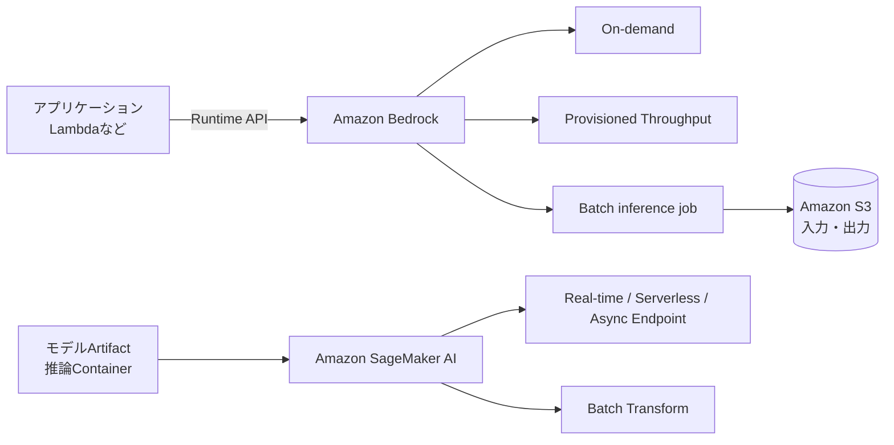

# Foundation Modelのデプロイ戦略を実装する

## このページの位置づけ

| 項目 | 内容 |
|---|---|
| 対応Task | `D2-02`: Model deployment strategyを実装する |
| 対応Skills | `2.2.1〜2.2.3` |
| 対象読者 | AIP-C01の学習者、およびAmazon BedrockまたはAmazon SageMaker AIで生成AI推論を提供する人 |
| このページで分かること | Amazon BedrockのOn-demand、Provisioned Throughput、Batch inferenceと、SageMaker AIの推論オプションの動作・課金単位・運用境界を説明する。LLM固有のメモリ、モデルロード、Token throughput、Container healthの課題と、公式の推論最適化・段階デプロイ機能も整理する。 |
| 前提知識 | Foundation Model（FM）が入力Tokenを処理し、出力Tokenを順次生成すること |
| 対応する補足ページ | [`02-02-model-deployment-strategies.md`](../supplimental-pages/02-02-model-deployment-strategies.md) |

## まず全体像

Task 2.2では、アプリケーション要件と性能要件に合わせてFMの提供方式を実装し、従来のMLより大きいLLMの資源要件を扱い、性能と資源消費のバランスを取ることが求められる。

Amazon Bedrockでは、AWSやモデルプロバイダーがモデル提供基盤を管理する。利用者は、リクエスト単位のOn-demand、Model Unit（MU）を確保するProvisioned Throughput、S3上の複数入力をジョブで処理するBatch inferenceなどから、モデルが対応する方式を使う。

SageMaker AIでは、利用者がモデル、推論コンテナ、インスタンスタイプ、台数などを選び、EndpointまたはBatch Transformへデプロイする。SageMaker AIは基盤のプロビジョニングやEndpointの更新を管理するが、モデルが資源へ収まること、コンテナがSageMaker AIの契約に従うこと、性能とAuto Scalingを適切に設定することは利用者の設計範囲に残る。

図の左側では、LambdaなどはBedrock Runtime APIを呼ぶアプリケーション層であり、FMをLambda内へロードする構成を意味しない。右側では、SageMaker AIがEndpoint基盤を管理しても、利用者がモデルと推論コンテナおよび計算資源を選ぶ。

## Skill 2.2.1: アプリケーション要件に合う推論方式

### Amazon BedrockのOn-demand inference

On-demandでは、対応する基盤モデルをBedrock Runtimeの`InvokeModel`、`Converse`などのAPIから呼び出す。新しいアプリケーションには`bedrock-runtime` Endpointが推奨されている。呼び出し元のLambdaやアプリケーションには、対象APIと推論先資源に対するIAM権限が必要である。

利用者は推論用インスタンスや推論コンテナを作成しない。使用できるAPI、モデル、Region、推論プロファイルはモデルごとに異なる。On-demandの料金もモデルと入出力の種類・量などによって異なるため、実装時点のモデル表、Region表、料金ページを確認する必要がある。

### Amazon Bedrock Provisioned Throughput

Provisioned Throughputは、選択したモデルに対してより高い推論スループットを固定費で確保する方式である。容量はMUで指定する。1 MUが処理できる1分当たりの入力Token数と出力Token数は、指定モデルに依存する。

料金は購入したProvisioned Throughputに対して時間単位で発生し、モデル、MU数、コミット期間で決まる。2026-09-22時点の公式資料では、コミットなし、1か月、6か月の選択肢があり、長いコミットほど時間単価が割り引かれる。コミットなしは削除できるが、削除するまで課金が続く。期間付きはコミット終了まで削除できない。対応するモデルとRegionは別表で管理され、変更され得る。

Amazon Bedrockでカスタマイズしたモデルを推論に使用するには、Provisioned Throughputを購入する。購入後の呼び出しでは、基盤モデルIDではなくProvisioned ThroughputのARNを推論先として指定する。

### Amazon Bedrock Batch inference

Batch inferenceは、複数のPromptを非同期のModel invocation jobとして処理する。入力はAmazon S3へJSONL形式で配置し、`CreateModelInvocationJob`でジョブ名、サービスロール、モデルID、入力S3場所、出力S3場所を指定する。入力形式には、モデル固有の`InvokeModel`形式と共通の`Converse`形式がある。

ジョブを作成・管理するIAM主体に加え、Bedrockが引き受け、S3の入出力などを実行するサービスロールが必要になる。利用できるモデル種別、モデル、Region、Cross-Region inference profileはBatch inferenceの対応表で確認する。

2026-09-22時点のBedrock料金ページでは、対象モデルのBatch inferenceは同じモデルのOn-demand料金より50%低いと説明されている。ただし、対象モデル、Region、単価は変化するため、ジョブ作成前の再確認が必要である。

### Amazon SageMaker AIの推論オプション

SageMaker AIは次の四つの推論オプションを提供する。Endpointを使わないBatch Transformと、Endpointを使う三方式を区別する。

| 方式 | 公式資料が示す用途 | 基盤と課金の単位 | 利用者が構成する主なもの |
|---|---|---|---|
| Real-time inference | 低レイテンシーまたは高スループットのオンライン推論 | 選択したインスタンスで永続的なREST Endpointを稼働 | モデル、Container、Endpoint configuration、インスタンスタイプ・台数、Auto Scaling |
| Serverless Inference | 休止時間があり、断続的または予測困難で、Cold startを許容する処理 | SageMaker AIが基盤とScalingを管理し、使用した計算時間と処理データ量に基づく | モデル、Container、メモリ容量、最大同時実行数など |
| Asynchronous Inference | 大きいPayloadや長時間処理をQueueに入れ、準リアルタイムで処理 | Endpointを稼働し、構成によりインスタンス数を0まで縮小可能 | モデル、Container、インスタンス、S3入出力、Queue処理、Auto Scaling |
| Batch Transform | 大量データが事前にあり、永続Endpointが不要なオフライン処理 | Job実行中に指定した計算インスタンスを使用 | モデル、Container、入力・出力S3、Job用のインスタンスタイプ・台数 |

Real-time Endpointをコードで作る基本要素は、モデルArtifactと推論Imageを関連付けるSageMaker Model、Production Variantごとのインスタンスと台数を定めるEndpoint configuration、それを稼働させるEndpointである。JumpStartは事前学習済みモデルをStudioからデプロイする入口を提供し、`ModelBuilder`は独自モデルと細かな設定をコードから扱い、CloudFormationなどは反復可能な本番管理に使える。

SageMaker AIの料金は、推論オプション、Region、インスタンスタイプ、稼働時間、処理量などに依存する。したがって、Endpointの運用ではモデル呼び出し回数だけでなく、アイドル時間を含むインスタンスの稼働も費用へ影響する。

## BedrockとSageMaker AIのサービス境界

| 関心事 | Amazon BedrockのManaged model inference | SageMaker AIでのModel hosting |
|---|---|---|
| Model serving Container | 利用者は管理しない | 利用者がAWS提供Containerまたは独自ContainerとModel artifactを選ぶ |
| Accelerator・Instance | 利用者は個別のGPU Instanceを選ばない | 利用者がEndpointまたはJobのInstance typeと台数を選ぶ |
| Capacity | On-demand、MUによるProvisioned Throughput、Batch jobから対応方式を使う | EndpointのInstance、Serverless設定、Auto Scaling、Batch jobを構成する |
| Model customization | Bedrockの対応方式で作成したCustom modelはProvisioned Throughputで呼び出す | 独自のModel artifactとServing codeをEndpointへ配置できる |
| Model load・Container health | Bedrockのサービス境界内 | Model load、`/ping`、`/invocations`、起動時間、Logの確認が利用者側の運用対象 |
| Performance control | Model・推論方式・Quota・Request設定を選ぶ | Model、Precision、Serving engine、Parallelism、Instance、Scalingまで選ぶ |
| 課金の中心 | Model invocationの入出力、Provisioned capacity、Batchなど | Endpoint/Jobの計算資源、Serverless使用量など |

この表は、BedrockがアプリケーションのSLOまで自動的に保証するという意味ではない。利用者はどちらのサービスでも、アクセス制御、入力、出力、アプリケーション全体の品質、レイテンシー、エラー処理、監視、予算を設計する。

## Skill 2.2.2: LLM固有のデプロイ課題

LLM推論では、同じモデルでもPrompt長、出力長、同時実行数、レイテンシー目標によって必要資源が大きく変わる。AWS Prescriptive Guidanceは、最初にモデルのArchitecture・Parameter数・Precision、平均と最大の入出力Token数、Concurrency、Time to First Token（TTFT）とEnd-to-end latency、Traffic patternを定義するよう説明している。

| 課題 | LLMで確認する内容 | SageMaker AIで現れる運用上の事象 |
|---|---|---|
| Model load | 大きいModel weightのS3取得、Host memoryへの読込、GPU間Sharding、初期化 | Endpoint作成・Scale-outが遅くなり、起動Health checkの時間内に準備できないことがある |
| GPU memory | WeightとActivationに加え、Contextと同時Requestに応じて増えるKV cache、Runtime overhead | Modelが単一GPUに収まらず、Quantization、大容量GPU、Tensor parallelismなどが必要になる |
| Cold start | Serverlessの休止後起動、Scale-to-zero後の起動、新しいInstanceへのModel load | 最初のRequestまたはScale-out時のLatencyが定常時より長くなる |
| Token throughput | InputのPrefillとOutputのDecodeで計算特性が異なり、Prompt長・出力長・Batching・Concurrencyが影響 | Requests/secondだけでは容量を説明できず、入力/出力Token、TTFT、生成速度も測る必要がある |
| Container health | Modelをロードし、SageMaker AIのHTTP契約へ応答できること | Primary containerが`/ping`へ応答しなければDeploymentが失敗する。`/invocations`の処理とCloudWatch Logsも確認対象になる |

推論Memoryは、主にModel weightとActivation、KV cache、Runtime overheadから成る。KV cacheは入力Context長、出力長、同時Request数などに応じて増える。ModelがAccelerator memoryへ収まらなければ、そのInstanceは計算性能が高くても候補にならない。複数GPUへShardingすれば大きいModelを配置できるが、GPU間通信がLatencyとThroughputへ影響する。

SageMaker AIのFast model loadingは、Modelを事前にShardへ分割し、Weightを同じ大きさのChunkにして、S3からGPUへ直接Streamingする。これにより、S3からDisk、Host memory、実行時Shardingを順に行うModel loadの一部を省き、EndpointのDeploymentとAuto ScalingのScale-outを速める。

## Skill 2.2.3: 性能と資源要件を両立する公式の手段

公式試験ガイドは、用途に合うModelを選び、特定TaskにSmall pre-trained modelを使い、Routine queryをAPIベースのModel cascadingで処理することを例示している。これは、すべてのRequestを同じ大きいModelへ送る必要はないことを示す。

- Small model: Taskに必要な品質を満たす小さいModelを選び、Memory、計算量、Latency、Costを抑える。
- Model cascading: Applicationが軽量Modelまたは処理を先に呼び、信頼度、複雑さ、Policyなどの条件を満たさないRequestだけを高機能Modelへ送る。
- Batch: 即時応答が不要で入力をまとめられる処理を、Bedrock Batch inferenceまたはSageMaker Batch TransformのJobとして実行する。

SageMaker AIは、生成AIModel向けにInference recommendationsと手動最適化を提供する。Inference recommendationsはModelとWorkloadを分析し、Instance typeとOptimizationを評価して、実測Performanceを伴うDeployment configurationを返す。手動最適化では、Modelごとの対応表を確認して次のTechniqueを適用する。

| Technique | 公式資料上の動作 | 主なTrade-offまたは条件 |
|---|---|---|
| Compilation | 選んだAccelerator向けにModelを事前Compileする | 対象HardwareとModelの対応が必要。GPUにはTensorRT-LLM、Trainium/InferentiaにはAWS Neuron SDKを使う |
| Quantization | WeightとActivationを低Precisionで表し、Hardware要件を減らす | より安価で入手しやすいGPUへ載せられる可能性がある一方、元ModelよりAccuracyが下がることがある |
| Speculative decoding | 小さく速いDraft modelが候補Tokenを作り、Target modelがまとめて検証する | 対応Modelと構成を確認する。生成Textの品質を損なわずDecodeを高速化する方式として提供される |
| Fast model loading | 事前ShardingとS3からGPUへのWeight streamingでLoadを短縮する | 対応ModelとInstanceを確認し、Tensor parallel degreeをGPU数に合わせる |

対応TechniqueとData formatはModelごとに異なる。2026-09-22時点でも対応Model表は個別管理されているため、Model名やPrecisionだけから適用可能と判断しない。

## SageMaker AI Endpointを段階的に更新する

SageMaker AIのDeployment guardrailsは、Real-time InferenceとAsynchronous InferenceのEndpoint更新に適用できる。Blue/green deploymentでは現行のBlue fleetとは別にGreen fleetを作成し、次の方式でTrafficを移す。

- All at once: 全Trafficを一度にGreenへ移し、Baking period中にCloudWatch Alarmで監視する。
- Canary: 一部TrafficをGreenへ移してBaking period中に監視し、成功後に残りを移す。
- Linear: 複数Stepに分け、一定量ずつGreenへ移して各Baking periodで監視する。
- Rolling: 指定したBatch sizeでCapacityを順に新構成へ更新する。

事前指定したCloudWatch AlarmがBaking period中に発報した場合、Deployment guardrailsはRollbackを行える。すべてのEndpoint機能との組み合わせに対応するわけではないため、公式のExclusionsを更新前に確認する。

## 重要な条件と制約

- BedrockのModel、API、On-demand、Provisioned Throughput、Batch inferenceの対応関係は同一ではない。RegionとModelの対応表を実装日に確認する。
- Provisioned Throughputは削除まで課金が続く。期間付きCommitmentは期間終了まで削除できない。
- BedrockのCustom modelを呼び出すには、2026-09-22時点の公式資料ではProvisioned Throughputが必要である。
- SageMaker AIのEndpointはManaged serviceだが、Model、Container、Instance、Scaling、Health、Performanceの構成責任は利用者に残る。
- ServerlessやScale-to-zeroはIdle costを減らせる一方、Cold startを許容できるWorkloadか確認する。
- QuantizationやSmall modelへの変更は、資源量だけでなくTask固有の品質を再評価する。
- 料金、Region、Quota、対応Model、対応Optimization、Deployment guardrailsの除外条件は変更され得る。本ページの確認日は2026-09-22である。

## 用語

| 用語 | このページでの意味 |
|---|---|
| On-demand inference | 事前に専用Capacityを購入せず、Bedrockの対応ModelをRequest単位で呼び出す方式 |
| Provisioned Throughput | BedrockでModelごとのMUを購入し、一定の推論Capacityを確保する方式 |
| Model Unit（MU） | 指定Modelについて、1分当たりの入力Token処理量と出力Token生成量でThroughputを表す単位 |
| Batch inference | S3上の複数入力を非同期Jobで処理し、結果をS3へ出力するBedrockの方式 |
| Endpoint | SageMaker AIが推論Requestを受け付けるManagedな提供先。背後のModel、Container、Compute構成は利用者が指定する |
| Cold start | 停止・未起動のComputeやContainerが起動し、ModelをLoadしてRequest処理可能になるまでの遅延 |
| KV cache | Autoregressive generationで過去TokenのAttention計算結果を保持するMemory領域 |
| TTFT | Requestから最初のTokenが返るまでの時間（Time to First Token） |
| Token throughput | 単位時間当たりに処理または生成できるToken量 |

## このページの要点

- BedrockはModel hosting基盤を管理し、利用者はOn-demand、Provisioned Throughput、Batch inferenceなど、Modelが対応する推論方式を選ぶ。
- SageMaker AIでは、Real-time、Serverless、AsynchronousのEndpointとBatch Transformがあり、利用者がModel、Container、Compute、Scalingを構成する。
- LLMではWeightだけでなくKV cache、Context長、Concurrency、Model load、TTFT、Token throughput、Container healthを扱う。
- Small model、Model cascading、Batch、Quantization、Compilation、Speculative decoding、Fast model loadingは、異なる場所の資源制約を緩和する。
- SageMaker AI Deployment guardrailsは、Blue/greenまたはRolling更新、CloudWatch Alarm、Auto rollbackをReal-time/Asynchronous Endpointへ組み込める。

## 公式資料

- [AIP-C01 Content Domain 2](https://docs.aws.amazon.com/aws-certification/latest/ai-professional-01/ai-professional-01-domain2.html) — Task 2.2とSkills 2.2.1〜2.2.3
- [Making inference requests](https://docs.aws.amazon.com/bedrock/latest/userguide/inference.html) — Bedrock Runtime Endpoint、API、IAM権限
- [Provisioned Throughput](https://docs.aws.amazon.com/bedrock/latest/userguide/prov-throughput.html) — MU、Custom model、課金、Commitment
- [Create a batch inference job](https://docs.aws.amazon.com/bedrock/latest/userguide/batch-inference-create.html) — S3入出力、Job API、Role、Input format
- [Supported Regions and models for batch inference](https://docs.aws.amazon.com/bedrock/latest/userguide/batch-inference-supported.html) — Batch inferenceのModel・Region対応
- [Amazon Bedrock pricing](https://aws.amazon.com/bedrock/pricing/) — On-demand、Batch、Provisioned Throughputの料金体系
- [Deploy models for inference](https://docs.aws.amazon.com/sagemaker/latest/dg/deploy-model.html) — SageMaker AIのModel deploymentと管理方法
- [Inference options in Amazon SageMaker AI](https://docs.aws.amazon.com/sagemaker/latest/dg/deploy-model-options.html) — Real-time、Serverless、Batch Transform、Asynchronousの用途
- [SageMaker AI pricing](https://aws.amazon.com/sagemaker/ai/pricing/) — 推論オプションごとの課金要素
- [Right-sizing and auto-scaling an inference system](https://docs.aws.amazon.com/prescriptive-guidance/latest/gen-ai-inference-architecture-and-best-practices-on-aws/right-sizing-and-auto-scaling.html) — Token、Concurrency、Memory、KV cache、Sharding、SLO
- [Inference optimization for Amazon SageMaker AI models](https://docs.aws.amazon.com/sagemaker/latest/dg/model-optimize.html) — Inference recommendations、Compilation、Quantization、Speculative decoding、Fast model loading
- [Supported models reference](https://docs.aws.amazon.com/sagemaker/latest/dg/optimization-supported-models.html) — ModelごとのOptimization対応
- [Troubleshoot Amazon SageMaker AI model deployments](https://docs.aws.amazon.com/sagemaker/latest/dg/deploy-model-troubleshoot.html) — Containerの`/ping`と`/invocations`、CloudWatch Logs
- [Deployment guardrails](https://docs.aws.amazon.com/sagemaker/latest/dg/deployment-guardrails.html) — Blue/green、Canary、Linear、Rolling、Auto rollback

最終確認日: 2026-09-22
