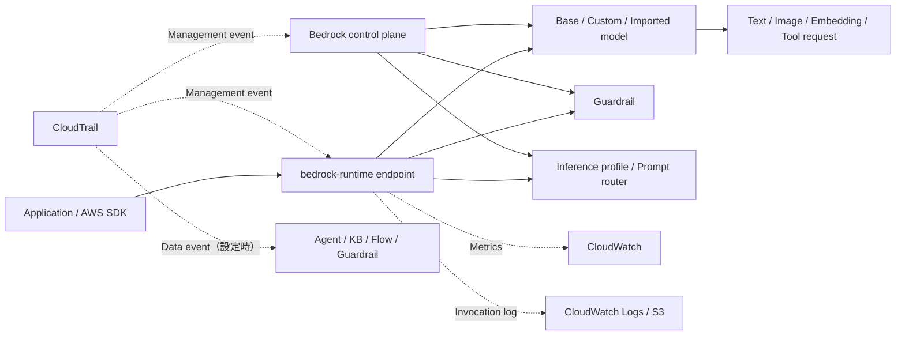

# Amazon BedrockとAmazon Titan

最終確認日: 2026-09-22

| 項目 | 内容 |
|---|---|
| 重要度 | A: 中核 |
| 対象サービス／機能 | Amazon Bedrock、Amazon Titan |
| 対応Task・Skills | Domain 1のTask 1.1〜1.3、1.5〜1.6（Skills 1.1.1〜1.3.4、1.5.1〜1.5.6、1.6.1〜1.6.6）のうち、Bedrock／Titanが直接担う部分 |
| このページで分かること | Amazon Bedrockを、モデルの発見、推論、容量、ルーティング、カスタマイズ、Safety、評価、観測までを扱うマネージド基盤として捉える。各機能の入出力、AWSと利用者の管理境界、代表的な連携をサービス単位で整理する。 |

## 全体像

Amazon Bedrockは、AWSおよび複数のモデルプロバイダーのFoundation Model（FM）を、マネージドなAPIと関連機能から利用するサービスである。Amazon TitanはAWSが開発したFMファミリーであり、Bedrockとは別の制御基盤ではない。2026-09-22時点のTitan一覧には、Text Embeddings V2、Multimodal Embeddings G1、Image Generator G1 v2が掲載されている。

AWSは、モデルを実行する基盤、BedrockのControl plane／Data plane endpoint、各マネージド機能を運用する。利用者は、用途と対応表に合うモデル・Region・API・推論方式を選び、入力、IAM、暗号化設定、Guardrail、ログ保存先、評価基準、容量と費用を管理する。モデルプロバイダーはAmazon Bedrockのデプロイ用Account、利用者のPrompt、Completion、BedrockログへアクセスできないとAWSは説明している。

図の実線は推論とResource管理、点線は観測経路である。Bedrockの推論APIはモデルを実行するが、業務データの妥当性、会話履歴、Toolの実行結果、出力の業務上の正しさまで自動管理するものではない。

## 1. Model catalog、Model card、Amazon Titan

BedrockのModel catalogは、利用可能なモデルを発見する入口である。モデルごとに、Provider、Model ID、入出力Modality、Context、Tool use、対応Endpoint／API、Region、Cross-Region inference、推論方式、カスタマイズ対応を確認する。モデル一覧と互換性は変わるため、モデル名だけをコードや設計の根拠にしない。

Model cardは能力、用途、制限、ライフサイクルなどをモデル単位で確認する資料である。2026-09-07以降にBedrockへ公開されたモデルにはActive、Legacy、End-of-Life（EOL）の状態があり、Model cardに「EOL no sooner than」とLegacy期間が示される。`GetFoundationModel`または`ListFoundationModels`でも`modelLifecycle`を確認できる。EOL時の移行は自動ではない。

Amazon Titanの責務はモデル推論である。たとえばText EmbeddingsはTextをVectorへ、Multimodal Embeddingsは複数ModalityをVectorへ、Image GeneratorはTextなどの入力からImageへ変換する。Knowledge BasesやVector StoreはTitanモデルそのものではなく、Embeddingの保存・検索を担う別Resourceである。

| 観点 | 入力 | Bedrock／Titanの処理 | 出力 | 利用者が管理する範囲 | 代表的な連携 |
|---|---|---|---|---|---|
| Model catalog | 用途、Modality、Region、APIなどの条件 | モデル情報と互換性を公開 | Model ID、対応条件 | 候補の評価、利用可否、移行計画 | Runtime API、Prompt Management |
| Model card | 対象モデル | 能力、制約、Lifecycle情報を提示 | 利用判断に必要なMetadata | 実データによる品質・Safety評価 | Model Evaluation |
| Titan | Text、Imageなどモデル固有のPayload | AWS開発モデルが推論 | EmbeddingまたはImage | 入力品質、Parameter、出力利用、保存先 | Knowledge Bases、S3、Vector Store |

## 2. Bedrock Runtime endpointとConverse／Invoke／Responses／Chat Completions

AWSは新しいApplicationに`bedrock-runtime` endpointを推奨している。このEndpointでは、Converse、Invoke、Chat Completions、Responses APIを利用できるが、すべてのモデルがすべてのAPIに対応するわけではない。Model catalogのAPI compatibilityとEndpoint availabilityを確認する。

| API系統 | 主な入力 | 処理と出力 | 管理境界・条件 |
|---|---|---|---|
| `Converse` / `ConverseStream` | `modelId`、`messages`、`system`、共通推論Parameter、任意のGuardrail／Tool設定 | 対応するMessageモデルへ共通形式で会話推論し、Message、Token usage、Stop reasonなどを返す | 会話履歴はApplicationが後続Requestへ再送する。モデル固有Parameterは別Fieldで渡す。`Converse`は`bedrock-runtime`のみ |
| `InvokeModel` / `InvokeModelWithResponseStream` | `modelId`とモデル固有JSON Payload | 同期またはStreamingでモデル固有Responseを返す | Request／Response schema、Parameter、Content typeは対象モデルの推論資料へ合わせる |
| Responses API | OpenAI互換のResponse Request | 対応モデルでResponseを作成する。`store`の既定値は`true`で、保存したResponseの取得・取消・削除とmulti-turnの継続に使える | `bedrock-runtime`版では既定Projectへの権限が追加で必要になる場合がある。保存期間、Model、Endpoint、Regionごとの対応を確認する |
| Chat Completions API | OpenAI互換のChat Message | 対応モデルでChat Completionを返す | `bedrock-runtime`または`bedrock-mantle`の対応表を確認する。Converseと同じIAM／Resource要件とは限らない |

Converseの`ContentBlock`はText、Image、Document、Videoなどを表す。S3 URIを使う場合は呼出Roleに`s3:GetObject`が必要である。Documentを渡す場合は関連するText Promptも必要で、Document名もPrompt injectionの入力になり得るため中立的な名前を使う。BedrockはConverseへ渡したText、Image、Documentを会話状態として保存しない。

## 3. Streaming、Async／Batch inference

実行方式は、単一Requestの応答方法と大量処理のJobを区別する。

| 方式 | 入力 | 処理 | 出力 | 主な管理項目・連携 |
|---|---|---|---|---|
| 同期 | 単一のモデルRequest | 応答完了まで接続して処理 | 完成したResponse | Client timeout、Retry、Idempotency、Quota |
| Streaming | `InvokeModelWithResponseStream`または`ConverseStream`のRequest | 生成中のEventを順次送る | Content delta、終了理由、Usage／Latency metadata | Client側で順序、切断、部分Responseを処理する。API Gateway等とのStreaming条件も別途確認する |
| Async invoke | `StartAsyncInvoke`へ`modelId`、`modelInput`、`outputDataConfig`、任意のIdempotency token／Tag | 1件の長時間推論を非同期で実行 | Invocation ARNと指定先の結果 | 利用者は状態取得、出力先、再実行を管理する。`bedrock:InvokeModel`権限が必要 |
| Batch inference | InvokeまたはConverse形式の複数Recordを含むS3上のJSONL | Batch Jobが各Recordを独立して非同期処理 | S3上のOutput file | S3、IAM、Job状態、EventBridge通知。Provisioned model、Tool calling、Structured output、Multi-turnは非対応 |

Batchは複数Promptを一つのJobとして処理する方式であり、`StartAsyncInvoke`は一つの非同期Invocationを開始するAPIである。どちらもStreamingの代替ではなく、対応モデル、Region、Quota、料金を個別に確認する。

## 4. On-demand、Provisioned Throughput、Service tier

On-demandは事前にModel Unitを購入せず、対応モデルをRequest単位で利用する。Provisioned ThroughputはモデルとModel Unit（MU）数を指定し、固定費で推論処理能力を確保するResourceである。MUは1分当たりに処理できるInput Tokenと生成できるOutput Tokenの水準を表し、無契約、1か月、6か月のCommitmentがある。削除するまで課金が継続する。

Service tierはOn-demand Requestの可用性、性能、費用特性を指定する仕組みである。2026-09-22時点でReserved、Priority、Standard、Flexがある。`service_tier`を省略、または`default`としたRequestはStandardになる。対応モデルと価格はModels at a glanceと料金表で確認する。

| Tier | 処理の性質 | 容量・課金の境界 |
|---|---|---|
| Reserved | Mission-critical向けに優先Capacityを予約し、超過分はStandardへOverflow | Input／Output TPMを別々に予約する。1か月または3か月。AWS Account teamへの連絡が必要 |
| Priority | Standardより優先されるRequest単位の処理 | 事前予約なし。Standard On-demandよりPrice premiumがある |
| Standard | 通常のOn-demand処理 | 既定Tier。Priority／Standard／FlexはモデルのOn-demand Quotaを共有する |
| Flex | 長い処理時間を許容するWorkload向け | 対応モデルで割引料金。評価や要約などを例としてAWSが挙げる |

Service tierのResponse、CloudTrail Event、CloudWatchの`ServiceTier`／`ResolvedServiceTier`で、指定Tierと実際に処理したTierを確認できる。Provisioned ThroughputとReserved tierは同じResourceではない。Cross-Region inference profileはProvisioned Throughputに対応しない。

## 5. Inference profile、Cross-Region inference、Prompt routing

Inference profileは、モデルとRequestを送れる1つ以上のRegionを定義するBedrock Resourceである。System-defined Cross-Region inference profileと、利用者が作るApplication inference profileがある。Application inference profileにはTagを付け、Model usageとCostをCloudWatchおよびCost allocationから追跡できる。

Cross-Region inferenceは、GeographicまたはGlobal profileを使い、利用可能なComputeへRequestをRouteする。GeographicはUS、EU、APACなど指定Geography内、Globalは対応する商用Region全体が処理先になり得る。Region間のDataはAWS Network上で暗号化され、CloudTrailはSource Regionに記録し、`additionalEventData.inferenceRegion`で処理Regionを確認できる。料金はInference profileを呼び出したSource RegionのModel価格を基準にする。

Intelligent prompt routingは、同一Model family内の2モデルから、PromptごとにResponse qualityを予測してRouteするServerless endpointである。Default routerとConfigured routerがあり、Configured routerではFallback modelとResponse quality differenceを設定する。Requestの出力には実際に使用したModel情報が含まれる。2026-09-22時点の公式資料は、英語Prompt向けに最適化され、Application固有の性能DataをRouting判断へ反映できないという制約を明記している。

| 機能 | 主な入力 | 出力 | 利用者の管理範囲 | 代表的な連携 |
|---|---|---|---|---|
| Inference profile | ModelまたはSystem-defined profile、Tag | Invocation先ARN、Usage／Cost単位 | IAM、Tag、呼出元Region、対応Model | Invoke／Converse、Prompt Management、Flows、Evaluation、Knowledge Bases |
| Cross-Region inference | Profile ARNと推論Request | Route先RegionでのModel Response | Data residency、SCP、全Destination Regionへの許可 | CloudTrail、CloudWatch |
| Prompt router | 同一Familyの2モデル、Fallback、Routing criteria、Prompt | 選択モデルのResponseとModel情報 | 対応Region／Model、英語最適化、継続評価 | Runtime API、CloudWatch |

## 6. Model customization、Custom model import、Model lifecycle

BedrockのModel customizationには、対応モデルでのSupervised fine-tuning、Reinforcement fine-tuning、Distillationがある。利用者はTraining／Validation data、Hyperparameter、IAM role、S3、KMS、評価方法を用意し、BedrockがTraining workflowを管理する。課金要因にはTrainingで処理するTokenとEpoch、Model storage、推論方式が含まれる。

Custom model importは、SageMaker AIなど別環境で調整した対応ArchitectureのModel artifactをS3から取り込み、BedrockのOn-demand推論で利用する機能である。入力はHugging Face形式のWeight、Config、Tokenizer fileなどであり、出力はImported model Resourceである。利用者はLicense、Artifactの完全性、S3とIAM、Chat template、Tokenizer互換性を管理する。2026-09-22時点の公式資料ではImport Regionは`eu-central-1`、`us-east-1`、`us-east-2`、`us-west-2`で、Batch inference、CloudFormation、Embedding modelには対応しない。

LifecycleはBase modelとCustom modelの双方で管理する。ActiveからLegacy、EOLへ進むBase modelでは、新規利用、Customization、Provisioned Throughputに制約が加わる。利用者はModel cardとAPIから状態と日付を確認し、評価済みの移行先、Config切替、Rollback手順を維持する。Custom modelのOn-demand対応はBase model、Customization実施日、Deployment Regionなどの条件があるため、Custom model deploymentの対応表を確認する。

## 7. Structured outputs、Tool use、Prompt caching

Structured outputsは、対応モデルのResponseを利用者指定のJSON SchemaまたはStrictなTool definitionへ適合させる機能である。Converseでは`outputConfig.textFormat`、対応するInvoke／OpenAI互換APIでは各APIのFieldへSchemaを渡す。Bedrockは対応するJSON Schema Draft 2020-12のSubsetを検証し、未対応Schemaは400 Errorにする。初回SchemaのGrammar compileや対応Model／APIは変わり得る。

Tool useでは、Tool名、説明、Input schemaをモデルへ渡し、モデルがTool requestを返す。Client-sideではApplicationがToolを実行し、結果を次のModel Requestへ戻す。Responses APIのServer-side mode（`bedrock-mantle`）では、登録したLambdaまたはAgentCore GatewayをBedrockが呼び出せる。`bedrock-runtime`ではServer-side tool useを利用できない。モデルは、権限を持たない外部SystemをTool definitionだけで直接操作できるわけではない。Application側ではTool allowlist、IAM、入力検証、Timeout、Idempotency、結果の無害化を管理する。

Prompt cachingは、長く繰り返すPrompt prefixの再処理を減らし、対応モデルでLatencyとInput Token費用を抑える任意機能である。Implicit cachingはService／ModelがEligibleなPrefixの再利用を試み、明示的なBreakpointを不要とする。Explicit cachingは利用者がCache controlまたは`cachePoint`を指定する。完全に同じPromptでもCache hitは保証されず、最低Token、TTL、Checkpoint数、API、Region、Modelの条件がある。CloudWatchとResponseのCache read／write Tokenを観測する。

## 8. Guardrails、Model Evaluation、Data Automation

これらはFMそのものとは別のBedrock機能である。

| 機能 | 入力 | Bedrockの処理 | 出力 | 利用者が管理する範囲 | 代表的な連携 |
|---|---|---|---|---|---|
| Guardrails | Text／Image content、Guardrail ID／Version | Content filter、Denied topics、Word filter、Sensitive information、Contextual grounding、Automated Reasoningなど設定済みPolicyで評価 | 許可・Block・MaskなどのAssessment／Response | Policy、Version、Threshold、Test、False positive／negative、Application側の業務検証 | Converse／Invoke、`ApplyGuardrail`、Flows、Knowledge Bases |
| Model Evaluation | Dataset、Task type、ModelまたはInference profile、Metric／Human worker設定 | Automatic、LLM-as-a-judge、Human evaluation Jobを実行 | Metric、Report、Human response | 代表性のあるDataset、Rubric、合格条件、評価結果のRelease判断 | S3、SageMaker Ground Truth、IAM、CloudWatch |
| Bedrock Data Automation（BDA） | S3等のDocument、Image、Audio、Video、Project／Blueprint | Standard outputまたはCustom outputとして内容を抽出・構造化 | JSON等のStructured outputとMetadata | Input権限、Blueprint、Confidence利用、PII／Safety、出力保存と再処理 | S3、EventBridge、Knowledge Bases、Cross-Region inference |

GuardrailsはApplication固有のAuthorization、必須Field検証、Tool実行権限の代替ではない。Model Evaluationは実運用の継続監視を自動的に完結させず、利用者がDatasetと判定基準を管理する。BDAは表形式Dataset全般のData quality engineではなく、Multimodal contentの抽出・構造化を担う。

## 9. Model Invocation Logging、CloudWatch metrics、CloudTrail

観測経路は目的が異なる。

| 観測手段 | 記録するもの | 出力先・用途 | 主な注意点 |
|---|---|---|---|
| CloudWatch metrics | Invocation数、Latency、Error、Throttle、Input／Output Token、Cache Token、Service tierなど | Dashboard、Alarm、Capacity／Cost観測 | Metric名とDimensionはEndpoint／Model／機能の公式表で確認する |
| Model Invocation Logging | 対応InvocationのRequest、Response、Metadata、Token数 | 同一Account／RegionのCloudWatch Logs、S3 | 既定で無効。機密Dataを含み得るため、Destination、KMS、Retention、Accessを利用者が管理する |
| CloudTrail | Control planeとRuntime APIのManagement event。設定によりAgent Alias、Knowledge Base、Flow Alias、GuardrailなどのData event | 誰が、いつ、どのAPIとResourceを操作したかの監査 | Prompt／Response本文の観測をInvocation Loggingと混同しない。Cross-Regionの処理RegionやService tierもEventで確認できる |

Model Invocation Loggingは`bedrock-runtime`経由の`Converse`、`ConverseStream`、`InvokeModel`、`InvokeModelWithResponseStream`を対象とし、同Endpoint上のOpenAI互換Responses／Chat Completionsも含む。`bedrock-mantle`など他Endpointの同名APIは現在対象外である。小さいJSONはCloudWatch LogsまたはS3へ、大きいBodyやBinary dataはS3へ出力される。これはCloudTrailのAPI監査とは別のOpt-in機能である。

## 10. Region、Quota、料金、Data protection

### Regionと可用性

BedrockのControl plane、`bedrock-runtime`、`bedrock-mantle`、BDAなどはEndpointのRegion一覧が異なる。さらに、同じRegionでもModel、API、Inference profile、Service tier、Customization、Guardrail、Evaluationの対応は一致しない。2026-09-22時点で東京（`ap-northeast-1`）と大阪（`ap-northeast-3`）にはBedrock Control planeとRuntime Endpointが掲載されているが、対象Model／機能が利用できることを意味しない。

単一Region推論はそのRegionの対応状況へ依存する。Cross-Region inferenceは利用可能なDestinationへRouteできるが、障害時の成功や同一Latencyを保証するものではない。利用者はSource／Destination、Data residency、SCP、Retry、Fallback、ApplicationのSLOを管理する。

### QuotaとScaling

Bedrock QuotaはAccount、Region、Model、API、Token per minute、Request per minute、同時Job、Resource数など複数の単位に分かれる。調整可能かどうかも項目ごとに異なる。固定値を暗記せず、AWS General ReferenceとService Quotas Consoleで対象Region／Modelの現在値を確認する。`ThrottlingException`と`ServiceQuotaExceededException`を区別し、Usage、Retry、Backoff、Capacity方式をApplication側で管理する。

### 料金要因

主な料金要因は次のとおりである。

- On-demand／Service tierのInput・Output Token、Image、Embeddingなどモデル固有の計測単位
- Batch inference、Prompt cachingのCache write／read、Global Cross-Region inferenceなど方式ごとの価格
- Provisioned ThroughputのModel、MU数、Commitment期間と稼働時間
- Model customizationのTraining Token×Epoch、Storage、Custom／Imported modelの推論
- GuardrailsのText unit、Image、Automated Reasoningなど適用Policy
- Model Evaluation、BDA、Knowledge Basesなど併用機能と、S3、CloudWatch Logs、KMS、Data transferなど連携Service

単価と割引はModel、Region、方式で変わるため、実行前にBedrock Pricingで確認する。Inference profile自体の追加Routing料金はなく、Source RegionのModel価格で計算されるとAWSは説明している。

### Data protectionとSecurity

AWS Shared Responsibility Modelでは、AWSがCloud InfrastructureとBedrockのManaged serviceを保護し、利用者がContent、IAM、Network、暗号化設定、Log、Retentionを管理する。

- IAMではControl planeとRuntime actionを分け、呼び出せるModel／Inference profile／Guardrail／ProjectをResourceとConditionで制限する。
- 通信にはTLSを使用する。Private接続が必要な構成では対応するInterface VPC Endpoint（AWS PrivateLink）とEndpoint policyを確認する。
- 対応ResourceではAWS owned keyまたはCustomer managed AWS KMS keyを使用する。S3、CloudWatch Logsなど連携先の暗号化とKey policyも利用者が管理する。
- Prompt、Completion、Evaluation dataset、Invocation logへ機密情報を送る前に用途と保存先を確認する。TagやResource名などのFree-form fieldへ機密情報を入れない。
- CloudTrailを監査、Model Invocation Loggingを推論内容の観測として構成し、保持、削除、Accessを組織Policyに合わせる。

## API、Event、Dataの入出力

| Plane／経路 | 代表的なInterface | 主なData |
|---|---|---|
| Control plane | `ListFoundationModels`、`GetFoundationModel`、Prompt router／Inference profile／Custom model／Guardrail／Evaluation Jobの各API | Resource設定、Status、ARN、Tag、Lifecycle metadata |
| Runtime | `InvokeModel`、`InvokeModelWithResponseStream`、`Converse`、`ConverseStream`、Responses、Chat Completions、`StartAsyncInvoke` | Model固有JSONまたは共通Message、Binary／S3参照、Generated response、Token usage |
| Batch／Job | Batch inference、Customization、Evaluation、BDA | S3 input、Job設定、Status、S3 output、EventBridge state change |
| Observability | CloudWatch metrics、Model Invocation Logging、CloudTrail | Metric、Request／Response／Metadata、API Event |

Request schemaとResponse schemaはAPI系統とモデルで異なる。共通Interfaceを使っても、対応Modality、Tool、Structured output、Streaming、Parameterが同じになるわけではない。

## AIP-C01との対応

| Task・Skill | このサービスが担う役割 | 関連ページ |
|---|---|---|
| Task 1.1 / Skills 1.1.1〜1.1.3 | Model catalog、Runtime、Safety、Evaluation、Loggingを標準部品として提供し、PoCで品質、Latency、Costを測る対象になる | [literal](../literal-pages/01-01-requirements-and-solution-design.md) / [supplimental](../supplimental-pages/01-01-requirements-and-solution-design.md) |
| Task 1.2 / Skills 1.2.1〜1.2.4 | Model／API／Region／Capacityの対応確認、Inference profile、Prompt router、Customization、Lifecycleを提供する | [literal](../literal-pages/01-02-foundation-model-selection-and-configuration.md) / [supplimental](../supplimental-pages/01-02-foundation-model-selection-and-configuration.md) |
| Task 1.3 / Skills 1.3.1〜1.3.4 | Converse等のInput contract、Structured outputs、BDAによるMultimodal抽出を提供する | [literal](../literal-pages/01-03-data-validation-and-processing.md) / [supplimental](../supplimental-pages/01-03-data-validation-and-processing.md) |
| Task 1.5 / Skills 1.5.1〜1.5.6 | Titan EmbeddingsをEmbedding生成へ、RuntimeのTool useをRetrieval interfaceとの接続へ利用できる | [literal](../literal-pages/01-05-retrieval-for-rag.md) / [supplimental](../supplimental-pages/01-05-retrieval-for-rag.md) |
| Task 1.6 / Skills 1.6.1〜1.6.6 | System instruction、会話Message、Structured outputs、Tool use、Guardrails、Version済みResourceとのRuntime統合を担う | [literal](../literal-pages/01-06-prompt-engineering-and-governance.md) / [supplimental](../supplimental-pages/01-06-prompt-engineering-and-governance.md) |

この表はBedrockから見た対応関係である。要件からどの方式を選ぶかは、各supplimental pageで比較する。

## 重要な制約と確認事項

- API名が同じでも`bedrock-runtime`と`bedrock-mantle`では、IAM、Project、対応Model、Model Invocation Loggingの条件が異なる。
- Models at a glance、API compatibility、Regional availability、Inference profileの対応表を、導入時とModel移行時に再確認する。
- Intelligent prompt routingは同一Familyの2モデルを使い、英語Prompt向けに最適化される。Application固有DataでRouting判断を直接調整できない。
- Structured outputs、Tool use、Prompt caching、Service tierは対応Model／APIが限定される。機能名だけから利用可能と判断しない。
- Batch inferenceはProvisioned model、Tool calling、Structured output、Multi-turn interactionに対応しない。
- Custom model importは対応Architecture、Artifact、Region、Size、Context、Transformer versionなどの条件を持つ。2026-09-22時点ではEmbedding modelとBatch inferenceに非対応である。
- RegionとQuotaの全数値、Model別料金は変動するため、本ページでは固定一覧を持たない。公式表を実装日に確認する。
- Responses／Chat Completions、Reserved tier、Configured prompt routerなど比較的新しい機能は、対象Model、Region、APIの対応を個別に確認する。

## 用語

| 用語 | このページでの意味 |
|---|---|
| Control plane | Model、Guardrail、Profile、Evaluation JobなどのResourceを作成・取得・更新する管理API |
| Data plane / Runtime | ModelへInputを送り、生成結果を受け取る推論API |
| Inference profile | Modelと1つ以上のRouting先Region、またはUsage／Cost追跡単位を表すResource |
| Prompt router | Promptごとに同一Family内のModelを選ぶIntelligent routing Resource |
| Model Unit（MU） | Provisioned Throughputで、1分当たりのInput／Output Token処理能力を表す単位 |
| Structured outputs | Model出力を対応するJSON SchemaまたはStrict Tool definitionへ適合させる機能 |
| Model Invocation Logging | 推論のRequest、Response、MetadataをCloudWatch Logs／S3へ記録するOpt-in機能 |

## 公式資料

- [AIP-C01 Content Domain 1](https://docs.aws.amazon.com/aws-certification/latest/ai-professional-01/ai-professional-01-domain1.html) — Task 1.1〜1.6とSkills
- [What is Amazon Bedrock?](https://docs.aws.amazon.com/bedrock/latest/userguide/what-is-bedrock.html) — サービスの役割と機能構成
- [Model availability and compatibility](https://docs.aws.amazon.com/bedrock/latest/userguide/models.html) — Model、API、Endpoint、Region、Lifecycleの確認入口
- [Model lifecycle](https://docs.aws.amazon.com/bedrock/latest/userguide/model-lifecycle.html) — Active、Legacy、EOLとCustom modelへの影響
- [Overview of Amazon Titan models](https://docs.aws.amazon.com/bedrock/latest/userguide/titan-models.html) — Titanファミリーの現行構成
- [Making inference requests](https://docs.aws.amazon.com/bedrock/latest/userguide/inference.html) — Runtime Endpoint、Converse、Invoke、Responses、Chat Completions
- [Inference using Converse API](https://docs.aws.amazon.com/bedrock/latest/userguide/conversation-inference.html) — Message、ContentBlock、会話履歴、Guardrail、Tool、Service tier
- [Responses API](https://docs.aws.amazon.com/bedrock/latest/userguide/inference-responses-api.html) — OpenAI互換ResponsesとEndpoint条件
- [Chat Completions API](https://docs.aws.amazon.com/bedrock/latest/userguide/inference-chat-completions.html) — OpenAI互換Chat Completions
- [StartAsyncInvoke](https://docs.aws.amazon.com/bedrock/latest/APIReference/API_runtime_StartAsyncInvoke.html) — 非同期Invocationの入出力
- [Batch inference](https://docs.aws.amazon.com/bedrock/latest/userguide/batch-inference.html) — S3入出力、Job、非対応機能
- [Provisioned Throughput](https://docs.aws.amazon.com/bedrock/latest/userguide/prov-throughput.html) — MU、Commitment、課金
- [Service tiers](https://docs.aws.amazon.com/bedrock/latest/userguide/service-tiers-inference.html) — Reserved、Priority、Standard、Flex
- [Inference profiles](https://docs.aws.amazon.com/bedrock/latest/userguide/inference-profiles.html) — System-defined／Application profile、Usage／Cost追跡
- [Cross-Region inference](https://docs.aws.amazon.com/bedrock/latest/userguide/cross-region-inference.html) — Geographic／Global routing、Data、CloudTrail、料金
- [Intelligent prompt routing](https://docs.aws.amazon.com/bedrock/latest/userguide/prompt-routing.html) — Default／Configured router、制約、処理
- [Customize your model](https://docs.aws.amazon.com/bedrock/latest/userguide/custom-models.html) — Fine-tuning、Reinforcement fine-tuning、Distillation
- [Model customization](https://docs.aws.amazon.com/bedrock/latest/userguide/model-customization.html) — Customization workflowと対応条件
- [Custom model import](https://docs.aws.amazon.com/bedrock/latest/userguide/model-customization-import-model.html) — Import artifact、Architecture、Region、制約
- [Structured outputs](https://docs.aws.amazon.com/bedrock/latest/userguide/structured-output.html) — JSON Schema、Strict Tool、対応API／Model
- [Tool use](https://docs.aws.amazon.com/bedrock/latest/userguide/tool-use.html) — Client-side／Server-side Tool executionの責務
- [Prompt caching](https://docs.aws.amazon.com/bedrock/latest/userguide/prompt-caching.html) — Implicit／Explicit cache、Token、条件
- [Amazon Bedrock Guardrails](https://docs.aws.amazon.com/bedrock/latest/userguide/guardrails.html) — Policy、Version、適用経路
- [Model Evaluation](https://docs.aws.amazon.com/bedrock/latest/userguide/model-evaluation.html) — Automatic／Judge／Human evaluation
- [Bedrock Data Automation](https://docs.aws.amazon.com/bedrock/latest/userguide/bda.html) — Multimodal contentの抽出とStructured output
- [Model Invocation Logging](https://docs.aws.amazon.com/bedrock/latest/userguide/model-invocation-logging.html) — CloudWatch Logs／S3、対象API、Log内容
- [Runtime metrics](https://docs.aws.amazon.com/bedrock/latest/userguide/monitoring-runtime-metrics.html) — CloudWatch metrics
- [CloudTrail logging](https://docs.aws.amazon.com/bedrock/latest/userguide/logging-using-cloudtrail.html) — Management／Data eventと監査
- [Data protection](https://docs.aws.amazon.com/bedrock/latest/userguide/data-protection.html) — Shared responsibility、Model providerからの分離、保護事項
- [Amazon Bedrock endpoints and quotas](https://docs.aws.amazon.com/general/latest/gr/bedrock.html) — Endpoint、Region、Quota
- [Amazon Bedrock pricing](https://aws.amazon.com/bedrock/pricing/) — Model、推論方式、関連機能の料金要因

## 関連ページ

- [サービス別目次](README.md)
- [要件分析とSolution design（literal）](../literal-pages/01-01-requirements-and-solution-design.md)
- [要件分析とSolution design（supplimental）](../supplimental-pages/01-01-requirements-and-solution-design.md)
- [FM選定と設定（literal）](../literal-pages/01-02-foundation-model-selection-and-configuration.md)
- [FM選定と設定（supplimental）](../supplimental-pages/01-02-foundation-model-selection-and-configuration.md)
- [Data validationとProcessing（literal）](../literal-pages/01-03-data-validation-and-processing.md)
- [Data validationとProcessing（supplimental）](../supplimental-pages/01-03-data-validation-and-processing.md)
- [RAG Retrieval（literal）](../literal-pages/01-05-retrieval-for-rag.md)
- [RAG Retrieval（supplimental）](../supplimental-pages/01-05-retrieval-for-rag.md)
- [Prompt engineeringとGovernance（literal）](../literal-pages/01-06-prompt-engineering-and-governance.md)
- [Prompt engineeringとGovernance（supplimental）](../supplimental-pages/01-06-prompt-engineering-and-governance.md)
