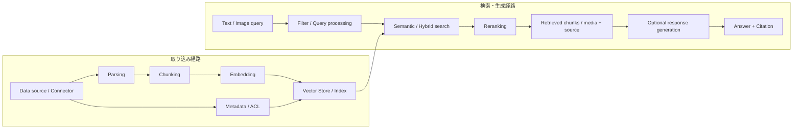

# Amazon Bedrock Knowledge Bases

最終確認日: 2026-09-22

| 項目 | 内容 |
|---|---|
| 重要度 | A: 中核 |
| 対象サービス／機能 | Amazon Bedrock Knowledge Bases |
| 対応Task・Skills | Task 1.4 / Skills 1.4.1〜1.4.5、Task 1.5 / Skills 1.5.1〜1.5.6。接点: Task 3.1、4.2〜4.3、5.1〜5.2 |
| このページで分かること | Knowledge Basesが、データソースから検索可能な知識を作り、検索結果または根拠付き回答を返すまでに何を管理するかを説明する。ManagedとCustomer-managedの境界、取り込み、検索、マルチモーダル、Security、Observability、Quota、料金要因をサービス単位で追える。 |

## 全体像

Amazon Bedrock Knowledge Basesは、組織のデータをFoundation Model（FM）やAgentから検索できるようにし、Retrieval-Augmented Generation（RAG）の検索結果を回答生成へ渡すサービスである。取り込み時はデータの取得、解析、Chunking、Embedding、Indexingを行う。実行時はQueryを受け、関連情報を検索し、検索結果だけ、またはCitation付きの生成回答を返す。

図の左側では原文とMetadataの対応を保ったまま検索単位を作る。右側では、認証済みの利用者情報から作ったFilterやACL contextを検索前に適用し、取得した根拠をアプリケーションまたは生成Modelへ返す。

### ManagedとCustomer-managedの管理境界

2026-09-22時点のDeveloper Guideは、次の2種類を公式名称としている。

| 種類 | AWSが管理する範囲 | 利用者が管理する範囲 | 主な出力・連携 |
|---|---|---|---|
| Managed Knowledge Base | 取り込み、Indexing、Storage、Retrieval infrastructure。既定ではEmbedding、Reranking、Agentic retrievalのService-managed modelも管理する | Data source、同期設定、IAM、ACLへ渡すUser context、検索設定。必要なら独自Modelを選択する | `Retrieve`、`AgenticRetrieveStream`、AgentCore Gateway、CloudWatch／X-Ray |
| Customer-managed Knowledge Base | Knowledge BaseのControl plane／Runtime APIと、設定に従う取り込み・検索処理 | Vector Store、Index schema、Capacity、接続、Embedding／Parser、Multimodal処理を含む関連Infrastructure | `Retrieve`、`RetrieveAndGenerate`、利用者が管理するStoreとModel |

ManagedではStorageが自動Scaleし、Smart Parsing、Document-level ACL filtering、Agentic retrieval、AgentCore GatewayとのNative integrationなどが提供される。Customer-managedではStoreとPipelineの制御範囲が広い一方、それらの可用性、性能、容量、費用も利用者が管理する。公式Pricingページには後者を「Self-Managed Knowledge Bases」と表記する箇所があるが、Developer Guideの分類名は「Customer-managed Knowledge Base」である。

## 主要機能と処理の流れ

### 1. Managed／Customer-managed Knowledge Base

Knowledge Base作成時の入力は、種類、Data source、Service role、およびCustomer-managedの場合はEmbedding modelとStorage configurationである。Amazon BedrockはこれらをKnowledge Base IDと設定として保持し、取り込み・検索APIから参照する。

Managedでは利用者はInfrastructureを直接Provisioningせず、AWSがIndex storage、Embedding、Reranking、検索のScaleを扱う。Customer-managedでは利用者がStoreを事前作成するかQuick createを使い、Field名、Dimension、Index、認証情報、Network policyを整合させる。Knowledge Baseを作成しただけでは検索対象は入らず、Data sourceの同期またはDirect ingestionが必要である。

### 2. Data source・Connector・ACL

Data sourceは文書またはContentをKnowledge Baseへ供給する入力境界である。

| 区分 | 2026-09-22時点の主な入力 | 処理 | 出力／連携 |
|---|---|---|---|
| Managed | Amazon S3、Box、Confluence Cloud／Data Center、Microsoft SharePoint Online、Google Drive、Microsoft OneDrive、ServiceNow、Web Crawler、Custom data source | Connectorが変更を検出し、Content、Metadata、対応ConnectorではACLを取り込む | Managed ingestion pipeline。Web Crawlerを除きDocument-level permission filteringに対応 |
| Customer-managed | Amazon S3、Confluence、SharePoint、Salesforce、Web Crawler、Custom data source | Service roleまたはSecrets ManagerのCredentialでSourceを読み、設定済みPipelineへ渡す | Customer-managed Vector Store |

Customer-managedでは、2026-09-30からConfluence、SharePoint、Salesforce、Web Crawlerの新規Connector作成が非対応になる予定である。既存Connectorは取り込みと検索を継続する。ManagedとCustomer-managedではConnector一覧が同じではないため、作成時に対象種類とRegionを確認する。

ACL-aware filteringは認可そのものではない。Knowledge BasesはEnd userを認証せず、Applicationが認証済みIdentityを`userContext`として渡す。Managed Knowledge BaseはそのContextと取り込んだACLを使ってPre-retrieval filteringを行う。利用者はIdentityの真正性、Knowledge BaseへのIAM権限、ACL同期の鮮度を管理する。Web CrawlerはDocument-level ACLに対応しない。

### 3. Parsing・Chunking・Embedding

取り込みの入力は、対応形式の文書、Parsing strategy、Chunking strategy、Embedding modelである。Customer-managedのS3／Connector入力では、一般的なText文書について`.txt`、`.md`、`.html`、`.doc/.docx`、`.csv`、`.xls/.xlsx`、`.pdf`が公式に列挙され、1ファイル50 MBのQuotaがある。Multimodalの条件は後述する。

Parsingは文書からText、表、画像などを抽出する。ManagedのSmart Parsingは文書種類に応じて戦略を選ぶ。Customer-managedではDefault parser、Bedrock Data Automation（BDA）、FM parserなど、利用可能な方式とRegionを利用者が選ぶ。

ChunkingはParser出力を検索単位へ分ける。Customer-managed Knowledge BaseではDefault、Fixed-size、Hierarchical、Semantic、No chunkingを構成できる。Defaultはおおむね300 TokenまでのChunkを作り、文境界を保つ。HierarchicalはChild chunkを検索し、返却時にParent chunkへ置換するため、返却件数が指定値より少なくなることがある。Chunking設定を変える場合はData sourceを削除して再接続し、再取り込みが必要である。

Embeddingは各ChunkをVectorへ変換する。入力はChunk、出力はModel固有DimensionのFloatまたは対応する場合はBinary vectorである。利用者はModelの対応Region、Modality、DimensionとStoreのField定義を一致させる。ManagedではService-managed modelが既定だが独自Modelも選択できる。

### 4. Vector Store・Index・Metadata

Customer-managed Knowledge Baseで公式に案内されるVector Storeには、Amazon OpenSearch Serverless、Amazon OpenSearch Service Managed Clusters、Amazon Aurora、Amazon Neptune Analytics、Amazon S3 Vectors、Pinecone、Redis Enterprise Cloud、MongoDB Atlasがある。対応StoreはKnowledge Baseの種類、Embedding type、Region、検索方式で異なる。

Storeへの入力はVector、Chunk本文、Bedrock管理Metadata、任意のCustom metadataである。出力はQueryに近いChunkとSource情報である。利用者は、Vector Dimension、Index／Field mapping、Capacity、Backupや可用性などStore固有の運用を管理する。Binary vectorをKnowledge Basesで保存できるStoreは、2026-09-22時点でOpenSearch ServerlessとOpenSearch Managed Clustersである。

Metadataは検索FilterとSource attributionに使う。S3文書では同名の`.metadata.json` sidecarを関連付けられ、型は`STRING`、`NUMBER`、`BOOLEAN`、`STRING_LIST`である。CSVは1つのContent fieldへChunkingとEmbeddingを適用し、指定列を文字列Metadataとして各Chunkへ関連付ける。StoreごとにFilter用Fieldや上限が異なる。たとえばS3 VectorsとKnowledge Basesの組み合わせでは、Custom metadataはVector当たり合計1 KB、35 Keyまでである。

### 5. Data ingestion・Sync・削除

取り込みのControl planeはData source設定とIngestion jobである。初回Syncは対象Contentを処理し、その後のSyncは前回以降に追加、変更、削除された文書をIncrementalに処理する。

- `StartIngestionJob`はCustomer-managed Data sourceの同期を開始する。
- ManagedではOn-demand、Daily、Weekly、MonthlyのScheduleを設定できる。
- S3とCustom data sourceでは`IngestKnowledgeBaseDocuments`、`DeleteKnowledgeBaseDocuments`などのDirect ingestionを使える。S3へのDirect ingestion結果は元Objectを更新しないため、次回Syncとの整合は利用者が管理する。
- Data source削除時の`dataDeletionPolicy`は、Vectorを`DELETE`または`RETAIN`する。既定は`DELETE`であり、`RETAIN`では削除したSourceのContentが検索可能なまま残る場合がある。

Jobの出力にはStatus、Statistics、Warningがある。ManagedのIngestion logでは文書ごとにCrawl、Sync、Indexを追え、追加・削除・変更なし、Chunk作成／削除数、失敗理由を確認できる。Job完了だけでなく、検索結果に更新と削除が反映されたことを確認する責任は利用者に残る。

### 6. Semantic／Hybrid search・Metadata filter

`Retrieve`または`RetrieveAndGenerate`の入力にはQuery text、結果数、検索設定、任意のMetadata filterを指定する。Semantic searchはQuery embeddingとVectorの意味的な近さを使う。Hybrid searchはSemanticとRaw textのKeyword検索を組み合わせる。

Customer-managedでHybridを明示的に選べるのは、公式資料上、Filter可能なText fieldを持つAmazon OpenSearch Serverless、Amazon RDS、MongoDBなど、対応Storeと構成に限られる。対応しない場合はSemanticが使われる。Managed Knowledge BaseのStandard RetrievalはSemanticとKeywordを組み合わせたHybrid searchとして提供される。

Metadata filterは検索前に候補を絞り、Equals、比較、List、論理演算などを型とStoreの対応条件に従って使う。Implicit filteringはMetadata schemaと対応Modelを入力し、QueryからFilterを生成する。Filterは検索精度と範囲制御に使えるが、未認証の属性を安全な認可情報へ変える機能ではない。

### 7. Reranking・Query decomposition・Agentic retrieval

Rerankingは初段検索の候補をQueryとの関連度で並べ直す。入力はQueryと候補Document、出力はScoreを付け直した順位である。Customer-managedでは対応するAmazon Bedrock Reranker modelなどを検索設定へ指定し、候補数、返却数、Model利用料を利用者が管理する。ManagedではManaged embeddingを使う場合にService-managed Rerankerが既定で含まれる。Custom embeddingを選んだManaged Knowledge BaseではService-managed Rerankerは利用できず、独自Modelを指定するか無効化する。Managedでは独自Modelも選択できる。

`RetrieveAndGenerate`のQuery decompositionは、複合QueryをSub-queryへ分けて取得結果を生成へ渡す設定である。これはCustomer-managedで利用できる検索時のQuery transformationであり、1回のQueryを複数検索へ展開し得る。

Managed専用のAgentic retrievalは`AgenticRetrieveStream`で呼び出す。FMがQueryを計画・分解し、最大5つのManaged Knowledge BaseまたはAgentCore Memoryから反復検索し、十分性を評価する。必要なら`GetDocumentContent`で全文を展開し、結果、任意の生成回答、Citation、Planning／RetrievalなどのTrace eventをStreamで返す。Query decompositionという要素を含むが、単発の`RetrieveAndGenerate`設定よりも、複数Source、反復、十分性評価、全文展開を含む広い実行方式である。

### 8. Retrieve／RetrieveAndGenerate・Citation

| API | 主な入力 | 処理 | 主な出力 | 管理境界・連携 |
|---|---|---|---|---|
| `Retrieve` | Knowledge Base ID、Text query、結果数、Search type、Filter、Reranking設定 | 検索し、必要なら並べ替える | `retrievalResults`: Content、Location、Score、Metadata | 生成を行わない。Application、Agent、独自Promptへ結果を渡せる |
| `RetrieveAndGenerate` | Query、Knowledge Base、検索設定、Generation model／Prompt／Guardrail設定 | 検索結果をContextにして回答を生成する | Text、Citation、Source reference、Session ID | Generation modelのRegion・料金・Quotaも関係する |
| `RetrieveAndGenerateStream` | `RetrieveAndGenerate`相当 | 検索後の生成をStreamする | Incremental responseとCitation event | ClientがStreamと中断を処理する |
| `AgenticRetrieveStream` | Messages、Managed KB retrievers、Planning model、任意のMemory／Guardrail | 計画、反復検索、十分性評価、任意の生成 | Result、Response、Trace event、Citation | Managed専用。AgentCore Memory／Observabilityと連携 |

Citationは回答中のSpanを取得Sourceへ関連付ける。利用者はCitationをUIや監査へ引き継ぎ、Sourceへのアクセス権と鮮度を別途管理する。`RetrieveAndGenerate`でGuardrailsが適用されるのは入力と生成回答であり、取得されたReference自体には適用されない。

### 9. Multimodal retrieval

Knowledge BasesはTextに加え、画像、Audio、VideoをIndex化・検索できる。Multimodal data sourceはAmazon S3またはCustom data sourceに限られ、ほかのConnectorではMultimodal fileが取り込み時にSkipされる。

| 処理方式 | 入力と処理 | 出力・検索 | 利用者が確認する条件 |
|---|---|---|---|
| Nova Multimodal Embeddings | 画像、Audio、VideoをNative形式のままEmbeddingする | Image query、Visual similarity、Cross-modal result | ModelとFeatureのRegion、対応Store。`RetrieveAndGenerate`ではRAGがText contentに制限される |
| Bedrock Data Automation | OCR、Visual extraction、ASR、Scene summaryなどでMultimediaをText表現へ変換する | Text queryから画像、Audio segment、Video segmentを取得し、TimestampやSourceを返す | BDAのRegion、File quota、処理料金、Intermediate／Output用S3 |

Customer-managedでMultimodal contentを使う場合は、解析方式と、抽出画像などを保存するS3 URIを構成する。ManagedではSmart ParsingとManaged storageがこのInfrastructureを扱う。`RetrieveAndGenerate`のResponse本文は画像を返さないが、検索された画像は生成Promptへ含められ、画像を含むSourceをCitationできる。

### 10. Evaluation・Trace・運用Metric

Amazon Bedrock RAG evaluationは、Prompt datasetを入力としてRetrieve-onlyまたはRetrieve-and-generateを評価する。Retrieve-onlyではContext relevanceと、Ground truthを要するContext coverageを測れる。Retrieve-and-generateではCorrectness、Completeness、Helpfulness、Logical coherence、Faithfulness、Citation precision／coverage、Harmfulness、Stereotyping、Refusalなどを選べる。結果は指定したAmazon S3へ出力され、Evaluator model、Evaluation job用IAM role、KMS設定は利用者が管理する。

Managed Knowledge Baseは`AWS/Bedrock/KnowledgeBases` Namespaceへ次を発行する。

- Runtime: `Invocations`、`ClientErrors`、`ServerErrors`、`Throttles`。`AgenticRetrieveStream`では成功時の`TotalIterationCount`もある。
- Storage: Ingestion完了後の`RawDataSize`。
- Ingestion log: Jobおよび文書単位のCrawl／Sync／Index status、Chunk statistics、Error message。CloudWatch Logs、S3、Amazon Data FirehoseへDeliveryできる。
- Trace: `Retrieve`のSpanをAWS X-RayへDeliveryできる。Agentic retrievalはResponse stream内にもPlanning、Retrieval、全文展開などのTrace eventを返す。

Metric発行はBest effortである。`Retrieve`ではKnowledge Base Service role、そのほかはCalling identityに`cloudwatch:PutMetricData`が必要で、権限がなくてもQuery自体は失敗しない。Vended log／Trace deliveryには`bedrock:AllowVendedLogDeliveryForResource`と送信先権限が必要である。AgentCore Observabilityとの統合はManagedのみである。

## API、Event、Dataの入出力

### Control plane

`CreateKnowledgeBase`、`CreateDataSource`、`UpdateKnowledgeBase`、`UpdateDataSource`、`StartIngestionJob`、`GetIngestionJob`、`ListIngestionJobs`が構成と同期状態を扱う。S3／Custom data sourceのDirect ingestionではKnowledge Base Documents APIを使う。入力にはClient tokenを指定できる操作があり、再試行時のIdempotencyに使う。

### Runtime

Runtimeは`Retrieve`、`RetrieveAndGenerate`、`RetrieveAndGenerateStream`、Managed専用の`AgenticRetrieveStream`が中心である。ApplicationはRequest ID、User identity context、適用Filter、Knowledge Base ID、検索設定、返却されたSource／Citationを関連付ける。Knowledge BasesがApplication固有のSession認可、UI、業務Audit recordを代行するわけではない。

### Data contract

取り込みでは原文、Content type、Source URI、Chunk、Vector、Bedrock管理Metadata、Custom metadata、ACLが対応する。検索ではQuery、Filter、検索方式、候補数を受け、Content、Location、Score、Metadataを返す。生成を加えるAPIではAnswer spanとSource referenceの対応がCitationとなる。

## SecurityとData保護

- IAM: Control planeを操作するPrincipal、Runtimeを呼ぶApplication role、Data sourceとStoreへアクセスするKnowledge Base Service roleを分ける。Service roleは利用するSource、Model、Store、KMS key、Secrets Manager secretだけへ絞り、Trust policyでは`aws:SourceAccount`とKnowledge Base ARNを制限する。
- 暗号化: S3 Source、Vector Store、同期中の一時Data、Evaluation input／outputなど、ResourceごとのAWS owned keyまたはCustomer managed KMS key条件を確認する。Customer managed keyを使う場合はService roleとKey policyの双方に必要な権限を設定する。
- Network: Amazon Bedrock APIはAWS PrivateLinkのInterface VPC endpointを使える。Customer-managed StoreのNetwork条件はStore別である。OpenSearch ServerlessはPrivate collectionとVPC endpointを構成できる一方、Knowledge Bases用OpenSearch Managed Clusterは2026-09-22時点のSetup文書でPublic accessが必要とされ、VPC内Domainは非対応である。
- Data source Credential: SaaS ConnectorのCredentialはSecrets Managerに保存し、同期に必要な範囲だけをService roleへ許可する。
- Data保護: Metadata／ACL filterは上流認証の代替ではない。取得Contentは信頼できない入力として扱い、Prompt injection、PII、悪意ある命令へのControlをApplication側にも置く。GuardrailsがRetrieved referenceへ直接適用されない点を分離して扱う。
- 監査: Knowledge Baseの管理APIはAWS CloudTrailで監査し、Runtime／IngestionのMetric、Log、Traceとは目的を分ける。

## 可用性、Scaling、Quota、料金要因

### 可用性とScaling

ManagedはIndex storageとRetrieval infrastructureをAWSがScaleする。利用者はRegion選択、Quota、ThrottlingへのRetry、Data source同期の失敗、Modelや外部Serviceの利用可能性を扱う。Customer-managedではStoreのNode／Capacity、Replica、Backup、Failover、Index性能まで利用者の責任であり、Knowledge Basesを使うだけでStoreがMulti-AZ化されるわけではない。

### RegionとQuota

2026-09-22時点のManaged Knowledge Base対応Regionは、`us-east-1`、`us-west-2`、`eu-west-1`、`eu-west-2`、`eu-central-1`、`ap-northeast-1`、`ap-southeast-2`、`us-gov-west-1`である。GovCloud (US-West)ではS3以外のConnector、Document-level ACL、Service-managed model、Agentic retrieval、AgentCore Gateway integrationが非対応である。

Customer-managedはKnowledge Bases、Data source、Embedding／Reranker／Generation model、Parser、Vector Storeの全Componentが同じ構成条件で使えるRegionかを個別に確認する。

Managedの代表的なDefault quotaには、Account・Region当たり10,000 Knowledge Bases、1 Knowledge Base当たり200 Data sources、同時Ingestion job 50、Raw data 10 TB、`Retrieve` 600 RPM／Knowledge Base、`AgenticRetrieveStream` 300 RPM／Accountがある。調整可否はQuotaごとに異なる。Customer-managedを含むKnowledge Basesには文書50 MB、Ingestion job 100 GBなど別のQuotaもある。値は変更され得るため、作成・負荷試験前にService Quotas consoleとGeneral Referenceを確認する。

### 料金要因

2026-09-22時点でManagedはRaw dataのIndex storage、`Retrieve` API call、Agentic retrievalとそのUnderlying retrieveが主要因である。Managed parser、Service-managed Embedding、Service-managed RerankingはPricing表で追加料金なしとされるが、独自Modelを選ぶとModel料金が加わる。AgentCore Gateway経由ではGateway tool invocation、ObservabilityではCloudWatchの標準料金も発生する。

Customer-managedではEmbedding／Reranking／Generation modelの利用、Vector StoreのCapacity／Storage／I/O、Parser、Data source、S3、Data transferが主な料金要因である。RAG evaluationはJudge modelのToken料金と通常のKnowledge Bases利用料が関係する。単価はRegionと時点で変わるため、本文では固定値を学習対象にしない。

## AIP-C01との対応

| Task・Skill | このサービスが担う役割 | 関連ページ |
|---|---|---|
| Task 1.4 / Skills 1.4.1〜1.4.5 | Store、Index、Metadata、Connector、同期・削除を一つのKnowledge Baseとして構成する | [literal](../literal-pages/01-04-vector-store-design.md) / [supplimental](../supplimental-pages/01-04-vector-store-design.md) |
| Task 1.5 / Skills 1.5.1〜1.5.6 | Parsing、Chunking、Embedding、Semantic／Hybrid検索、Filter、Reranking、Query transformation、Retrieval APIを提供する | [literal](../literal-pages/01-05-retrieval-for-rag.md) / [supplimental](../supplimental-pages/01-05-retrieval-for-rag.md) |
| Task 3.1 / Skills 3.1.1〜3.1.5 | ACL-aware filtering、Citation、Grounding、Guardrail適用境界、Retrieved contentへの追加Controlに接続する | [Domain 3学習Task](../../docs/tasks/domain-3.md) |
| Task 4.2 / Skills 4.2.1〜4.2.6 | Index、Search type、Filter、候補数、Reranking、QuotaをRetrieval latency／throughputへ関連付ける | [Domain 4学習Task](../../docs/tasks/domain-4.md) |
| Task 4.3 / Skills 4.3.1〜4.3.6 | Ingestion freshness、Error、Throttling、Raw data、TraceをCloudWatch／X-Rayで観測する | [Domain 4学習Task](../../docs/tasks/domain-4.md) |
| Task 5.1 / Skills 5.1.1〜5.1.9 | Retrieve-onlyとRetrieve-and-generateのRAG evaluationを実行する | [Domain 5学習Task](../../docs/tasks/domain-5.md) |
| Task 5.2 / Skills 5.2.1〜5.2.5 | Chunk、Embedding、Filter、Stale index、Reranking、Quota、権限をSignalから切り分ける | [Domain 5学習Task](../../docs/tasks/domain-5.md) |

選定条件、比較、障害切り分けの判断手順は、上表のsupplimental pageを参照する。このページではKnowledge Basesのサービス境界と公式機能を扱う。

## 重要な制約と確認事項

- Managed専用機能とCustomer-managed機能を混在させない。Agentic retrieval、Native AgentCore Gateway、Managed Observability integration、Managed ConnectorのACLはManaged側の機能である。
- Data source、Parser、Embedding／Reranker／Generation model、Vector Store、検索方式、Multimodal方式は、同じRegionでも対応条件が異なる。
- Chunking strategyはData source接続後に直接変更できない。変更には再接続・再取り込みが伴う。
- Filter operator、Metadata size、Field mapping、Hybrid search、Binary vectorはStore固有の制約を持つ。
- `RetrieveAndGenerate`のGuardrailsはRetrieved referenceへ適用されない。
- `AgenticRetrieveStream`はManaged専用で、通常の`RetrieveAndGenerate` Query decompositionとはAPI、出力、反復範囲が異なる。
- Customer-managed Connectorの2026-09-30変更予定は執筆日時点では将来日である。利用開始日に公式ページを再確認する。
- API、Region、Quota、料金、Model対応は2026-09-22に確認した。実装時はService Quotas、Supported models and Regions、Pricingを再確認する。

## 用語

| 用語 | このページでの意味 |
|---|---|
| Knowledge Base | Data sourceを取り込み、検索またはRAG生成に使える形で公開するAmazon Bedrock Resource |
| Managed Knowledge Base | Storage、Indexing、Retrieval infrastructureをAmazon Bedrockが管理するKnowledge Base |
| Customer-managed Knowledge Base | 利用者がVector StoreなどのRAG infrastructureを管理するKnowledge Base |
| Smart Parsing | Managed Knowledge Baseが文書種類に応じてParsing strategyを選ぶ機能 |
| ACL-aware filtering | Applicationが渡すIdentity contextと取り込んだACLで検索前に文書を絞る機能。単独の認証・認可境界ではない |
| Hybrid search | Semantic searchとKeyword／Text searchの結果を組み合わせる方式 |
| Reranking | 初段検索の候補をQueryとの関連度で並べ直す処理 |
| Query decomposition | 複合Queryを複数のSub-queryへ分けるQuery transformation |
| Agentic retrieval | FMが計画、反復検索、十分性評価、任意の回答生成を行うManaged専用方式 |
| Citation | 生成回答中のSpanと、根拠となる取得Sourceを対応付ける情報 |

## 公式資料

- [AIP-C01 Content Domain 1](https://docs.aws.amazon.com/aws-certification/latest/ai-professional-01/ai-professional-01-domain1.html) — Task 1.4、1.5とSkills
- [Amazon Bedrock Knowledge Bases](https://docs.aws.amazon.com/bedrock/latest/userguide/knowledge-base.html) — サービスの役割、Managed／Customer-managed、主要機能
- [Create a managed knowledge base](https://docs.aws.amazon.com/bedrock/latest/userguide/kb-managed-create.html) — ManagedのEmbedding／Reranking条件、対応Connector
- [Prerequisites for a vector store](https://docs.aws.amazon.com/bedrock/latest/userguide/knowledge-base-setup.html) — 対応Store、Index field、Dimension、Network条件
- [Prerequisites for knowledge base data](https://docs.aws.amazon.com/bedrock/latest/userguide/knowledge-base-ds.html) — 対応形式とFile制約
- [Connect a data source](https://docs.aws.amazon.com/bedrock/latest/userguide/data-source-connectors.html) — Connector、Deletion policy、2026-09-30の変更予定
- [Document-level access controls](https://docs.aws.amazon.com/bedrock/latest/userguide/kb-managed-ds-custom-acl.html) — ACL filteringと認証境界
- [Chunking and parsing](https://docs.aws.amazon.com/bedrock/latest/userguide/kb-chunking-parsing.html) — Parsing／Chunking方式
- [Metadata](https://docs.aws.amazon.com/bedrock/latest/userguide/kb-metadata.html) — Metadata schema、CSV、Data type
- [Configure queries and response generation](https://docs.aws.amazon.com/bedrock/latest/userguide/kb-test-config.html) — Search type、Filter、Reranking、Query transformation
- [Retrieving information](https://docs.aws.amazon.com/bedrock/latest/userguide/kb-how-retrieval.html) — `Retrieve`、`RetrieveAndGenerate`、Runtime API
- [Query and generate responses](https://docs.aws.amazon.com/bedrock/latest/userguide/kb-test-retrieve-generate.html) — Citation、Streaming、Guardrail適用境界
- [Agentic retrieval](https://docs.aws.amazon.com/bedrock/latest/userguide/kb-test-agentic-retrieve.html) — 計画、反復検索、Trace、制約
- [Multimodal Knowledge Bases](https://docs.aws.amazon.com/bedrock/latest/userguide/kb-multimodal.html) — Image／Audio／Videoの処理方式
- [RAG evaluation metrics](https://docs.aws.amazon.com/bedrock/latest/userguide/knowledge-base-evaluation-metrics.html) — Retrieve／Generate評価Metric
- [Managed Knowledge Base observability](https://docs.aws.amazon.com/bedrock/latest/userguide/kb-managed-observability.html) — CloudWatch Metric、Ingestion log、X-Ray Trace
- [Knowledge Bases service role](https://docs.aws.amazon.com/bedrock/latest/userguide/kb-permissions.html) — Source、Model、Store、KMSへのIAM権限
- [Amazon Bedrock and AWS PrivateLink](https://docs.aws.amazon.com/bedrock/latest/userguide/usingVPC.html) — Private接続
- [Managed Knowledge Base Regions](https://docs.aws.amazon.com/bedrock/latest/userguide/kb-managed-regions.html) — 対応RegionとGovCloud制約
- [Managed Knowledge Base quotas](https://docs.aws.amazon.com/bedrock/latest/userguide/kb-managed-quotas.html) — Managed固有Quota
- [Amazon Bedrock endpoints and quotas](https://docs.aws.amazon.com/general/latest/gr/bedrock.html) — Knowledge Bases全体のQuota
- [Amazon Bedrock pricing](https://aws.amazon.com/bedrock/pricing/) — Managed／Customer-managed、Model、Evaluationの料金要因

## 関連ページ

- [サービス別目次](README.md)
- [Vector Storeを設計・実装する（literal）](../literal-pages/01-04-vector-store-design.md)
- [Vector Storeを設計・実装する（supplimental）](../supplimental-pages/01-04-vector-store-design.md)
- [FM拡張用のRetrievalを設計する（literal）](../literal-pages/01-05-retrieval-for-rag.md)
- [FM拡張用のRetrievalを設計する（supplimental）](../supplimental-pages/01-05-retrieval-for-rag.md)
