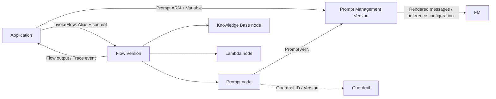

# Amazon Bedrock Prompt ManagementとAmazon Bedrock Flows

最終確認日: 2026-09-22

| 項目 | 内容 |
|---|---|
| 重要度 | A: 中核 |
| 対象サービス／機能 | Amazon Bedrock Prompt Management、Amazon Bedrock Flows（試験ガイド上の表記: Amazon Bedrock Prompt Flows） |
| 対応Task・Skills | 主軸: Task 1.6 / Skills 1.6.1〜1.6.6。接点: Task 2.5、Task 3.4、Task 5.2 |
| このページで分かること | Prompt Managementが再利用可能なPrompt構成を管理する範囲と、Flowsが型付きNodeを接続してWorkflowを実行・展開する範囲を区別する。両機能の入出力、Version、Guardrail、権限、Trace、Quota、料金要因までをサービス単位で追える。 |

## 全体像

Prompt ManagementとFlowsは、管理する対象が異なる。

- **Prompt Management**は、Prompt message、Variable、ModelまたはInference profile、Inference configurationを再利用可能なPrompt resourceとして保持する。Draftで編集・テストし、ある時点の構成をVersionとして固定する。
- **Flows**は、Prompt、Foundation Model（FM）、Knowledge Base、LambdaなどをNodeとして接続し、Node間で型付きDataを渡すWorkflowを管理する。Working draftをテストし、ImmutableなVersionとAliasでApplicationへ公開する。

図の上段はPrompt単体の実行、下段はFlowによるOrchestrationを示す。Prompt Managementは業務Workflowを実行せず、FlowsはPromptの本文やVariantを管理するRepositoryではない。Prompt nodeからManaged promptを参照するときに両者が接続する。

AWSはPrompt／Flow resourceを保存するControl plane、Flow実行とNode間のData受け渡しを提供する。利用者はPrompt内容、変数へ渡すData、Modelと推論設定、Flow定義、依存Resource、Versionの採用、IAM権限、TestとApplication側の検証を管理する。

## Prompt Management

### Prompt・Variable・Variant

| 機能 | 入力 | 処理・保持する状態 | 出力 | 利用者が管理する範囲 |
|---|---|---|---|---|
| Prompt | TextまたはChat形式のMessage、任意のSystem messageや会話履歴 | 再利用可能なPrompt resourceの`DRAFT`を保持する | Prompt ID／ARN | 指示、Context、出力形式、機密情報を含めない設計 |
| Variable | `{{variable}}`形式のPlaceholderとRuntime値 | Testまたは実行時に値をTemplateへ差し込む | RenderされたPrompt | Variable名、値の検証、Data分類 |
| Variant | Message、Model、Inference configurationなどの代替構成 | Variantを並べてTestできる。Consoleでは最大3 Variantを比較し、`Save as draft`で選んだ構成をDraftへ保存する | Variant別のModel出力 | 比較条件、評価基準、採用するVariant |

`CreatePrompt`では`variants`と`defaultVariant`を指定する。VariantはModel IDまたはInference profile、`TEXT`／`CHAT`のTemplate、共通推論Parameter、Model固有の追加Field、Metadataを持てる。Prompt Management自体は、Variableへ渡す値の業務上の妥当性や、Variantの品質を自動承認しない。

### Test・Version・Lifecycle

Prompt builderではVariableへTest valueを入れて実行できる。Test valueは一時的であり、Promptを保存しても保存されない。Test対象はDraftまたは既存Versionである。

Promptを保存すると編集可能なDraftになる。`CreatePromptVersion`で作るVersionは、作成時点のPrompt構成のSnapshotである。ApplicationはVersionを含むPrompt ARNを`modelId`へ指定してRuntime APIから呼び出す。Prompt ManagementにはFlow Aliasに相当するRouting resourceが公式Lifecycleとして説明されていないため、Applicationまたは参照元Flowが使用するPrompt Versionを明示する。

Prompt Managementが提供する状態はDraftとVersionである。Owner、Review、Approval、品質Gate、Rollback理由などのGovernance記録は、利用者のWorkflowでVersion IDと関連付ける。この判断と展開手順は[Task 1.6の補足ページ](../supplimental-pages/01-06-prompt-engineering-and-governance.md)で扱う。

### FM／Inference configuration・Guardrailとの関連付け

Promptには、FM、Inference profile、またはConsoleでテストするAgentを関連付けられる。すべてのPromptで共通に扱う基本Parameterは`maxTokens`、`stopSequences`、`temperature`、`topP`である。Model固有Parameterは`additionalModelRequestFields`へ指定する。対応範囲はModelごとに異なる。

2026-09-22時点で、Prompt ManagementはConverse API対応のText modelを利用できる。Managed promptを`InvokeModel`／`InvokeModelWithResponseStream`で直接使えるのは、Prompt構成がAnthropic ClaudeまたはMeta Llamaを指定する場合である。対応ModelとRegionは追加・変更されるため、利用時に公式一覧を再確認する。

Guardrailの関係は呼び出し経路ごとに区別する。

- Managed promptを`Converse`／`ConverseStream`で実行するときは、Requestの`guardrailConfig`でPrompt全体へGuardrailを適用できる。`guardContent`を指定した場合は、そのBlockだけが対象になる。
- FlowのPrompt nodeでは、`guardrailIdentifier`と`guardrailVersion`をNode設定へ指定できる。
- Knowledge Base nodeでGuardrailを指定できるのは`RetrieveAndGenerate`を使う場合である。検索結果だけをArrayで返す経路には同じ適用条件を持ち込まない。

Managed promptを`Converse`／`ConverseStream`で呼ぶ場合、`additionalModelRequestFields`、`inferenceConfig`、`system`、`toolConfig`はRequest側で同時指定できない。`messages`を指定した場合は、Managed prompt内のMessageの後ろへ追加される。Model、推論設定、ToolはPrompt resource側との責務境界を保つ。

## Amazon Bedrock Flows

### Flow nodeと型

Flow定義はNodeとConnectionから成る。各Node inputにはName、Expression、Typeを、OutputにはNameとTypeを指定する。RuntimeではExpressionで取り出した値とNode outputが宣言した型に一致するか検証される。使用する型は`String`、`Number`、`Boolean`、`Object`、`Array`を中心とする。

Flowは1つのFlow input nodeから開始し、少なくとも1つのFlow output nodeを持つ。Logicを制御するInput／Output、Condition、Iterator、Collectorなどと、処理を実行するPrompt、Knowledge Base、LambdaなどのNodeを接続する。Node固有Resourceは事前に作成し、Flow定義からIDまたはARNで参照する。

### Condition・Iterator・Collector

| Node | 入力 | 処理 | 出力 | 主な制約・連携 |
|---|---|---|---|---|
| Condition | 1つ以上の型付き値 | `==`、`!=`、数値比較と`and`／`or`／`not`で条件を順に評価する | 最初に成立したConditionのConnectionへDataを送る | 複数成立時は定義順が優先。Default outcomeが必要 |
| Iterator | `array`（Array） | ArrayのItemを後続Nodeへ反復して渡す | `arrayItem`と`arraySize` | 反復後の再集合にはCollectorを接続する |
| Collector | 各反復の`arrayItem`と`arraySize` | Iterator経路から返るItemを集約する | `collectedArray`（Array） | Iteratorの下流で、各Itemを処理した結果を集める |

ConditionはModelの自由文を解釈するNodeではない。宣言した型の値を比較する。IteratorとCollectorはArrayを1 Itemずつ処理して再びArrayへ集約する責務を持ち、反復内で呼ぶPrompt、Lambdaなどの回数はFlowのNode transition数と依存サービス利用量へ反映される。

### Lambda・Knowledge Base・Prompt node

| Node | 入力 | AWS側の処理 | 出力 | 利用者の管理境界・代表連携 |
|---|---|---|---|---|
| Prompt | Variableへ対応する型付きData | Managed promptまたはInline promptをRenderし、設定したModelで推論する | `modelCompletion`（String） | Prompt ARN／Inline設定、Model、Inference configuration、Guardrail Versionを管理 |
| Knowledge Base | `retrievalQuery`（String） | Knowledge Baseを検索し、設定により検索結果を返すかModelで回答を生成する | `retrievalResults`（Array）または`outputText`（String） | Knowledge Base ID、`Retrieve`／`RetrieveAndGenerate`相当の使い分け、Model・Guardrail設定を管理 |
| Lambda function | `codeHookInput`として1つ以上の型付きData | 指定したLambda functionをFlow execution roleで呼ぶ | `functionResponse`（宣言した型） | Function code、Timeout、Error処理、入力・出力契約、`lambda:InvokeFunction`権限を管理 |

Prompt nodeのManaged prompt参照はPrompt ARNを使う。Inline promptではNode内にModel、Template、Inference configurationを定義する。Lambda nodeへはFlow ARN、Flow Alias ARN、Node名と解決済みInput値を含むEventが送られる。各依存Resourceの可用性、Quota、ErrorはFlow全体の完了へ影響する。

### Test・Version・Alias

作成直後のFlowにはWorking draft（`DRAFT`）と、それを指すTest alias（`TSTALIASID`）がある。Test前にAmazon Bedrockは、Node間の接続、Flow output nodeの存在、Input／Output型、Condition式とDefault outcomeを検証する。変更は保存してからTestへ反映する。

満足したWorking draftから作るFlow Versionは、作成時点のImmutableなSnapshotである。Production applicationはVersionへ直接追従するのではなく、Versionを指すAliasへ`InvokeFlow`を送る。Aliasの参照先を別Versionへ更新すると、呼び出し先を変えずに展開版を切り替えられる。

Prompt VersionとFlow Versionは別Resourceである。Flow Versionが参照するPrompt、Guardrail、Knowledge Base、Lambdaなどの識別子とVersion条件を、同一の展開記録として追跡する必要がある。

## API、Event、Dataの入出力

| 面 | 主なAPI／識別子 | 入力 | 出力 |
|---|---|---|---|
| Prompt Control plane | `CreatePrompt`、`UpdatePrompt`、`CreatePromptVersion`、`GetPrompt` | Prompt名、Variant、Default variant、暗号化Key、Tag | Prompt ID／ARN、DraftまたはVersion情報 |
| Prompt Data plane | `Converse`、`ConverseStream`、条件付きで`InvokeModel`／`InvokeModelWithResponseStream` | Version付きPrompt ARNを`modelId`へ指定し、`promptVariables`を渡す | Model response／Stream |
| Flow Control plane | `CreateFlow`、`UpdateFlow`、`PrepareFlow`、`CreateFlowVersion`、`CreateFlowAlias`／`UpdateFlowAlias` | Execution role ARN、Node／Connection定義、Version、Alias routing | Flow／Version／Alias ARNと状態 |
| Flow Data plane | `InvokeFlow` | Flow ID、Alias ID、Input node名、`content` | `flowOutputEvent`。完了時は`flowCompletionEvent`、`enableTrace`時はTrace eventも返す |
| Lambda連携 | Lambda invocation event | Flow／Alias ARN、Node名、型・Expression・解決済み値 | Functionが返した値をNode outputとして検証 |

Build-timeのPrompt／Flow APIとRuntimeの推論／`InvokeFlow`を分ける。ApplicationはControl planeのDraft更新権限と、ProductionのVersion／Alias実行権限を同一視しない。

## SecurityとData保護

### IAMと管理境界

利用者がPrompt／Flowを作成・更新するUser roleと、Amazon BedrockがFlow内のResourceを呼び出すFlow execution roleは別である。Execution roleのTrust policyでは`bedrock.amazonaws.com`に`sts:AssumeRole`を許可し、`aws:SourceAccount`とFlow ARNの`aws:SourceArn`条件で範囲を狭められる。

Execution roleには、使用Nodeに応じて次の権限だけを付与する。

- Modelの`bedrock:InvokeModel`
- Managed promptの`bedrock:RenderPrompt`
- Knowledge Baseの`bedrock:Retrieve`
- Guardrailの`bedrock:ApplyGuardrail`
- Lambdaの`lambda:InvokeFunction`
- 暗号化Resourceに必要な`kms:Decrypt`など

2024-11-22より後に作成されたFlowでは、Managed promptのRenderに`bedrock:RenderPrompt`を使い、Lambda／LexもFlow service roleで呼び出す。これより前のFlowはExecution roleの権限更新が必要になる場合がある。これは既存Resourceへ適用条件がある変更点である。

### 暗号化、Network、機密Data

Prompt作成時、指定しなければAWS managed keyで暗号化され、Customer managed AWS KMS keyも選択できる。FlowとFlowが呼ぶ暗号化ResourceでCustomer managed keyを使う場合は、Key policyとExecution roleのKMS権限を整合させる。

Prompt本文、Variable、Flow input、Node output、Traceには業務Dataや機密Dataが入り得る。利用者は保存してよいData、Runtimeで渡すData、Traceを表示・保存できる主体、下流のLambda／Knowledge Baseへ渡す範囲を管理する。GuardrailはIAM認可や業務固有の入力Schema検証の代替ではない。

Network経路は、Flowから呼ぶModel、Knowledge Base、Lambda、S3など各依存先のEndpointとNetwork設定にも依存する。Prompt Management／Flowsの機能名だけで、Applicationから依存先までPrivate経路になるとは判断しない。

## 可観測性と運用

### Test Traceと監査

Flow TestではTraceを有効にすると、各NodeのInput、Output、実行時間と、最終Responseまでの経路を確認できる。APIでは`InvokeFlow`の`enableTrace`を`true`にする。Traceは予期しない分岐、Error、性能上の停滞箇所を追うDataであり、機密Dataを含み得る点に注意する。

Prompt／Flowの作成、更新、Version化、Alias更新などのAPI操作はCloudTrailによるControl plane監査の対象として追跡する。Flow Traceは実行経路、CloudTrailはAPI操作主体と操作内容を扱い、Prompt品質や承認理由そのものは利用者の評価記録で補う。

### 可用性とScaling

Prompt ManagementとFlowsでは、利用者がPrompt保存基盤やFlow orchestration serverをProvisioningしない。End-to-endの可用性と処理量は、選択したModel、Inference profile、Knowledge Base、Lambdaなどの提供Region、Quota、Timeout、Errorにも制約される。Iterator内の呼び出しはItem数だけ依存Nodeを繰り返すため、Flowだけでなく各依存先のThrottlingも確認する。

Flow VersionはImmutableで、Aliasを以前のVersionへ付け替えられる。一方、Version切替は実行中の依存Resource障害を自動的に解消する仕組みではない。利用者は依存先の失敗を含むTestとApplication側のError処理を管理する。

### Region、Quota、料金要因

以下は2026-09-22に確認した既定値・提供条件である。Accountに適用される値はService Quotasと利用Regionで再確認する。

| 対象 | 確認した条件 |
|---|---|
| Prompt Management Region | 東京（`ap-northeast-1`）と大阪（`ap-northeast-3`）を含む公式掲載Regionで提供。Model自体のRegion対応も別途必要 |
| Prompt Management Model | Converse対応Text model。`InvokeModel`系でManaged promptを使う場合はAnthropic ClaudeまたはMeta Llama構成に限定 |
| Prompt Management Quota | 1 Account・1 supported Region当たりPrompt 500（調整可能）、1 Prompt当たりVersion 10（調整不可） |
| Flows Region・Model | 東京と大阪を含むPrompt Managementと同じ公式掲載Regionで提供。Prompt nodeはConverse対応Text model、Agent／Knowledge Base nodeは各機能の対応Model・Regionにも依存 |
| Flows Quota | 1 Account・1 supported Region当たりFlow 100（調整可能）、1 Flow当たりVersion 10、Alias 10（後二つは調整不可）、総Node 40（調整不可） |
| Node別Quotaの例 | Prompt node 20（調整可能）、Knowledge Base node 20、Lambda node 20、Iterator node 1（後三つは調整不可） |

Flowsの料金要因はNode transition数である。Iteratorでは反復ごとのTransitionも数える。さらに、Prompt nodeのModel token、Knowledge Base、Lambda、S3、Guardrailなど、Workflow内で利用した各AWS serviceの料金が加算される。Prompt ManagementではPromptの保存・Version数だけで推論料金が決まるのではなく、実行時のModel、Token、推論方式、Guardrailなどが主な料金要因になる。単価は固定値として扱わず、利用Regionと実行日に公式料金ページで確認する。

## AIP-C01の対応Task・Skills

| Task・Skills | このサービスページでの接点 |
|---|---|
| Task 1.6 / Skills 1.6.1〜1.6.6 | Prompt Template、Variable、Variant、Test、Version、Guardrail、会話Message、条件分岐、前後処理を管理・実行する中核機能 |
| Task 2.5 / Skills 2.5.1〜2.5.6 | ApplicationがVersion付きPrompt ARNまたはFlow AliasをAPIから呼び、Prompt chainingとAWS service連携を組み込む接点 |
| Task 3.4 / Skills 3.4.1〜3.4.3 | Guardrail Version、再現可能なPrompt／Flow Version、Traceと人による評価記録を関連付ける接点。Responsible AIの判断自体をFlowへ委任するものではない |
| Task 5.2 / Skills 5.2.1〜5.2.5 | Prompt Version、Variable、Model・推論設定、Node input／output型、Condition、Trace、依存Resourceを分けて不具合を調べる接点 |

## 関連するliteral／supplimental page

- Task 1.6の公式機能とSkill: [`01-06-prompt-engineering-and-governance.md`](../literal-pages/01-06-prompt-engineering-and-governance.md)
- Prompt／Guardrail／Flowの選択、評価、展開判断: [`01-06-prompt-engineering-and-governance.md`](../supplimental-pages/01-06-prompt-engineering-and-governance.md)
- Task 2.5の予定範囲: [Literal pages目次のTask 2.5](../literal-pages/README.md#第2部-実装と統合)、[Supplimental pages目次のTask 2.5](../supplimental-pages/README.md#第2部-実装と統合)
- Task 3.4の予定範囲: [Literal pages目次のTask 3.4](../literal-pages/README.md#第3部-ai-safetysecuritygovernance)、[Supplimental pages目次のTask 3.4](../supplimental-pages/README.md#第3部-ai-safetysecuritygovernance)
- Task 5.2の予定範囲: [Literal pages目次のTask 5.2](../literal-pages/README.md#第5部-テスト検証トラブルシューティング)、[Supplimental pages目次のTask 5.2](../supplimental-pages/README.md#第5部-テスト検証トラブルシューティング)

## 公式資料

- [AIP-C01 Content Domain 1](https://docs.aws.amazon.com/aws-certification/latest/ai-professional-01/ai-professional-01-domain1.html) — Task 1.6とSkills 1.6.1〜1.6.6
- [Prompt Management](https://docs.aws.amazon.com/bedrock/latest/userguide/prompt-management.html) — Prompt、Variable、Variantと全体Workflow
- [Create a prompt](https://docs.aws.amazon.com/bedrock/latest/userguide/prompt-management-create.html) — Template、Model、Inference configuration、Variant、暗号化、API入出力
- [Test a prompt](https://docs.aws.amazon.com/bedrock/latest/userguide/prompt-management-test.html) — Test value、Runtime API、Managed promptのRequest制約、Guardrail
- [Deploy a prompt using versions](https://docs.aws.amazon.com/bedrock/latest/userguide/prompt-management-deploy.html) — DraftとVersion lifecycle
- [Supported Regions and models for Prompt Management](https://docs.aws.amazon.com/bedrock/latest/userguide/prompt-management-supported.html) — Region、Converse対応Model、InvokeModelの条件
- [Amazon Bedrock Flows](https://docs.aws.amazon.com/bedrock/latest/userguide/flows.html) — Flowの役割、作成、Test、展開と料金要因
- [Supported Regions and models for flows](https://docs.aws.amazon.com/bedrock/latest/userguide/flows-supported.html) — FlowsのRegionとNode別Model条件
- [Create and design a flow](https://docs.aws.amazon.com/bedrock/latest/userguide/flows-create.html) — Flow定義とControl plane
- [Node types for flows](https://docs.aws.amazon.com/bedrock/latest/userguide/flows-nodes.html) — Node、型、Condition、Iterator、Collector、Prompt、Knowledge Base、Lambda
- [Test a flow](https://docs.aws.amazon.com/bedrock/latest/userguide/flows-test.html) — 検証項目、Test、Trace
- [Deploy a flow using versions and aliases](https://docs.aws.amazon.com/bedrock/latest/userguide/flows-deploy.html) — Working draft、Immutable Version、Alias
- [Track each step in a flow with trace](https://docs.aws.amazon.com/bedrock/latest/userguide/flows-trace.html) — Node input／output、実行経路、`enableTrace`
- [Create a service role for Amazon Bedrock Flows](https://docs.aws.amazon.com/bedrock/latest/userguide/flows-permissions.html) — Trust policy、Node別権限、2024-11-22前後の適用条件
- [Amazon Bedrock endpoints and quotas](https://docs.aws.amazon.com/general/latest/gr/bedrock.html) — Prompt Management／FlowsのQuota
- [Amazon Bedrock pricing](https://aws.amazon.com/bedrock/pricing/) — Flow node transitionと依存Resourceの料金要因

最終確認日: 2026-09-22
