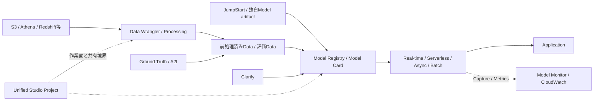

# Amazon SageMaker AIと関連機能

最終確認日: 2026-09-23

| 項目 | 内容 |
|---|---|
| 重要度 | A: 中核 |
| 対象サービス／機能 | Amazon SageMaker AI、Amazon SageMaker Clarify、Amazon SageMaker Data Wrangler、Amazon SageMaker Ground Truth、Amazon SageMaker JumpStart、Amazon SageMaker Model Monitor、SageMaker Model Registry、SageMaker Neo、SageMaker Processing、Amazon SageMaker Unified Studio、Amazon Augmented AI（Amazon A2I） |
| 対応Task・Skills | 主軸: Task 1.2 / Skills 1.2.1〜1.2.4、Task 1.3 / Skills 1.3.1〜1.3.4。横断: Task 2.2 / Skills 2.2.1〜2.2.3、Task 3.3 / Skills 3.3.1〜3.3.4、Task 3.4 / Skills 3.4.1〜3.4.3、Task 4.1 / Skills 4.1.1〜4.1.4、Task 4.2 / Skills 4.2.1〜4.2.6、Task 4.3 / Skills 4.3.1〜4.3.6、Task 5.1 / Skills 5.1.1〜5.1.9のうちSageMaker AIが直接担う部分 |
| このページで分かること | SageMaker AIを、データ前処理、モデル成果物、推論、版管理、段階展開、Responsible AI、監視、最適化をつなぐマネージドML基盤として捉える。各機能の入出力、AWSと利用者の管理境界、およびAmazon SageMakerという統合基盤やAmazon Bedrockとの境界を整理する。 |

## 全体像

Amazon SageMaker AIは、MLモデルとFoundation Model（FM）を構築、学習、デプロイするためのフルマネージドサービスである。AWSは、JobやEndpointを動かす基盤とSageMaker AIのControl plane／Runtimeを管理する。利用者は、データ、処理コード、Container、Model artifact、Instance／推論方式、IAM、Network、評価基準、Version、監視と費用を管理する。

2024-12-03に従来のAmazon SageMakerは**Amazon SageMaker AI**へ改称された。`sagemaker` API namespace、Service endpoint、`AWS::SageMaker` CloudFormation resourceなどは互換性のため名称が変わっていない。一方、現在の**Amazon SageMaker**はData、Analytics、AIを統合する上位Platformであり、SageMaker AI、SageMaker Lakehouse、Data and AI Governance、Data Processing、Unified Studio、Amazon Bedrockなどを含む。SageMaker AIと統合Platform全体を同義に扱わない。

図はサービス間の責務を示す。SageMaker AIはJobとEndpointを管理するが、FM入力の業務上の妥当性、生成内容の事実性、Human reviewerの判断基準、ModelをProductionへ進める承認まで自動的に決定するものではない。

## 1. SageMaker AIと統合SageMakerの境界

| 観点 | 入力 | 処理・保持する状態 | 出力 | 利用者が管理する範囲 | 代表的な連携 |
|---|---|---|---|---|---|
| SageMaker AI | Data、Code／Container、Model artifact、Job／Endpoint設定 | Processing、Model管理、Hosting、MonitoringなどのML Resourceを実行・保持 | 処理済みData、Model Resource、推論Response、Metric／Log | Resource構成、Data contract、IAM、評価、Version、停止・削除 | S3、ECR、CloudWatch、EventBridge、KMS、VPC |
| Amazon SageMaker | Data、Analytics、AIのProjectとResource | 複数AWS機能を統合したPlatformを提供 | 統合された開発・Governance体験 | どのCapabilityを使うか、Domain／Project、Data access | SageMaker AI、Lakehouse、Bedrock、Redshift、Glue |
| Unified Studio | Domain、Identity、Project membership、Project内Resource | Data、Analytics、AI、MLの統合作業面とProject単位の共同作業を提供 | 共有されたData、Compute work、Application、Model等 | AdministratorはUser／GroupとTeam用Resource、利用者はProject内成果物とAccess | IAM Identity Center／IAM、SageMaker AI、Bedrock、Analytics service |

Unified StudioはModelを推論するRuntimeそのものではない。AdministratorがDomain、認証、User／Group、Project profileやResourceを整え、利用者がProjectへ参加して作業する。Model Endpoint、Processing job、S3、KMSなど、Projectから利用する個別Resourceの権限と料金は残る。

## 2. Data Wrangler／ProcessingによるFM入力前処理

Data Wranglerは、Data sourceからDataを取り込み、Data flow上で結合、変換、可視化、Data quality分析を行い、S3、SageMaker Pipelines、Feature Store、Python scriptなどへExportする機能である。従来のData WranglerはStudio Classicの機能であり、現在はSageMaker Canvasへ統合された新しいData Wrangler体験も提供される。UIと実行環境を混同せず、利用する体験の公式手順と料金を確認する。

SageMaker Processingは、利用者のScript／NotebookをBuilt-inまたは独自Containerで実行するJob基盤である。SageMaker AIはCompute instanceを起動し、S3からDataとScriptを取得して処理し、指定したS3へ結果を保存した後にResourceを解放する。S3に加えてAthenaまたはRedshiftを入力Sourceにできる。

| 機能 | 入力 | 処理 | 出力 | 管理境界 | 代表的な連携 |
|---|---|---|---|---|---|
| Data Wrangler | S3、Athena、Redshift等のData、Data flow | Import、Clean、Transform、Featurize、Analyze、Data Insights | Data flow、変換済みData、Quality report、Script／Pipeline定義 | 利用者がSampling、Schema、変換、PII処理、出力先を決める | Canvas、S3、Pipelines、Feature Store |
| Processing | S3等のData、Script／Notebook、Container image、Instance設定 | 一時的なManaged computeで前処理、後処理、評価を実行 | S3上のArtifact、Job status、CloudWatch metric／log | AWSはJob基盤を管理。利用者はCode、依存関係、Data validation、Instance、Retry、Output検証を管理 | S3、ECR、Athena、Redshift、CloudWatch |

FM入力Pipelineでは、正規化、形式変換、重複・欠損・PII検査、評価Data作成などに使える。ただし、Data WranglerやProcessingを通過しただけで生成AI向けの事実性、Prompt injection耐性、利用許諾が保証されるわけではない。

## 3. JumpStartとModel artifact

SageMaker JumpStartは、事前学習済みModel、Solution template、Notebook例を提供する。StudioのModels画面ではSageMaker Public Hub、Private／Curated Hub、Customized modelを探索し、対応するModelでFine-tune、Customize、Deploy、Evaluateを開始できる。すべてのModelがすべての操作へ対応するわけではない。

ModelをSageMaker AIでHostする基本入力は、S3上のModel artifactとECR上のInference container imageである。`CreateModel`でこれらとExecution role、Network設定、Environment variableを関連付け、EndpointまたはTransform jobから利用する。JumpStartは候補ModelとDeployment assetを提供するが、第三者ModelのLicense確認、Model cardの制限、Artifact／ContainerのVersion固定、脆弱性管理、対象Region／Instanceでの互換性は利用者の責任である。

2026-03-13にJumpStart catalogから一部ModelがRegion横断で除外されたと公式資料に記載されている。既存Endpointは動作を継続するとされるが、CatalogのModel availabilityはLifecycle保証ではない。利用時点でModel詳細、License、Region、Deploy／Customize／Evaluate対応を確認する。

| 入力 | JumpStart／SageMaker AIの処理 | 出力 | 利用者の管理範囲 | 代表的な連携 |
|---|---|---|---|---|
| Model ID／Model card、任意のCustomization data | 対応Asset、Notebook、Deployment workflowを提示・実行 | Model artifact、Endpoint、評価結果等 | License、Data、Version、評価、Instance、Endpoint削除 | Studio、S3、ECR、Model Registry、Endpoint |
| S3 Model artifactとECR image | `Model` ResourceとしてDeployment情報を保持 | Endpoint／Batch Transformで使うModel | Artifactの完全性、Image、Execution role、Environment、Network | KMS、VPC、CloudWatch、Registry |

## 4. Endpoint、Inference option、Auto Scaling

SageMaker AI Inferenceは4つの方式を提供する。適用条件は変わり得るため、固定値は公式のInference optionsとSupported featuresで再確認する。

| 方式 | 入力と処理 | 出力 | AWSと利用者の管理境界 | Scaling／連携 |
|---|---|---|---|---|
| Real-time Inference | `InvokeEndpoint`等でPayloadを永続Endpointへ同期送信 | 同期Responseまたは対応する場合はResponse stream | AWSはEndpoint基盤を管理。利用者はInstance type、初期台数、Variant、Container health、Scaling policyを管理 | Application Auto Scaling、CloudWatch。低Latency／持続Traffic向け |
| Serverless Inference | Endpointへ同期Request | 同期Response | AWSがInstanceを意識させず基盤とAuto Scalingを管理。利用者はMemory、Provisioned Concurrencyを含む対応FeatureとCold startを確認 | 断続的・予測困難なTraffic向け。機能制約はFeature matrixで確認 |
| Asynchronous Inference | Request payloadをS3へ置き、`InvokeEndpointAsync`へS3 URIを渡す | S3上のResponse／Failure結果と通知 | AWSはQueueとEndpoint実行を管理。利用者はInput／Output S3、期限、再処理、Scalingを管理 | Auto Scalingで0 Instanceまで縮小可能。S3、SNS、CloudWatch |
| Batch Transform | S3上の大量Data、Model、Transform設定 | S3上の推論結果 | 永続Endpointを作らずJob用ComputeをAWSが起動・解放。利用者は分割、並列度、Record対応、失敗処理を管理 | S3、EventBridge／CloudWatch。Offline処理向け |

Real-time EndpointのAuto ScalingではProduction variantをScalable targetとして登録し、最小・最大CapacityとTarget trackingまたはStep scaling policyを設定する。Target trackingはCloudWatch metricとTarget値に基づいてInstance数を調整する。Model load時間、Scale-out中のQueue、Cooldown、最大Quotaは利用者がCapacity planへ含める。

`CreateModel`、`CreateEndpointConfig`、`CreateEndpoint`の順に、Artifact／Container、Compute構成、Runtime endpointを分離して作る。Endpoint名だけでModel versionを識別せず、Model、Endpoint configuration、Variant、Application側のPrompt／Schemaを対応付ける。

## 5. Model Registry、Model Cards、Deployment guardrails

Model RegistryはModel package group内にVersion付きModel packageを登録する。Model versionにはModel artifact、任意のInference code、Metric、Metadata、Lineage、Approval statusを関連付けられる。`PendingManualApproval`、`Approved`、`Rejected`などのApproval statusをPipelineやCI/CDの条件にできるが、承認基準そのものは利用者が定義する。

Model Cardsは、Model owner、目的、意図した用途／意図しない用途、Risk rating、Training情報、評価結果、注意事項を記録するGovernance resourceである。Model Registryと統合され、ClarifyやModel MonitorがS3へ出力したJSON評価Reportを参照できる。Approval status以外の編集は新しいModel Card versionとなり、変更記録を保持する。

Deployment guardrailsはReal-timeとAsynchronous EndpointのUpdateに適用される。Blue/greenのAll at once、Canary、Linear、およびRolling deploymentを構成できる。CloudWatch AlarmとBaking periodを指定すると、Alarm発火時に旧Endpoint構成へAuto rollbackする。これはErrorやLatencyなど観測可能なAlarmに対するRollbackであり、生成内容の品質を自動判定する機能ではない。

| 機能 | 入力 | 保持／処理 | 出力 | 利用者が管理する範囲 | 代表的な連携 |
|---|---|---|---|---|---|
| Model Registry | Artifact、Container、Metric、Metadata、Group | Version、Approval、Lineage、Deployment history | Deploy可能なModel package version | 評価Gate、承認者、Cross-account access、Retention | Pipelines、CI/CD、Endpoint、Model Cards |
| Model Cards | Model情報、用途、Risk、評価Report | 監査用DocumentをVersion化 | JSON／PDFのCardとVersion | 内容の正確性、Owner、Evidence、更新・承認 | Registry、Clarify、Model Monitor、S3 |
| Deployment guardrails | 新旧Endpoint configuration、Traffic shift、Baking period、Alarm | Fleetを段階更新し、条件違反時にRollback | Endpoint deployment status／Event | Alarm、Quality gate、Capacity、互換性、旧版保持 | CloudWatch、EventBridge、`UpdateEndpoint` |

## 6. Clarify、Ground Truth、Amazon A2I

3機能は「人や責任あるAI」に関係するが責務が異なる。

| 機能 | 入力 | 処理 | 出力 | 管理境界 | 代表的な連携 |
|---|---|---|---|---|---|
| SageMaker Clarify | S3上のDataset、分析設定、必要に応じModel／Endpoint | Specialized Processing containerでPre-training bias、Post-training bias、Feature attribution等を計算 | S3上のJSON、Visual report、Attribution file | 利用者がFacet、Label、Baseline、Metric、社会・法的文脈、結果解釈を管理 | Processing、Endpoint、Model Monitor、Model Cards |
| Ground Truth | S3 input manifest、Task type、Label定義、Worker UI、Workforce | Data objectをWorkerへ割当て、Annotationを統合。対応TaskではAutomated labelingも実行 | S3の`output.manifest`、個別Annotation、Metadata | 利用者が指示、Workforce、PII、品質検査、Budgetを管理 | S3、IAM、Private workforce、Model training／Evaluation |
| Amazon A2I | Flow definition、Worker template、Workforce、Review対象 | Built-in条件またはApplicationの`StartHumanLoop`でHuman reviewを開始 | S3上のHuman review結果、Human loop status | 利用者がEscalation条件、Reviewer権限、Template、SLA、結果の反映を管理 | Textract、Rekognition、Custom application、S3 |

ClarifyはBiasを「除去」したり、Fairnessの正解を自動決定したりしない。指標とFeature attributionを生成し、利用者がStakeholderと適切なMetric、Group、Threshold、残存Riskを判断する。2026-09-23時点でClarifyは新規顧客へ開放されておらず、既存顧客は継続利用できると公式資料に記載されている。

Ground TruthはDatasetをLabel付けする仕組み、A2Iは推論や業務処理の特定結果を人へReviewさせる仕組みである。2026-09-23時点でGround TruthとA2Iはいずれも新規顧客へ開放されておらず、既存顧客は継続利用できる。A2IのCustom taskではBuilt-inのActivation conditionを設定できないため、Applicationが条件を評価して`StartHumanLoop`を呼ぶ。

## 7. Model Monitor

SageMaker Model MonitorはProductionのModelについて、Baselineと取得Dataを比較するMonitoring jobをScheduleし、違反をReportする。主なMonitorはData quality、Model quality、Bias drift、Feature attribution driftである。Model qualityには予測と後から得られるGround Truth labelの対応が必要になる。

入力はEndpointのData Capture、Baseline statistics／constraints、Monitoring schedule、Processing用Container／Instance、任意のGround Truthである。出力はS3上のStatistics、Constraint violation、CloudWatch metric／Alarmである。AWSはMonitoring jobをScheduleして実行するが、Capture対象、PIIの扱い、Baselineの代表性、Ground Truth結合、Threshold、Alert後の対応は利用者が管理する。

Model MonitorはReal-time Endpoint、定期的に実行するBatch Transform job、on-scheduleのAsynchronous batch transform jobを監視できる。Real-time Endpointの組み込みMonitoringでは、単一ModelをHostするEndpointを対象とし、Multi-model Endpointは対象外である。また、Model Monitorが計算するMetric／StatisticsはTabular dataを対象とし、image classificationのInput imageのような非Tabular inputは対象外である。2026-09-23時点でModel Monitorも新規顧客Accessを受け付けず、既存顧客は継続利用できる。したがって、LLMのFactual accuracy、Hallucination、Safety、Business outcomeをModel Monitorだけで評価できるとはみなさない。生成AI固有MetricはApplication log、評価Runner、Human feedback等と組み合わせる。

## 8. Neoと推論最適化

SageMaker Neoは、FrameworkからExportされたModelを対象Hardware向けにCompileする。CompilerがFramework固有Operationを中間表現へ変換して最適化し、Target platform向けLibrary、Model definition、Parameterを生成する。Neo Runtimeが対象PlatformでCompile済みModelをLoadして実行する。

| 入力 | 処理 | 出力 | 利用者が管理する範囲 | 代表的な連携 |
|---|---|---|---|---|
| Model artifact、Framework、Input shape、Target instance／Device | Compilation jobでTarget固有に最適化 | S3上のCompiled artifactと対象Runtime | 対応Framework／Operator／Target、精度、Latency、Throughput、Fallback artifact | SageMaker Endpoint、AWS IoT Greengrass、S3 |

NeoはFP32のほか、対応するModelではINT8／FP16へQuantizeされたModelも扱う。Compile成功は品質やSLO達成を保証しない。元Modelと同じEvaluation dataで出力差、精度、Latency、Memory、Target互換性を確認する。

SageMaker AIにはNeo以外にもInference OptimizationでQuantization、Speculative decoding、Compilation、Fast model loadingなどを扱う機能がある。対応Model、Instance、Runtimeは変わり得るため、AIP-C01では「どのResource制約を緩和し、品質・互換性を何で再評価するか」を扱い、特定Runtime versionの暗記へ広げない。

## 9. Unified Studio、Security、MLOps

Unified StudioのProjectは共同作業とResource共有の境界を提供する。AdministratorがDomain accessとUser／Groupを管理し、Project memberがData、Compute work、Application、Model等を作成・共有する。ただし、Project membershipだけで個別のS3 object、KMS key、ECR image、SageMaker AI APIへのAccessが自動的に安全になるわけではない。Project profile、IAM／IAM Identity Center、Service role、Resource policyを対応付ける。

SageMaker AIの主なSecurity境界は次のとおりである。

- IAM: Control planeを操作するPrincipal、Job／ModelのExecution role、Endpointを呼ぶPrincipalを分ける。Execution roleは必要なS3 prefix、ECR repository、KMS key、CloudWatch等に絞る。
- 暗号化: S3、EBS volume、Model artifact、Output、Endpoint data captureを保存先ごとに暗号化し、Customer managed KMS keyを使う場合はIAMとKey policyの双方を構成する。TransportはHTTPS endpointを使う。
- Network: SageMaker APIとRuntimeはAWS PrivateLinkのInterface VPC endpointに対応する。VPC configurationを使うContainerではSubnet、Security group、Route、必要なService endpoint／NATを利用者が管理する。
- Network isolation: 有効にしたTraining／Inference containerはOutbound network callを行えず、AWS credentialもContainer runtimeへ渡されない。SageMaker AIはExecution roleを使い、Containerとは分離してS3／ECRのArtifact転送を行う。VPC configurationとNetwork isolationは同義ではない。
- Data protection: Endpoint payload、Captured data、Ground Truth／A2IのHuman data、Clarify／Monitor reportには機密情報が入り得る。最小収集、Masking、Access、Retention、削除を利用者が設定する。

MLOpsでは、Processing output、Model artifact／Container、Model package version、Model Card、Evaluation結果、Endpoint configuration、Deployment eventをLineageとして結ぶ。Registry approvalやCloudWatch AlarmはRelease controlの一部であり、Application、Prompt、Data schema、Quality gateを別々にVersion化したままにしない。

## 10. AIP-C01対象外となるModel開発／Trainingの境界

AIP-C01は、SageMaker AIの一般的なTraining service全体を網羅する試験ではない。試験ガイドは、Model選定・設定、FM入力Data処理、Domain-specificに調整したModelのDeployment／Version／Rollback、LLM HostingのResource制約、Responsible AI、運用・評価との接続を扱う。

このページで扱うTraining関連事項は、次に限定する。

- JumpStartまたは独自ArtifactをDeploy可能な形で識別すること
- Fine-tuned／Adapted modelをVersion付きArtifactとしてRegistryへ登録し、評価と承認へ接続すること
- Processing、Clarify、Ground Truth等の入力と出力をLifecycle evidenceへ関連付けること
- EndpointのInstance、Container、Memory、Model load、Scaling、OptimizationをHosting要件として扱うこと

分散Training algorithmの内部、Hyperparameter tuning手法の網羅、Advanced feature engineering、Custom optimizer設計、Model architecture研究は、このサービスページの対象外である。SageMaker AIが提供する機能であっても、Taskとの接続がない全機能Catalogには広げない。

## API、Event、Dataの入出力

### Control plane

- Data処理: `CreateProcessingJob`、`DescribeProcessingJob`、`StopProcessingJob`
- Model／Hosting: `CreateModel`、`CreateEndpointConfig`、`CreateEndpoint`、`UpdateEndpoint`、`DescribeEndpoint`、`DeleteEndpoint`
- Batch: `CreateTransformJob`、`DescribeTransformJob`
- Registry: `CreateModelPackageGroup`、`CreateModelPackage`、`UpdateModelPackage`、`DescribeModelPackage`
- Human workflow: `CreateLabelingJob`、`CreateFlowDefinition`

Control planeはResource構成とJob／Deployment stateを扱う。CloudTrailは、誰がいつAPIを呼び出したかの監査に使う。Endpoint deployment state changeなどのService eventはAmazon EventBridgeでAutomationへ渡せる。

### Data plane

- Real-time／ServerlessはSageMaker Runtimeの`InvokeEndpoint`等へPayloadを送る。
- AsyncはRequest payloadをS3へ置き、`InvokeEndpointAsync`へS3 URIを渡して、S3のOutput locationから結果を得る。
- Batch Transform、Processing、Clarify、Ground Truth、A2I、Model MonitorはS3 URIを主要なData contractとして使う。
- EndpointのRequest／Response schemaはSageMaker AI共通ではなく、Inference containerが定義する。Content type、Accept、Serialization、Error schema、Request IDをApplicationとContainerで一致させる。

Job開始の成功とData処理の成功を混同しない。ApplicationはJob ARN／Name、Model／Endpoint configuration、S3 input／output、Schema version、Correlation IDを対応付け、Terminal stateとOutputの完全性を確認する。

## 可観測性と運用

| 観測手段 | 対象 | 主な用途 | 利用者側の注意 |
|---|---|---|---|
| CloudWatch Metrics | Endpoint invocation、Latency、Error、Instance CPU／GPU／Memory／Disk、Processing job等 | Dashboard、Alarm、Auto Scaling、Deployment rollback | NamespaceとDimensionをModel／Endpoint／Variant／Jobへ対応付ける |
| CloudWatch Logs | Processing／Training／Inference containerのstdout／stderr等 | Container startup、Model load、Script error、Request処理の調査 | Payloadや秘密情報を不用意に出さず、RetentionとKMSを設定する |
| Data Capture／Model Monitor | Endpoint input／output、Baseline、Violation | Data／Model quality、Bias／Attribution drift | Sampling、Ground Truth、Schema、PII、独自GenAI metricを管理する |
| CloudTrail | SageMaker AI管理API等 | Resource変更と呼出主体の監査 | Modelの生成内容やContainer内部Logの代替ではない |
| EventBridge | Job／Endpointの状態変化Event | Pipeline進行、通知、失敗時Automation | At-least-onceを前提にConsumerを冪等にする |

Availabilityは推論方式と構成に依存する。Real-time／Async EndpointではInstance数、Auto Scaling、Health、Deployment capacityを管理する。Serverlessは基盤のProvisioningをAWSへ委譲するが、Cold start、Concurrency、Feature制約を確認する。Batch／ProcessingはJob再実行、Partial output、Idempotency、S3の整合を設計する。

QuotaはAccount、Region、Resource、API、Instance familyごとに分かれる。新規Accountでは一部Instance quotaが0の場合もある。固定値を暗記せず、AWS General ReferenceとService Quotas consoleでProcessing、Transform、Endpoint、Serverless／Async、Ground Truth等の現在値と調整可否を確認する。

料金の主な要因は次のとおりである。

- Data Wrangler／Studio／CanvasのInteractive compute時間とData Wrangler job
- Processing、Clarify、Model Monitor、Batch Transform、Neo／Inference optimizationのInstance、実行時間、Storage
- Real-time／Async EndpointのInstance type、台数、稼働時間、Blue/green時の追加Capacity
- ServerlessのCompute／処理時間、Memory、Provisioned Concurrency等
- Ground Truth／A2Iの処理Object、Workforce、人手作業、および関連Compute
- S3、ECR、KMS、CloudWatch、Data transferなど接続Service

単価、Free Tier、Savings Plans、対応Instance、Regionは2026-09-23時点でも変更され得る。作成前にSageMaker AI Pricing、Pricing Calculator、Service Quotasを確認し、EndpointとInteractive appは不要時に停止または削除する。

## AIP-C01との対応

| Task・Skill | このサービス群が担う役割 | 関連ページ |
|---|---|---|
| Task 1.2 / Skills 1.2.1〜1.2.4 | JumpStart／Model artifact、Endpoint、Registry、段階展開、Rollback、LifecycleをFM選定・設定へ接続する | [literal](../literal-pages/01-02-foundation-model-selection-and-configuration.md) / [supplimental](../supplimental-pages/01-02-foundation-model-selection-and-configuration.md) |
| Task 1.3 / Skills 1.3.1〜1.3.4 | Data Wrangler／ProcessingでText、Table等を検証・変換し、FM入力や評価DataとしてS3へ出力する | [literal](../literal-pages/01-03-data-validation-and-processing.md) / [supplimental](../supplimental-pages/01-03-data-validation-and-processing.md) |
| Task 2.2 / Skills 2.2.1〜2.2.3 | Real-time、Serverless、Async、BatchをTraffic／SLO／Resource制約へ対応させ、OptimizationとDeployment guardrailsを使う | [literal](../literal-pages/02-02-model-deployment-strategies.md) / [supplimental](../supplimental-pages/02-02-model-deployment-strategies.md) |
| Task 3.3 / Skills 3.3.1〜3.3.4 | Registry、Model Cards、Lineage、Approval、Deployment historyをGovernance evidenceへつなぐ | [Domain 3学習Task](../../docs/tasks/domain-3.md) |
| Task 3.4 / Skills 3.4.1〜3.4.3 | Clarify、Model Cards、Ground Truth／A2IによりBias／Explainabilityの測定とHuman oversightへ接続する | [Domain 3学習Task](../../docs/tasks/domain-3.md) |
| Task 4.1 / Skills 4.1.1〜4.1.4 | Endpoint capacity、Serverless／Async／Batch、Auto Scaling、Optimizationの利用量と待機Capacityを料金要因へ関連付ける | [Domain 4学習Task](../../docs/tasks/domain-4.md) |
| Task 4.2 / Skills 4.2.1〜4.2.6 | Instance、Concurrency、Model load、Compilation、Auto ScalingをLatency／Throughput／Capacityへ関連付ける | [Domain 4学習Task](../../docs/tasks/domain-4.md) |
| Task 4.3 / Skills 4.3.1〜4.3.6 | CloudWatch、Data Capture、Model Monitor、CloudTrail、EventBridgeでInfrastructureとModelのSignalを収集する | [Domain 4学習Task](../../docs/tasks/domain-4.md) |
| Task 5.1 / Skills 5.1.1〜5.1.9 | JumpStart evaluation、Processing、Clarify、Ground Truth／A2I、Model Card、Registry approvalをEvaluation evidenceとRelease gateへ接続する | [Domain 5学習Task](../../docs/tasks/domain-5.md) |

方式の選定条件、除外理由、Release判断は上表のsupplimental pageを参照する。このページではSageMaker AIサービス群の公式な機能と管理境界を扱う。

## 重要な制約と確認事項

- Amazon SageMakerは統合Platform、Amazon SageMaker AIはML機能群、Unified Studioは統合作業面であり、責務を混同しない。
- `sagemaker` API／Endpoint／CloudFormation namespaceには改名前の名称が残る。
- Data WranglerはCanvasへ統合された新体験とStudio Classic側の既存体験がある。利用環境と料金を確認する。
- JumpStart Model、Inference option、Instance、Neo target、Optimization、Regionの対応は変わる。Model／Feature matrixを利用日に確認する。
- Clarify、Ground Truth、A2I、Model Monitorは新規顧客Accessに制約がある。AIP-C01のIn-Scope掲載と新規利用可能性は同義ではない。
- Deployment guardrailsはReal-time／Async Endpointが対象であり、CloudWatch Alarmだけでは生成品質を判定できない。
- Built-in Model Monitorの対象とData typeには制約がある。LLM評価全体の代替にしない。
- SageMaker AIのManaged infrastructureは、利用者のContainer、Artifact、Data、IAM、Network、Schema、評価、Endpoint削除の責任をなくさない。
- Region、Quota、料金、提供状況は2026-09-23に確認した。実装時は公式の対応表、Service Quotas、Pricingを再確認する。

## 用語

| 用語 | このページでの意味 |
|---|---|
| Model artifact | Model weight、定義、Tokenizer等をまとめ、通常はS3に置くDeploy入力 |
| Model package group | Model Registryで同じ目的のModel versionをまとめる単位 |
| Endpoint configuration | Model／VariantとInstance／Serverless／Async構成をEndpointへ関連付けるVersion可能な設定 |
| Processing job | Script／Containerを一時的なManaged computeで実行し、結果をS3へ出すJob |
| Flow definition | Amazon A2IでWorkforce、Template、Output、Human loop条件等を定義するResource |
| Baking period | 新DeploymentへTrafficを移した後、Alarmを監視して確定またはRollbackする期間 |
| Network isolation | ContainerからのNetwork callとCredential提供を遮断し、Artifact転送をSageMaker AI側へ分離する設定 |

## 公式資料

- [AIP-C01 Content Domain 1](https://docs.aws.amazon.com/aws-certification/latest/ai-professional-01/ai-professional-01-domain1.html) — Task 1.2〜1.3と対応Skills
- [What is Amazon SageMaker AI?](https://docs.aws.amazon.com/sagemaker/latest/dg/whatis.html) — SageMaker AIの役割、改称、統合SageMakerとの境界
- [What is Amazon SageMaker Unified Studio?](https://docs.aws.amazon.com/sagemaker-unified-studio/latest/userguide/what-is-sagemaker-unified-studio.html) — Domain、Project、利用者／Administratorの境界
- [Prepare ML Data with SageMaker Data Wrangler](https://docs.aws.amazon.com/sagemaker/latest/dg/data-wrangler.html) — Import、Data flow、Transform、Analyze、ExportとCanvas統合
- [Data transformation workloads with SageMaker Processing](https://docs.aws.amazon.com/sagemaker/latest/dg/processing-job.html) — Job入出力、Managed infrastructure、CloudWatch
- [SageMaker JumpStart pretrained models](https://docs.aws.amazon.com/sagemaker/latest/dg/studio-jumpstart.html) — Model探索、Deploy／Customize／Evaluate、Catalog変更
- [Deploy models for inference](https://docs.aws.amazon.com/sagemaker/latest/dg/deploy-model.html) — Model deploymentの入口
- [Inference options in Amazon SageMaker AI](https://docs.aws.amazon.com/sagemaker/latest/dg/deploy-model-options.html) — Real-time、Serverless、Batch、Asyncの用途と条件
- [Asynchronous inference](https://docs.aws.amazon.com/sagemaker/latest/dg/async-inference.html) — S3 Input／Output、非同期処理、通知、Auto Scaling
- [Auto scaling policy overview](https://docs.aws.amazon.com/sagemaker/latest/dg/endpoint-auto-scaling-policy.html) — Target tracking、Step scaling、Capacity、Cooldown
- [SageMaker Model Registry](https://docs.aws.amazon.com/sagemaker/latest/dg/model-registry.html) — Version、Metadata、Lineage、Approval、Deployment
- [Amazon SageMaker Model Cards](https://docs.aws.amazon.com/sagemaker/latest/dg/model-cards.html) — 用途、Risk、評価、監査情報のVersion管理
- [Deployment guardrails](https://docs.aws.amazon.com/sagemaker/latest/dg/deployment-guardrails.html) — Blue/green、Canary、Linear、Rolling、Auto rollback
- [SageMaker Clarify（割当て指定の公式入口）](https://docs.aws.amazon.com/sagemaker/latest/dg/clarify-fairness-and-explainability.html) — ClarifyのFairness／Explainability文書への入口。2026-09-23時点ではDeveloper Guide rootへRedirectされるため、次の現行ページで本文を確認した
- [Fairness, model explainability and bias detection with SageMaker Clarify](https://docs.aws.amazon.com/sagemaker/latest/dg/clarify-configure-processing-jobs.html) — Bias、Feature attribution、Processing job、新規顧客Access
- [Training data labeling using humans with Amazon SageMaker Ground Truth](https://docs.aws.amazon.com/sagemaker/latest/dg/sms.html) — Labeling job、Workforce、Input／Output
- [Ground Truth labeling job output](https://docs.aws.amazon.com/sagemaker/latest/dg/sms-data-output.html) — Manifest、Annotation、Metadata、新規顧客Access
- [Using Amazon Augmented AI for Human Review（公式入口）](https://docs.aws.amazon.com/sagemaker/latest/dg/a2i.html) — Amazon A2I文書へのRedirect入口
- [Create an Amazon A2I human review workflow](https://docs.aws.amazon.com/sagemaker/latest/dg/a2i-create-flow-definition.html) — Flow definition、Human loop、Custom task、新規顧客Access
- [Data and model quality monitoring with Model Monitor](https://docs.aws.amazon.com/sagemaker/latest/dg/model-monitor.html) — Data／Model quality、Bias／Attribution drift、Monitoring schedule
- [Model performance optimization with SageMaker Neo](https://docs.aws.amazon.com/sagemaker/latest/dg/neo.html) — Compiler、Runtime、Target platform、Compiled artifact
- [Connect to SageMaker AI within your VPC](https://docs.aws.amazon.com/sagemaker/latest/dg/interface-vpc-endpoint.html) — PrivateLink、VPC configuration、Network isolation
- [SageMaker AI endpoints and quotas](https://docs.aws.amazon.com/general/latest/gr/sagemaker.html) — Region endpoint、Quota、調整可否
- [Amazon SageMaker AI pricing](https://aws.amazon.com/sagemaker/ai/pricing/) — Data Wrangler、Processing、Inference、Optimization、Labeling等の料金要因

## 関連ページ

- [サービス別目次](README.md)
- [Amazon BedrockとAmazon Titan](01-01-amazon-bedrock.md)
- [FM選定・設定 literal](../literal-pages/01-02-foundation-model-selection-and-configuration.md)
- [FM選定・設定 supplimental](../supplimental-pages/01-02-foundation-model-selection-and-configuration.md)
- [Data検証・処理 literal](../literal-pages/01-03-data-validation-and-processing.md)
- [Data検証・処理 supplimental](../supplimental-pages/01-03-data-validation-and-processing.md)
- [Model deployment literal](../literal-pages/02-02-model-deployment-strategies.md)
- [Model deployment supplimental](../supplimental-pages/02-02-model-deployment-strategies.md)
