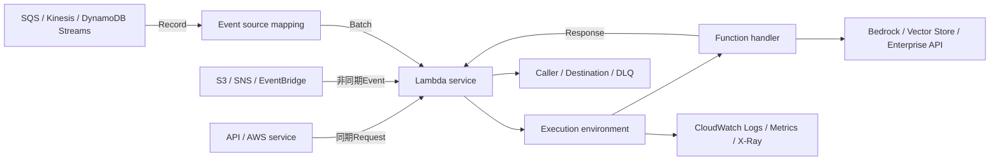

# AWS Lambda

最終確認日: 2026-09-23

| 項目 | 内容 |
|---|---|
| 重要度 | A: 中核 |
| 対象サービス／機能 | AWS Lambda（Lambda Functionsを中心に扱う） |
| 対応Task・Skills | 主軸: Task 1.2〜1.5。接点: Task 2.1〜2.5、Task 3.1〜3.4、Task 5.2 |
| このページで分かること | LambdaがEventまたはAPI RequestからFunction codeを実行する範囲と、利用者がCode、設定、権限、失敗処理を管理する範囲を区別する。同期・非同期・Event source mapping、Version、Concurrency、Response streaming、Security、Observabilityと、GenAI Applicationでの前後処理・Tool実装の接続点を追える。 |

## 全体像

AWS Lambdaは、ServerをProvisioningまたは管理せずにCodeを実行するServerless compute serviceである。本ページでは、AIP-C01の実装対象になるLambda Functionsを扱う。AWSは基盤、Execution environmentの作成と破棄、Routing、Scaling、Fault toleranceを管理する。利用者はFunction code、Runtime、Architecture、Memory、Timeout、Invocation方式、Version、Concurrency、IAM、Network、入力・出力Schema、再試行されても安全な処理を管理する。

同期呼び出しは処理結果をCallerへ返す。非同期呼び出しはLambdaの内部QueueへEventを受け渡し、Event source mappingはStreamまたはQueueをPollしてRecordのBatchをFunctionへ渡す。失敗時の再試行主体と出力先は経路ごとに異なるため、Function codeだけでなくInvocation方式まで含めて管理する。

### このページで扱うCompute形態の境界

このページのConcurrency、Timeout、Payload、Invocation、Event source mappingの説明は、特記しない限りLambdaの既定Compute typeである標準Lambda Functionsを対象にする。次の形態は同じLambdaサービスに含まれても、実行・状態管理の単位が異なる。

| 形態 | 実行・状態の単位 | 標準Lambda Functionsとの主な違い |
|---|---|---|
| 標準Lambda Functions | EventまたはAPI呼び出しごとのHandler実行 | 1つのExecution environmentは同時に1 Invocationを処理し、1回の実行は最大15分。Event-drivenな前後処理、API、Toolの実装を本ページで扱う |
| Lambda Managed Instances | Capacity providerに紐付く、利用者Account内のManaged EC2 instance上のFunction Version | Instance type、VPC、Capacity providerを指定でき、1つのExecution environmentで複数Invocationを同時処理できる。標準Functionの単一Concurrency前提やQuotaをそのまま適用しない |
| Lambda durable functions | Checkpoint、Wait、Resumeを含むdurable execution | 状態を保持して中断から回復でき、長期のmulti-step workflowを実行する。標準Functionの15分Timeout内で待機する実装とは区別する |
| Lambda MicroVMs | User、job、sandboxごとの独立したVM環境 | Dockerfileから作るimageを基に起動し、Suspend／ResumeでMemoryとDiskの状態を保持できる。Event Handlerを横展開する標準Functionとは別の、隔離された長時間Session向けComputeである |

## Function、Runtime、Execution environment

| 要素 | 入力 | AWS側の処理・保持状態 | 出力 | 利用者の管理境界・代表連携 |
|---|---|---|---|---|
| Function | Deployment packageまたはContainer image、Handler、設定 | Codeと設定を保持し、InvocationをExecution environmentへRoutingする | HandlerのResponse、Error、Log | Code、Dependency、Memory、Timeout、Environment variable。Bedrock Runtime、S3、DynamoDBなどをSDKで呼ぶ |
| Runtime | Invocation event、Context | Managed runtimeまたはCustom runtimeがRuntime APIを介してEventとResponseを中継する | HandlerへのEvent、LambdaへのResponse／Error | 対応Runtime、Runtime version、ArchitectureとDependencyの互換性を管理する |
| Execution environment | Function code、Runtime、Layer、設定 | 分離された環境で`Init`、`Invoke`、`Shutdown`を実行し、再利用時は環境をFreeze／Thawする | 1回のInvocation結果。標準のEnvironmentは同時に1 Requestを処理する | Invocation間の永続性を前提にしない。Global objectや`/tmp`は再利用される場合があるが、状態の正本にしない |

`Init`ではExtension、Runtime、FunctionのStatic codeを初期化する。Warm startでは同じ環境が再利用される場合がある。ReuseされるConnectionや一時Cacheは性能改善に使えるが、別EnvironmentやShutdownでも正しく動くようにする。Context固有DataをGlobal variableへ残さない。

LambdaはManaged runtimeとCustom runtimeを提供する。2026-09-23時点で、対応Runtime、廃止日、Base imageは継続して変わるため、個別Versionを固定一覧として暗記せず、[Lambda runtimes](https://docs.aws.amazon.com/lambda/latest/dg/lambda-runtimes.html)を確認する。対応Managed runtimeは`x86_64`と`arm64`を扱うが、Native library、Layer、Extension、Container imageも選択Architectureへ対応させる。

## 同期・非同期呼び出しとEvent source mapping

| 方式 | 入力 | 処理 | 出力 | 管理境界・代表連携 |
|---|---|---|---|---|
| 同期呼び出し | `Invoke`のPayload、API Gateway／Function URLからのHTTP Eventなど | LambdaがFunctionを実行し、完了までCallerを待たせる | FunctionのResponse、Executed version、またはInvocation Error | CallerがTimeoutとFunction ErrorのRetryを管理する。Bedrock呼び出しを含むRequest-response APIに接続できる |
| 非同期呼び出し | `InvocationType=Event`、S3／SNS／EventBridgeなどのEvent | Lambdaが内部Queueへ受理して先に応答し、別ProcessがFunctionへ配送する | 受理時は通常`202`。実行後は任意のDestinationまたはDLQへRecordを送る | LambdaのEvent age、Retry、Destinationを設定する。Callerは受理応答を処理完了とみなさない |
| Event source mapping | SQS、Kinesis、DynamoDB Streams、MSKなどのRecord | LambdaのEvent pollerがSourceをPollし、Batch size・Batching window・Payload上限のいずれかでBatchを作ってFunctionを呼ぶ | Batch単位のEventと処理結果。SourceまたはMappingの設定に従ってRetry／破棄する | 利用者がMapping、Batch、Starting position、Failure設定、Functionの冪等性を管理する |

Event source mappingはLambda resourceであり、S3やSNSのようにSource serviceが保持する直接Triggerとは管理位置が異なる。Mappingは少なくとも1回処理するため、同じRecordが複数回来る可能性がある。SQSのVisibility timeoutとRedrive policy、StreamのRetry回数・Record age・Batch failure、DestinationはSource別に確認する。

## Version、Alias、Layer

- `$LATEST`は編集可能なFunction codeと設定を表す。PublishしたFunction Versionは、その時点のCodeとVersion固有設定を固定した変更不可のResourceである。
- AliasはFunction Versionを指す名前付きResourceである。ClientはVersion番号の代わりにAlias ARNを呼べる。AliasのRouting configurationでは2つのVersionへ重み付きでTrafficを分けられるが、両VersionのIAM role、Dead-letter queue、VPC設定などに互換性条件がある。
- Layerは補助CodeまたはDataを含む`.zip` archiveであり、Library、Custom runtime、Configuration fileをFunction codeから分離する。Layer versionは変更不可で、Functionは正確なLayer version ARNを参照する。Layerは`.zip`形式のFunctionで利用し、Container imageではDependencyをImageへ含める。

VersionとAliasはCodeの品質を評価または自動承認する機能ではない。利用者がTest結果、Configuration、呼出し先のBedrock Model／Prompt VersionとFunction Versionを同じRelease記録へ関連付ける。採用版やTraffic切替の判断は関連する[FM選定の補足ページ](../supplimental-pages/01-02-foundation-model-selection-and-configuration.md)で扱う。

## Concurrency、Scaling、Timeout

Concurrencyは同時に処理中のInvocation数である。標準Functionでは1 Execution environmentが同時に1 Requestを処理し、Lambdaは需要に応じてEnvironmentを増減する。

| Control | AWS側の動作 | 利用者が管理すること |
|---|---|---|
| Account concurrency | Region単位でFunctionsが共有する同時実行枠 | Service Quotasの値、他Functionとの競合、Quota increase |
| Reserved concurrency | 対象Functionへ同時実行枠を予約すると同時に、そのFunctionの上限にもする | Downstreamの保護、Function間の配分。`0`にするとInvocationを止める |
| Provisioned concurrency | VersionまたはAlias向けに初期化済みEnvironmentを事前確保する | 必要数、Schedule／Auto Scaling、別料金、超過分をOn-demandで受ける条件 |
| Scaling rate | FunctionごとにEnvironmentを増やす速度をLambdaが制限する | 急増時のThrottling、QueueやAPI側のBackpressure、Load test |
| Timeout | 設定時間に達したInvocationをLambdaが停止する | Downstream timeoutより長すぎない上限、部分実行後の再試行、Client側timeout |

2026-09-23時点で、標準FunctionのTimeout上限は900秒、FunctionごとのConcurrency scaling rateは10秒ごとに最大1,000 Execution environment、既定のRegion別Concurrent executions quotaは1,000である。値はAccount、Compute type、Region、Quota変更で異なり得るため、実装時にService QuotasとLambda Quotasを確認する。

## Retry、DLQ、Destination、冪等性

Retryの主体はInvocation方式で区別する。

- 同期呼び出しでは、Function codeのErrorをLambdaが自動Retryしない。Callerまたは上流ServiceがRetryを判断する。
- 非同期呼び出しでは、Function Errorに対してLambdaが既定で2回Retryする。Queue内でEventが待機する場合があり、Maximum event ageとMaximum retry attemptsを設定できる。
- StreamのEvent source mappingでは、既定でBatch全体を成功するかRecordが期限切れになるまで再処理し、対象Shardの後続処理を止める。Partial batch responseやBatch分割など、Source別のFailure controlを確認する。
- QueueのEvent source mappingでは、Source queueのVisibility timeoutとRedrive policyが再試行間隔とDLQを制御する。SQSをSourceにする場合、DLQはFunctionではなくSQS側に設定する。

非同期InvocationのDestinationは成功用と失敗用を分けられ、RequestとResponseの詳細を含むInvocation recordをSQS、SNS、Lambda、EventBridgeへ送り、失敗時はS3も選べる。FunctionのDLQは失敗または期限切れで破棄される元EventをSQS Standard queueまたはSNS Standard topicへ送る。Destination delivery自体の権限・Size Errorも`DestinationDeliveryFailures`または`DeadLetterErrors`で監視する。

LambdaやEvent source mappingでは重複配送があり得る。利用者は業務上のEvent ID、条件付きWrite、既処理Recordなどを使い、同じ入力を複数回処理しても重複更新や二重送信を起こさないFunctionを実装する。

## Function URLとResponse streaming

Function URLはFunction用の専用HTTP(S) Endpointである。HTTP RequestはAPI Gateway Payload Format Version 2.0と同じSchemaでFunctionへ渡される。`AWS_IAM`ではSigV4署名と`lambda:InvokeFunctionUrl`／`lambda:InvokeFunction`権限を使う。`NONE`ではPublic accessを許可するResource-based policyが必要であり、Application側の認証・認可要件を自動的には満たさない。

Response streamingでは、生成途中のChunkをClientへ返し、Time to First Byteを短縮できる。2026-09-23時点の公式資料で確認できる呼出し経路は次のとおりである。

- Function URLを`RESPONSE_STREAM` modeで呼ぶ。
- AWS SDKまたはDirect APIで`InvokeWithResponseStream`を使う。
- `InvokeWithResponseStream`を使うAmazon API Gateway Proxy integrationから呼ぶ。

NativeなManaged runtime対応はNode.jsであり、他言語はCustom runtimeのRuntime API統合またはLambda Web Adapterを使う。Streamed responseは最大200 MBで、最初の6 MBは帯域上限なし、超過部分は最大2 MBpsである。VPC内ではFunction URLによるResponse streamingを利用できず、Lambda用Interface VPC endpoint経由でSDKの`InvokeWithResponseStream`を使う。Region対応も利用時に確認する。

Client接続が切れてもStream処理は自動停止せず、Functionの実行時間分が課金される。FMのToken streamを中継する場合も、Client切断、Backpressure、Function Timeout、API Gatewayなど上流・下流のTimeoutを別々に管理する。

## IAM execution role、VPC接続、Secrets

### IAMとResource-based policy

Execution roleはFunction codeがAWS Resourceへアクセスする権限である。Trust policyでは`lambda.amazonaws.com`にRoleの引受けを許可する。Bedrock推論、S3 Object、Vector Store、CloudWatch Logs、X-Rayなど必要なActionとResourceだけを付与する。

Functionを誰が呼べるかは、CallerのIdentity-based policyとFunctionのResource-based policyで制御する。S3などAWS serviceからのInvocationでは、Function側のResource-based policyにSource ARNとSource accountの条件を付け、意図したResourceに限定する。Execution roleはFunctionの外向き権限、Resource-based policyはFunctionへの呼び出し権限であり、役割が異なる。

### VPC接続とData保護

FunctionをVPCへ接続すると、指定したSubnetとSecurity groupを使ってVPC Resourceへ到達できる。LambdaはHyperplane ENIを管理するが、利用者はRoute、Security group、Network ACL、NAT、VPC endpoint、DNS、接続先を管理する。FunctionをPublic subnetへ配置しただけではInternet accessは得られない。Private subnetからPublic endpointへ出る場合はNATなどの経路が必要で、AWS serviceへInternetを経由せず接続する場合は対応VPC endpointを使う。

Environment variableはFunction設定として暗号化されるが、CredentialやAPI keyの保管場所として平文設定へ埋め込まない。AWS Secrets ManagerまたはSystems Manager Parameter Storeから実行時に取得し、Execution roleへ最小権限を付ける。AWS Parameters and Secrets Lambda ExtensionまたはPowertools Parameters utilityはSecretをExecution environment内でCacheできる。VPC内からSecrets Managerへ接続する場合はNetwork経路またはInterface VPC endpointも必要である。

入力Event、Prompt、Retrieved content、FM ResponseをLogへ残す場合は、PII、Credential、Tenant境界、Retentionを利用者が管理する。CodeやLayerへSecretを含めない。

## Log、Metric、Trace

| Signal | Lambda／連携Serviceが提供する内容 | 利用者が確認すること |
|---|---|---|
| CloudWatch Metrics | `Invocations`、`Errors`、`Duration`、`Throttles`、`ConcurrentExecutions`、Async delivery、Event source mappingなどのMetric | Error率、p95／p99 Duration、Throttle、Concurrency、Iterator age、DLQ／Destination delivery failureをAlarmへ接続する |
| CloudWatch Logs | RuntimeとFunctionのLog、`START`／`END`／`REPORT`、Request ID、Duration、Billed duration、Memory使用量 | Structured log、Correlation ID、Data redaction、Retention、Logs Insights queryを管理する |
| AWS X-Ray | Lambda serviceとFunction、対応DownstreamのTrace／Segment | Active tracing、Sampling、Downstream SDK instrumentation、Trace IDによるFM API・Tool呼出しの関連付けを管理する |
| AWS CloudTrail | Function作成、設定、Version、Alias、PolicyなどLambda API操作 | Control plane変更の主体、時刻、対象Resourceを監査する。Application内部の判断Logとは分ける |

LambdaはFunctionのInvocation数、Duration、Error数をCloudWatchへ自動送信する。Application固有の検証結果、FM Model ID、Prompt Version、Retrieval件数、Tool名などは、機密Dataを除いた構造化LogまたはCustom metricとして利用者が追加する。Function側の成功だけではFM Responseの品質を示さない。

## FM前後処理とTool／MCP実装

LambdaはModelをHostingするServiceではなく、短時間のApplication logicを実行してFMやData serviceを接続する。

| GenAIでの役割 | 入力 | Lambdaで行う処理 | 出力・代表連携 | 管理境界 |
|---|---|---|---|---|
| FM切替・障害処理 | Model selector、Prompt、Request metadata | 外部設定を読んでModel IDを解決し、Request形式を変換し、Retry可能なErrorやFallback信号を扱う | Amazon Bedrock Runtime、AppConfig、Step Functions | Model互換性、Retry上限、Circuit breakerの状態、Data residency。選定判断は[Task 1.2補足](../supplimental-pages/01-02-foundation-model-selection-and-configuration.md)で扱う |
| Data検証・変換 | Text、Image参照、Tabular JSON、Webhook payload | Schema、Size、必須項目、Content typeを検証し、正規化、Redaction、隔離先Routingを行う | S3、SQS、Glue、Comprehend、Bedrock | Validation rule、Reject理由、再処理、機密Data。Pipeline判断は[Task 1.3補足](../supplimental-pages/01-03-data-validation-and-processing.md)で扱う |
| Connector・同期 | S3 Event、Queue／Stream Record、Schedule、変更Event | Source schemaをCanonical formへ変換し、Metadataを付け、同期処理を起動する | Knowledge Bases、OpenSearch、Aurora、EventBridge | Checkpoint、Tombstone、Idempotency、Access scope。Store判断は[Task 1.4補足](../supplimental-pages/01-04-vector-store-design.md)で扱う |
| Retrieval公開 | Query、Filter、Tenant／User context | 認可範囲を検証し、Retrieval APIを呼び、統一Response schemaへ変換する | Bedrock Knowledge Bases、OpenSearch、Aurora、API Gateway | Query／Result schema、Filter強制、Timeout、Source attribution。方式判断は[Task 1.5補足](../supplimental-pages/01-05-retrieval-for-rag.md)で扱う |
| Tool／MCP | Tool name、JSON Schemaに従うArgument、Agent context | Parameter validation、最小権限での業務API実行、Error mapping、冪等処理を行う | Bedrock Tool use、AgentCore Gateway、API Gateway、業務API | Tool schema、認可、Timeout、停止条件、監査。Lambdaは軽量なStateless MCP serverの実装例として試験ガイドに明記される |
| FM後処理・Compliance check | Model response、Citation、Structured output | JSON Schema検証、内容検査、Masking、業務規則による許可／拒否を行う | Bedrock Guardrails、CloudWatch、Human review workflow | 検査規則、False positive／negative、監査証跡。Lambdaだけで全Safety controlを代替しない |

この表はLambdaが接着層として受け持つ入出力と責務を示す。FMの推論Capacity、Vector Storeの検索、Workflowの長時間状態管理、GuardrailのManaged判定は、それぞれのServiceが管理する。

## API、Event、Dataの入出力

| 面 | 主なAPI／Resource | 入力 | 出力 |
|---|---|---|---|
| Control plane | `CreateFunction`、`UpdateFunctionCode`、`UpdateFunctionConfiguration`、`PublishVersion`、`CreateAlias`／`UpdateAlias`、`CreateEventSourceMapping` | Code、Runtime、Role、Memory、Timeout、VPC、Version／Alias、Trigger設定 | Function ARN、Version、Alias、Mapping UUIDと状態 |
| 同期Data plane | `Invoke`（`RequestResponse`）、Function URL、API Gateway integration | JSONまたはBinary Payload、HTTP Event、Qualifier | Function Response、Log tail（条件付き）、Executed version、Error metadata |
| 非同期Data plane | `Invoke`（`Event`）、Service Event | 最大Payload内のEvent | 受理応答。後続はFunction実行、Destination／DLQ |
| Streaming Data plane | `InvokeWithResponseStream`、`RESPONSE_STREAM` Function URL、対応API Gateway Proxy integration | Invocation Payload／HTTP Event | Response metadataとPayload chunkのStream |
| Event source mapping | MappingがPollするQueue／Stream Record | Batch、Source metadata | FunctionへのBatch Event、Source固有のCheckpoint／Retry／Destination |

FunctionのEvent schemaはTriggerごとに異なる。LambdaはS3 Event、SQS Message、API Gateway Event、MCP Tool argumentを同じSchemaへ自動変換しない。利用者がSource versionを確認し、入力を検証し、出力ContractをCallerまたは連携Serviceの形式に合わせる。

## 可用性、Quota、料金要因

LambdaはAvailability ZoneをまたいでFunctionを実行できるManaged serviceであるが、Applicationの可用性はDownstream、VPCのSubnet／NAT／Endpoint、Concurrency、Event source、Timeout、Retryにも依存する。FunctionはStatelessにし、必要な状態をDynamoDB、S3などのDurable storeへ置く。Async queueやEvent source mappingを使う場合は、Backlog、Event age、Iterator age、DLQを監視する。

以下は2026-09-23時点の標準Lambda Functionsで確認した主な条件である。Managed Instances、Durable Functions、Lambda@Edgeには異なる条件がある。

| 対象 | 確認した条件 |
|---|---|
| Memory | 128〜10,240 MB。CPUはMemoryに比例して割り当てられる |
| Timeout | 最大900秒 |
| 同期Payload | Request、Response各6 MB。Streamed responseは最大200 MB |
| 非同期Payload | 1 MB |
| Layer | 1 Function当たり最大5 |
| Ephemeral storage | `/tmp`を512〜10,240 MBで設定 |
| Concurrency | Region別既定Quota 1,000。新規Accountは低いQuotaの場合がある。FunctionごとのScaling limitは10秒当たり1,000 Environment |
| Architecture | `x86_64`、`arm64`。Runtime、Dependency、Regionの対応を確認 |

QuotaはHard limitと引上げ可能なService quotaに分かれる。固定値だけでなく、FunctionのRegion、Account、Compute typeに実際に適用される値をService Quotasで確認する。

主な料金要因はRequest数と、割り当てMemoryに実行時間を乗じたDurationである。これにProvisioned concurrencyの確保時間、追加Ephemeral storage、Streamed responseのData量、Event source mappingのProvisioned modeが加わり得る。さらにCloudWatch Logs／X-Ray、NAT Gateway、Data transfer、Secrets Manager、Bedrock、S3など連携Serviceは別料金である。単価、Free Tier、Architecture／Region差は実行日に[Lambda pricing](https://aws.amazon.com/lambda/pricing/)を確認する。

## AIP-C01との対応

| Task・Skills | このサービスが担う役割 | 関連ページ |
|---|---|---|
| Task 1.2 / Skills 1.2.2〜1.2.3 | 外部設定に基づくFM呼出し先の解決、Provider別Payload変換、Retry／FallbackのApplication logicを実行する | [literal](../literal-pages/01-02-foundation-model-selection-and-configuration.md) / [supplimental](../supplimental-pages/01-02-foundation-model-selection-and-configuration.md) |
| Task 1.3 / Skills 1.3.1〜1.3.4 | FM入力のCustom validation、Multimodal処理の接続、JSON／会話形式への変換、正規化を実行する | [literal](../literal-pages/01-03-data-validation-and-processing.md) / [supplimental](../supplimental-pages/01-03-data-validation-and-processing.md) |
| Task 1.4 / Skills 1.4.4〜1.4.5 | 文書管理System用Connector、Change event処理、Incremental syncと再処理を実装する | [literal](../literal-pages/01-04-vector-store-design.md) / [supplimental](../supplimental-pages/01-04-vector-store-design.md) |
| Task 1.5 / Skills 1.5.1〜1.5.2、1.5.5〜1.5.6 | Custom chunking、Embedding batch、Query decomposition、Function calling／REST／MCP向けRetrieval interfaceを実装する | [literal](../literal-pages/01-05-retrieval-for-rag.md) / [supplimental](../supplimental-pages/01-05-retrieval-for-rag.md) |
| Task 2.1 / Skills 2.1.3、2.1.6〜2.1.7 | AgentのTimeout、Tool parameter validation、Error handling、Stateless MCP serverを実装する | [literal目次](../literal-pages/README.md#第2部-実装と統合) / [supplimental目次](../supplimental-pages/README.md#第2部-実装と統合) |
| Task 2.2 / Skill 2.2.1 | FMをOn-demandで呼ぶCompute layerになる。FM自体をLambdaへ配置することとは区別する | [literal](../literal-pages/02-02-model-deployment-strategies.md) / [supplimental](../supplimental-pages/02-02-model-deployment-strategies.md) |
| Task 2.3 / Skills 2.3.1〜2.3.3、2.3.5 | Webhook、Event-driven連携、Data同期、最小権限のAPI integration、Version／Aliasを使うRelease単位を構成する | [literal目次](../literal-pages/README.md#第2部-実装と統合) / [supplimental目次](../supplimental-pages/README.md#第2部-実装と統合) |
| Task 2.4 / Skills 2.4.1〜2.4.4 | SDKからFM APIを同期／非同期で呼び、Streamを中継し、Retry／Fallback／RoutingをApplication codeで実装する | [literal目次](../literal-pages/README.md#第2部-実装と統合) / [supplimental目次](../supplimental-pages/README.md#第2部-実装と統合) |
| Task 2.5 / Skills 2.5.1、2.5.3、2.5.6 | GenAI APIのBackend、業務System拡張、Log・Traceによる障害調査の実行点になる | [literal目次](../literal-pages/README.md#第2部-実装と統合) / [supplimental目次](../supplimental-pages/README.md#第2部-実装と統合) |
| Task 3.1 / Skills 3.1.1〜3.1.5 | Guardrail前後のCustom validation、Moderation workflow、Response schemaと業務規則を実装する | [literal目次](../literal-pages/README.md#第3部-ai-safetysecuritygovernance) / [supplimental目次](../supplimental-pages/README.md#第3部-ai-safetysecuritygovernance) |
| Task 3.2 / Skills 3.2.1〜3.2.3 | IAM、VPC接続、Secret取得、PIIのMasking／RedactionをApplication境界へ実装する | [literal目次](../literal-pages/README.md#第3部-ai-safetysecuritygovernance) / [supplimental目次](../supplimental-pages/README.md#第3部-ai-safetysecuritygovernance) |
| Task 3.3 / Skills 3.3.1〜3.3.4 | Decision log、Source metadata、Policy violation検知とRemediation eventを出力する | [literal目次](../literal-pages/README.md#第3部-ai-safetysecuritygovernance) / [supplimental目次](../supplimental-pages/README.md#第3部-ai-safetysecuritygovernance) |
| Task 3.4 / Skills 3.4.1〜3.4.3 | Confidence／Evidence metadataの整形、Fairness評価Pipelineの接続、自動Compliance checkを実行する | [literal目次](../literal-pages/README.md#第3部-ai-safetysecuritygovernance) / [supplimental目次](../supplimental-pages/README.md#第3部-ai-safetysecuritygovernance) |
| Task 5.2 / Skills 5.2.1〜5.2.5 | Request validation、Error log、Version、Latency、Throttle、Downstream traceを使い、入力・FM API・Retrieval・Prompt周辺の不具合を切り分ける | [literal目次](../literal-pages/README.md#第5部-テスト検証トラブルシューティング) / [supplimental目次](../supplimental-pages/README.md#第5部-テスト検証トラブルシューティング) |

## 重要な制約と確認事項

- Runtimeと廃止日、`arm64`のRegion対応、Function URL、Response streamingのRegion提供状況は変更され得る。実装RegionとRuntimeの公式表を確認する。
- 同期、非同期、Event source mappingではRetry、Payload上限、Errorの返却先が異なる。1つのRetry規則を全経路へ当てはめない。
- Function URLはAPI GatewayのUsage plan、Request validation、WebSocketなどを自動的に提供しない。どちらを使うかの判断はTask 2の補足ページへ委ねる。
- 標準Functionの最大実行時間を超える状態遷移やHuman approvalを、Processを待機させて実装しない。Orchestrationの責務はStep Functionsなどと区別する。
- SnapStartを使う場合、2026-09-23時点ではJava 11以降、Python 3.12以降、.NET 8以降の対応条件があり、Provisioned concurrency、EFS、S3 Files、512 MB超のEphemeral storageとは併用できない。Publish済みVersionまたはそれを指すAliasで利用し、初期化時に生成した一意値やConnectionをRestore後に再検証する。
- Lambda Managed Instances、Durable Functions、Lambda MicroVMsのAIP-C01での詳細な要求深度は未確認である。本ページでは標準Lambda Functionsとの実行・状態管理の境界だけを扱い、各形態の個別Quotaや実装手順へは広げない。

## 用語

| 用語 | このページでの意味 |
|---|---|
| Execution environment | Runtime、Function code、Extensionなどを実行する分離環境 |
| Cold start | 新しいExecution environmentを準備し、RuntimeとFunctionを初期化してからHandlerを呼ぶ開始経路 |
| Concurrency | 同時に処理中のFunction Invocation数 |
| Event source mapping | Queue／StreamをPollし、RecordのBatchでFunctionを呼ぶLambda resource |
| Destination | 非同期Invocationの成功／失敗後に詳細なInvocation recordを送る先 |
| Dead-letter queue | 処理できず破棄されるEventを保持するSQS Standard queueまたはSNS Standard topic |
| Function URL | Lambda FunctionへHTTP(S)で直接到達する専用Endpoint |
| Response streaming | Responseを完了後に一括返却せず、生成されたChunkからCallerへ送る方式 |
| Execution role | Function codeがAWS ResourceへアクセスするためにLambdaが引き受けるIAM role |

## 公式資料

- [AIP-C01 Content Domain 1](https://docs.aws.amazon.com/aws-certification/latest/ai-professional-01/ai-professional-01-domain1.html) — Task 1.2〜1.5におけるLambdaの役割
- [AIP-C01 Content Domain 2](https://docs.aws.amazon.com/aws-certification/latest/ai-professional-01/ai-professional-01-domain2.html) — Task 2.1〜2.5におけるLambda、Tool、MCP、API統合
- [AIP-C01 Content Domain 3](https://docs.aws.amazon.com/aws-certification/latest/ai-professional-01/ai-professional-01-domain3.html) — Safety、Security、GovernanceにおけるCustom Lambda処理
- [AIP-C01 Content Domain 5](https://docs.aws.amazon.com/aws-certification/latest/ai-professional-01/ai-professional-01-domain5.html) — Task 5.2のLogging、Validation、Trace
- [What is AWS Lambda?](https://docs.aws.amazon.com/lambda/latest/dg/welcome.html) — Serviceの役割、管理境界、Lambda Functionsの処理モデル
- [Lambda Managed Instances](https://docs.aws.amazon.com/lambda/latest/dg/lambda-managed-instances.html) — Capacity provider、Managed EC2 instance、multi-concurrency
- [Lambda durable functions](https://docs.aws.amazon.com/lambda/latest/dg/durable-functions.html) — Checkpoint、Wait、Resume、長期workflow
- [AWS Lambda MicroVMs](https://docs.aws.amazon.com/lambda/latest/dg/lambda-microvms-guide.html) — 隔離環境、image、Suspend／Resume、利用条件
- [Execution environment lifecycle](https://docs.aws.amazon.com/lambda/latest/dg/lambda-runtime-environment.html) — `Init`、`Invoke`、`Shutdown`、Reuse、Cold start
- [Lambda runtimes](https://docs.aws.amazon.com/lambda/latest/dg/lambda-runtimes.html) — Managed／Custom runtime、廃止Policy、Architecture
- [Synchronous invocation](https://docs.aws.amazon.com/lambda/latest/dg/invocation-sync.html) — 同期Request／Response
- [Asynchronous invocation](https://docs.aws.amazon.com/lambda/latest/dg/invocation-async.html) — 内部Queue、受理応答、非同期処理
- [Event source mappings](https://docs.aws.amazon.com/lambda/latest/dg/invocation-eventsourcemapping.html) — Poller、Batch、対応Source、At-least-once処理
- [Manage function versions](https://docs.aws.amazon.com/lambda/latest/dg/configuration-versions.html) — `$LATEST`と変更不可Version
- [Create an alias](https://docs.aws.amazon.com/lambda/latest/dg/configuration-aliases.html) — AliasとWeighted routing
- [Managing dependencies with layers](https://docs.aws.amazon.com/lambda/latest/dg/chapter-layers.html) — Layer、Layer version、`.zip` Functionとの適用条件
- [Reserved concurrency](https://docs.aws.amazon.com/lambda/latest/dg/configuration-concurrency.html) — Reserved concurrencyの予約と上限
- [Provisioned concurrency](https://docs.aws.amazon.com/lambda/latest/dg/provisioned-concurrency.html) — 初期化済みEnvironment、Auto Scaling、課金
- [Lambda scaling behavior](https://docs.aws.amazon.com/lambda/latest/dg/scaling-behavior.html) — Function単位のScaling rate
- [Retry behavior](https://docs.aws.amazon.com/lambda/latest/dg/invocation-retries.html) — Invocation方式別のRetry主体
- [Capturing asynchronous invocation records](https://docs.aws.amazon.com/lambda/latest/dg/invocation-async-retain-records.html) — Destination、DLQ、Delivery failure
- [Invoking Lambda function URLs](https://docs.aws.amazon.com/lambda/latest/dg/urls-invocation.html) — HTTP Event schema、認証、Region条件
- [Response streaming](https://docs.aws.amazon.com/lambda/latest/dg/configuration-response-streaming.html) — 対応呼出し経路、Payload、帯域、VPC条件
- [Execution role](https://docs.aws.amazon.com/lambda/latest/dg/lambda-intro-execution-role.html) — FunctionのAWS Resourceアクセス権限
- [Lambda permissions](https://docs.aws.amazon.com/lambda/latest/dg/lambda-permissions.html) — Execution roleとResource-based policy
- [VPC access](https://docs.aws.amazon.com/lambda/latest/dg/configuration-vpc.html) — Hyperplane ENI、Subnet、Security group、Internet接続の境界
- [Use Secrets Manager secrets](https://docs.aws.amazon.com/lambda/latest/dg/with-secrets-manager.html) — Extension／Powertools、Cache、VPC接続
- [Monitoring Lambda functions](https://docs.aws.amazon.com/lambda/latest/dg/lambda-monitoring.html) — CloudWatch Metrics／Logs、CloudTrail、X-Ray
- [Lambda quotas](https://docs.aws.amazon.com/lambda/latest/dg/gettingstarted-limits.html) — Memory、Timeout、Payload、Layer、Concurrency、Storage
- [Lambda SnapStart](https://docs.aws.amazon.com/lambda/latest/dg/snapstart.html) — Runtime、Version、Featureの適用条件
- [AWS Lambda pricing](https://aws.amazon.com/lambda/pricing/) — Request、Duration、Provisioned concurrency、Ephemeral storage、Streamingの料金要因

## 関連ページ

- [サービス別目次](README.md)
- [Foundation Model選定・設定](../literal-pages/01-02-foundation-model-selection-and-configuration.md) / [補足](../supplimental-pages/01-02-foundation-model-selection-and-configuration.md)
- [Data検証・処理Pipeline](../literal-pages/01-03-data-validation-and-processing.md) / [補足](../supplimental-pages/01-03-data-validation-and-processing.md)
- [Vector Store設計](../literal-pages/01-04-vector-store-design.md) / [補足](../supplimental-pages/01-04-vector-store-design.md)
- [Retrieval設計](../literal-pages/01-05-retrieval-for-rag.md) / [補足](../supplimental-pages/01-05-retrieval-for-rag.md)
- [Domain 2のTask別ページ](../literal-pages/README.md#第2部-実装と統合) / [補足目次](../supplimental-pages/README.md#第2部-実装と統合)
- [Domain 3のTask別ページ](../literal-pages/README.md#第3部-ai-safetysecuritygovernance) / [補足目次](../supplimental-pages/README.md#第3部-ai-safetysecuritygovernance)
- [Domain 5のTask別ページ](../literal-pages/README.md#第5部-テスト検証トラブルシューティング) / [補足目次](../supplimental-pages/README.md#第5部-テスト検証トラブルシューティング)
