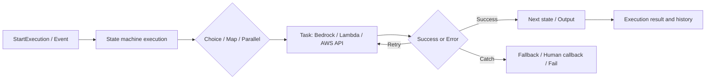

# AWS Step Functions

最終確認日: 2026-09-23

| 項目 | 内容 |
|---|---|
| 重要度 | A: 中核 |
| 対象サービス／機能 | AWS Step Functions |
| 対応Task・Skills | 主軸: Task 1.2 / Skill 1.2.3、Task 1.5 / Skills 1.5.5〜1.5.6、Task 1.6 / Skills 1.6.2、1.6.6。接点: Task 2.1 / Skills 2.1.1〜2.1.6、Task 2.3 / Skills 2.3.1〜2.3.5、Task 2.4 / Skills 2.4.1、2.4.3、Task 2.5 / Skills 2.5.3、2.5.5〜2.5.6、Task 3.1 / Skills 3.1.3〜3.1.5、Task 5.1 / Skills 5.1.4、5.1.7、5.1.9 |
| このページで分かること | State machineが、外部のAWS serviceやWorkerに処理を委託しながら、順序、分岐、並列化、待機、失敗経路を管理する範囲を説明する。Workflow type、Data変換、Service integration、再実行、観測、Version展開、大規模Mapの入出力と管理境界を追える。 |

## 全体像

Step FunctionsはAmazon States Language（ASL）で定義したState machineを実行するWorkflow orchestration serviceである。StateはJSON inputを受け取り、外部の処理を呼ぶか、Dataを変換するか、実行経路を制御し、次のStateへJSON outputを渡す。

図の要点は、Step FunctionsがFM推論、Retrieval、入出力Validationの中身を実装するのではなく、それらの実行順序と状態遷移を管理することである。AWSはWorkflow execution基盤、Stateの進行、対応するService integrationを管理する。利用者はASL定義、入出力Contract、呼び出すResource、IAM role、Retry可否、停止条件、機密Dataの扱い、展開Versionを管理する。

## 1. StandardとExpress Workflow

Workflow typeはState machine作成時に選び、後から変更できない。どちらもASLと同じService integrationのRequest Response patternを使うが、実行保証、最大時間、履歴と統合Patternが異なる。

| Type | 入力・起動 | 保持状態と処理 | 出力・履歴 | 主な条件 |
|---|---|---|---|---|
| Standard | `StartExecution`、EventBridge、API Gatewayなど | State transition間の実行状態を永続化。Workflow実行はexactly-onceで、明示した`Retry`は別 | Step Functions API／Consoleで実行履歴を確認でき、CloudWatch Logsも追加可能 | 最大1年。`.sync`、`.waitForTaskToken`、Distributed Mapに対応 |
| Asynchronous Express | `StartExecution`、Event、Nested workflow | 実行はat-least-once。State transition間の状態を永続化しない | 起動受付を返す。履歴にはCloudWatch Logsの有効化が必要 | 最大5分。Request Responseのみ |
| Synchronous Express | `StartSyncExecution`、API Gateway、Lambda | 実行はat-most-once。完了まで待つ | 実行結果を同期Responseとして返す。履歴はCloudWatch Logsに依存 | 最大5分。Request Responseのみ |

Expressの重複実行に対する冪等性、Standardで明示したRetry後の副作用は利用者の責任である。入力・出力はどちらもJSONで、終了Stateまたは同期APIが最終結果を返す。

## 2. StateとInput／Output processing

ASLのStateはExecution inputまたは直前Stateのoutputを受け取る。`Task`は仕事を委託し、`Pass`はDataを渡すまたは変換し、`Succeed`と`Fail`はExecutionを終了する。State名はState machine内で一意で、`Succeed`と`Fail`以外は`Next`または`End`で進行先を持つ。

Query languageはJSONPathが後方互換性のための既定で、JSONataはState machineまたは個別Stateでopt-inする。2026-09-23時点の公式文書は新規State machineにJSONataを推奨している。

| Query language | 入力の選択・処理 | 出力 | 利用者の管理範囲 |
|---|---|---|---|
| JSONPath | `InputPath` → `Parameters` → Resource実行 → `ResultSelector` → `ResultPath` → `OutputPath` | 各Fieldで選択・結合したJSON | Reference path、Payload template、下流StateのSchema |
| JSONata | `$states.input`などを`Arguments`で呼出し先入力へ変換し、`Assign`でVariableへ保存 | `Output`で変換したJSON | Expression、Variable scope、個人情報や不要Dataの混入防止 |

Step FunctionsはSchemaの業務的な正しさを自動判定しない。FM response、Retrieval result、Tool resultを後続Stateで使うときは、利用者がLambdaなどで型、必須値、認可、根拠を検査する。

## 3. AWS SDKとOptimized service integration

`Task` stateからAWS serviceを直接呼び出す。AWS SDK integrationsは広いAPI actionをSDK callに対応する形で提供する。Optimized integrationsは対応Serviceに専用のParameterと実行Patternを提供する。対応APIとPatternはServiceごとに異なる。

| Pattern | 入力 | Step Functionsの処理 | 出力・進行条件 | 対応 |
|---|---|---|---|---|
| Request Response | API actionとParameter | HTTP responseまで待つ | API responseをTask resultとし、次のStateへ | Standard、Express |
| Run a Job (`.sync`) | Job作成Parameter | 統合先のJob完了まで待つ | 完了結果またはError | 対応ServiceのStandardのみ |
| Wait for Callback (`.waitForTaskToken`) | ParameterとTask token | Tokenを外部へ渡し、`SendTaskSuccess`／`SendTaskFailure`まで一時停止 | Callback payloadまたはError | 対応ServiceのStandardのみ |

Amazon Bedrock optimized integrationでは`InvokeModel`と`CreateModelCustomizationJob`を利用できる。`InvokeModel` inputはModel固有の`Body`またはS3 URIの`Input`のいずれかで、S3 URIの`Output`を指定するとResponse bodyの代わりに保存先参照が返る。Step Functionsは`Body`のModel固有形式を検証しないため、Model IDとPayload contractは利用者が管理する。代表的な連携先はBedrock、Lambda、SageMaker AI、SQS、SNS、EventBridge、DynamoDB、ECS、Glueである。

## 4. Choice・Map・Parallel・Wait

| State | 入力 | 処理・状態 | 出力 | 代表連携と管理境界 |
|---|---|---|---|---|
| `Choice` | 条件判定用のJSON | Ruleを評価し、一致する経路へ進む | 選択した次Stateへinputを渡す | 分類値やValidation結果を分岐に使う。条件とDefault経路は利用者が定義 |
| `Map` | JSON array、Distributed modeではS3 datasetも可 | 各Itemに同じIteratorを実行 | Itemごとの結果を集合 | Document前処理、Evaluation case、Retrieval queryの反復。Concurrencyと失敗閾値を管理 |
| `Parallel` | 各Branchに共通input | 異な複数Branchを並列実行し、すべての終了を待つ | BranchごとのoutputのArray | RetrievalとPolicy checkなど独立した処理。Branch間の副作用とError処理を管理 |
| `Wait` | 固定秒数、Timestamp、またはinput内の値 | 指定時間／日時までExecutionを一時停止 | inputを次Stateへ渡す | Polling間隔、待機上限、Workflow全体の最大時間は利用者が設計 |

## 5. Retry・Catch・Timeout

`Task`、`Parallel`、`Map`はError nameに応じた`Retry`と`Catch`を持てる。`Retry`は`ErrorEquals`、`IntervalSeconds`、`BackoffRate`、`MaxAttempts`などで再試行し、尽きると`Catch`を評価する。`Catch` resultは`ResultPath`などで原inputへ結合し、Fallback、補償処理、`Fail`へ渡せる。

`TimeoutSeconds`はTaskの実行上限、`HeartbeatSeconds`はCallback／Activity workerからの定期的な存活信号の上限である。これらとWorkflow typeの最大実行時間を区別する。

AWSはErrorの照合と状態遷移を実行する。利用者は再試行で回復するErrorとしないError、最大回数、副作用の冪等性、Fallbackで返す結果を定義する。RetryはStandardのState transitionと下流Service呼び出しを増やし、料金と負荷の両方に影響する。

## 6. CallbackとHuman approval

Callback patternはTask tokenをSQS、SNS、Lambda、API Gatewayなどを通じて外部処理へ渡し、Standard Workflowを一時停止する。外部の承認者またはWorkerがTokenとPayloadを`SendTaskSuccess`または`SendTaskFailure`へ返すと、Executionが再開する。Express WorkflowはCallback patternをサポートしない。

Step Functionsは承認画面、承認基準、本人確認、業務記録を自動提供しない。利用者はTokenを機密情報として扱い、承認主体を認証・認可し、Timeout、拒否、重複Callback、監査記録を定義する。入力は承認対象の構造化Data、出力は承認・拒否・Timeoutの判定結果である。

## 7. Agent loop・停止条件・Circuit breaker

**Agent loop、停止条件、Circuit breakerは、Step Functionsの独立した組み込みStateではない。** 利用者がState、Data、Retry、Timeout、Choice、Wait、Fail、外部の状態Storeを組み合わせて実装するPatternである。試験ガイドはSkill 1.2.3でStep Functions circuit breaker patternを、Skill 2.1.2〜2.1.3でAgentのState machine、停止条件、Timeout、Budget、Circuit breakerを扱う。

| Pattern上の要素 | Step Functionsで使う構成要素 | 利用者が定義する入出力・状態 |
|---|---|---|
| Plan → Act → Observe → Re-plan | Bedrock／Lambdaの`Task`、`Choice`、必要ならLoop back | Plan、Tool request、Tool result、次の行動、Correlation ID |
| 停止条件 | `Choice`から`Succeed`／`Fail`へ遷移 | 完了、最大Step数、期限、予算、承認待ち、禁止Action |
| Circuit breaker | `Catch`で失敗を集計する外部Storeへ連携、`Choice`で開閉を判定、`Wait`で回復待ち | 対象Resource、失敗閾値、開放期間、half-openのProbe、Fallback |

FMはWorkflow自体を実行しない。Application／Step Functions側がTool inputのValidation、IAM認可、副作用の冪等性、Loop上限、Human approvalを制御する。方式の選択は[FM障害対応の補足](../supplimental-pages/01-02-foundation-model-selection-and-configuration.md)と[Prompt orchestrationの補足](../supplimental-pages/01-06-prompt-engineering-and-governance.md)で扱う。

## 8. Execution history・Logging・Tracing

| Signal | 入力・対象 | 処理・保持 | 出力・用途 | 重要な境界 |
|---|---|---|---|---|
| Standard execution history | State transition、input／output、Error | Step Functionsが実行Eventを保持 | Console、`GetExecutionHistory`でDebug／監査 | 完了後の既定保持は90日。1 Execution 25,000 eventsの上限 |
| CloudWatch Logs | 設定したLog level、Execution data | Log groupへbest effortで配信 | Logs Insights、Alarm、Expressの履歴確認 | Expressは履歴にLog設定が必要。完全性は保証されない |
| CloudWatch metrics | Execution、失敗、Timeout、Throttling | Service metricを集計 | Dashboard、Alarm、容量計画 | 業務品質やFM回答の正しさはApplication metricで補う |
| AWS X-Ray | State machineと対応統合先のTrace data | Service mapとTrace summaryを生成 | Latency bottleneck、Error経路 | Distributed Mapが起動するChild executionはX-Ray trace非対応 |
| AWS CloudTrail | State machineの作成・更新・実行などのAPI call | 操作主体とAPI eventを記録 | Control planeの監査 | FM品質、Humanの承認理由、業務的妥当性は記録しない |

Execution input／output、Task result、Error causeにPrompt、Retrieved context、PII、Secretが含まれ得る。LoggingでExecution dataを含めるか、Mask／外部保管するか、Retentionと閲覧権限を利用者が管理する。

## 9. Version・Alias・Distributed Map

### VersionとAlias

VersionはState machineの番号付きImmutable snapshotである。Definition、IAM role、Logging、Tracing configurationはVersionごとに異なり得るが、Workflow typeは共通である。Aliasは同一State machineの最大2 Versionを指し、単一Versionまたは重み付きRoutingで実行を割り当てる。ApplicationはVersion／Alias ARNを`StartExecution`へ渡し、完了結果には実際に使われたVersionを関連付ける。

AWSはSnapshotの不変性とAlias routingを提供する。利用者はVersion化前のTest、依存するBedrock model／Prompt／LambdaのVersion、Traffic weight、監視指標、RollbackのAlias更新を管理する。

### Distributed Map

Distributed MapはStandard Workflowの`Map` stateをDistributed modeで実行し、S3のJSON／CSV／Object listなどをItem sourceとしてChild workflow executionsへ分割する。各Child executionは親Executionと別の履歴を持つ。利用者はItem reader、Processor workflow、Concurrency、許容失敗数／割合、Result writer、S3権限を設定する。InputはDatasetと各Item、OutputはItemごとの結果またはS3に書き出した参照である。

## API、Event、Dataの入出力

| 面 | 主なAPI／Event | 入力 | 出力 |
|---|---|---|---|
| Control plane | `CreateStateMachine`、`UpdateStateMachine`、`PublishStateMachineVersion`、`CreateStateMachineAlias`、`UpdateStateMachineAlias` | ASL definition、Type、Execution role ARN、Logging、Tracing、Encryption、Version routing | State machine／Version／Alias ARNと構成 |
| Standard／Async Express | `StartExecution`、EventBridge target | JSON input、State machine／Version／Alias ARN、必要ならExecution name、Trace header | Execution ARN、Start date。完了後の状態は`DescribeExecution` |
| Sync Express | `StartSyncExecution` | JSON inputとState machine ARN | Status、JSON output、Error、Billing details |
| Callback | `SendTaskSuccess`、`SendTaskFailure`、`SendTaskHeartbeat` | Task token、JSON outputまたはError | 待機中Taskの再開、失敗、Heartbeat更新 |
| 実行確認 | `DescribeExecution`、`GetExecutionHistory`、`ListMapRuns` | Execution ARNまたはMap Run ARN | Status、input／output、State transition event、Map Runの進捗 |

データ形式はUTF-8 JSONを中心とし、Task、State、Executionのinput／outputは2026-09-23時点で最大256 KiBである。大きなPrompt、Document、FM outputはS3に置き、Workflow内ではURIやIDを渡す構成が公式のクォータ回避策と整合する。

## SecurityとData保護

State machineを作成・更新・実行するCallerのIAM権限と、Execution中にStep Functionsが統合先を呼ぶExecution roleを分ける。Execution roleにはBedrock model、Lambda function、SQS queue、S3 objectなど実際に呼ぶActionとResourceだけを許可する。Resource policyがStep Functions service principalを信頼する場合は`aws:SourceArn`と`aws:SourceAccount`でConfused deputyの範囲を制限できる。

Step Functionsは保存DataをAWS owned keyで常時暗号化する。State machineとActivityに対してSymmetric customer managed AWS KMS keyの第二層も構成できる。Data in transitはTLSで保護される。Customer managed keyを使う場合はKey policy、Execution role、API callerの`kms:Decrypt`／`kms:GenerateDataKey`などの条件を利用者が管理する。

Execution input／output、Context object、History、Log、Trace、Task tokenにSecretを含めない。Step Functionsの暗号化は、統合先のData retention、ユーザーへの認可、FM input／outputのSafety validationを代替しない。

## 可観測性と運用

### 可用性、Scaling、Quota

Step FunctionsのExecution基盤はAWSが管理し、利用者はOrchestrator serverをProvisioningしない。End-to-endの可用性はBedrock、Lambda、S3、Queue、Human approverなどの依存先とRetry／Fallback設定に依存する。

2026-09-23時点の主なHard quotaは、Standardの最大実行1年、Expressの最大5分、Task／State／Executionのinput／output 256 KiB、Standard 1 Executionあたり25,000 history eventsである。API throttling、State transition rate、同時実行、Distributed Map、Version・AliasにもQuotaがあり、一部はRegionやAccountで異なる。固定値として扱わずService Quotasと利用Regionの公式表を実施日に再確認する。

### 料金要因

- Standard Workflowsは実行されたState transition数で課金され、RetryもTransitionを増やす。
- Express WorkflowsはRequest数、Execution duration、実行時のMemory消費が料金要因である。Workflow definition、Map／Parallel、Payload sizeはMemory消費へ影響する。
- CloudWatch Logs、X-Ray、AWS KMS customer managed key、S3、Lambda、Bedrock model tokenなどの依存Serviceは別料金である。

単価はRegionと時期で変更され得るため、公式料金ページで実行時に確認する。

## AIP-C01との対応

| Task・Skills | このサービスが担う役割 | 関連ページ |
|---|---|---|
| Task 1.2 / Skill 1.2.3 | Retry、Catch、Timeout、Choiceと外部状態を組み合わせ、障害時のFallbackとCircuit breaker patternを状態機械にする | [literal](../literal-pages/01-02-foundation-model-selection-and-configuration.md) / [supplimental](../supplimental-pages/01-02-foundation-model-selection-and-configuration.md) |
| Task 1.5 / Skills 1.5.5〜1.5.6 | Query rewrite／decomposition、複数Retrieval、Reranking、Fallbackの呼び出し順をOrchestrationし、共通JSON contractで接続する | [literal](../literal-pages/01-05-retrieval-for-rag.md) / [supplimental](../supplimental-pages/01-05-retrieval-for-rag.md) |
| Task 1.6 / Skills 1.6.2、1.6.6 | Clarification、Prompt、Retrieval、Validation、Fallbackを条件分岐と待機を持つWorkflowとしてつなぐ | [literal](../literal-pages/01-06-prompt-engineering-and-governance.md) / [supplimental](../supplimental-pages/01-06-prompt-engineering-and-governance.md) |
| Task 2.1 / Skills 2.1.1〜2.1.6 | Agentの状態、Plan／Act／Observe loop、停止条件、Tool task、Human approval、Traceを明示的なStateで表す | [literal目次](../literal-pages/README.md#第2部-実装と統合) / [supplimental目次](../supplimental-pages/README.md#第2部-実装と統合) |
| Task 2.3 / Skills 2.3.1〜2.3.5 | API、Event、Queue、BatchをWorkflowへ統合し、Execution roleとVersion／Aliasで統合境界と展開単位を持つ | [literal目次](../literal-pages/README.md#第2部-実装と統合) / [supplimental目次](../supplimental-pages/README.md#第2部-実装と統合) |
| Task 2.4 / Skills 2.4.1、2.4.3 | 同期／非同期起動、Timeout、Retry、Fallback、Idempotency、Traceの実行経路を構成する | [literal目次](../literal-pages/README.md#第2部-実装と統合) / [supplimental目次](../supplimental-pages/README.md#第2部-実装と統合) |
| Task 2.5 / Skills 2.5.3、2.5.5〜2.5.6 | Lambda、Bedrock、Data processingを統合するWorkflow、Prompt chaining／Agentとの接続、Execution history／Logs／X-Rayの観測接点 | [literal目次](../literal-pages/README.md#第2部-実装と統合) / [supplimental目次](../supplimental-pages/README.md#第2部-実装と統合) |
| Task 3.1 / Skills 3.1.3〜3.1.5 | Grounding／Validation／Review／RegressionのControlを分岐させる。Safety判定自体はGuardrailやValidatorが担う | [literal目次](../literal-pages/README.md#第3部-ai-safetysecuritygovernance) / [supplimental目次](../supplimental-pages/README.md#第3部-ai-safetysecuritygovernance) |
| Task 5.1 / Skills 5.1.4、5.1.7、5.1.9 | Map／Distributed MapでEvaluation caseを実行し、Agent step・Tool recovery・Human handoffを追跡し、Version／Alias展開のGateを接続する | [literal目次](../literal-pages/README.md#第5部-テスト検証トラブルシューティング) / [supplimental目次](../supplimental-pages/README.md#第5部-テスト検証トラブルシューティング) |

## 重要な制約と確認事項

- Workflow typeは作成後に変更できない。Expressは`.sync`、Callback、Distributed Mapをサポートしない。
- JSONPathとJSONataはFieldと変換手順が異なる。既存のJSONPath definitionにJSONataの`Arguments`／`Output`を無条件で持ち込まない。
- Service integrationの`.sync`／`.waitForTaskToken`対応、Bedrock API、Regionは変更され得るため、実施日に公式対応表を確認する。
- Standardのexactly-onceは明示したRetryを除くWorkflow execution semanticsであり、統合先の副作用まで無条件に一度だけになることを意味しない。
- Execution history／Log／Traceの完全性、保持期間、機密Dataの含有は異なる。Expressで保証された業務記録が必要な場合、CloudWatch Logsのbest-effort配信だけに依存しない。
- Distributed Map Child executionはX-Ray trace非対応。Map RunとChild executionの履歴／Logを使い分ける。
- Region、API throttling、State transition rate、Distributed Map concurrency、Version／Alias数、料金は固定値とせず、公式のRegion表、Service Quotas、料金ページで再確認する。

## 用語

| 用語 | このページでの意味 |
|---|---|
| State machine | ASLで定義したWorkflow resource |
| Execution | State machineの1回の実行Instance |
| State | Inputを受け、仕事またはFlow controlを行い、Outputを次へ渡すStep |
| ASL | Amazon States Language。State machine definitionのJSON-based language |
| Task token | Callback taskを外部から再開するためのToken |
| Map Run | Distributed Mapの各実行とChild executionsの進捗をまとめるResource |
| Revision | State machineの最新編集状態。公開済みのImmutable Versionとは別 |

## 公式資料

- [AIP-C01 Content Domain 1](https://docs.aws.amazon.com/aws-certification/latest/ai-professional-01/ai-professional-01-domain1.html) — Skill 1.2.3のCircuit breaker pattern、Task 1.5〜1.6
- [What is Step Functions?](https://docs.aws.amazon.com/step-functions/latest/dg/welcome.html) — Serviceの役割、Workflow type、統合、主なState
- [Choosing workflow type](https://docs.aws.amazon.com/step-functions/latest/dg/choosing-workflow-type.html) — Standard／Expressの実行保証、履歴、上限、対応Pattern
- [Workflow states](https://docs.aws.amazon.com/step-functions/latest/dg/workflow-states.html) — Taskと7種のFlow state、Input／Outputと遷移
- [Processing input and output](https://docs.aws.amazon.com/step-functions/latest/dg/concepts-input-output-filtering.html) — JSONPath／JSONata、Variable、State間のData
- [Integrating services](https://docs.aws.amazon.com/step-functions/latest/dg/integrate-services.html) — AWS SDK／Optimized integrationと連携先
- [Service integration patterns](https://docs.aws.amazon.com/step-functions/latest/dg/connect-to-resource.html) — Request Response、`.sync`、`.waitForTaskToken`
- [Amazon Bedrock optimized integration](https://docs.aws.amazon.com/step-functions/latest/dg/connect-bedrock.html) — `InvokeModel`、S3 input／output、IAM
- [Handling errors](https://docs.aws.amazon.com/step-functions/latest/dg/concepts-error-handling.html) — Error name、Retry、Catch、Timeout
- [Callback pattern with SQS, SNS, and Lambda](https://docs.aws.amazon.com/step-functions/latest/dg/callback-task-sample-sqs.html) — Task tokenを用いた外部待機
- [Creating an IAM role](https://docs.aws.amazon.com/step-functions/latest/dg/procedure-create-iam-role.html) — Execution roleとConfused deputy防止
- [Data at rest encryption](https://docs.aws.amazon.com/step-functions/latest/dg/encryption-at-rest.html) — AWS owned key、Customer managed key、KMS権限
- [CloudWatch Logs](https://docs.aws.amazon.com/step-functions/latest/dg/cw-logs.html) — Standard／Expressの履歴差、Log delivery、暗号化
- [X-Ray tracing](https://docs.aws.amazon.com/step-functions/latest/dg/concepts-xray-tracing.html) — Service map、Sampling、Distributed Mapの制約
- [CloudTrail logging](https://docs.aws.amazon.com/step-functions/latest/dg/procedure-cloud-trail.html) — Step Functions API eventの監査
- [State machine versions](https://docs.aws.amazon.com/step-functions/latest/dg/concepts-state-machine-version.html) — Immutable snapshotとVersion ARN
- [State machine aliases](https://docs.aws.amazon.com/step-functions/latest/dg/concepts-state-machine-alias.html) — 2 VersionまでのRouting
- [Distributed Map](https://docs.aws.amazon.com/step-functions/latest/dg/state-map-distributed.html) — S3 dataset、Child workflow、Concurrencyと失敗閾値
- [Step Functions service quotas](https://docs.aws.amazon.com/step-functions/latest/dg/service-quotas.html) — Execution、Payload、History、API、Version／AliasのQuota
- [AWS Step Functions pricing](https://aws.amazon.com/step-functions/pricing/) — StandardとExpressの料金要因

## 関連ページ

- [サービス別目次](README.md)
- [Foundation Model選定・literal](../literal-pages/01-02-foundation-model-selection-and-configuration.md) / [判断の補足](../supplimental-pages/01-02-foundation-model-selection-and-configuration.md)
- [Retrieval・literal](../literal-pages/01-05-retrieval-for-rag.md) / [判断の補足](../supplimental-pages/01-05-retrieval-for-rag.md)
- [Prompt engineering・literal](../literal-pages/01-06-prompt-engineering-and-governance.md) / [判断の補足](../supplimental-pages/01-06-prompt-engineering-and-governance.md)
- [Domain 2のliteral予定ページ](../literal-pages/README.md#第2部-実装と統合) / [supplimental予定ページ](../supplimental-pages/README.md#第2部-実装と統合)
- [Domain 3のliteral予定ページ](../literal-pages/README.md#第3部-ai-safetysecuritygovernance) / [supplimental予定ページ](../supplimental-pages/README.md#第3部-ai-safetysecuritygovernance)
- [Domain 5のliteral予定ページ](../literal-pages/README.md#第5部-テスト検証トラブルシューティング) / [supplimental予定ページ](../supplimental-pages/README.md#第5部-テスト検証トラブルシューティング)
