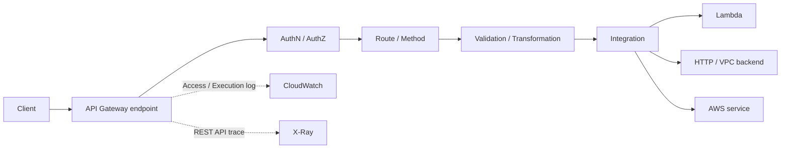

# Amazon API Gateway

最終確認日: 2026-09-22

| 項目 | 内容 |
|---|---|
| 重要度 | A: 中核 |
| 対象サービス／機能 | Amazon API Gateway |
| 対応Task・Skills | 主軸: Task 1.2 / Skill 1.2.2〜1.2.3。接点: Task 2.1 / Skills 2.1.3、2.1.6、Task 2.3 / Skills 2.3.1〜2.3.5、Task 2.4 / Skills 2.4.1〜2.4.4、Task 2.5 / Skills 2.5.1〜2.5.3、2.5.6、Task 3.1 / Skills 3.1.1、3.1.4〜3.1.5、Task 5.2 / Skill 5.2.2 |
| このページで分かること | REST API、HTTP API、WebSocket APIの責務差と、Route、変換、認可、Traffic管理、Streaming、観測、Private接続をサービス単位で整理する。API Gatewayが管理する受付・Routing基盤と、利用者が管理するAPI契約、Backend、Data、権限、再試行・切替の境界を追える。 |

## 全体像

Amazon API Gatewayは、REST、HTTP、WebSocket APIを作成、公開、保守、監視、保護するマネージドサービスである。ClientからRequestまたはMessageを受け、設定したRoute／Method、認可、検証、変換を適用して、AWS Lambda、AWSサービス、公開HTTP endpoint、VPC内のBackendへ渡す。Backendの業務処理やFoundation Model（FM）推論をAPI Gateway自身が実行するわけではない。

AWSはAPI endpoint、Request受付、Routing、サービス基盤のScalingとMulti-AZ運用を管理する。利用者はAPI type、契約、認証・認可、Integration、Stage／Deployment、Quota、Log、Backend capacity、Error処理を管理する。API Gatewayは各Region内で複数Availability Zoneを使い、Availability Zone障害から自動回復するよう設計されている。一方、複数Regionへの配置、DNS failover、BackendとDataの可用性は利用者の設計範囲である。

図は同期HTTP処理の基本境界を示す。WebSocketでは接続確立後、Message内容からRouteを選び、BackendからConnection management APIを介してClientへPushできる。Response streamingではREST APIが完成前のIntegration responseを順次Clientへ転送する。

## 1. REST API、HTTP API、WebSocket API

| API type | 入力 | API Gatewayの処理 | 出力 | 利用者が管理する範囲 | 代表的な連携 |
|---|---|---|---|---|---|
| REST API | HTTP Request | ResourceとMethodを照合し、豊富なAPI管理機能とIntegrationを適用 | Buffered responseまたは対応Proxy integrationのStream | Resource／Method、Validation、VTL変換、API key、Usage plan、Cache、WAF、Private endpoint | Lambda、AWSサービス、公開HTTP、VPC link |
| HTTP API | HTTP Request | Route keyでRouteを選び、少ない設定でProxy中心のIntegrationを実行 | HTTP response | Route、JWT／Lambda authorizer、Parameter mapping、CORS、Stage | Lambda、公開HTTP、ALB／NLB／Cloud MapへのPrivate integration |
| WebSocket API | Upgrade Requestと双方向Message | Connectionを維持し、Route selection expressionの結果でMessageをRouting | Route response、またはBackendからClientへのPush | `$connect`認可、Route、Connection IDと状態、切断・再接続処理 | Lambda、HTTP endpoint、AWSサービス、DynamoDB等の状態Store |

REST APIとHTTP APIはいずれもStatelessなHTTP APIであるが、機能は同一ではない。REST APIはAPI key、Client別Throttling、Usage plan、Request validation、Cache、AWS WAF、Private API endpoint、Execution log、X-Ray、Response streamingを備える。HTTP APIはこれらを持たない一方、JWT authorizer、Automatic deployment、ALBやCloud Mapを含むPrivate integrationに対応する。WebSocket APIはStatefulな全二重Connectionを提供するが、会話履歴やSessionの業務状態は利用者がBackendまたはData storeで管理する。

## 2. Route、Method、Integration

REST APIはResource pathとHTTP Methodの組でMethodを定義する。HTTP APIはHTTP MethodとPathからなるRoute key、WebSocket APIはMessageから評価するRoute selection expressionとRoute keyを使う。WebSocketの予約Routeは`$connect`、`$disconnect`、`$default`である。

Integrationは選ばれたMethod／RouteをBackendへ結び付ける。Proxy integrationではRequestをBackendへまとめて渡し、BackendのResponseをAPI Gatewayが所定の契約で返す。REST APIのCustom integrationではMethod request、Integration request、Integration response、Method responseを分けて変換できる。代表的な接続先はLambda、AWSサービス、公開HTTP endpoint、およびVPC link経由のPrivate resourceである。

| 段階 | 主な入力 | 処理・出力 | 管理境界 |
|---|---|---|---|
| Route／Method照合 | Method、Path、WebSocket Message | 対象Integrationを決定 | 利用者がPath、Verb、Route key、Default routeを定義する |
| Integration request | Parameter、Header、Body、Context | Backend固有のRequestへ渡す | API Gatewayは設定を実行し、利用者はContract、Credential、Timeoutを定義する |
| Backend | Integration request | 業務処理、FM呼出し、Data操作 | Lambda code、Model選択、状態、Idempotencyは利用者が管理する |
| Integration／Route response | Status、Header、BodyまたはMessage | Client向けResponseへ渡す | Error mapping、Schema、部分Responseの扱いを利用者が定義する |

## 3. Request／Response transformationとValidation

REST APIはRequired parameter、Model、Request validatorをMethodへ設定し、Body、Query string、Path parameter、HeaderをBackendの前で検査できる。REST APIの非Proxy integrationではVelocity Template Language（VTL）のMapping templateと`$input`、`$context`などの変数を使い、Request／ResponseのBody、Header、Parameter、Status codeを変換できる。HTTP APIはParameter mappingには対応するが、Request body transformationとRequest validationには対応しない。

Validationの入力はAPI契約とClient request、出力はBackendへ進むRequestまたは4xx responseである。API GatewayがSchemaの業務上の正しさ、Prompt injection、過大な生成指示、出力の事実性まで判断するわけではない。利用者はAPI Gatewayの構文的Validationに加え、Backendで業務規則、Size、認可対象、Prompt／Tool input、生成Outputを検証する。

Response streamingを有効にしたREST APIではResponse全体をBufferする機能を併用できないため、Endpoint cache、Content encoding、VTLによるResponse transformationは使えない。Stream内のEvent形式やSSEの`data:` fieldはIntegrationが生成し、Clientが切断・途中終了を処理する。

## 4. AuthN／AuthZとResource policy

| Control | 対応範囲と入力 | 処理・出力 | 利用者が管理する範囲 |
|---|---|---|---|
| AWS IAM authorization | SigV4で署名したCaller identity | `execute-api:Invoke`許可を評価 | IAM policy、Role、対象Stage／Method／Route |
| Lambda authorizer | Token、Header、Query、Context等 | Function結果から許可・拒否とContextを渡す | Authorizer code、Identity source、Cache key／TTL、最小権限 |
| Cognito／JWT | TokenとClaim | REST APIはCognito user pool authorizer、HTTP APIはJWT authorizerでRoute accessを評価 | Issuer、Audience、Scope、Token lifecycle |
| Resource policy | Source IP、VPC endpoint、Principal等 | REST API Resourceに対するAllow／Deny | Policy条件、Account間Access、`aws:SourceVpc`／`aws:SourceVpce` |
| mTLS | Client certificate | Custom domainへのTLS相互認証 | Truststore、Certificate lifecycle、Domain設定 |

REST APIとHTTP APIはIAMとLambda authorizerに対応するが、Resource policyはREST APIだけである。HTTP APIはJWT authorizerを直接提供する。WebSocket APIはConnection確立時の`$connect` RouteにIAMまたはLambda authorizerを設定し、その認可がConnection全体を保護する。既存ConnectionへAuthorizer変更を遡及適用するものではないため、接続後のMessage単位の業務権限もBackendで検証する。

API GatewayからLambdaやAWSサービスを呼ぶ権限と、ClientがAPIを呼ぶ権限は別である。利用者は、必要なIntegrationにはIntegration roleまたはBackend側のResource-based policyを、Client accessにはIAM／Authorizer／REST API Resource policyをそれぞれ設定し、Backendの権限をAPI callerへそのまま委譲しない。TLSは転送中Dataを保護するが、Payloadの保存、Log、Backendでの暗号化と機密情報の取扱いは別途管理する。

## 5. Throttling、Quota、Usage plan

API GatewayはToken bucket algorithmで、Account／Region、API、Stage、MethodまたはRouteなどのTarget rateとBurstを適用し、超過時には`429 Too Many Requests`を返し得る。REST APIではAPI keyをUsage planへ関連付け、Client別のThrottling targetと一定期間のQuota targetを設定できる。ただしThrottlingとUsage quotaはいずれもBest effortのTargetであり、厳密な費用上限や認可機構ではない。

入力はAPI callとAPI key等、処理はRate／Burst／Quotaの照合、出力はIntegrationへの転送または429である。利用者はBackend、Bedrock等の下流Quotaも別に把握し、Client側のExponential backoffとJitter、再実行可能性、Idempotencyを実装する。API GatewayのThrottlingはFMのModel別Token quotaやLambda concurrencyを増やさない。

2026-09-22時点の一般的なAccount-level既定値は、1 Account・1 Regionで全API typeとWebSocket callback APIを合算して10,000 RPS、最大Burst bucket 5,000である。Burst bucket値はAPI Gateway service teamが決め、利用者は任意に設定または増加できない。ただし一部Regionは2,500 RPS／Burst 1,250で、RPS quotaの増加可否と実値はService Quotasで確認する。

## 6. Streaming、SSE、WebSocketの境界

三つは同義ではない。

| 方式 | 接続と方向 | API Gatewayでの公式境界 | 主な利用者管理項目 |
|---|---|---|---|
| REST response streaming | 1 HTTP Requestに対するServer→Clientの逐次Response | REST APIの`HTTP_PROXY`／`AWS_PROXY`だけ。`responseTransferMode=STREAM`。Request streamingは非対応 | Chunk／Event形式、切断、部分Response、Backend timeout |
| SSE | HTTP response内のText EventをServer→Clientへ送るApplication protocol | REST response streamingのUse case。API GatewayがSSE Eventを生成するのではない | `Content-Type`、Event ID、Heartbeat、再接続位置、Error event |
| WebSocket | 長時間のStateful、Full-duplex Connection | WebSocket API。Client messageをRouteし、BackendはConnection ID宛てにPush | Connection registry、認可後の権限、順序、再接続、期限切れConnection |

REST response streamingは全REST endpoint typeで利用でき、Streamは最大15分である。Idle timeoutはRegional／Private endpointで5分、Edge-optimized endpointで30秒である。最初の10 MBを超えるResponse dataは2 MB/sに制限される。Streamingでは通常の10 MB Response payload上限や29秒のIntegration timeoutを超えられるが、設定、BackendのTimeout、Idle timeoutは残る。

HTTP APIは2026-09-22時点の公式機能表でResponse streaming非対応である。WebSocket APIのIntegration timeoutは29秒で、Connection durationは2時間、Idle timeoutは10分、Message payloadは128 KB、Frameは32 KBである。WebSocketは長時間Connectionを提供しても、1回のIntegration処理がConnection時間まで継続する仕組みではない。

## 7. Cache、Stage、Deployment

REST APIのStage cacheはEndpoint responseをTTL中保持し、Cache keyが一致するRequestへBackendを呼ばずに返す。入力はMethod requestとCache key、出力はCached responseまたはBackend responseである。既定TTLは300秒、設定範囲は0〜3,600秒、Cached response上限は1,048,576 Bytesで、CacheはBest effortである。利用者はCache key、暗号化、Invalidate権限、Staleness、Capacity、Costを管理する。生成AIの個人別・権限別Responseでは、Cache keyとData分離が不十分だと別Callerの内容を返す危険がある。

DeploymentはAPI構成のSnapshot、StageはDeploymentを公開する名前付き環境である。Stage variables、Log、Throttling等をStageへ設定できる。REST APIはCanary releaseで同じStageの一部Trafficを別Deploymentへ送り、HTTP APIとWebSocket APIはStageでAutomatic deploymentを設定できる。API GatewayがPrompt、Model、Backend codeのVersionを一体でRollbackするわけではないため、利用者はAPI契約と依存Versionの対応をRelease記録へ残す。

## 8. Access log、Execution log、CloudWatch、X-Ray

| Signal | 対象と内容 | 出力・用途 | 境界 |
|---|---|---|---|
| Access log | REST／HTTP／WebSocketのCaller、Route、Status、Latency、Request ID等 | CloudWatch Logs等でRequest単位の調査 | Formatと保存先を利用者が設定する。少なくともRequest IDを含める |
| Execution log | REST API内部の処理Step、Error、Parameter等 | API Gateway管理または利用者管理のLog destination | REST APIだけ。Data tracingは機密Payloadを含み得る |
| CloudWatch metrics | Count、4XX／5XX、Latency、IntegrationLatency、CacheHit／Miss等 | Dashboard、Alarm、Scaling／障害検知 | Backend固有Metricや生成品質は別途収集する |
| X-Ray | REST APIから下流ServiceまでのTraceとLatency | Service map、Trace、Sampling | REST APIだけ。HTTP／WebSocket APIのNative X-Ray tracingと混同しない |
| CloudTrail | API Gateway Resourceの作成・変更等 | Control plane監査 | Application request本文のLogではない |

Access logでは`$context.requestId`または`$context.extendedRequestId`が必要で、両方を含めることが推奨される。API GatewayはExecution logからAuthorization headerやAPI keyなどをRedactするが、任意のPayload全体が安全になるとは限らない。利用者はPrompt、Response、PII、TokenをLogへ出す範囲、Retention、KMS、Access権限を管理する。

障害調査ではAPI GatewayのStatus、`IntegrationLatency`、Request IDと、Lambda／Backend、FM RuntimeのLog／TraceをCorrelation IDで結ぶ。4xx、Authorizer失敗、Validation失敗、429、Integration timeout、5xxを同じ失敗として扱わない。

## 9. Private API、VPC link、AWS WAF

Private APIとPrivate integrationは方向が異なる。

- **Private REST API**は、ClientからAPI Gatewayへの入口をVPC内に限定する。Interface VPC endpoint（AWS PrivateLink）を通り、Resource policy、VPC endpoint policy、`aws:SourceVpc`／`aws:SourceVpce`条件で範囲を制御する。Private endpoint typeはREST APIだけである。
- **VPC link**は、API GatewayからVPC内Backendへの出口を提供する。VPC link V2ではAPI GatewayがElastic network interfaceを作成・管理する。HTTP APIはALB、NLB、Cloud Mapへ、REST APIはALBまたはNLBへPrivate integrationできる。REST APIのVPC link V2はCloud MapをIntegration targetにできない。入口がPublicでもBackendをPrivateにできるため、Private APIとは別概念である。
- **AWS WAF**はWeb ACLのRuleでHTTP Requestを検査し、API GatewayではREST API Stageを保護する。HTTP APIとWebSocket APIへ直接関連付ける機能ではない。WAFはIAM／JWT認可、Schema validation、Prompt injection対策の代替ではない。

VPC link V2はSubnetとSecurity groupを作成後に変更できず、60日Trafficがないと`INACTIVE`になり、再開時のNetwork interface再作成中はRequestが失敗し得る。対応Region／Availability Zoneも変わり得るため、2026-09-22時点の固定一覧を暗記せず公式表を確認する。

## API、Event、Dataの入出力

| 面 | 主なResource／API | 入力 | 出力 |
|---|---|---|---|
| Control plane | REST APIの`RestApi`／Resource／Method／Deployment／Stage、V2 APIのApi／Route／Integration／Stage | OpenAPI定義、Route、Integration URI、Authorizer、Stage設定 | API ID、Invoke URL、Deployment／Stage状態 |
| REST／HTTP Data plane | `execute-api` endpoint | HTTP Method、Path、Header、Query、Body | Status、Header、BodyまたはResponse stream |
| WebSocket Data plane | `wss` endpointと`@connections` management API | Upgrade、Message、Connection ID宛てPayload | Route invocation、ClientへのMessage、切断結果 |
| Observability | `$context`、CloudWatch metrics、X-Ray header、CloudTrail event | Request／Integration metadata | Log event、Metric、Trace、監査Event |

Control planeのAPI定義変更権限と、Data planeの`execute-api:Invoke`権限を分離する。OpenAPI importはAPI契約をResourceへ展開するが、Backend code、Prompt schema、Data分類、Release承認を自動で保証しない。

## 可用性、Quota、料金要因

API GatewayのRegion内基盤はMulti-AZで管理される。Region障害へ備える場合は複数RegionにAPIとBackendを展開し、Route 53等でHealth checkとFailoverを構成する。API Gateway endpointだけを複製しても、単一RegionのLambda、VPC link、Data store、FMへの依存は残る。

2026-09-22時点で、Buffered REST APIのPayload上限は10 MBである。Regional／Private REST APIのIntegration timeoutは既定範囲50 ms〜29秒で、29秒超への増加はRegional throttle quotaの引下げを必要とする場合がある。Edge-optimized REST APIは29秒超へ増加できない。HTTP APIはPayload 10 MB、Integration timeout最大30秒である。WebSocketの主な値はStreaming節のとおりである。QuotaはAPI type、Region、Account、Resourceごとに異なるため、公式Quota表とService Quotasで実値を確認する。

料金要因は、REST／HTTP APIでは受信API call数とData transfer out、WebSocket APIでは送受信Message数とConnection minutesである。REST APIのResponse streamingはResponse sizeにより10 MB単位でBillable request数が計算される。REST API cacheは選択Sizeごとの時間課金で、Private APIのData transfer out課金はないがAWS PrivateLink料金が発生する。Lambda、CloudWatch、X-Ray、WAF、Data transfer、Backendなどの料金は別である。単価、Free Tier、Region差は[API Gateway pricing](https://aws.amazon.com/api-gateway/pricing/)を利用時に確認する。

## AIP-C01との対応

| Task・Skill | API Gatewayが担う役割 | 関連ページ |
|---|---|---|
| Task 1.2 / Skills 1.2.2〜1.2.3 | FM呼出し層をAPIとして分離し、Stage、Throttle、Integration切替の境界を提供する。Model選択、Cross-Region inference、Graceful degradation自体はBackend／Bedrock側の責務 | [literal](../literal-pages/01-02-foundation-model-selection-and-configuration.md) / [supplimental](../supplimental-pages/01-02-foundation-model-selection-and-configuration.md) |
| Task 2.1 / Skills 2.1.3、2.1.6 | Tool／MCP連携のHTTP契約、Validation、認可、Timeoutの入口を提供する。Agent state、Tool allowlist、停止条件はApplication側で管理する | [Domain 2 literal目次](../literal-pages/README.md#第2部-実装と統合) / [Domain 2補足目次](../supplimental-pages/README.md#第2部-実装と統合) |
| Task 2.3 / Skills 2.3.1〜2.3.5 | Legacy／Cloud Backendを同期APIまたはPrivate integrationへ接続し、Stage／Canary、認証主体、Network境界を構成する | [Domain 2 literal目次](../literal-pages/README.md#第2部-実装と統合) / [Domain 2補足目次](../supplimental-pages/README.md#第2部-実装と統合) |
| Task 2.4 / Skills 2.4.1〜2.4.4 | 同期Request、Response streaming、SSE、WebSocket、Throttling、Timeout、Routing、TraceのAPI境界を担う | [Domain 2 literal目次](../literal-pages/README.md#第2部-実装と統合) / [Domain 2補足目次](../supplimental-pages/README.md#第2部-実装と統合) |
| Task 2.5 / Skills 2.5.1〜2.5.3、2.5.6 | FM API契約、OpenAPI、Lambda／Step Functions等へのIntegration、Request IDによる調査経路を提供する | [Domain 2 literal目次](../literal-pages/README.md#第2部-実装と統合) / [Domain 2補足目次](../supplimental-pages/README.md#第2部-実装と統合) |
| Task 3.1 / Skills 3.1.1、3.1.4〜3.1.5 | Request validation、Size／Rate制御、WAF、Authorizer、Logを多層防御のAPI境界として提供する。GuardrailsとOutput validationは別層 | [Domain 3 literal目次](../literal-pages/README.md#第3部-ai-safetysecuritygovernance) / [Domain 3補足目次](../supplimental-pages/README.md#第3部-ai-safetysecuritygovernance) |
| Task 5.2 / Skill 5.2.2 | Authentication、Validation、429、Timeout、5xxをAccess／Execution log、Metric、Traceから切り分けるSignalを提供する | [Domain 5 literal目次](../literal-pages/README.md#第5部-テスト検証トラブルシューティング) / [Domain 5補足目次](../supplimental-pages/README.md#第5部-テスト検証トラブルシューティング) |

要件からREST、HTTP、WebSocket、Streaming方式を選ぶ判断は、対応するsupplimental pageで扱う。このページでは各方式の公式な機能境界を示す。

## 重要な制約と確認事項

- API type間で、WAF、Private endpoint、Cache、Validation、Execution log、X-Ray、Response streaming、JWTの対応は異なる。2026-09-22時点の機能表を基準とし、実装時に再確認する。
- REST response streamingはResponseだけを対象とし、Request streamingには対応しない。Stream中はCache、Content encoding、VTL Response transformationを使えない。
- Usage planとAPI keyはClient識別と利用量Targetのための仕組みであり、Authentication／Authorizationの代替ではない。
- Private REST APIはClient→API Gateway、VPC linkはAPI Gateway→Private BackendをPrivateにする。それぞれ片方向の境界を自動的に補完しない。
- Quota、Integration timeoutの増加可否、Region／Availability Zone、料金は変更され得る。公式Quota表、Service Quotas、Pricing pageを対象Account・Regionで確認する。

## 用語

| 用語 | このページでの意味 |
|---|---|
| Method | REST APIでResource pathに結び付けるHTTP Verbと処理設定 |
| Route | HTTP APIまたはWebSocket APIでRequest／MessageをIntegrationへ対応付ける規則 |
| Integration | API Gatewayが呼び出すLambda、AWSサービス、HTTP endpoint、Private Backendとの接続 |
| Stage | Deploymentを公開し、Log、Throttle、Variable等を設定する名前付き環境 |
| Usage plan | REST API keyごとにThrottleと一定期間のQuota targetを関連付けるResource |
| Response streaming | Integration responseを完成前からREST API Clientへ逐次転送する機能 |
| Private API | Interface VPC endpointからだけ呼び出せるREST API endpoint type |
| VPC link | API GatewayからVPC内ResourceへのPrivate integrationに使う接続Resource |

## 公式資料

- [What is Amazon API Gateway?](https://docs.aws.amazon.com/apigateway/latest/developerguide/welcome.html) — サービスの役割、API type、管理機能、Integration
- [Choose between REST APIs and HTTP APIs](https://docs.aws.amazon.com/apigateway/latest/developerguide/http-api-vs-rest.html) — Endpoint、認可、管理、変換、監視、Integrationの機能差
- [API Gateway WebSocket APIs](https://docs.aws.amazon.com/apigateway/latest/developerguide/apigateway-websocket-api.html) — 双方向ConnectionとRoute
- [Create routes for WebSocket APIs](https://docs.aws.amazon.com/apigateway/latest/developerguide/websocket-api-develop-routes.html) — Route、`$connect`認可、API key
- [Set up a method request](https://docs.aws.amazon.com/apigateway/latest/developerguide/api-gateway-method-settings-method-request.html) — REST Resource、Method、Parameter、Model、Validation
- [Variables for data transformations](https://docs.aws.amazon.com/apigateway/latest/developerguide/api-gateway-mapping-template-reference.html) — VTL Mappingで使用する変数
- [Control and manage access to REST APIs](https://docs.aws.amazon.com/apigateway/latest/developerguide/apigateway-control-access-to-api.html) — IAM、Resource policy、Lambda authorizer、Cognito、VPC endpoint policy
- [Throttle requests to REST APIs](https://docs.aws.amazon.com/apigateway/latest/developerguide/api-gateway-request-throttling.html) — Token bucket、429、Throttle／QuotaのBest effort境界
- [Amazon API Gateway quotas](https://docs.aws.amazon.com/apigateway/latest/developerguide/limits.html) — Account／RegionのThrottle quota
- [REST API quotas](https://docs.aws.amazon.com/apigateway/latest/developerguide/api-gateway-execution-service-limits-table.html) — Payload、Timeout、Cache、Resource quota
- [HTTP API quotas](https://docs.aws.amazon.com/apigateway/latest/developerguide/http-api-quotas.html) — Payload、Timeout、Route、Authorizer quota
- [WebSocket API quotas](https://docs.aws.amazon.com/apigateway/latest/developerguide/apigateway-execution-service-websocket-limits-table.html) — Connection、Message、Frame、Timeout quota
- [Stream integration responses](https://docs.aws.amazon.com/apigateway/latest/developerguide/response-transfer-mode.html) — REST Response streaming、SSE、適用Integration、制約
- [Cache settings for REST APIs](https://docs.aws.amazon.com/apigateway/latest/developerguide/api-gateway-caching.html) — TTL、Size、Cache key、Metric、課金
- [Set up CloudWatch logging for REST APIs](https://docs.aws.amazon.com/apigateway/latest/developerguide/set-up-logging.html) — Access log、Execution log、Request ID、機密Data
- [Trace REST API requests with X-Ray](https://docs.aws.amazon.com/apigateway/latest/developerguide/apigateway-xray.html) — REST APIのTrace、Service map、Sampling
- [Private REST APIs](https://docs.aws.amazon.com/apigateway/latest/developerguide/apigateway-private-apis.html) — PrivateLink、Resource／Endpoint policy、適用条件
- [Private integrations for REST APIs](https://docs.aws.amazon.com/apigateway/latest/developerguide/private-integration.html) — REST APIのVPC link V2、ALB／NLB、Cloud Map非対応
- [Private integrations for HTTP APIs](https://docs.aws.amazon.com/apigateway/latest/developerguide/http-api-develop-integrations-private.html) — HTTP APIのALB／NLB／Cloud Map連携
- [Set up VPC links V2](https://docs.aws.amazon.com/apigateway/latest/developerguide/apigateway-vpc-links-v2.html) — Private integration、ENI、状態、Region／AZ
- [Use AWS WAF to protect REST APIs](https://docs.aws.amazon.com/apigateway/latest/developerguide/apigateway-control-access-aws-waf.html) — REST API StageとWeb ACL
- [Resilience in Amazon API Gateway](https://docs.aws.amazon.com/apigateway/latest/developerguide/disaster-recovery-resiliency.html) — Multi-AZ管理、Region間Failoverの境界
- [Amazon API Gateway pricing](https://aws.amazon.com/api-gateway/pricing/) — API call、Data transfer、Streaming、Cache、WebSocket、PrivateLinkの料金要因
- [AIP-C01 Content Domain 1](https://docs.aws.amazon.com/aws-certification/latest/ai-professional-01/ai-professional-01-domain1.html) — Task 1.2とAPI Gatewayの出題範囲上の接点

## 関連ページ

- [サービス別目次](README.md)
- [FM選定と設定（literal）](../literal-pages/01-02-foundation-model-selection-and-configuration.md)
- [FM選定と設定（supplimental）](../supplimental-pages/01-02-foundation-model-selection-and-configuration.md)
- [Domain 2のTask別literal目次](../literal-pages/README.md#第2部-実装と統合)
- [Domain 2のTask別supplimental目次](../supplimental-pages/README.md#第2部-実装と統合)
- [Domain 3のTask別literal目次](../literal-pages/README.md#第3部-ai-safetysecuritygovernance)
- [Domain 3のTask別supplimental目次](../supplimental-pages/README.md#第3部-ai-safetysecuritygovernance)
- [Domain 5のTask別literal目次](../literal-pages/README.md#第5部-テスト検証トラブルシューティング)
- [Domain 5のTask別supplimental目次](../supplimental-pages/README.md#第5部-テスト検証トラブルシューティング)
