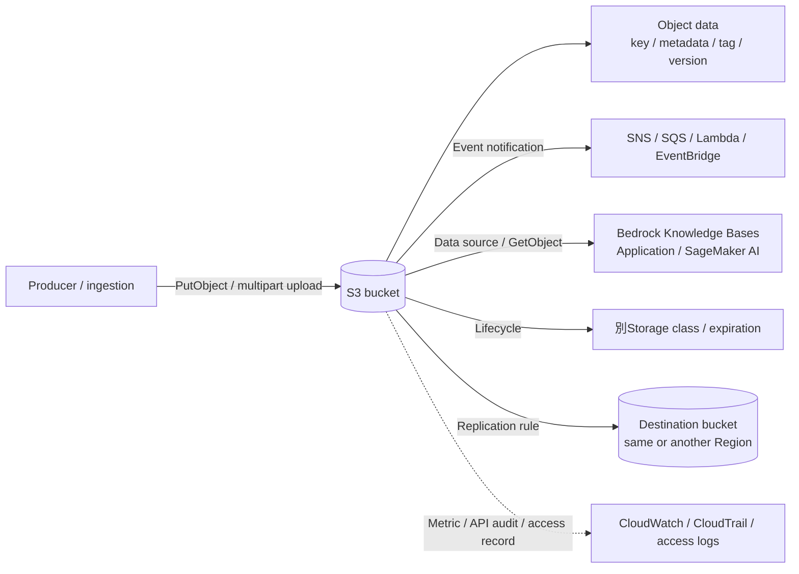

# Amazon S3

最終確認日: 2026-09-23

| 項目 | 内容 |
|---|---|
| 重要度 | A: 中核 |
| 対象サービス／機能 | Amazon S3、S3 Intelligent-Tiering、S3 Lifecycle policies、S3 Cross-Region Replication（CRR） |
| 対応Task・Skills | 主軸: Task 1.3 / Skills 1.3.1〜1.3.4、Task 1.4 / Skills 1.4.2、1.4.4〜1.4.5、Task 1.5 / Skills 1.5.1〜1.5.3、Task 1.6 / Skills 1.6.3〜1.6.4。接点: Task 2.2 / Skills 2.2.1〜2.2.3、Task 3.2 / Skills 3.2.1〜3.2.3、Task 3.3 / Skills 3.3.1〜3.3.4、Task 4.1 / Skills 4.1.1〜4.1.4 |
| このページで分かること | S3のオブジェクトモデル、階層化、保護、保持、イベント、Region間複製を一つの保存基盤として整理する。RAGデータソース、モデル成果物、Prompt／Log repositoryとして接続するときの入出力、AWSと利用者の管理境界、Security、観測、可用性、料金要因を追える。 |

## 全体像と管理境界

Amazon Simple Storage Service（Amazon S3）は、データとMetadataをObjectとしてBucketへ保存するマネージドObject storageである。S3はStorage infrastructure、Region内のサービス基盤、Objectの保存と取得、設定されたLifecycle／Replication処理を管理する。利用者はBucketのRegionと種類、Object key、Data／Metadata、Storage class、保持期間、Versioning、Replication rule、暗号化方式、権限、Event destination、監視と費用を管理する。

このページはAIP-C01で中心となるGeneral purpose bucketとObjectを主に扱う。Directory bucket、Table bucket、Vector bucketは別のAPI・機能境界を持つため、General purpose bucketの機能をそのまま適用できるとは限らない。

図の中心はObjectである。S3はObjectを保存し、設定に従って通知、階層移動、失効、複製を行うが、文書内容の検証、Chunking、Embedding、Prompt承認、生成品質の評価は接続先またはApplicationの責務である。

## 1. Bucket、Object、Key、Metadata、Tag

General purpose bucketはObjectを収容するRegion単位のResourceである。ObjectはDataとMetadataから成り、Bucket内ではKeyで識別する。Versioningが有効なら、Bucket、Key、Version IDの組が特定Versionを識別する。Key内の`/`を使ったPrefixは一覧、Lifecycle rule、Event filter、Policy等でDataを分類できるが、General purpose bucketのObject namespace自体は階層File systemではない。

| 要素 | 入力 | S3が保持・処理する状態 | 出力・利用先 | 利用者が管理する範囲 |
|---|---|---|---|---|
| Bucket | Name、Region、Bucket type、設定 | ObjectのContainerと設定 | Regional endpoint、Bucket ARN | Region、命名、Policy、Versioning、暗号化、Lifecycle、Replication |
| Object／Key | Bytes、Key、任意のChecksum | Object data、Size、Last modified、ETag等 | `GetObject`のBody、`HeadObject`のMetadata | Key規約、Content、完全性検証、Multipart uploadの完了／中止 |
| User-defined metadata | Upload時のKey-value header | Objectに付随。Upload後の変更はObject copyが必要 | `HEAD`／`GET` response header | Metadata schema、Size制約、機密情報を入れない規則 |
| Object tag | 最大10個のKey-value | Objectと別APIで追加・置換・削除可能 | Policy、Lifecycle filter、Cost allocation等の条件 | Tag schema、変更権限、Policy／Lifecycleとの整合 |

System-defined metadataにはSize、作成／更新時刻、Storage class、Encryption、Version ID、Checksum等が含まれる。User-defined metadata、Tag、Object bodyは役割が異なる。RAGの検索用MetadataはKnowledge Bases等の取り込み契約にも合わせ、S3のTagだけでVector Store側のFilter schemaが自動的に完成するとみなさない。

## 2. Storage classとS3 Intelligent-Tiering

Storage classはObjectごとの保存特性である。S3 Standardは既定Classで、Standard-IA／One Zone-IA、S3 Glacier系ClassなどはAccess頻度、Availability、取り出し方式、最小保存期間、料金構造が異なる。Archive classではObjectを直接リアルタイム取得できず、Restoreが必要な場合がある。

S3 Intelligent-TieringはAccess patternが変化する、または未知のObject向けに、Accessを監視してTier間を自動移動するStorage classである。低LatencyのAccess tierと、明示的に有効化する非同期Archive tierを持つ。Object monitoring／automation料金が発生し、Archive tierの有効化条件やObject sizeによる扱いは変わり得るため、固定日数の暗記ではなく公式文書を確認する。

入力は`PutObject`時のStorage class指定、Lifecycle transition、またはIntelligent-Tiering configurationである。出力は同じKeyで保持されるObjectと現在のStorage class／Access tierであり、ApplicationがKeyを書き換える機能ではない。利用者はAccess latency、Restore許容時間、最小保存期間、Object size、Request／Retrieval／Monitoring費用を管理する。

## 3. VersioningとObject Lock

S3 Versioningは同じKeyの複数Versionを保持する。上書きは新Versionを作り、通常のDeleteはDelete markerを作るため、誤上書きや誤削除から特定Versionを復元できる。VersioningはBucket全体で有効化し、一度有効化したBucketはUnversionedへ戻せず、Suspendできる。各Versionは差分ではなくObject全体としてStorage料金の対象になる。

S3 Object LockはVersioningされたObject versionにWrite Once Read Many（WORM）保護を適用する。Retention period、Governance mode、Compliance mode、Legal holdを使い、保護中のVersionに対する削除や上書きを制限する。同じKeyへの新規PUTは新Versionを作れるが、既存の保護Versionは保持される。

AWSは設定されたVersionとRetentionを強制する。利用者は対象Bucket／Object、Mode、Retain-until date、Legal hold、例外権限、証跡、Versionの復元手順を管理する。VersioningはRetention policyではなく、Object LockはBackupや別Region配置そのものではない。

## 4. Lifecycle、Retention、削除

S3 Lifecycle configurationはRuleのFilterに一致するObjectへ、Storage classのTransition、現行VersionのExpiration、非現行VersionのTransition／Expiration、期限切れDelete markerや未完了Multipart uploadの処理を適用する。Ruleは設定後に作成したObjectだけでなく、条件を満たす既存Objectにも適用される。

LifecycleによるExpirationとApplicationの`DeleteObject`は同一ではない。Versioning有効Bucketでは、現行VersionのExpirationがDelete markerを作る場合と、非現行Versionを恒久削除するActionを区別する。Object LockのRetentionまたはLegal holdで保護されたVersionは、Lifecycle expirationの対象時刻に達しても保護を回避して削除されない。一方、Bucket policyのDenyでLifecycle ruleの削除やTransitionを止めることはできない。

入力はPrefix、Tag、Object size、Version状態、経過日数等を含むRuleである。S3は適格性を評価し、TransitionまたはExpirationを非同期に処理する。利用者は業務・法令上のRetention、Versioning／Object Lockとの関係、Restore時間、早期削除料金、Rule変更の影響を管理する。

## 5. Event notification

S3 Event NotificationsはObject作成／削除、Restore、Replication、Lifecycle、Intelligent-Tiering、Tag等のEventをAmazon SNS、Amazon SQS、AWS Lambda、Amazon EventBridgeへ送る。Prefix／Suffix filterで対象Keyを絞れる。

通知は少なくとも1回（at-least-once）配信を前提とし、通常は秒単位だが遅延し得る。利用者はConsumer側の冪等性、重複処理、失敗処理、Eventと実際のObject versionの照合を管理する。SQS FIFO queueはS3 Event Notificationsの直接Destinationではなく、必要な場合はEventBridgeを介する。Consumerが同じTrigger対象Bucket／PrefixへObjectを書き戻す構成は再帰Loopになり得る。

RAG ingestionでは、通知は「Objectが変化した」というSignalを渡せるが、Knowledge Baseの同期完了、Indexの鮮度、検索結果の公開可否までは保証しない。それらは接続先のJob状態と検証結果で管理する。

## 6. ReplicationとCross-Region Replication

S3 ReplicationはRuleに一致するObjectをDestination bucketへ非同期に複製する。Same-Region Replication（SRR）は同一Region、Cross-Region Replication（CRR）は異なるRegionを対象にする。SourceとDestinationでVersioningが必要で、S3がSourceを読みDestinationへ書くためのIAM role、Bucket policy、必要に応じてKMS key権限を利用者が設定する。

Live replicationはRule設定後の新規Objectを対象にする。Rule以前の既存Object、失敗済みObject、再複製が必要なObjectにはS3 Batch Replicationを使う。Tag、Metadata、Delete marker、SSE-KMS Object、Object Lock等は設定・権限・Ruleによって扱いが異なるため、対象Data typeごとに公式のReplication要件を確認する。

S3 Replication Time Control（S3 RTC）は、新規Objectの99.99%を15分以内に複製するSLA付き機能であり、Batch Replicationには適用されない。通常のCRRを同期Writeや即時Failoverの保証として扱わない。Destinationの遅延、失敗、未複製ObjectはReplication status、Metric、Eventで監視する。CRRはObject copyを作る機能であり、Application trafficの切替やDestinationからSourceへの逆方向同期を自動では構成しない。

## 7. Encryption、Bucket policy、Access Point

2026-09-23時点で、S3へ新しくUploadされるObjectは、追加料金のないSSE-S3を基準とするServer-side encryptionが既定で適用される。利用者はBucket default encryptionまたはRequestでSSE-S3、SSE-KMS、DSSE-KMS等を指定できる。SSE-KMS／DSSE-KMSではS3権限に加えてKMS key policy／GrantとKMS Request、CRR時のSource／Destination key権限を管理する。Client-side encryptionでは暗号化処理とKey管理も利用者の責務になる。転送中はHTTPS／TLSを用い、Policy条件でSecure transportを強制できる。

Bucket policyはBucketとObjectに対するResource-based policyで、Principal、Action、Resource、Conditionを評価する。IAM identity policy、Service role、KMS key policy、VPC endpoint policyは別の評価境界である。Block Public AccessとObject OwnershipのBucket owner enforced（ACL無効が既定）により、Policy中心のAccess管理を構成できる。

S3 Access Pointは共有Datasetに対する名前付きNetwork endpointと専用Policyである。VPC限定Access Pointも構成できる。Access PointはObject操作の入口であり、Bucket削除やReplication configuration作成などすべてのS3 Control plane操作を代替しない。利用者はApplication／TenantごとのAccess Point policy、Underlying bucket policyとの関係、Public access block、Network経路を管理する。

## 8. RAG data source、Model artifact、Prompt／Log repository

| 用途 | S3への入力 | S3からの出力 | S3の責務 | 接続先／利用者の責務 |
|---|---|---|---|---|
| RAG data source | 文書、画像等のSource object、Key、Metadata | Connector／Ingestion jobが読むObjectとVersion | 原本保存、Access、Version、Event、Lifecycle | Knowledge Bases等がParsing、Chunking、Embedding、Indexing、同期状態を管理。利用者がSource schema、削除反映、公開前検証を管理 |
| Model artifact | Training／Customizationで生成したArtifact、Containerが読むFile | Job／Endpointが取得するArtifact URIとBytes | Artifactの保存、暗号化、Version、Checksum metadata | SageMaker AI／Bedrock等の対応形式、Model registry、Deploy、Runtime互換性、Rollbackを管理 |
| Prompt／Evaluation repository | Prompt template、Test dataset、評価結果、承認記録 | Pipeline／Reviewerが読む版付きObject | Durable object storage、Versioning、Retention、Access log | Prompt semantics、承認状態、対応Model／Dataset、Release mappingを利用者が管理 |
| Invocation／Application log repository | ServiceまたはExport pipelineが書くLog object | Athena等の分析、監査、Archive | 保存、Encryption、Lifecycle、Object Lock、Replication | 収集元がLog schemaとDeliveryを管理。利用者がPII／Prompt／Responseの記録範囲、Retention、Query権限を管理 |

S3 URIが存在しても、接続先Serviceの対応Region、File type、Size、Encryption key、Service role、Cross-account accessを満たすとは限らない。RAG source、Model artifact、Prompt、Logでは更新・削除・保持の意味が異なるため、Bucket、Prefix、Tag、Policy、Lifecycleを用途ごとに対応付ける。

## 9. Consistency、Transfer、料金要因

S3はObjectのPUT／overwrite／DELETE後のReadとLIST、およびObject metadata／Tag等について強い整合性を提供する。成功したWrite後のReadで最新Objectを取得できる。Bucket configurationはこの強整合性の対象ではない。たとえばVersioningを初めて有効化した直後は設定の伝播を待ってからPUT／DELETEを行う。この説明を、Event notification、CRR、Lifecycle、外部Connector同期、Vector index更新まで同期的に完了する保証へ拡張してはいけない。これらはそれぞれ非同期状態を持つ。

大きなObjectはMultipart uploadでPartを並列転送できる。S3 Transfer AccelerationはCloudFront Edge locationとAWS Networkを通して長距離Upload／Downloadを高速化する機能で、追加料金と効果測定が必要になる。大量のRequestはPrefixへ並列化できるが、Applicationは503等へのRetryとExponential backoffを実装する。

料金の主な要因は次のとおりである。

- 保存Byte数、Storage class、保存期間、Version数、Replica数
- PUT／COPY／POST／LIST／GET、Lifecycle transition、Restore等のRequest
- IA／Archive系のRetrieval、最小Storage duration、早期削除
- Region間／Internet向けData transfer。CRRではDestination storage、Replication PUT、Inter-Region transferが加わる
- Intelligent-TieringのObject monitoring／automation、任意Archive、S3 RTC、Replication metrics
- KMS、CloudWatch、CloudTrail data event、Inventory、Storage Lens等の連携Service／管理機能

単価、Free Tier、Storage class条件、Region差は変わり得るため、2026-09-23時点の固定値を本文には置かず、実装するRegionの[S3 Pricing](https://aws.amazon.com/s3/pricing/)とService Quotasを確認する。

## API、Event、Dataの入出力

| 面 | 主なAPI／Resource | 入力 | 出力 |
|---|---|---|---|
| Object data plane | `PutObject`、Multipart upload、`GetObject`、`HeadObject`、`ListObjectsV2`、`DeleteObject` | Bucket、Key、Body、Header、Tag、Checksum、Version ID等 | Object bytes、Metadata、一覧、Version／Delete marker、Status |
| Object管理 | `GetObjectTagging`／`PutObjectTagging`、Version API、Retention／Legal hold API | Object identifier、Tag set、Retention設定 | 更新されたTag／Retention／Version状態 |
| Bucket control plane | Versioning、Lifecycle、Notification、Replication、Encryption、Policy、Access Point configuration | JSON／XML configuration、IAM role、Destination ARN | Bucket subresource設定と処理状態 |
| Event | S3 Event Notifications、EventBridge event | Event type、Bucket、Key、Version等 | SNS／SQS／Lambda／EventBridgeへのEvent message |
| Observability | CloudWatch metrics、CloudTrail、Server access log、S3 Inventory、Storage Lens | Request／Storage／ConfigurationのSignal | Metric、監査Event、Access record、Inventory report、集約指標 |

Data plane権限とBucket configurationを変更するControl plane権限を分離する。Presigned URLは期限付きで特定S3操作を委譲できるが、URLを発行したPrincipalの権限を越えず、URL自体をCredentialとして保護する。

## 可観測性、可用性、Scaling、Quota

CloudWatchのDaily storage metricsはBucketの保存量とObject数、Request metricsは有効化したBucket／FilterのRequest数、Latency、Error等を示す。Replication metricsはPending bytes／operations、Latency、Failureを追跡する。S3 Storage LensはAccount／Organizationを横断したUsage／Activityを集約する。S3 InventoryはObject、Storage class、Encryption、Replication status等の定期Reportを作る。

CloudTrailはBucket-levelのManagement eventを記録し、Object-levelのData eventは選択して有効化する。Server access loggingはData access recordをDestination bucketへ配信する。これらは即時性、収録内容、料金が異なる。Prompt／Response、PII、機密MetadataをLogやInventoryのTagへ複製しないよう、記録内容、暗号化、Retention、閲覧権限を管理する。

General purpose bucketではS3 Express One Zoneを除くStorage classを使え、S3 StandardなどのMulti-AZ Storage classは複数Availability Zoneへ冗長保存される。S3 One Zone-IAは単一Availability ZoneのStorage classである。S3 Express One ZoneはDirectory bucket用で、単一Availability Zone内の複数Deviceへ冗長保存される。BucketのRegionは作成後に変更できない。別RegionのcopyはReplication等で明示的に構成する。

S3はRequest rateに応じてScalingする。公式のPerformance guidanceはPrefix当たり少なくとも毎秒3,500件のPUT／COPY／POST／DELETEと5,500件のGET／HEADを示すが、急増時には一時的な503が起こり得る。Bucket数、Access Point、Replication destination、Lifecycle rule等のQuotaはResourceとRegionで異なり、一部は増枠可能である。数値は[AWS General Reference](https://docs.aws.amazon.com/general/latest/gr/s3.html)とService Quotasで対象Account／Regionを確認する。

## AIP-C01との対応

| Task・Skill | S3が担う役割 | 関連ページ |
|---|---|---|
| Task 1.3 / Skills 1.3.1〜1.3.4 | Multimodal原本、検証済みData、隔離Data、中間結果をObjectとして保存し、Checksum、Metadata、Version、EventでPipelineの入出力を結ぶ。内容検証と変換は別Service／Applicationが担う | [literal](../literal-pages/01-03-data-validation-and-processing.md) / [supplimental](../supplimental-pages/01-03-data-validation-and-processing.md) |
| Task 1.4 / Skills 1.4.2、1.4.4〜1.4.5 | Vector ingestionのSource、文書ID／Version／分類Metadata、Full／Incremental syncと削除のSource of truthを提供する。Vector indexと検索はVector Store側の責務 | [literal](../literal-pages/01-04-vector-store-design.md) / [supplimental](../supplimental-pages/01-04-vector-store-design.md) |
| Task 1.5 / Skills 1.5.1〜1.5.3 | RAG文書とMetadataをConnectorへ渡すData sourceとなる。Chunking、Embedding、Retrieval方式の選択は接続先の責務 | [literal](../literal-pages/01-05-retrieval-for-rag.md) / [supplimental](../supplimental-pages/01-05-retrieval-for-rag.md) |
| Task 1.6 / Skills 1.6.3〜1.6.4 | Prompt、Test dataset、評価結果、承認EvidenceをVersion付きObjectとして保持し、Retention／監査の保存境界を提供する | [literal](../literal-pages/01-06-prompt-engineering-and-governance.md) / [supplimental](../supplimental-pages/01-06-prompt-engineering-and-governance.md) |
| Task 2.2 / Skills 2.2.1〜2.2.3 | Batch input／output、Model artifact、Deployment manifestの保存先になる。Inference方式、Artifact形式、Runtime capacityはBedrock／SageMaker AI側で管理する | [literal](../literal-pages/02-02-model-deployment-strategies.md) / [supplimental](../supplimental-pages/02-02-model-deployment-strategies.md) |
| Task 3.2 / Skills 3.2.1〜3.2.3 | IAM／Bucket policy、KMS、Private endpoint、Object Lock、LifecycleでData access、暗号化、Retention、削除を実装する | [Domain 3 literal目次](../literal-pages/README.md#第3部-ai-safetysecuritygovernance) / [Domain 3補足目次](../supplimental-pages/README.md#第3部-ai-safetysecuritygovernance) |
| Task 3.3 / Skills 3.3.1〜3.3.4 | Version、Metadata、Inventory、CloudTrail、Access log、Object LockをData lineageとAudit evidenceの保存・追跡に接続する | [Domain 3 literal目次](../literal-pages/README.md#第3部-ai-safetysecuritygovernance) / [Domain 3補足目次](../supplimental-pages/README.md#第3部-ai-safetysecuritygovernance) |
| Task 4.1 / Skills 4.1.1〜4.1.4 | Storage class、Intelligent-Tiering、Lifecycle、Version／Replica保持、Request／TransferをStorage cost driverとして可視化・制御する | [Domain 4 literal目次](../literal-pages/README.md#第4部-運用効率と最適化) / [Domain 4補足目次](../supplimental-pages/README.md#第4部-運用効率と最適化) |

要件からStorage class、Retention、Replication方式、Bucket分離を選ぶ判断は、対応するsupplimental pageで扱う。このページではS3の機能と責務境界を示す。

## 重要な制約と確認事項

- Strong consistencyをEvent notification、CRR、Lifecycle、Knowledge Base sync、Vector index更新へ拡張しない。各非同期処理のStatusを別に確認する。
- Strong consistencyはObject操作の保証であり、Bucket configurationへは同じように適用されない。初めてVersioningを有効化した後は、公式資料が案内する設定伝播の待機時間を確認する。
- Versioning、Object Lock、Lifecycle、Replicationは相互作用する。削除、非現行Version、Delete marker、Retention、Replicaの扱いをRule単位で確認する。
- Intelligent-TieringのTier条件、Archive access、Object size条件、Storage classの最小保存期間とRetrieval条件は変更され得る。
- S3のDefault encryptionだけでKMS key分離、Cross-account access、Data classification、Log redactionが完了するわけではない。
- Event destination、Replication／S3 RTC、Access Point、Bucket type、Quota、料金、Region対応は2026-09-23時点の公式資料と対象Accountで再確認する。

## 用語

| 用語 | このページでの意味 |
|---|---|
| Bucket | Objectを格納し、Region、Policy、Lifecycle等の設定境界となるS3 Resource |
| Object | Data、Key、Metadataから成るS3の基本保存単位 |
| Prefix | Keyの先頭部分。分類、List、Policy、Lifecycle、Event filter等に使う |
| Delete marker | Versioning有効Bucketで通常のDelete時に現行位置へ置かれるMarker |
| Lifecycle | Objectの経過日数等に応じてTransitionまたはExpirationを実行する設定 |
| CRR | 異なるAWS RegionのBucket間でObjectを非同期複製する機能 |
| S3 RTC | 新規Objectの99.99%を15分以内に複製するSLA付きReplication機能 |

## 公式資料

- [What is Amazon S3?](https://docs.aws.amazon.com/AmazonS3/latest/userguide/Welcome.html) — Object storage、Bucket／Object／Key、Security、監視、Strong consistency
- [Working with object metadata](https://docs.aws.amazon.com/AmazonS3/latest/userguide/UsingMetadata.html) — System／User-defined metadata、更新条件、Header制約
- [Tagging your objects](https://docs.aws.amazon.com/AmazonS3/latest/userguide/object-tagging.html) — Object tag、Policy／Lifecycle／Replicationとの関係
- [Understanding and managing S3 storage classes](https://docs.aws.amazon.com/AmazonS3/latest/userguide/storage-class-intro.html) — Storage classの特性と適用条件
- [Managing storage costs with S3 Intelligent-Tiering](https://docs.aws.amazon.com/AmazonS3/latest/userguide/intelligent-tiering.html) — Access tier、自動移動、管理機能
- [Retaining multiple versions with S3 Versioning](https://docs.aws.amazon.com/AmazonS3/latest/userguide/Versioning.html) — Version状態、Version ID、Storage料金
- [Locking objects with Object Lock](https://docs.aws.amazon.com/AmazonS3/latest/userguide/object-lock.html) — WORM、Retention mode、Legal hold
- [Managing the lifecycle of objects](https://docs.aws.amazon.com/AmazonS3/latest/userguide/object-lifecycle-mgmt.html) — Transition、Expiration、既存Objectへの適用
- [Amazon S3 Event Notifications](https://docs.aws.amazon.com/AmazonS3/latest/userguide/EventNotifications.html) — Event type、Destination、at-least-once、Loop
- [Replicating objects within and across Regions](https://docs.aws.amazon.com/AmazonS3/latest/userguide/replication.html) — SRR、CRR、Batch Replication、S3 RTC
- [Configuring replication for buckets in the same account](https://docs.aws.amazon.com/AmazonS3/latest/userguide/replication-walkthrough1.html) — Versioning、IAM role、Bucket policy、Rule構成
- [S3 Replication Time Control](https://docs.aws.amazon.com/AmazonS3/latest/userguide/replication-time-control.html) — SLA、Metric、Event、Request rateの条件
- [Protecting data with encryption](https://docs.aws.amazon.com/AmazonS3/latest/userguide/UsingEncryption.html) — Server-side／Client-side encryption、転送中暗号化
- [Using SSE-KMS](https://docs.aws.amazon.com/AmazonS3/latest/userguide/UsingKMSEncryption.html) — KMS権限、Bucket key、RequestとQuota
- [Bucket policies for Amazon S3](https://docs.aws.amazon.com/AmazonS3/latest/userguide/bucket-policies.html) — Resource-based policyとLifecycleの境界
- [Managing access with S3 Access Points](https://docs.aws.amazon.com/AmazonS3/latest/userguide/access-points.html) — Named endpoint、Access point policy、VPC限定Access
- [Amazon S3 data consistency model](https://docs.aws.amazon.com/AmazonS3/latest/userguide/Welcome.html#ConsistencyModel) — Strong consistencyの適用範囲
- [Amazon S3 Transfer Acceleration](https://docs.aws.amazon.com/AmazonS3/latest/userguide/transfer-acceleration.html) — Edge locationと最適化経路による長距離転送、適用条件、追加料金
- [Amazon S3 performance design patterns](https://docs.aws.amazon.com/AmazonS3/latest/userguide/optimizing-performance.html) — Prefix単位のRequest rate、並列化、Retry
- [Amazon S3 endpoints and quotas](https://docs.aws.amazon.com/general/latest/gr/s3.html) — Region endpointとService quota
- [Amazon S3 pricing](https://aws.amazon.com/s3/pricing/) — Storage、Request、Retrieval、Transfer、Replication、管理機能の料金要因
- [AIP-C01 Content Domain 1](https://docs.aws.amazon.com/aws-certification/latest/ai-professional-01/ai-professional-01-domain1.html) — Task 1.3〜1.6のData、Metadata、Connector、Lifecycle、RAG、Prompt governance

## 関連ページ

- [サービス別目次](README.md)
- [データ検証・処理（literal）](../literal-pages/01-03-data-validation-and-processing.md) / [補足](../supplimental-pages/01-03-data-validation-and-processing.md)
- [Vector Store設計（literal）](../literal-pages/01-04-vector-store-design.md) / [補足](../supplimental-pages/01-04-vector-store-design.md)
- [RAG Retrieval（literal）](../literal-pages/01-05-retrieval-for-rag.md) / [補足](../supplimental-pages/01-05-retrieval-for-rag.md)
- [Prompt engineeringとGovernance（literal）](../literal-pages/01-06-prompt-engineering-and-governance.md) / [補足](../supplimental-pages/01-06-prompt-engineering-and-governance.md)
- [Model deployment（literal）](../literal-pages/02-02-model-deployment-strategies.md) / [補足](../supplimental-pages/02-02-model-deployment-strategies.md)
- [Domain 3のTask別literal目次](../literal-pages/README.md#第3部-ai-safetysecuritygovernance) / [補足目次](../supplimental-pages/README.md#第3部-ai-safetysecuritygovernance)
- [Domain 4のTask別literal目次](../literal-pages/README.md#第4部-運用効率と最適化) / [補足目次](../supplimental-pages/README.md#第4部-運用効率と最適化)
