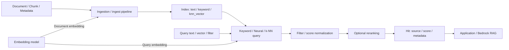

# Amazon OpenSearch Service

最終確認日: 2026-09-23

| 項目 | 内容 |
|---|---|
| 重要度 | A: 中核 |
| 対象サービス／機能 | Amazon OpenSearch Service（Managed domain、Amazon OpenSearch Serverless、Amazon OpenSearch Ingestion） |
| 対応Task・Skills | 主軸: Task 1.4 / Skills 1.4.1〜1.4.5、Task 1.5 / Skills 1.5.1〜1.5.6。運用上の接点: Task 4.2 / Skills 4.2.2、4.2.6、Task 4.3 / Skills 4.3.1〜4.3.3、4.3.5〜4.3.6、Task 5.2 / Skill 5.2.4 |
| このページで分かること | OpenSearch Serviceが文書、Keyword用Field、Embedding Vector、MetadataをIndex化して検索する範囲を整理する。Managed domainとServerless collectionの管理境界、Vector／Neural／Hybrid search、Shard、Security、Ingestion、Snapshot、Metricの関係を追える。 |

## 全体像

Amazon OpenSearch Serviceは、OpenSearch clusterのDeploy、運用、ScalingをAWSが管理するServiceである。Provisioned型ではOpenSearch Service domainがClusterに相当し、利用者がInstance、Node数、Storage、Availability Zone、Index、Shard、Replicaを構成する。Amazon OpenSearch Serverlessでは、利用者は用途別のCollection、Index、Security policy、OCUの上下限を構成し、AWSがNode、Shard配置、Service software、Capacity scalingを管理する。

どちらの形態でも、AWSが検索内容の正しさを自動保証するわけではない。利用者はSource document、Mapping、Embedding modelとDimension、Index／Search pipeline、Query、Filter、Score統合、権限、鮮度、保持期間を管理する。

取り込み側は文書をMappingに従ってIndexへ書き、必要ならEmbeddingを生成する。検索側はKeyword、Vector、または両方の候補を取得し、Filter、Score統合、任意のRerankingを経てHitを返す。OpenSearch Serviceの出力は検索結果であり、FMの最終回答、Citation、End user認証は呼出し側ApplicationまたはAmazon Bedrock側の責務である。

## Managed domainとServerless collection

| 形態 | 入力 | AWSが管理する処理・状態 | 出力 | 利用者の管理境界・代表連携 |
|---|---|---|---|---|
| OpenSearch Service domain（Managed cluster） | Domain設定、Index document、OpenSearch query | InstanceのProvisioning、Service software、Node障害検知と交換、Automated snapshot | Domain endpoint、Search hit、Cluster／Index状態、Metric | Engine version、Instance／Storage、Node数、AZ、Shard／Replica、Mapping、Access policy、FGAC。Bedrock Knowledge Bases、CloudWatch、S3と連携 |
| OpenSearch Serverless collection | Collection generation／type、Document、Index、Query、Security policy | Computeの自動Scaling、Node／Shard、Index lifecycle、Service software／Version、冗長性 | Collection endpoint、Search hit、OCU／Collection metric | 世代に応じたCollection type、Index、Mapping、Data access／Network／Encryption policy、OCU上限。BedrockとPrivate accessで連携可能 |
| OpenSearch Ingestion | Source event／stream、Pipeline定義 | Data PrepperベースのServerless pipeline、Patch、設定範囲内のScaling | 変換済みDocumentをDomain／Collectionへ配送 | Source／Sink、Buffer、Filter／変換、IAM、VPC、最小／最大Ingestion OCU、Failure処理 |

### ServerlessのNextGen／ClassicとOCU

Serverlessでは、Collectionを作成するときにNextGenまたはClassicを選ぶ。両世代を同一のCapacity・Network手順として扱わない。

| 世代 | Collection typeと設定単位 | OCUとScale-to-zero | Private accessのData plane endpoint |
|---|---|---|---|
| NextGen | SearchまたはVector search。Collection groupで複数CollectionのComputeを共有し、Security／Network／Encryptionは作成方法に応じて構成する | Collection groupでIndexing用とSearch用の最小／最大OCUを別々に設定できる。最小0 OCUでIdle時にScale-to-zeroできる | `on.aws` endpointへ、標準AWS PrivateLink interface VPC endpointを使う |
| Classic | Search、Time series、またはVector search。作成WizardでCollectionごとのSecurity／Network／Encryptionを構成する | Collection groupを使わない場合はAccount-level capacityを使う。最小0 OCUのScale-to-zeroは使えない | `aoss.amazonaws.com` endpointへ、OpenSearch Serverlessが管理するVPC endpointを使う |

検索用とIndexing用のComputeはOpenSearch Compute Unit（OCU）で別々にScalingする。OCUの仕様、Collection generation、Scale-to-zero、上限、対応Regionは変わり得るため、固定値ではなく利用Regionの公式文書とService Quotasで確認する。

## Document、Index、Mapping

OpenSearchのDocumentはJSON fieldの集合であり、IndexはDocumentを検索可能な形で保持する論理単位である。Mappingは各Fieldをどう保存しIndex化するかを定める。

| 要素 | 入力 | 処理または保持状態 | 出力 | 利用者の管理境界 |
|---|---|---|---|---|
| Document | Chunk本文、Source URI、文書ID、Version、Timestamp、TenantなどのJSON | `_source`に元JSONを保持し、Mapping対象Fieldを検索構造へ追加する | `_id`、`_index`、`_source`、検索可能なField | 一意ID、Update／Delete、機密情報、Metadataの正本との対応を管理する |
| Index | Mapping、Settings、Document | Document、Inverted index、Vector index、Primary shard／Replicaをまとめる | Query対象、Aliasの参照先、Index stats | Domain／用途／Tenant／Schema／Lifecycleの分割単位、ShardとReplica、Version移行を管理する |
| Mapping | Field名と型、Analyzer、`index`、Vector設定 | `text`を解析してToken化し、`keyword`を完全一致用に保持し、`knn_vector`をVector検索用にIndex化する | Query時に利用できるFieldと演算 | Dynamic mappingに任せる範囲、型、検索・Filter・Sort対象、Dimensionを取り込み前に整合させる |

同じ文字列を`text`と`keyword`のMulti-fieldにすれば、全文検索と完全一致Filter／Sortを分けて扱える。Embedding fieldは`knn_vector`とし、Embedding modelの出力DimensionとMappingの`dimension`を一致させる。Metadata filterに使うFieldも、文字列、数値、日付、BooleanなどQuery演算に合う型でIndex化する。

MappingやDimensionを互換性のない形で変える場合は、既存Documentを別IndexへRe-indexし、検証後にAliasを切り替える構成を取れる。AliasはApplicationが物理Index名へ固定されるのを避けるが、Schema migrationやRollbackを自動判定する機能ではない。

## Vector engine、k-NN、Dimension

Vector searchは、Text、Image、Audioなどから生成した高次元のEmbeddingを`knn_vector` fieldへ保存し、Query vectorに近いDocumentを返す。Amazon OpenSearch Serviceの公式資料では、2026-09-23時点で`knn_vector`のDimensionは最大16,000とされる。ただし、利用可能なEngine、Method、Encoder、Distance、Filter動作、Dimension上限はOpenSearch version、Domain／Serverless、Featureごとに異なるため、Index作成時に対応表を確認する。

| 検索要素 | 入力 | 処理 | 出力 | 管理境界・条件 |
|---|---|---|---|---|
| Exact k-NN | Query vector、`k`またはScore条件 | 候補Vectorを厳密に比較する | 類似度順のHit | Data量とLatencyに応じて利用可否を確認する |
| Approximate k-NN | Query vector、`k`、ANN Index | HNSW、IVFなどの構造から近傍候補を探索する | 近似されたTop-k | Recall、Latency、Indexing時間、Memory、Filter動作をMethod／Engine設定と一緒に評価する |
| Distance／Space type | Document vector、Query vector | L2、Cosine、Inner productなどで近さを計算する | Scoreまたは距離に基づく順位 | Embedding modelが想定する類似度、Vector正規化と一致させる |
| Vector engine | `knn_vector` MappingとMethod | Faiss、LuceneなどがVector indexを構築・検索する | Engine固有のIndexとHit | OpenSearch ProjectではNMSLIBはDeprecatedである。AWS Managed ServiceやBedrock Knowledge Basesではさらに対応条件を確認する |

Dimensionを変更すると既存Vectorとの互換性が失われる。Embedding model、Model version、Vector type、Dimension、Distanceを同じIndex contractとして記録し、変更時は再EmbeddingとRe-indexの対象を明確にする。Bedrock Knowledge BasesからOpenSearch Managed Clusterを使う場合など、連携ServiceがEngineやDistanceへ追加条件を持つ場合は、その連携側の公式文書も確認する。

## Neural searchとEmbedding integration

Neural searchは、OpenSearchのML CommonsとNeural Search機能を使い、Embedding生成とSemantic queryをSearch workflowへ接続する。基本の構成要素は次のとおりである。

1. ModelまたはRemote model connectorを登録する。
2. Text embedding ingest processorが指定FieldからDocument embeddingを生成する。
3. Index mappingの`knn_vector` fieldへVectorを保存する。
4. `neural` queryがQuery textまたはImageをEmbeddingへ変換してVector fieldを検索する。

入力はRaw text／Image、Model ID、Source field、Target vector fieldである。出力はEmbeddingを含むIndex documentとSemantic search hitである。AWSはOpenSearch Service基盤と対応Pluginを管理するが、利用者はModel／Connector、IAM service role、Model access、Field mapping、Pipeline、Dimension、Failure時の再処理を管理する。

OpenSearch ServerlessのNeural searchは2026-09-23時点でRemote modelのみを使い、Remote modelをConnectorで構成する。Serverlessで使えるProcessor、Query、API、RegionはProvisioned domainやOpenSearch Projectの最新版と同一とは限らない。利用Regionと[Serverlessの対応表](https://docs.aws.amazon.com/opensearch-service/latest/developerguide/serverless-configure-neural-search.html)を確認する。

Amazon BedrockはEmbedding生成先として接続でき、Amazon Bedrock Knowledge BasesはOpenSearch Service／ServerlessをVector Storeとして利用できる。この場合、BedrockはChunking、Embedding、Retrievalの設定された処理を担い、OpenSearchはIndexと検索を担う。Knowledge Baseの同期状態とOpenSearchのIndex／Cluster状態は別々に観測する。

## Keyword、Semantic、Hybrid search

| 検索方式 | 主な入力 | OpenSearchでの処理 | 主な出力 |
|---|---|---|---|
| Keyword／Lexical | Query文字列、`text`／`keyword` field、Analyzer | Inverted indexを検索し、既定ではBM25などで関連度をScore化する | 語やPhraseに合うDocument hit |
| Semantic／Vector | Query textまたはQuery vector、`knn_vector` field、Model ID | Query embeddingを生成または受け取り、Vectorの近さを検索する | 意味的に近いDocument hit |
| Hybrid | Keyword queryとNeural／Vector query | 複数Queryの候補と異なるScore尺度をSearch pipelineで正規化・統合する | KeywordとSemanticを統合した順位 |

OpenSearch ServerlessのHybrid searchでは、`hybrid` queryとNormalization processorを含むSearch pipelineを使う。2026-09-23時点のServerless公式資料には`min_max`／`l2`正規化と、Arithmetic／Geometric／Harmonic meanによる結合が記載されている。対応方式はEngine／提供形態／Versionで変わり得る。

OpenSearchが返す`_score`は検索方式、Distance、Normalization、Boost、Reranking設定に依存する。異なるIndex、Model、Query方式のScoreを無条件に同一尺度として扱わない。方式の選定とThresholdの決定は[Retrieval設計の補足ページ](../supplimental-pages/01-05-retrieval-for-rag.md)で扱う。

## Filter、Scoring、Rerankingとの境界

Filter、Scoring、Rerankingは異なる段階を担当する。

| 段階 | 入力 | 処理 | 出力 | 境界 |
|---|---|---|---|---|
| Filter | Tenant、公開範囲、日付、文書種別などの条件 | 検索対象または候補を条件で制限する | 許可・条件に合う候補集合 | FilterだけをEnd user認証の代わりにしない。EngineによりPre／Post filteringの動作が異なる |
| Initial scoring | Keyword一致、Vector距離、Field boost | 各Query方式がDocumentへScoreを付ける | 方式別の候補とScore | Scoreの意味と範囲はQuery方式に依存する |
| Normalization／Combination | Hybrid queryの複数Score | Search pipelineで尺度を正規化し、重みまたは結合方式で統合する | Hybrid順位 | Weightと結合方式は利用者設定である |
| Reranking | Queryと初段のTop candidates | Cross-encoder、Document field、Late interaction modelなどで候補を再評価する | 並べ替えられた候補 | 初段で除外されたDocumentは復活しない。追加LatencyとModel／Feature対応条件がある |

OpenSearch Projectの`rerank` processorはSearch pipelineで初段結果を並べ替える。Normalizationと併用する場合はNormalization後にRerankingが動く。これはOpenSearch Projectの機能説明であり、すべてのAmazon OpenSearch Service Engine version／Serverless Regionで同じRerankerが使えることを意味しない。AWS Managed Service上のPlugin、Remote model、IAM、Region条件を実装時に確認する。

## Shard、Replica、Multi-index

Managed domainでは、IndexをPrimary shardへ分け、Replica shardを持たせる。ShardはData nodeへ分散される検索・回復単位である。Replicaは同じDataのCopyであり、Read処理の分散とNode／AZ障害時の可用性に使われる。

- Primary shard数は既存Indexで容易に変更できないため、最初のDocumentをIndex化する前に決める。
- 大きすぎるShardは回復を遅くし、小さすぎるShardを多数作るとCPUとMemoryを消費する。
- AWSの一般的なGuidelineは、検索Latency重視でShard当たり10〜30 GiB、Write重視で30〜50 GiBである。これは一律の正解ではなく、実DataとQueryで検証する開始点である。
- Replica数とAZ数は可用性、Storage、Indexing量、Search throughputへ影響する。

Multi-indexは、専門Domain、Tenant、Schema version、保持期間などを別Indexに分け、Aliasまたは複数Index Queryで扱う。入力は分割規則と各IndexのMapping、出力は複数IndexにまたがるHitである。利用者はQuery対象、権限、重複Document、Scoreの比較可能性、Re-index単位を管理する。ServerlessではAWSがPhysical shardとIndex lifecycleを管理するため、Managed domain向けのShard数調整をそのまま適用しない。

## Security、Network、Fine-grained access control

### Managed domain

Managed domainのSecurityは三層で考える。

1. Network層はPublic endpointまたはVPC accessとSecurity groupでRequestがEndpointへ到達できるかを制御する。
2. Domain access policyはResource-based policyとしてDomainのSubresource／URIへの到達を許可または拒否する。
3. Fine-grained access control（FGAC）はUserを認証し、Role mappingに基づいてCluster、Index、Document、Field単位の権限を評価する。

IAMのIdentity-based policyはControl plane操作と、構成に応じたData plane署名Requestを制御する。Domain access policy、IAM、FGACの許可を一つの境界として混同しない。VPC domainではIP-based access policyを使わずSecurity groupでNetwork sourceを制御する。Public endpointとVPC accessは作成後に直接切り替えられず、新DomainとData migrationが必要である。

At-rest encryption、Node-to-node encryption、HTTPSを構成し、KMS keyのPolicyとLifecycleも管理する。FGACでAudit logを有効にできるが、Log publication、CloudWatch Logs resource policy、保持と機密情報の扱いは利用者が構成する。

### OpenSearch Serverless

Serverless collectionはEncryption policy、Network policy、Data access policyを分ける。At-rest encryptionは必須であり、AWS owned keyまたはCustomer managed KMS keyを選ぶ。Network policyはPublic／Private accessとCollection／Dashboards endpointを対象にし、Private collectionは世代に対応したVPC endpointや対応AWS serviceから接続できる。Data access policyはIAM role、User、SAML identityへCollection／IndexのOperationを許可する。

Network policyで到達できてもData access policyの権限は得られない。逆にData access policyだけでもNetwork policyが許可しなければ到達できない。Private Data plane accessのVPC endpoint方式は世代で異なり、NextGenは標準AWS PrivateLink interface VPC endpoint、ClassicはOpenSearch Serverless-managed VPC endpointを使う。Amazon BedrockからPrivate collectionへ接続する場合は、Network policyのAWS service private accessとBedrock側Service role／Data accessの両方を構成する。

## Ingestion、Index lifecycle、Snapshot

| 機能 | 入力 | 処理 | 出力 | 利用者の管理境界・連携 |
|---|---|---|---|---|
| Direct／Bulk indexing | JSON Document、Document ID、Target index | Mappingに従ってFieldとVectorをIndex化する | Item単位の成功／失敗 | `_bulk`の部分失敗、Retry、冪等なID、Refresh、Backpressureを管理する |
| OpenSearch Ingestion | Stream／Event、Pipeline定義 | Filter、Enrich、Transform、Normalize、Aggregateし、Domain／Collectionへ配送する | Index document、Pipeline metric／Log | Source、Sink、DLQ／Failure、IAM、VPC、OCU上限。S3、Kinesis、CloudWatchなどと連携 |
| Index State Management（ISM） | Policy、Index pattern、State／Transition条件 | Read-only化、Rollover、Deleteなどの定期Taskを自動実行する | Index stateとAction結果 | Policy適用、保持要件、失敗監視を管理する。Cluster statusがRedの間はISM jobが動かない |
| Re-index／Alias | Source index、新Mapping、Destination index | Documentを新Indexへコピーし、Alias参照先を切り替える | 新Schema／DimensionのIndex | 検証、Dual write条件、切替、旧Index保持、Rollbackを管理する |
| Snapshot（Managed domain） | DomainのIndexとCluster state | AWSのAutomated snapshot、または利用者のS3 bucketへのManual snapshot | Restore可能なSnapshot | Automated snapshotはCluster recovery用。Manual snapshotは移行にも使え、S3、IAM role、Repositoryを管理する |

OpenSearchまたはElasticsearch 5.3以降のManaged domainでは、AWSはHourly automated snapshotを取り、14日間で最大336個保持する。これは2026-09-23時点の条件であり、Engine versionで異なる。Automated snapshotは利用者の長期Backup／保持Policyを自動的に満たすものではない。Manual snapshotは利用者のS3 bucketへ保存され、S3料金と権限管理が加わる。ServerlessはAWSがStorageと冗長性を管理し、Managed domainのManual snapshot手順をそのまま適用しない。

Index freshnessは、Source更新、Ingestion、Embedding、Indexing、Refresh／Query可能化までを分けて確認する。Bedrock Knowledge Bases経由ではIngestion jobの成功に加えて、対象Documentの追加・更新・削除がOpenSearchの検索結果へ反映されたかを確認する。

## API、Event、Dataの入出力

| 面 | 主なAPI／Interface | 入力 | 出力 |
|---|---|---|---|
| AWS Control plane | `CreateDomain`、`UpdateDomainConfig`、`DescribeDomain`、ServerlessのCollection／Security policy API、Ingestion pipeline API | Capacity、Network、Encryption、Policy、Engine／Pipeline設定 | ARN、Endpoint、Status、Configuration |
| OpenSearch Index plane | Index、Mapping、Document、`_bulk`、`_reindex`、Alias、ISM API | JSON、Mapping、Index settings、Policy | Item結果、Task／Index state、Alias状態 |
| OpenSearch Search plane | `_search`、`knn`／`neural`／`hybrid` query、Filter、Search pipeline | Query DSL、Query text／vector、`k`、Filter、Pagination | `hits`、`_score`、`_source`、Metadata、Aggregation |
| Snapshot plane | Snapshot repository／Snapshot／Restore API | S3 repository、Index、Snapshot名 | Snapshot／Restore状態 |
| Event／Monitoring | CloudWatch Metrics／Logs、CloudTrail、EventBridge対応Event | Service metric、OpenSearch log、AWS API call、Service event | Alarm、Dashboard、Audit record、Notification |

OpenSearchのData planeはHTTP REST APIであり、Managed domainではEndpointへIAM SigV4、Basic authentication、SAML／Cognito経由のDashboardsなど構成に合う認証を使う。ServerlessのOpenSearch API RequestはAWS credentialで署名し、Network policyとData access policyも通過する必要がある。

## 可観測性と性能調整

### Signalの境界

| Signal | 確認できること | 主な利用者Action |
|---|---|---|
| CloudWatch cluster／node metric | `ClusterStatus`、Shard割当、CPU、`JVMMemoryPressure`、Storage、Indexing／Search latency・rate、Queue、Rejected request | Node／Storage／Shard／Replica／Query／Ingestion設定を切り分ける |
| k-NN metric | Graph memory、Eviction、Index／Query error、Request、Cache hit | Vector数、Dimension、Engine、Memory、Indexing rate、Queryを確認する |
| Serverless metric | `IndexingOCU`、`SearchOCU`、Collection／Indexing／Search metric | OCU上限到達、Scale、Throttle、Query／Indexing負荷を確認する |
| CloudWatch Logs（Managed domain） | Error、Search request slow log、Shard search／Indexing slow log、Audit log | Threshold、Log publication、Retentionを設定し、遅いQuery／ShardとUser activityを調査する |
| CloudTrail | Domain、Collection、PolicyなどAWS Control plane API call | 誰がいつConfigurationを変更したかを監査する |
| OpenSearch API | `_cluster/health`、`_cat`、Index／Node／Task stats、Profile API | Shard、Index、Query plan、Task単位へ掘り下げる |

CloudTrailのConfiguration API履歴は、全Search queryやDocument accessの記録ではない。Data accessの監査はAudit log、性能調査はSlow log／Metric／Profileを使い分ける。OpenSearch ServiceのLog publicationとSlow log thresholdは既定で無効なため、必要なLog group、Resource policy、Domain／Index設定を利用者が有効化する。

### Query／Cluster性能の切り分け

1. End-to-end latencyをQuery変換、Embedding、OpenSearch検索、Reranking、生成へ分ける。
2. OpenSearch区間でSearch latency、Queue／Rejected、CPU／JVM、Storage、Shard状態を確認する。
3. Vector検索ではk-NN graph memory、Eviction、Query／Index error、DimensionとCandidate数を確認する。
4. Slow logまたはProfileで、対象Index、Shard、Filter、Aggregation、Script、Search pipelineを絞る。
5. Index freshnessとRetrieval relevanceを、Cluster capacity問題と分けて検証する。

`ClusterStatus.yellow`はPrimary shardが割り当て済みでも一部Replicaが未割当、`red`は少なくとも一つのPrimary shardが未割当である状態を示す。検索不良でRelevant documentが存在しない場合は、Score調整より先にSource、Ingestion、Mapping、Embedding、Index freshnessを確認する。原因別の判断手順は[Retrieval設計の補足ページ](../supplimental-pages/01-05-retrieval-for-rag.md)で扱う。

## 可用性、Scaling、Quota、料金要因

Managed domainでは、Nodeを複数AZへ分散し、Replicaを別Node／AZへ配置する。Multi-AZ with Standbyは三つのAZ、Dedicated master、Data copy、Auto-Tuneなどの構成条件を持つ。対応Engine version、Instance type、Region、Shard上限があるため、作成時の公式条件を確認する。Snapshotは論理的な削除や破損からの回復手段であり、Replica／Multi-AZは稼働中の冗長性である。

Serverlessは冗長性とCapacity scalingをAWSが管理するが、利用者はCollection groupの検索／Indexing OCUの最小・最大、Data access、Index／Query設計を管理する。最大OCUはCost controlになる一方、上限到達時は性能低下またはRequest失敗につながり得る。

QuotaはRegionとAccountに依存し、Domain数、Node数、EBS、Shard、Serverless collection／Index／OCU、Ingestion pipeline／OCUなどに分かれる。値は変更されるため、2026-09-23時点の固定値を暗記対象にせず、[OpenSearch Service quotas](https://docs.aws.amazon.com/opensearch-service/latest/developerguide/limits.html)とService Quotasで確認する。

主な料金要因は次のとおりである。

- Managed domain: Instance hour、EBS／Instance storage、Provisioned IOPS／Throughput、UltraWarm／Cold／Managed storage、Data transfer、Extended Support。
- Serverless: Indexing OCU、Search OCU、Managed storage。Collection generation、Collection group、最小CapacityとScale-to-zero条件を確認する。
- OpenSearch Ingestion: Pipelineに割り当てたIngestion OCU。停止中の扱い、最小／最大OCUを確認する。
- 追加機能と連携: Vector indexing acceleration、Semantic enrichment、CloudWatch Logs、KMS、S3 snapshot、Embedding／Reranking model、NAT／PrivateLink、Bedrockは別料金になり得る。

単価とFeatureの課金単位は変更されるため、実装Regionと日付を指定して[Amazon OpenSearch Service pricing](https://aws.amazon.com/opensearch-service/pricing/)を確認する。

## AIP-C01との対応

| Task・Skills | このサービスが担う役割 | 関連ページ |
|---|---|---|
| Task 1.4 / Skill 1.4.1 | FM拡張用Vector StoreとしてDocument、Vector、Metadataを保持・検索する | [literal](../literal-pages/01-04-vector-store-design.md) / [supplimental](../supplimental-pages/01-04-vector-store-design.md) |
| Task 1.4 / Skill 1.4.2 | MappingとMetadata fieldによりTimestamp、Author、Domain、Access scopeなどを検索・Filterへ渡す | [literal](../literal-pages/01-04-vector-store-design.md) / [supplimental](../supplimental-pages/01-04-vector-store-design.md) |
| Task 1.4 / Skill 1.4.3 | Dimension、Engine、Shard、Replica、Multi-indexを使いVector検索のScaleと性能を構成する | [literal](../literal-pages/01-04-vector-store-design.md) / [supplimental](../supplimental-pages/01-04-vector-store-design.md) |
| Task 1.4 / Skills 1.4.4〜1.4.5 | Bedrock Knowledge Bases、S3、Kinesis、Lambda、OpenSearch IngestionからDataを取り込み、Incremental update、Re-index、Lifecycleを管理する | [literal](../literal-pages/01-04-vector-store-design.md) / [supplimental](../supplimental-pages/01-04-vector-store-design.md) |
| Task 1.5 / Skills 1.5.1〜1.5.3 | ChunkとEmbeddingをMappingへ格納し、Vector Store上のSemantic retrievalを提供する | [literal](../literal-pages/01-05-retrieval-for-rag.md) / [supplimental](../supplimental-pages/01-05-retrieval-for-rag.md) |
| Task 1.5 / Skills 1.5.4〜1.5.5 | Keyword／Semantic／Hybrid、Filter、Score統合、Reranking、Neural queryをRetrieval pipelineへ構成する | [literal](../literal-pages/01-05-retrieval-for-rag.md) / [supplimental](../supplimental-pages/01-05-retrieval-for-rag.md) |
| Task 1.5 / Skill 1.5.6 | REST Search APIをApplication、Function calling、MCP toolのRetrieval実装から呼び出せる形で提供する | [literal](../literal-pages/01-05-retrieval-for-rag.md) / [supplimental](../supplimental-pages/01-05-retrieval-for-rag.md) |
| Task 4.2 / Skills 4.2.2、4.2.6 | Index、Hybrid／Custom scoring、Vector query、Shard、Pipelineを観測してRetrieval relevanceとLatencyを調整する | [literal目次](../literal-pages/README.md#第4部-運用効率と最適化) / [supplimental目次](../supplimental-pages/README.md#第4部-運用効率と最適化) |
| Task 4.3 / Skills 4.3.1〜4.3.3、4.3.5〜4.3.6 | CloudWatch Metric／Logs、CloudTrail、OpenSearch statsからVector Storeの性能、Reliability、変更、障害Signalを提供する | [literal目次](../literal-pages/README.md#第4部-運用効率と最適化) / [supplimental目次](../supplimental-pages/README.md#第4部-運用効率と最適化) |
| Task 5.2 / Skill 5.2.4 | Mapping、Embedding、Dimension、Filter、Score、Index freshness、k-NN memory、Search latencyを分けてRetrieval障害を調査する | [literal目次](../literal-pages/README.md#第5部-テスト検証トラブルシューティング) / [supplimental目次](../supplimental-pages/README.md#第5部-テスト検証トラブルシューティング) |

## 重要な制約と確認事項

- OpenSearch Projectの最新版にあるFeatureが、Amazon OpenSearch Serviceの全Engine version、Serverless、全Regionで使えるとは限らない。Neural／Hybrid／Reranking、Engine、Processor、APIごとにAWSの対応条件を確認する。
- Embedding model、Dimension、Vector type、Distance、Engineは一つのIndex contractとして扱う。変更時は既存Vectorとの互換性と再Index化を確認する。
- Managed domainとServerlessでは、Capacity、Shard、Security、Snapshot、APIの管理境界が異なる。同じ手順を両方へ適用しない。
- Metadata filterは検索対象を制限できるが、ApplicationのEnd user認証・認可を単独で代替しない。
- Rerankingは初段候補を並べ替える。FilterまたはTop-kで除外されたDocumentを復活させない。
- Region、Quota、Engine version、Serverless collection generation／OCU、Neural／Hybrid／Reranking、Snapshot、料金は2026-09-23に確認した。実装時に再確認する。

## 用語

| 用語 | このページでの意味 |
|---|---|
| Domain | OpenSearch ServiceのProvisioned Clusterと、その設定・Node・StorageをまとめるResource |
| Collection | OpenSearch Serverlessで、特定用途型のIndexをまとめる論理Resource |
| Document | Indexへ保存するJSON形式の検索単位 |
| Mapping | Document fieldの型とIndex化方法を定めるSchema |
| `knn_vector` | Dense vectorを保存し、k-NN／Vector similarity検索へ使うField type |
| Neural search | Model／ConnectorとIngest／Search pipelineを使い、Embedding生成とSemantic queryをOpenSearchへ統合する機能 |
| Hybrid search | KeywordとSemantic／Vectorの候補およびScoreを統合する検索 |
| Primary shard | Index dataを分割して保持する元Shard |
| Replica shard | Primary shardのCopy。Read分散と障害時の可用性へ使う |
| OCU | OpenSearch Compute Unit。Serverless collectionやIngestionなどのCapacity／課金単位。Featureにより構成は異なる |
| FGAC | Fine-grained access control。Role mappingに基づきCluster、Index、Document、Field権限を評価する機能 |

## 公式資料

- [AIP-C01 Content Domain 1](https://docs.aws.amazon.com/aws-certification/latest/ai-professional-01/ai-professional-01-domain1.html) — Task 1.4〜1.5とSkills 1.4.1〜1.5.6
- [AIP-C01 Content Domain 4](https://docs.aws.amazon.com/aws-certification/latest/ai-professional-01/ai-professional-01-domain4.html) — Retrieval性能、Vector Store運用、Observability
- [AIP-C01 Content Domain 5](https://docs.aws.amazon.com/aws-certification/latest/ai-professional-01/ai-professional-01-domain5.html) — Retrieval systemのTroubleshooting
- [What is Amazon OpenSearch Service?](https://docs.aws.amazon.com/opensearch-service/latest/developerguide/what-is.html) — Service、Domain、AWSの管理範囲、主要連携、料金要因
- [Amazon OpenSearch Serverless](https://docs.aws.amazon.com/opensearch-service/latest/developerguide/serverless.html) — Collection、Auto Scaling、管理境界、可用性
- [What is Amazon OpenSearch Serverless?](https://docs.aws.amazon.com/opensearch-service/latest/developerguide/serverless-overview.html) — NextGen／Classic、Collection type、分離されたIndexing／Search compute
- [Creating collections](https://docs.aws.amazon.com/opensearch-service/latest/developerguide/serverless-create.html) — NextGen／Classicの作成時の管理境界
- [Managing capacity limits for OpenSearch Serverless](https://docs.aws.amazon.com/opensearch-service/latest/developerguide/serverless-scaling.html) — OCU、Collection group、Scaling、Metric
- [Data plane access through AWS PrivateLink](https://docs.aws.amazon.com/opensearch-service/latest/developerguide/serverless-vpc.html) — NextGen／ClassicのVPC endpoint方式
- [Vector search in Amazon OpenSearch Service](https://docs.aws.amazon.com/opensearch-service/latest/developerguide/vector-search.html) — `knn_vector`、Dimension、k-NN、Distance、連携
- [Vector search — OpenSearch Project](https://docs.opensearch.org/latest/vector-search/) — Vector indexing、Semantic／Hybrid queryの構成
- [Methods and engines — OpenSearch Project](https://docs.opensearch.org/latest/mappings/supported-field-types/knn-methods-engines/) — Faiss、Lucene、NMSLIB、MethodとDimension条件
- [Neural search — OpenSearch Project](https://docs.opensearch.org/latest/vector-search/ai-search/neural-search/) — Neural searchの構成要素
- [Hybrid search — OpenSearch Project](https://docs.opensearch.org/latest/vector-search/ai-search/hybrid-search/) — Hybrid queryとSearch pipeline
- [Configure Neural Search and Hybrid Search on OpenSearch Serverless](https://docs.aws.amazon.com/opensearch-service/latest/developerguide/serverless-configure-neural-search.html) — Serverless固有のProcessor、Remote model、Region条件
- [Reranking search results — OpenSearch Project](https://docs.opensearch.org/latest/search-plugins/search-relevance/reranking-search-results/) — Search pipeline、RerankとNormalizationの順序
- [Mappings — OpenSearch Project](https://docs.opensearch.org/latest/field-types/index) — Document field、Mapping、明示的なSchema
- [Choosing the number of shards](https://docs.aws.amazon.com/opensearch-service/latest/developerguide/bp-sharding.html) — Primary shard数、Shard size、性能と回復
- [Identity and Access Management in OpenSearch Service](https://docs.aws.amazon.com/opensearch-service/latest/developerguide/ac.html) — Identity／Resource／IP policy
- [VPC domains](https://docs.aws.amazon.com/opensearch-service/latest/developerguide/vpc.html) — Public／VPC endpoint、Security group、変更制約
- [Fine-grained access control](https://docs.aws.amazon.com/opensearch-service/latest/developerguide/fgac.html) — Network、Domain policy、FGACの三層
- [Security in OpenSearch Serverless](https://docs.aws.amazon.com/opensearch-service/latest/developerguide/serverless-security.html) — Encryption、Network、Data access policy
- [OpenSearch Ingestion](https://docs.aws.amazon.com/opensearch-service/latest/developerguide/ingestion.html) — Serverless ingestion pipeline、Data Prepper、Scaling
- [Index State Management](https://docs.aws.amazon.com/opensearch-service/latest/developerguide/ism.html) — Policy、State、Transition、定期Action
- [Creating index snapshots](https://docs.aws.amazon.com/opensearch-service/latest/developerguide/managedomains-snapshots.html) — Automated／Manual snapshot、保持、S3
- [Multi-AZ domains](https://docs.aws.amazon.com/opensearch-service/latest/developerguide/managedomains-multiaz.html) — AZ、Replica、Multi-AZ with Standby、適用条件
- [CloudWatch metrics for OpenSearch clusters](https://docs.aws.amazon.com/opensearch-service/latest/developerguide/managedomains-cloudwatchmetrics.html) — Cluster、Shard、Latency、Queue、k-NN metric
- [Monitoring OpenSearch logs](https://docs.aws.amazon.com/opensearch-service/latest/developerguide/createdomain-configure-slow-logs.html) — Error、Slow、Audit logとCloudWatch Logs
- [OpenSearch Service quotas](https://docs.aws.amazon.com/opensearch-service/latest/developerguide/limits.html) — Domain、Node、Storage、Shard、Serverless、Ingestion quotaの確認先
- [Amazon OpenSearch Service pricing](https://aws.amazon.com/opensearch-service/pricing/) — Managed cluster、Serverless、Ingestion、Storage、追加Featureの料金要因

## 関連ページ

- [サービス別目次](README.md)
- [Vector Storeを設計・実装する](../literal-pages/01-04-vector-store-design.md) / [理解と判断の補足](../supplimental-pages/01-04-vector-store-design.md)
- [FM拡張用のRetrievalを設計する](../literal-pages/01-05-retrieval-for-rag.md) / [理解と判断の補足](../supplimental-pages/01-05-retrieval-for-rag.md)
- [Application性能のTask別ページ目次](../literal-pages/README.md#第4部-運用効率と最適化) / [補足目次](../supplimental-pages/README.md#第4部-運用効率と最適化)
- [TroubleshootingのTask別ページ目次](../literal-pages/README.md#第5部-テスト検証トラブルシューティング) / [補足目次](../supplimental-pages/README.md#第5部-テスト検証トラブルシューティング)
