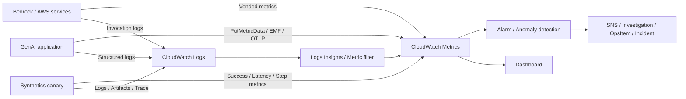

# Amazon CloudWatch、Amazon CloudWatch Logs、Amazon CloudWatch Synthetics

最終確認日: 2026-09-23

| 項目 | 内容 |
|---|---|
| 重要度 | A: 中核 |
| 対象サービス／機能 | Amazon CloudWatch、Amazon CloudWatch Logs、Amazon CloudWatch Synthetics |
| 対応Task・Skills | Domain 1 Task 1.3（Skill 1.3.1）、Task 1.6（Skills 1.6.3〜1.6.4）のCloudWatch担当部分。Domain 3 Task 3.2〜3.4、Domain 4 Task 4.1〜4.3、Domain 5 Task 5.2の監視・監査・障害調査部分 |
| このページで分かること | GenAIアプリケーションのMetric、Log、Synthetic testをCloudWatchで収集・分析・通知する流れを、Amazon Bedrockの観測経路と結び付けて整理する。AWSが自動発行する運用Metricと、利用者が評価・発行する品質、Cost、Business KPIの管理境界も区別する。 |

## 全体像

Amazon CloudWatchは、AWS ResourceとAWS上のApplicationをリアルタイムに監視し、Metric、Alarm、Dashboard、Log、Application performance monitoring（APM）などを提供する。Amazon CloudWatch LogsはLog eventを収集、保持、検索し、Amazon CloudWatch SyntheticsはCanary scriptを定期実行してEndpointやAPIを能動的に検査する。これらは別々の入力を扱うが、Dashboard、Alarm、Logs Insights、Application Signalsなどで関連付けて利用できる。

AWSはCloudWatchの収集・保存・Query・Alarm評価基盤と、各AWSサービスが公開する標準Metricを管理する。利用者は、収集対象、NamespaceとDimension、Log内容と保持期間、Alarm条件、Canary script、Access権限、機密情報の除去、品質・事業指標の定義、対応手順を管理する。CloudWatchはFM応答の正確性、Hallucination、Promptの有効性、Business valueを本文から自動判定する汎用評価器ではない。

図の要点は、Serviceが発行するMetric、Applicationが発行するCustom metric、詳細調査用Log、外形監視用Canaryを同じものとして扱わないことである。Metricは時系列の集計とAlarm、LogはRequest単位の証拠とQuery、Canaryは実利用者のTrafficがなくてもEndpointを検査する入力になる。

## 1. Metric、Namespace、Dimension

CloudWatch Metricは時刻順のData pointである。CloudWatch Metrics（Classic）では、Metric name、Namespace、0個以上のDimensionの組み合わせが一つのMetricを識別する。AWSサービスのNamespaceは通常`AWS/<service>`形式で、Amazon Bedrock Runtimeは`AWS/Bedrock`を使用する。Custom metricは`PutMetricData`、Embedded Metric Format（EMF）、CloudWatch Agent、またはOpenTelemetry経路などから発行できる。

| 入力 | CloudWatchの処理 | 出力 | 利用者が管理する範囲 | 代表的な連携 |
|---|---|---|---|---|
| AWSサービスが発行するData point | Service定義のNamespace、Metric、Dimensionで時系列化 | Statistics、Percentile、Metric mathの結果 | 対象Region、Period、Statistic、欠損値の扱い | Bedrock、Lambda、API Gateway、S3、OpenSearch Service |
| `PutMetricData`のCustom data | 利用者指定のNamespaceとDimensionで保存 | Application固有Metric | Metric定義、Unit、Timestamp、Cardinality、発行頻度 | Lambda、Container、Business system |
| EMFに従うStructured log | CloudWatch LogsがLogからCustom metricを抽出 | 元LogとMetric | EMF schema、Dimension、重複を許容する集計 | CloudWatch Logs、Alarm、Dashboard |
| OTLP Metric | OpenTelemetryのLabelを持つMetricとして取り込み | PromQL等でQuery可能な時系列 | Instrumentation、Collector／Endpoint、Label cardinality | Application Signals、ADOT |

Dimensionの一意な組み合わせごとに別Metricが作られる。`requestId`、User ID、Prompt本文のような高Cardinality値をDimensionにすると、Metric数と料金が増え、機密情報も露出し得る。Request単位の識別子は原則としてLogやTrace側で扱い、MetricにはModel、Environment、Prompt versionなど集計に必要な低Cardinalityの属性を使う。

Metricは作成したRegionに存在し、Regionを越えて自動集計されない。CloudWatch Metrics（Classic）の保持期間と解像度は時間経過に伴い集約されるため、短い障害を後から調べる要件では、元LogやTraceの保持も別に設計する。

## 2. Alarm、Composite alarm、Anomaly detection

Metric alarmは、一つのMetricまたはMetric math式を、Threshold、Period、Evaluation period、Datapoints to alarmなどの条件で評価し、`OK`、`ALARM`、`INSUFFICIENT_DATA`の状態を持つ。状態変化によりAmazon SNS通知や対応する自動Actionを起動できる。欠損DataをBreaching、Not breaching、Ignore、Missingのどれとして扱うかは利用者の設定である。

Composite alarmは、複数のMetric alarmまたはComposite alarmの状態をRule式で組み合わせる。複数条件が同時に成立したときだけ通知するなど、Alarm noiseを抑える用途がある。Composite alarmはSNS通知、Investigation、Systems Manager OpsItem、Incidentを開始できるが、EC2 actionやAuto Scaling actionは実行できない。

Anomaly detectionはMetricの過去Dataから期待範囲のBandを作り、その範囲外をAlarm条件に利用する。固定Thresholdを置き換える機能ではあるが、Token burst、Latency、Error率、品質Scoreなどの変化が業務上の異常かどうかを自動で説明するものではない。Training対象のMetric、Sensitivity、除外期間、季節性、Alarm actionは利用者が管理する。

## 3. Log group、Log stream、Retention

CloudWatch LogsはLog eventをLog groupとLog streamへ整理する。Log groupはRetention、KMS key、Data protection policy、Resource policyなどの管理単位であり、Log streamは通常、同じSourceから届く一連のEventを表す。Log eventはTimestampとMessageを持つ。

| 項目 | 入力と処理 | 出力 | 管理境界・連携 |
|---|---|---|---|
| Log ingestion | AWS service、CloudWatch Agent、`PutLogEvents`、Subscription等からEventを受信 | Log group内のLog event | 利用者はSource、構造、IAM、重複・順序を考慮する |
| Retention | Log groupごとに無期限または対応する保持期間を設定 | 期限内の検索可能なLog | 既定は無期限。法令、調査期間、Cost、削除要件に合わせて利用者が設定する |
| Metric filter／Log alarm | Log eventのPattern、Field、Thresholdを評価 | MetricまたはAlarm state | Error codeやPolicy violationを数値化する。本文の意味評価とは区別する |
| Subscription filter | 合致するLog eventを継続的に転送 | Lambda、Firehose、Kinesis等へのStream | Destination権限、Backpressure、失敗、転送先の保持を管理する |

Prompt、Retrieved context、FM Response、Tool引数にはPII、Credential、Tenant dataが含まれ得る。必要性を確認せず全文をLogへ残さず、Correlation ID、Model ID、Prompt version、Token数、Latency、Error、評価結果など、調査に必要なMetadataと本文を分離する。

## 4. CloudWatch Logs Insights

CloudWatch Logs Insightsは、選択したLog groupと時間範囲をQueryして、Filter、Aggregation、Sort、Pattern分析などを行う。Logs Insights QL、OpenSearch PPL、OpenSearch SQLを利用できる。JSON形式のApplication logや一部AWSサービスLogではFieldが自動検出される。Queryは保存、再実行、Dashboardへの追加ができる。

主な入力はLog group、時間範囲、Query文であり、出力は一致Eventまたは集計結果である。Prompt version別のError、Model別のLatency、Request IDによる前後Event、Invocation logのToken usageなどを調べられる。ただしQuery結果は元Logの内容と保持期間に依存し、作成前のLog groupより古いTimestampを持つEventにはアクセスできない。

Field indexは、指定Fieldを持たないEventのScanを避け、対象Queryの処理量と時間を減らせる。Logs Insightsの料金は主にScan対象Data量に関係するため、時間範囲、Log group、Field filter、Indexを利用者が管理する。

## 5. Dashboard

CloudWatch Dashboardは、Metric、Log query、AlarmなどのWidgetを一つの画面へ配置する。Console、AWS CLI、`PutDashboard` APIから作成でき、Cross-account／Cross-RegionのMetricやLogも構成に応じて表示できる。

GenAI Applicationでは、次の異なる層を同じDashboardで並べられるが、Sourceは区別する。

- Service運用: Request数、Latency、Error、Throttle、Availability
- FM利用: Input／Output Token、Time to first token、Cache read／write Token
- Application品質: 形式遵守率、Groundedness、Hallucination評価、User feedback
- Retrieval／Tool: Search latency、Result件数、Index freshness、Tool error
- Cost／Business: Request当たり推定Cost、Cache hit率、Task completion、Conversionなど

Dashboardは表示と探索の面を提供する。品質ScoreやBusiness KPIを算出する処理、Metricへ発行する処理、Alert後の対応責任は利用者側に残る。

## 6. CloudWatch Synthetics Canary

CloudWatch Syntheticsは、Canaryと呼ばれるScriptを一度またはScheduleで実行し、EndpointやAPIの可用性とPerformanceを能動的に確認する。Canaryは利用者が定義した処理をAWS Lambda上で実行し、既定で`CloudWatchSynthetics` NamespaceへMetricを発行する。`CanaryName`がDimensionになり、Step function libraryを使う場合は`StepName`も利用できる。

| 入力 | 処理 | 出力 | 利用者が管理する範囲 | 代表的な連携 |
|---|---|---|---|---|
| Canary script、Runtime version、Schedule、Environment設定 | BrowserまたはHTTPの利用者操作を模擬 | Success、Duration等のMetric、Log、Screenshot／Artifact | Test data、Secret、Timeout、Runtime更新、Artifact保持 | CloudWatch Alarm、S3、X-Ray |
| GenAI APIのSynthetic request | 認証、Request送信、Responseの技術的検証 | Status、Latency、Schema検証結果 | 低RiskなTest prompt、Rate、Token上限、出力検証、Cost | API Gateway、Lambda、Bedrock Runtime |

CanaryはEndpoint到達性、認証、HTTP status、Latency、Response schemaなどを継続検査できる。意味的な正確性やHallucination率を検査する場合は、利用者がReference、Evaluator、ThresholdをScriptまたは別の評価Pipelineへ実装する。CanaryのActive tracingを有効にするとX-Ray TraceとApplication SignalsのApplication mapへ関連付けられる。

Runtime version、Region、PrivateLink／X-Ray対応条件は変わり得る。2026-09-23時点の公式概要ではCanaryは最短1分間隔で実行でき、Commercial RegionとGovCloud Regionで提供されるが、一部RegionではPrivateLinkまたはX-Rayが未対応である。実装時は対象RegionとRuntimeのSupport policyを確認する。

## 7. Embedded Metric FormatとApplication Signals

### Embedded Metric Format（EMF）

EMFは、ApplicationのLog eventにCloudWatch向けMetric metadataを埋め込むJSON形式である。CloudWatch Logsへ`PutLogEvents`またはCloudWatch Agentで送ると、元Logを保持しながらCustom metricを抽出できる。`logs:PutLogEvents`権限が必要で、抽出だけのために`cloudwatch:PutMetricData`権限を追加する必要はない。

EMFから抽出されるMetricは少なくとも1回配信であり、重複する場合がある。CountやCost集計で厳密な一意性が必要なら、Request IDをDimensionにしてMetricを増やすのではなく、元Log側で重複排除可能なIDを保持する。

### Application Signals

CloudWatch Application Signalsは、Application serviceのRequest volume、Availability、Latency、Error／FaultなどをService、Operation、Dependency単位で観測し、Service map、Dashboard、Service Level Objective（SLO）へ関連付けるAPM機能である。CloudWatch AgentとAWS Distro for OpenTelemetry（ADOT）等のInstrumentationからMetricとTraceを受け取る。

Application SignalsをAccountで有効にするとService-linked roleが作られ、X-Ray service graph、Logs query、CloudWatch Metric、Tagなどを読み取る。2026-09-23時点の公式Support matrixではAmazon EKS、Native Kubernetes、Amazon ECS、Amazon EC2でSupport／Testされ、Language、Runtime、Frameworkごとの条件がある。対応条件は固定せず公式表を確認する。

Application Signalsが自動化するのはApplicationのGolden signalsに相当する運用観測である。FM ResponseのRelevance、Fairness、Groundedness、Prompt effectiveness、Task completionなどは、評価処理の結果をCustom metricまたはStructured logとして利用者が発行する。

## 8. Amazon Bedrock Runtime MetricとModel Invocation Logging

Amazon Bedrockの`bedrock-runtime` Endpointは、`AWS/Bedrock` NamespaceへRuntime Metricを発行する。2026-09-23時点の公式表には、`Invocations`、`InvocationLatency`、`InvocationClientErrors`、`InvocationServerErrors`、`InvocationThrottles`、`InputTokenCount`、`OutputTokenCount`、`TimeToFirstToken`、`EstimatedTPMQuotaUsage`、Prompt cacheのRead／Write Tokenなどがある。主なDimensionは`ModelId`である。

`EstimatedTPMQuotaUsage`は概算値であり、Throttle判定に使われる予約Token消費をそのまま示すものではないため、Capacity planningの唯一の根拠にしない。BedrockはModel Invocation LoggingのCloudWatch Logs／S3配信成功・失敗Metricも`AWS/Bedrock`に発行する。

Model Invocation Loggingは、対応する推論呼び出しのRequest、Response、Metadataを同一Account・同一RegionのCloudWatch LogsまたはAmazon S3へ出力するOpt-in機能で、既定では無効である。2026-09-23時点では`bedrock-runtime` Endpointの`Converse`、`ConverseStream`、`InvokeModel`、`InvokeModelWithResponseStream`を対象とし、同EndpointのOpenAI互換Responses／Chat Completionsも含む。`bedrock-mantle`など別Endpointの呼び出しは対象外である。

Invocation logはPromptやResponse本文を含み得る。利用者は、Log delivery用IAM role、Log group／S3 bucket、KMS key、記録するData type、Retention、Access、Maskingを管理する。CloudTrailが記録するAPI操作主体・時刻・Resourceの監査Eventと、Invocation Loggingの推論内容を混同しない。

## 9. Quality、Token、Cost、Business KPIの責任境界

| 指標群 | AWSまたは連携Serviceが発行するもの | 利用者が定義・発行するもの |
|---|---|---|
| Availability／Performance | BedrockのInvocation、Latency、Client／Server error、Throttle、TTFT。SyntheticsのSuccess／Duration。Application SignalsのRequest、Latency、Error等 | End-to-end SLO、Fallback成功率、Component別Latency、許容Threshold |
| Token／Capacity | BedrockのInput／Output Token、Cache Token、概算TPM使用量 | Request／Tenant／Prompt version別集計、Token budget、Capacity判定 |
| Quality／Safety | Bedrock GuardrailsやEvaluationなど、各機能が明示的に返すAssessment／Metric | Hallucination率、Groundedness、形式遵守率、Prompt regression、Fairness、Human feedback。EvaluatorとDatasetも利用者が管理 |
| Cost | CloudWatch usage、Bedrock usageなど各Serviceの課金対象Data | Token数と価格表等からの推定Cost、Request／Task／Tenant別配賦、Budgetとの関連付け |
| Business | CloudWatchがApplicationから受け取ったCustom metricを保存・集計 | Task completion、Deflection、Conversion、処理時間短縮などの意味、計測Event、分母、Owner |

AIP-C01試験ガイドはCloudWatchによるPrompt regression、Token usage、Hallucination rate、Response quality、Confidence、Fairnessなどの観測例を示す。これはCloudWatchがFM出力本文からそれらを一律に自動算出するという意味ではない。明示的なAWS機能がMetricを発行しない指標は、Applicationまたは評価Pipelineが算出し、Custom metricやLogとしてCloudWatchへ渡す。

## 10. Security、Data protection、Access control、料金要因

### IAM、暗号化、Network

- Metricの読み書き、Alarm、Dashboard、Log group、Query、Data protection、Canaryには別々のIAM actionがある。発行Role、閲覧Role、運用Role、`logs:Unmask`を分離する。
- CloudWatch LogsのDataは転送中と保存時に暗号化される。Log groupへCustomer managed AWS KMS keyを関連付ける場合はKey policyとLifecycleも利用者が管理する。
- CloudWatch LogsのInterface VPC endpointを利用できる。Private接続だけで、ApplicationからBedrock、S3、KMS、SNSなど連携先への経路が自動で用意されるわけではない。
- Synthetics CanaryのExecution role、VPC、Secret取得、S3 Artifact、KMS keyを最小権限にする。Canary scriptやEnvironment variableへCredentialを埋め込まない。

### Data protectionとRedaction

CloudWatch LogsのData protection policyはManaged／Custom data identifierで新たに取り込むSensitive dataを検出し、AuditとMaskingを行う。MaskingはLogs Insights、Metric filter、Subscription filterを含むEgressに既定で適用され、`logs:Unmask`権限を持つ主体だけが非Mask表示できる。

Policyを設定する前に取り込まれたEventは遡ってMaskされない。また、Pattern／Machine learningによる検出にはFalse positive／negativeがあり得る。したがって、PromptやResponseをLogへ送る前のApplication側Redaction、最小限のLogging、CloudWatch Logs側Data protectionを別のControlとして扱う。

### Availability、Scaling、Quota

CloudWatchはManaged serviceとして収集、保存、Query、Alarm評価をScalingするが、Application側ではAPI rate、Log ingestion、Query concurrency、Alarm数、Dashboard数、Canary数などのQuotaを確認する。QuotaはRegion、Account、APIごとに異なり、引上げ可能かどうかも項目ごとに異なる。固定値を暗記せず、Service Quotas Console、CloudWatch Service Quotas、CloudWatch Logs endpoints and quotasで実装Regionの値を確認する。

監視経路自体の障害も考慮する。Log delivery failure、Missing data、Canary未実行、Alarm action先の不備を別のSignalで監視する。CloudWatchは設定されたAlarm actionが存在するか、通知先で処理に成功したかを自動検証しない。

### 料金要因

2026-09-23時点で料金に影響する主な要因は次のとおりである。単価とFree TierはRegionおよび料金表の更新により変わり得るため、実装時に公式料金ページを確認する。

- Custom metric数。Dimensionの一意な組み合わせと発行時間がMetric数へ影響する
- `PutMetricData`、Metric query、Alarm、Dashboard、Metric streamなどの利用量
- CloudWatch LogsのIngestion量、Storage量、Log class、Data protection scan量、Logs InsightsのScan量、Live Tail等
- SyntheticsのCanary run数、Artifact storage、Alarm、Traceなどの連携利用量
- Application SignalsのSignal数、SLO、Transaction span／X-Ray Traceなどの構成
- Cross-account observabilityで複製・集約するTelemetry、および連携するS3、KMS、SNS、Firehose等の料金

EMFはLog ingestion／Archivalと抽出されたCustom metricの両方が料金要因になる。高Cardinality Dimension、不要なInvocation本文、長すぎるRetention、広いLogs Insights Query範囲は、機能面だけでなくCost面でも管理対象である。

## API、Event、Dataの入出力

| 面 | 主なAPI／Resource | 入力 | 出力 |
|---|---|---|---|
| Metric Data plane | `PutMetricData`、`GetMetricData`、`GetMetricStatistics`、`ListMetrics` | Namespace、Metric、Dimension、Value／StatisticSet、Timestamp | Time series、Statistic、Metric metadata |
| Alarm Control plane | `PutMetricAlarm`、`PutCompositeAlarm`、`DescribeAlarms` | Metric／Math、Threshold／Anomaly band、Evaluation条件、Action | Alarm resource、State、History、Action event |
| Logs Data plane | `PutLogEvents`、`StartQuery`、`GetQueryResults`、Subscription | Log group／Stream、Timestamp、Message、Query | Log event、Query result、Streaming event |
| Dashboard Control plane | `PutDashboard`、`GetDashboard` | Dashboard body、Widget、Account／Region | Dashboard definitionと可視化 |
| Synthetics Control plane／実行 | Canary作成・更新・開始API、Script、Schedule | Runtime、Code、Role、Artifact location、VPC | Run state、Metric、Log、Artifact、Trace |
| Bedrock連携 | Runtime Metric、Model Invocation Logging | Invocation metadata、任意のRequest／Response本文 | `AWS/Bedrock` Metric、CloudWatch Logs／S3のInvocation log |

## AIP-C01との対応

| Task・Skills | このサービスが担う役割 | 関連ページ |
|---|---|---|
| Task 1.3 / Skill 1.3.1 | Data validation Pipelineの合格率、失敗数、処理LatencyなどをMetric化し、不合格理由をLogで追跡する | [literal](../literal-pages/01-03-data-validation-and-processing.md) / [supplimental](../supplimental-pages/01-03-data-validation-and-processing.md) |
| Task 1.6 / Skills 1.6.3〜1.6.4 | Prompt access log、Version別評価Metric、Regression test結果、AlarmをPrompt governanceのEvidenceへ接続する | [literal](../literal-pages/01-06-prompt-engineering-and-governance.md) / [supplimental](../supplimental-pages/01-06-prompt-engineering-and-governance.md) |
| Task 3.2 / Skills 3.2.1〜3.2.3 | Data accessを監視し、LogのIAM、KMS、Retention、Masking／Unmask権限で機密情報を保護する | [literal目次](../literal-pages/README.md#第3部-ai-safetysecuritygovernance) / [supplimental目次](../supplimental-pages/README.md#第3部-ai-safetysecuritygovernance) |
| Task 3.3 / Skills 3.3.1、3.3.4 | Decision logとPolicy violationを保持・Queryし、継続監視、Alert、Remediation workflowへ接続する | [literal目次](../literal-pages/README.md#第3部-ai-safetysecuritygovernance) / [supplimental目次](../supplimental-pages/README.md#第3部-ai-safetysecuritygovernance) |
| Task 3.4 / Skills 3.4.1〜3.4.2 | Confidence、Uncertainty、Fairness評価結果をCustom metric／Logとして収集し、Group別に可視化する | [literal目次](../literal-pages/README.md#第3部-ai-safetysecuritygovernance) / [supplimental目次](../supplimental-pages/README.md#第3部-ai-safetysecuritygovernance) |
| Task 4.1 / Skills 4.1.1〜4.1.4 | Token、Cache、Throughput、利用量を観測し、Cost／Resource efficiencyの分析に必要なSignalを提供する | [literal目次](../literal-pages/README.md#第4部-運用効率と最適化) / [supplimental目次](../supplimental-pages/README.md#第4部-運用効率と最適化) |
| Task 4.2 / Skills 4.2.1〜4.2.6 | End-to-end／Component別Latency、TTFT、Throughput、Retrieval／Tool性能をMetric、Log、Traceで関連付ける | [literal目次](../literal-pages/README.md#第4部-運用効率と最適化) / [supplimental目次](../supplimental-pages/README.md#第4部-運用効率と最適化) |
| Task 4.3 / Skills 4.3.1〜4.3.6 | Metric、Log、Trace、Dashboard、Alarm、Syntheticsを使い、FM、Tool、Vector Store、品質、Business impactの観測面を構成する | [literal目次](../literal-pages/README.md#第4部-運用効率と最適化) / [supplimental目次](../supplimental-pages/README.md#第4部-運用効率と最適化) |
| Task 5.2 / Skills 5.2.1〜5.2.5 | Request／Response metadata、Error、Latency、Token、Prompt version、Retrieval／Tool log、Synthetic resultから障害箇所を絞る | [literal目次](../literal-pages/README.md#第5部-テスト検証トラブルシューティング) / [supplimental目次](../supplimental-pages/README.md#第5部-テスト検証トラブルシューティング) |

## 重要な制約と確認事項

- Bedrock Runtime Metric名、Dimension、Invocation log schema、対象Endpoint／APIは変わり得る。`bedrock-runtime`と`bedrock-mantle`の資料を分けて確認する。
- Application Signalsの対応Platform、Language、Runtime、Framework、Instrumentation条件は変わり得る。Application Signalsを有効にしただけで未InstrumentのApplicationから全Signalが得られるとは限らない。
- CloudWatch LogsのData protection policyは過去Eventへ遡及せず、Application側の入力時Redactionを代替しない。
- SyntheticsのRuntime version、Region、PrivateLink、X-Rayの対応は変わり得る。廃止予定RuntimeとCanaryの更新状態を確認する。
- Metric、Alarm、Dashboard、Logs、Logs Insights、Synthetics、Application Signals、X-Rayは課金単位が異なる。高CardinalityとTelemetry量を実装前に見積もる。
- Domain 3、4、5のliteral／supplimental本文は2026-09-23時点では作成予定であり、本ページからは各目次へリンクしている。

## 用語

| 用語 | このページでの意味 |
|---|---|
| Namespace | CloudWatch Metrics（Classic）でMetricを分離するContainer |
| Dimension | Metricを識別・FilterするName／Value。組み合わせごとに別Metricになる |
| Metric alarm | MetricまたはMath式を条件と比較して状態を持つAlarm |
| Composite alarm | 他のAlarm状態をRule式でまとめるAlarm |
| Log group | Retention、KMS、Data protection等を設定するLogの管理単位 |
| Log stream | 同じSourceから届く一連のLog event |
| Canary | Scheduleに基づきEndpointや利用者操作を模擬するSynthetics script |
| EMF | Structured logからCustom metricを抽出するEmbedded Metric Format |
| Application Signals | Application serviceのRequest、Latency、Error、Dependency、SLOを関連付けるCloudWatch APM機能 |
| Vended metric | AWSサービスが利用者に代わってCloudWatchへ発行するMetric |

## 公式資料

- [AIP-C01 Content Domain 1](https://docs.aws.amazon.com/aws-certification/latest/ai-professional-01/ai-professional-01-domain1.html) — Skill 1.3.1、1.6.3、1.6.4のCloudWatch担当部分
- [AIP-C01 Content Domain 3](https://docs.aws.amazon.com/aws-certification/latest/ai-professional-01/ai-professional-01-domain3.html) — Data access monitoring、Decision log、継続監視、Confidence／Fairness metric
- [AIP-C01 Content Domain 4](https://docs.aws.amazon.com/aws-certification/latest/ai-professional-01/ai-professional-01-domain4.html) — Cost、Performance、GenAI monitoringのSkills 4.1.1〜4.3.6
- [AIP-C01 Content Domain 5](https://docs.aws.amazon.com/aws-certification/latest/ai-professional-01/ai-professional-01-domain5.html) — Task 5.2のError logging、Prompt observability、Troubleshooting
- [What is Amazon CloudWatch?](https://docs.aws.amazon.com/AmazonCloudWatch/latest/monitoring/WhatIsCloudWatch.html) — Metric、Alarm、Dashboard、APM、Logの全体像
- [Metrics concepts](https://docs.aws.amazon.com/AmazonCloudWatch/latest/monitoring/cloudwatch_concepts.html) — Namespace、Metric、Dimension、Resolution、Retention
- [CloudWatch OpenTelemetry Metrics](https://docs.aws.amazon.com/AmazonCloudWatch/latest/monitoring/metrics-otel-overview.html) — OTLPによるMetric取り込み、PromQL Query、Classic Metricとの境界
- [Using Amazon CloudWatch alarms](https://docs.aws.amazon.com/AmazonCloudWatch/latest/monitoring/AlarmThatSendsEmail.html) — Metric alarm、Composite alarm、State、Action
- [Using CloudWatch anomaly detection](https://docs.aws.amazon.com/AmazonCloudWatch/latest/monitoring/CloudWatch_Anomaly_Detection.html) — Anomaly detection modelとBand
- [What is Amazon CloudWatch Logs?](https://docs.aws.amazon.com/AmazonCloudWatch/latest/logs/WhatIsCloudWatchLogs.html) — Log収集、監視、Retention、Data protection
- [Analyzing log data with CloudWatch Logs Insights](https://docs.aws.amazon.com/AmazonCloudWatch/latest/logs/AnalyzingLogData.html) — Query、Field discovery、Field index、Dashboard連携
- [Using Amazon CloudWatch dashboards](https://docs.aws.amazon.com/AmazonCloudWatch/latest/monitoring/CloudWatch_Dashboards.html) — Dashboard API、Widget、Cross-account／Cross-Region表示
- [Synthetic monitoring](https://docs.aws.amazon.com/AmazonCloudWatch/latest/monitoring/CloudWatch_Synthetics_Canaries.html) — Canary、Schedule、Metric、X-Ray／Application Signals連携
- [Embedding metrics within logs](https://docs.aws.amazon.com/AmazonCloudWatch/latest/monitoring/CloudWatch_Embedded_Metric_Format.html) — EMF、権限、少なくとも1回配信、Cardinality
- [Application Signals](https://docs.aws.amazon.com/AmazonCloudWatch/latest/monitoring/CloudWatch-Application-Signals.html) — Application service、Dependency、SLOの観測
- [Application Signals supported systems](https://docs.aws.amazon.com/AmazonCloudWatch/latest/monitoring/CloudWatch-Application-Signals-supportmatrix.html) — Platform、Language、Runtime条件
- [Monitor the bedrock-runtime endpoint](https://docs.aws.amazon.com/bedrock/latest/userguide/monitoring.html) — Bedrock RuntimeのMetric、CloudTrail、Invocation logging
- [Monitor bedrock-runtime inference using CloudWatch metrics](https://docs.aws.amazon.com/bedrock/latest/userguide/monitoring-runtime-metrics.html) — `AWS/Bedrock` Namespace、Runtime／Delivery Metric
- [Monitor model invocation using CloudWatch Logs and Amazon S3](https://docs.aws.amazon.com/bedrock/latest/userguide/model-invocation-logging.html) — 対象API、出力先、IAM、Log schema
- [Help protect sensitive log data with masking](https://docs.aws.amazon.com/AmazonCloudWatch/latest/logs/mask-sensitive-log-data.html) — Data protection policy、Masking、`logs:Unmask`、非遡及
- [Amazon CloudWatch Logs endpoints and quotas](https://docs.aws.amazon.com/general/latest/gr/cwl_region.html) — Region EndpointとQuota確認先
- [Amazon CloudWatch pricing](https://aws.amazon.com/cloudwatch/pricing/) — Metric、Log、Alarm、Synthetics、Application Signals等の料金要因

## 関連ページ

- [サービス別目次](README.md)
- [Amazon BedrockとAmazon Titan](01-01-amazon-bedrock.md)
- [Task 1.3 literal](../literal-pages/01-03-data-validation-and-processing.md) / [Task 1.3 supplimental](../supplimental-pages/01-03-data-validation-and-processing.md)
- [Task 1.6 literal](../literal-pages/01-06-prompt-engineering-and-governance.md) / [Task 1.6 supplimental](../supplimental-pages/01-06-prompt-engineering-and-governance.md)
- [Domain 3 literal目次](../literal-pages/README.md#第3部-ai-safetysecuritygovernance) / [Domain 3 supplimental目次](../supplimental-pages/README.md#第3部-ai-safetysecuritygovernance)
- [Domain 4 literal目次](../literal-pages/README.md#第4部-運用効率と最適化) / [Domain 4 supplimental目次](../supplimental-pages/README.md#第4部-運用効率と最適化)
- [Domain 5 literal目次](../literal-pages/README.md#第5部-テスト検証トラブルシューティング) / [Domain 5 supplimental目次](../supplimental-pages/README.md#第5部-テスト検証トラブルシューティング)
