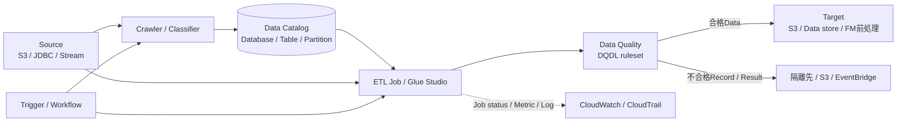

# AWS Glue

最終確認日: 2026-09-23

| 項目 | 内容 |
|---|---|
| 重要度 | A: 中核 |
| 対象サービス／機能 | AWS Glue |
| 対応Task・Skills | 主軸: Task 1.3 / Skills 1.3.1〜1.3.4。接点: Task 3.2 / Skills 3.2.1〜3.2.3、Task 3.3 / Skills 3.3.1〜3.3.2 |
| このページで分かること | AWS Glueを、Data Catalog、Crawler、ETL、Data Quality、Schema Registry、lineageから成るServerless data integration serviceとして整理する。FM入力用の表形式データを発見・変換・検証する流れと、AWS／利用者の管理境界、Security、可観測性、料金要因を追える。 |

## 全体像と管理境界

AWS Glueは、複数のSourceからデータを発見し、準備し、移動し、統合するServerless data integration serviceである。AIP-C01では、FMへ渡すTabular dataのSchemaとLocationをData Catalogへ登録し、ETL Jobで変換し、Data Qualityで品質規則を評価する役割がTask 1.3の中心になる。Task 3.2ではデータへの権限・暗号化・Network境界、Task 3.3ではData lineageとSource metadataの接点を扱う。

AWSはGlueのControl plane、Serverless ETL実行基盤、Data Catalogのサービス基盤、設定に従うScalingと可用性を管理する。利用者はSource／Target、Database／Table metadata、CrawlerとClassifier、Job code／Glue version／Worker、DQDL ruleset、Trigger／Workflow、IAM role、Lake Formation権限、KMS key、VPC connection、Log、Quota、費用を管理する。Glueは元データの業務上の正しさ、PIIの利用可否、FM用Payload、生成結果の根拠表示を自動では決定しない。

図の要点は、Data Catalogが実データではなくLocationやSchema等のMetadataを保持し、JobがSource dataを読み書きし、Data Qualityが定義された規則の結果を返すことである。Data Catalog tableが存在するだけでは、実データの品質、最新性、FMへの適合性は保証されない。

## 1. Data Catalog、Database、Table

AWS Glue Data CatalogはDatasetのMetadataを一元管理するRepositoryである。DatabaseはTableをまとめるContainerで、TableはData storeのLocation、Schema、Partition、Properties等を表すMetadataである。実際のObjectやDatabase recordはAmazon S3、JDBC接続先等に残る。

| 入力 | Glueの処理・保持状態 | 出力・連携先 | 利用者が管理する範囲 |
|---|---|---|---|
| 手動定義またはCrawlerが抽出したLocation、Schema、Partition、Property | Database、Table、Table version、Partition等のMetadataを保持 | Glue ETL、Amazon Athena、Amazon EMR、Amazon Redshift Spectrum、Amazon SageMaker AI、Lake Formationが参照 | 命名、Schema、Location、更新方針、権限、実データとの整合 |
| Column statisticsの生成要求 | 対応形式の列統計を計算・登録 | Query最適化やData profileのための統計 | 対象列、更新頻度、実行費用、統計の鮮度 |

AWS Lake FormationはData Catalog Resourceに対するきめ細かなAccess controlを提供する認可Layerである。IAMがGlue APIやRole利用を許可していても、Lake Formation管理TableのData accessには別の許可が必要になり得る。

## 2. CrawlerとClassifier

CrawlerはData sourceを調査し、TableまたはPartitionへGroupingし、推論したMetadataをData Catalogへ作成・更新する。Crawlerは指定順のCustom classifierを先に評価し、最初にData構造を認識したClassifierのSchemaを使用する。どのCustom classifierも一致しない場合は、JSON、CSV、Apache Avro等に対応するBuilt-in classifierが評価される。

Custom classifierでは、CSVのDelimiter／Header／Data type、JSONPath、XMLのRow tag、Grok pattern等を定義できる。入力はSource location、Connection、IAM role、Classifier、Schedule、Catalog update behaviorである。出力はDatabase内のTable／Partition metadataとClassificationであり、変換済みDataや品質合格結果ではない。

利用者はCrawlerがSourceを読む権限、Connection、Schema changeの扱い、削除されたObjectに対するCatalog更新方針を管理する。推論された型やTable groupingは用途上のData contractと一致するとは限らないため、Crawler結果とData Quality評価を同一視しない。

## 3. ETL Job、Trigger、Workflow

JobはSourceへ接続し、ScriptでExtract／Transform／Loadを実行し、Targetへ書き出す実行単位である。Spark、Spark Streaming、Python shell等はJob typeごとにRuntimeと性質が異なる。Job propertyにはIAM role、Glue version、Worker type／数、ScriptのS3 path、Job bookmark、Retry、Timeout、Security configuration、Connection、引数等が含まれる。

TriggerはJobまたはCrawlerを開始する。Scheduled、Conditional、On-demandの3種類があり、Conditional triggerは前段Job／Crawlerの状態を条件にする。依存Chainでは、前段もTriggerから開始されている必要がある。Workflowは複数のCrawler、Job、Triggerの実行、依存関係、進捗、Statusをまとめ、ConsoleではGraphとして表示する。WorkflowのStart triggerはSchedule、On demand、EventBridge eventを扱う。

| 構成要素 | 入力 | 処理・状態 | 出力・連携先 | 利用者の管理 |
|---|---|---|---|---|
| Job | Source data、Catalog table、Script、Argument | 変換、Bookmark、Run status、Retry | Target data、Job run result、Metric／Log | Code、Runtime version、Worker、Timeout、冪等性、Target |
| Trigger | Schedule、要求、前段Status | 発火状態とJob／Crawler開始 | Job／Crawler run | 条件、引数、依存Chain、再実行 |
| Workflow | Job、Crawler、Trigger、Run property | Component間の実行と進捗 | Workflow graph、Run status | 並列性、失敗時の扱い、共有Property、Quota |

Job bookmarkは処理済みDataに関する状態を保持し、増分処理を支援する。Bookmarkを有効にしても、Targetへの書込みや外部Side effectの冪等性が自動で保証されるわけではない。

## 4. AWS Glue Studio

AWS Glue StudioはETL Jobを作成、実行、監視するVisual interfaceである。Visual editorではSource、Transform、TargetをNodeとして接続し、GlueがPySpark Scriptを生成する。生成Scriptは出発点として編集でき、既存Scriptを使うJobも管理できる。JobはGlueのApache SparkベースのServerless ETL engineで実行される。

入力はSource／Target、Schema、Visual node、Transform設定、Job propertyである。出力はJob definition、生成または編集したScript、Job runとMonitoring情報である。StudioはAuthoring／Monitoring interfaceであり、Studio自体が独立したData storeではない。Visual nodeが生成する処理内容と、生成後に編集したCodeのVersion、Test、Reviewは利用者が管理する。

## 5. Data QualityとRuleset

AWS Glue Data Qualityは、Data Quality Definition Language（DQDL）で記述したRuleをDatasetへ評価するManaged／Serverless機能である。Ruleは個別にBoolean結果を返し、Data Quality scoreは合格したRuleの割合である。平均Scoreだけで必須Ruleの失敗を上書きせず、処理継続条件は利用者が定義する。

| 入口 | 入力 | 処理・出力 | 主な接続点 |
|---|---|---|---|
| Data Catalog | Catalog table、Ruleset、Evaluation／Recommendation設定 | Catalog済みDataを評価し、Rule result、Score、Statisticsを返す。Rule recommendationを利用できる | Console／API、Amazon S3、Amazon EventBridge、Amazon CloudWatch |
| ETL Job | Job内を流れるDataFrame、DQDL Rule、Action／Output設定 | Load前に能動的に評価し、不合格Recordを特定してFilter／隔離できる | Glue Studio／Script／Interactive session、S3、EventBridge、CloudWatch |

RulesetはRule集合を持つGlue Resourceで、Data Catalog tableと関連付ける。2026-09-23時点の公式資料では、Data Catalog経路とETL経路でRecommendation、Auto Scaling、失敗Recordの特定等の対応が異なる。Nested型またはList型はそのまま評価できず、事前にFlattenが必要である。Rule type、Recommendation mode、対応Source、Glue version、Quotaは更新され得るため、実装時にData Quality overviewとRelease notesを再確認する。

## 6. Schema Registry

AWS Glue Schema RegistryはStreaming recordのSchemaを一元的に発見、制御、Version管理するServerless Registryである。RegistryはSchemaの論理Containerで、SchemaはAvro、JSON Schema、Protocol BuffersのRecord構造を保持する。Producerが登録する新Versionは、`BACKWARD`、`FORWARD`、`FULL`と各`_ALL`、`NONE`、`DISABLED`のCompatibility modeに従って検証される。

入力はRegistry、Schema definition、Data format、Compatibility mode、Version metadataである。出力はSchema ARN／Versionと、Serializer／Deserializerが使うSchema契約である。代表的な連携先はApache Kafka、Amazon MSK、Amazon Kinesis Data Streams、Amazon Managed Service for Apache Flink、AWS Lambdaである。

Schema RegistryはRecordの構造互換性を管理するが、値の完全性、重複、鮮度、PII、業務Ruleを評価するData Qualityの代替ではない。利用者は互換性Mode、Producer／ConsumerのDeployment順、Access permission、Schema version metadataを管理する。

## 7. Data lineageとSource attribution

AIP-C01 Task 3.3は、AWS GlueによるData lineageの追跡と、Metadata taggingによるSource attributionを別の例として挙げている。2026-09-23時点のData Catalog公式ページは、変換と操作のRecordを保持してData lineage情報を提供すると説明している。一方、割り当てで指定された詳細ページ`monitor-data-lineage.html`は現在Glue Guideの入口へRedirectされ、Engine、Connector、Column-level lineage等の詳細な自動収録範囲を確認できなかった。このため、本文ではData Catalogの一般的な説明を越えて対応範囲を断定しない。

| 対象 | 追跡する内容 | Glueとの境界 |
|---|---|---|
| Data lineage | Source dataset、変換／操作、Output datasetの関係 | Data CatalogとGlue処理のMetadataを基礎にする。対象Engine／Connector／粒度は実装時の公式資料で確認する |
| Source attribution | Source ID、Version、Owner、License、取得日、Document URI等 | 利用者がCatalog property、Tag、Table／Column metadata、別のGovernance repository等へ定義し、下流へ引き継ぐ |
| 生成回答のCitation | 回答中のClaimとRetrieved source／Passageの対応 | Retrieval／Application／FM側の責務。Glue lineageだけでは自動生成されない |

したがって、GlueのLineage情報が存在することを、FM出力が利用者へ引用や出典を自動表示する保証として扱わない。生成結果までのTraceabilityには、Ingestion時のSource metadata、変換後DataのID、Vector metadata、Retrieval結果、Application logを同じ識別子で接続する必要がある。

## 8. IAM、Encryption、Network

GlueのSecurityはShared Responsibility Modelに従う。AWSはサービスを実行するInfrastructureを保護し、利用者はData sensitivity、IAM／Lake Formation permission、KMS key、Connection、Network、Log内容を管理する。

- IAMでは、Glue Resourceを作成・更新するPrincipal、Job／CrawlerがSourceとTargetへAccessするService role、`iam:PassRole`を分離する。Lake Formation管理ResourceではCatalogとUnderlying data双方の許可を確認する。
- At restでは、Security configurationとAWS KMSによりData Catalog metadata、Job bookmark、Crawler／Job log、S3へ書くData等を暗号化できる。対応するKMS keyはSymmetric customer managed keyであり、Glue roleと連携ServiceにKey permissionが必要である。
- In transitではTLSを使用する。JDBC data storeへの接続ではTrusted TLSだけを許可する設定を利用できる。
- Networkでは、VPC connectionによりPrivate subnet内のData storeへ接続する。Glue APIへPrivateに接続するInterface VPC endpointはAWS PrivateLinkを使用し、Endpoint policyでもPrincipal／Action／Resourceを制御できる。Glue API endpointと、JobがS3、KMS、CloudWatch、JDBC先へ到達するData pathは別に設計する。
- Glue StudioのDetect PII transformは、全行のCellを検査してPII entityを検出するか、SampleしたRowからPIIを含むColumnを検出する。検出結果の付加、Redaction、Partial redaction、SHA-256 hash等をDataFrameへ適用できる。Sampling、Detection threshold、Sensitivity、対象Pattern、Actionを利用者が選ぶため、検出漏れ／誤検知、不可逆化の要件、原本Access、下流への再識別Riskは別に管理する。
- Job argument、Log、Error、Catalog propertyへPassword、Token、PII等を無制限に記録しない。SecretはAWS Secrets Manager等から実行時に取得し、Log sanitizationとRetentionを管理する。

## 9. Metric、Log、Cost

CloudWatchにはCrawler／JobのMetricが送られる。Job profilerとGlue namespaceでは、Read／Write bytes、Record数、Elapsed time、完了／失敗Task、Executor、CPU、Heap、Shuffle等をJob name／Job run ID等のDimensionで追跡できる。Job observability metrics、Continuous logging、Spark UIはJob propertyとして有効化する機能で、追加のCloudWatch料金または保存料金が発生し得る。

CloudTrailはGlue APIに対するUser、Role、AWS serviceのActionを記録する。CloudWatch LogsはJob／Crawlerの実行内容を調べる。これらはData CatalogのLineage、Data Quality result、Application側のFM入力／出力Logとは異なるEvidenceである。監査では「誰が設定を変更したか」「Jobがどう実行されたか」「どのData／Ruleが合否となったか」を別のSignalとして関連付ける。

GlueはServerlessでWorkloadに応じてComputeを拡縮し、Built-in high availabilityを提供する。ただし、Job／WorkflowのConcurrency、DPU、Crawler、Data Quality evaluation、Catalog object等にはAccount／Region単位のQuotaがある。Capacity不足時のJob run queuingを構成できるが、VPCのIP不足がDriver開始後に起きた場合等、Queueで回復しない条件もある。Workflow内のComponent数やEvent起動時のConcurrencyにも制約がある。

料金の主な要因は次のとおりである。

- Spark／Streaming／Ray／Python shell Job、Interactive session、Data Quality評価／Recommendation等のCompute量と実行時間
- Crawlerの実行時間、Data CatalogのObject storage／Request、Column statistics等の管理機能
- CloudWatch Metric／Log、CloudTrail、S3のScript／Temporary data／Data Quality result／Target data、KMS、Data transfer、PrivateLink等の連携Service
- Worker type／数、Glue version、Standard／Flex execution class、Retry、Timeout、再処理、Job bookmarkの設定

単価、Minimum billing、Free Tier、Glue version別Data Quality料金、Region、Worker／Connectorの対応状況は変わり得る。固定値は暗記せず、実装するRegionのAWS Glue Pricing、AWS Glue endpoints and quotas、Service Quotasを2026-09-23以後も再確認する。

## API、Event、Dataの入出力

| 面 | 主なAPI／Resource | 入力 | 出力 |
|---|---|---|---|
| Catalog control plane | `CreateDatabase`、`CreateTable`、`UpdateTable`、`GetTable`、Partition／Statistics API | Schema、Location、Property、Partition | Catalog metadata、Version、Statistics |
| Discovery | `StartCrawler`、`GetCrawler`、Classifier API | Source、Connection、Classifier、Role、更新方針 | Crawler status、Catalog table／partition |
| ETL data plane | `StartJobRun`、`GetJobRun`、Job definition | Script、Argument、Role、Worker、Source data | Target data、Run status、Error、Metric／Log |
| Orchestration | Trigger／Workflow API、EventBridge | Schedule、Event、前段Status、Run property | Job／Crawler開始、Workflow run graph／status |
| Data Quality | Ruleset、Recommendation、Evaluation API／Studio node | Catalog tableまたはDataFrame、DQDL | Rule result、Score、Statistics、Row-level result、Event |
| Streaming schema | Registry／Schema／SchemaVersion API | Avro／JSON／Protobuf schema、Compatibility | Versioned schema、Compatibility result、Serde用Identifier |

Control plane APIが成功したことと、Crawler、Job、Workflow、Data Quality runが完了したことを分ける。非同期実行はRun IDとStatus、Output、Metric／Logを確認する。

## AIP-C01との対応

| Task・Skill | AWS Glueが担う役割 | 関連ページ |
|---|---|---|
| Task 1.3 / Skill 1.3.1 | DQDL rulesetで必須値、一意性、鮮度、File等の品質を評価する。Data Catalog経路はCatalog済みDataの継続評価、ETL経路はLoad前の不合格Record特定／隔離に接続する | [literal](../literal-pages/01-03-data-validation-and-processing.md) / [supplimental](../supplimental-pages/01-03-data-validation-and-processing.md) |
| Task 1.3 / Skills 1.3.2、1.3.4 | Crawler／Catalog／ETL／StudioでTabular dataの発見、Schema化、正規化、変換、保存を構成する。Image／Audio内容の抽出やFM固有処理は別Serviceの責務 | [literal](../literal-pages/01-03-data-validation-and-processing.md) / [supplimental](../supplimental-pages/01-03-data-validation-and-processing.md) |
| Task 1.3 / Skill 1.3.3 | 検証・変換済みDataを下流が読むSchemaとFormatへ出力する。Bedrock Converse requestやSageMaker endpoint固有Payloadへの最終整形はApplication／接続先の契約に従う | [literal](../literal-pages/01-03-data-validation-and-processing.md) / [supplimental](../supplimental-pages/01-03-data-validation-and-processing.md) |
| Task 3.2 / Skills 3.2.1〜3.2.3 | IAM、Lake Formation、KMS、VPC connection、PrivateLinkによりTrust boundaryを構成する。Detect PII transformでSensitive dataを検出し、Redaction／Hash等をETLへ組み込む | [Domain 3 literal目次](../literal-pages/README.md#第3部-ai-safetysecuritygovernance) / [補足目次](../supplimental-pages/README.md#第3部-ai-safetysecuritygovernance) |
| Task 3.3 / Skills 3.3.1〜3.3.2 | Data Catalog、Lineage情報、Metadata tagging、CloudTrailをData sourceの追跡と監査へ接続する。生成回答のCitationは別に実装する | [Domain 3 literal目次](../literal-pages/README.md#第3部-ai-safetysecuritygovernance) / [補足目次](../supplimental-pages/README.md#第3部-ai-safetysecuritygovernance) |

要件からData Catalog経路とETL経路、検証Gate、隔離／再処理方式を選ぶ判断は、対応するsupplimental pageで扱う。このページではGlueの機能と責務境界を示す。

## 重要な制約と確認事項

- Data CatalogはMetadata repositoryであり、実Data、Data Quality合格、PIIの利用許可、FM出力のCitationを自動で保証しない。
- CrawlerのSchema推論とClassifierの一致は、業務上のData contractまたは品質合格と同義ではない。
- Data QualityはData Catalog経路とETL Job経路で機能差がある。Nested／List型は評価前にFlattenする。
- Schema RegistryのCompatibilityはRecord構造の契約であり、値の品質Ruleではない。
- Data lineageの詳細な自動収録範囲は、2026-09-23時点で指定の詳細URLから確認できなかった。対象Engine、Connector、粒度、Regionを実装前に再確認する。
- Glue version、Spark／Python version、Worker type、Connector、Region、Quota、料金は変更され得る。Job作成時の既定Versionを固定前提にしない。
- Trigger／Workflow、Job bookmark、Retryを使っても、外部Targetへの書込みやSide effectの冪等性は利用者が設計する。

## 用語

| 用語 | このページでの意味 |
|---|---|
| Data Catalog | DatasetのLocation、Schema、Partition、Property等を保持するMetadata repository |
| Crawler | Sourceを調査し、Schemaを推論してCatalog table／partitionを作成・更新するResource |
| Classifier | Data formatとSchemaを認識する規則。Built-inまたはCustomを使う |
| DQDL | AWS Glue Data QualityのRuleを表すData Quality Definition Language |
| Ruleset | Data Quality Rule集合を保持するGlue Resource |
| Job bookmark | Jobが処理済みDataを追跡して増分処理に利用する状態 |
| Data lineage | Source、変換／操作、Outputの関係を追跡するMetadata |
| Source attribution | Source ID、Version、Owner、License等を下流Outputへ結び付けるためのMetadata管理 |

## 公式資料

- [What is AWS Glue?](https://docs.aws.amazon.com/glue/latest/dg/what-is-glue.html) — Serverless data integration、主要機能、管理基盤、Scaling、High availability
- [Data discovery and cataloging in AWS Glue](https://docs.aws.amazon.com/glue/latest/dg/catalog-and-crawler.html) — Data Catalog、Database／Table、Crawler、統合、Lineageの位置づけ
- [Using crawlers to populate the Data Catalog](https://docs.aws.amazon.com/glue/latest/dg/add-crawler.html) — Crawlerの入力、Classifier評価、Catalog出力
- [Writing custom classifiers](https://docs.aws.amazon.com/glue/latest/dg/custom-classifier.html) — Grok、JSON、XML、CSVのCustom classifier
- [Configuring job properties for Spark jobs](https://docs.aws.amazon.com/glue/latest/dg/add-job.html) — Job role、Glue version、Worker、Bookmark、Queue、Retry、Security configuration
- [AWS Glue triggers](https://docs.aws.amazon.com/glue/latest/dg/about-triggers.html) — Scheduled／Conditional／On-demand triggerと依存条件
- [Overview of workflows in AWS Glue](https://docs.aws.amazon.com/glue/latest/dg/workflows_overview.html) — Workflow graph、Start trigger、Run property、Concurrency
- [Building visual ETL jobs](https://docs.aws.amazon.com/glue/latest/dg/author-job-glue.html) — Glue StudioのVisual editor、Script生成、実行、監視
- [AWS Glue Data Quality](https://docs.aws.amazon.com/glue/latest/dg/glue-data-quality.html) — DQDL、Data Catalog／ETLの機能差、制約、Release notes
- [Evaluating data quality with AWS Glue Studio](https://docs.aws.amazon.com/glue/latest/dg/data-quality-gs-studio.html) — Rule、Action、Job、結果Monitoring
- [AWS Glue Schema Registry](https://docs.aws.amazon.com/glue/latest/dg/schema-registry.html) — Format、Version、Compatibility、Streaming連携
- [Security in AWS Glue](https://docs.aws.amazon.com/glue/latest/dg/security.html) — Shared responsibilityとSecurity項目
- [Encrypting data at rest](https://docs.aws.amazon.com/glue/latest/dg/encryption-at-rest.html) — Catalog、Bookmark、Log、S3 outputの暗号化
- [Configuring interface VPC endpoints for AWS Glue](https://docs.aws.amazon.com/glue/latest/dg/vpc-interface-endpoints.html) — PrivateLink、Endpoint、Endpoint policy
- [Detect and process sensitive data](https://docs.aws.amazon.com/glue/latest/dg/detect-PII.html) — PII検出、Sampling、Redaction、Partial redaction、Hash
- [Logging and monitoring in AWS Glue](https://docs.aws.amazon.com/glue/latest/dg/logging-and-monitoring.html) — Crawler／Job、CloudTrail、EventBridge、Log保護
- [Monitoring AWS Glue using CloudWatch metrics](https://docs.aws.amazon.com/glue/latest/dg/monitoring-awsglue-with-cloudwatch-metrics.html) — Job Metric、Dimension、収集間隔、追加料金
- [AWS Glue endpoints and quotas](https://docs.aws.amazon.com/general/latest/gr/glue.html) — Region endpointとService quota
- [AWS Glue pricing](https://aws.amazon.com/glue/pricing/) — Job、Crawler、Catalog、Data Qualityと連携Serviceの料金要因
- [AIP-C01 Content Domain 1](https://docs.aws.amazon.com/aws-certification/latest/ai-professional-01/ai-professional-01-domain1.html) — Task 1.3 / Skills 1.3.1〜1.3.4
- [AIP-C01 Content Domain 3](https://docs.aws.amazon.com/aws-certification/latest/ai-professional-01/ai-professional-01-domain3.html) — Task 3.2〜3.3、LineageとSource attributionの区別

## 関連ページ

- [サービス別目次](README.md)
- [データ検証・処理（literal）](../literal-pages/01-03-data-validation-and-processing.md)
- [データ検証・処理（supplimental）](../supplimental-pages/01-03-data-validation-and-processing.md)
- [Domain 3のTask別literal目次](../literal-pages/README.md#第3部-ai-safetysecuritygovernance)
- [Domain 3のTask別supplimental目次](../supplimental-pages/README.md#第3部-ai-safetysecuritygovernance)
