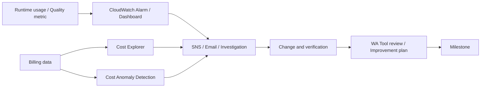

# AWS Cost Explorer、AWS Cost Anomaly Detection、AWS Auto Scaling、AWS Well-Architected Tool

最終確認日: 2026-09-23

| 項目 | 内容 |
|---|---|
| 重要度 | B: 重要 |
| 対象サービス／機能 | AWS Cost Explorer、AWS Cost Anomaly Detection、AWS Auto Scaling（主にApplication Auto Scaling）、AWS Well-Architected Tool、AWS Well-Architected Generative AI Lens |
| 対応Task・Skills | Domain 1 Task 1.1（Skills 1.1.1〜1.1.3）を主軸とし、Domain 2 Task 2.2〜2.3、Domain 4 Task 4.1〜4.3のCost、Capacity、標準Architecture、監視・改善記録に対応 |
| このページで分かること | Cost ExplorerとCost Anomaly Detectionで請求データを分析・通知し、Auto Scalingで対応ResourceのCapacityを制御し、AWS Well-Architected Toolで設計Reviewと改善履歴を管理する責務の違いを整理する。Token、Capacity、品質を関連付けるときも、請求上のCost signalとApplicationが測定するQuality metricを分離して扱う。 |

## 全体像

このページの4サービスは、同じ「最適化」に関係していても担当するControlが異なる。

| サービス／機能 | 主な入力 | AWSが行う処理 | 主な出力 | 利用者に残る管理 |
|---|---|---|---|---|
| Cost Explorer | 請求・使用量Data、期間、Dimension、Filter、Cost metric | 請求Dataの集計、表示、Forecast | Graph、Table、CSV、API response、Forecast | 分析軸、Tag設計、Costの解釈、Application利用量との関連付け |
| Cost Anomaly Detection | Cost monitor、過去の支出Pattern、Subscription、Threshold | Machine learningによる予想支出との差の検出とRoot cause候補の提示 | Anomaly、Cost impact、通知 | Monitor範囲、Threshold、通知先、原因調査、是正 |
| Application Auto Scaling | Scalable target、最小／最大Capacity、CloudWatch metric、Policy | Policyに従うCapacity変更、Target tracking用Alarmの管理 | Desired capacityの変更、Scaling activity | Target serviceの構成、MetricとTarget値、Headroom、Cooldown、SLO検証 |
| AWS Well-Architected Tool | Workload metadata、Lens、Questionへの回答、Note | Review状態、Risk、Improvement plan、Milestoneを保持 | Review report、High／Medium Risk、改善項目、Snapshot | 回答の根拠、改善Owner、期限、実装、再Review |

Cost ExplorerとCost Anomaly DetectionはBilling dataを扱い、ApplicationのCapacityを直接変更しない。Application Auto Scalingは対応ResourceのCapacityを変更するが、請求予測やFM回答品質を判定しない。AWS Well-Architected Toolは設計をBest practiceに照らして記録するToolであり、指摘された改善を自動実装するものではない。

## 1. Cost ExplorerのDimension、Filter、Forecast

Cost ExplorerはAWSのCostとUsageをGraph、Report、Table、APIで分析する。入力となるのは、期間、Granularity、Cost metric、Group、Dimension、Tagなどである。Service、Linked account、Region、Usage type、Operation、Purchase option、TagなどでFilterまたはGroup化し、該当する請求Dataを集計して出力する。

複数Filterでは、異なるFilter間をAND、同じFilter内の複数値をOR相当で扱う。したがって、Service別総額と、特定Applicationに属するServiceのCostは同じReportではない。分析条件とCost metricをReportと一緒に記録する必要がある。

Forecastは過去のUsageに基づく予測であり、実際の請求額ではない。2026-09-23時点の公式文書では80%の予測区間を使い、十分な履歴がない場合はForecastを提供しない。新しいWorkload、Trafficの急変、組織への新規Account追加などは過去Patternに十分表れず、予測と実績が異なり得る。

Cost ExplorerのDataはリアルタイムではない。現行の公式文書では当月Dataが表示可能になるまで約24時間かかり、少なくとも24時間ごとに更新されるが、上流Billing dataによってさらに遅れることがある。このため、Request単位の即時Cost guardrailにはRuntimeのToken／Usage metricを使い、Cost Explorerでは後から請求実績を照合する。

## 2. Cost allocation tag

Cost allocation tagはResource tagを請求分析の分類軸として使う仕組みである。AWS-generated tagとUser-defined tagは別々に有効化する。ResourceへTagを付けただけではCost ExplorerやCost allocation reportの軸にならず、Billing and Cost Managementで有効化する必要がある。

| 段階 | 入力と処理 | 出力 | 管理境界 |
|---|---|---|---|
| Tag付与 | ResourceへKey／Valueを設定 | Resource metadata | 利用者が命名規則、適用範囲、必須化を管理 |
| Cost allocation tag有効化 | Billing管理画面でTag keyを有効化 | Cost Explorer／Reportで利用可能なTag Dimension | Management accountまたは対象Single accountが管理 |
| Cost分析 | 有効なTagでFilter／Group化 | Application、Environment、Owner等のCost集計 | 未Tag Resource、対応しないResource、共有Costの配賦を利用者が確認 |

TagがBilling Consoleへ現れるまで時間がかかる。過去Dataへの適用条件も別途確認が必要であり、有効化前から全Costへ自動的に遡及すると仮定しない。Tag値には請求閲覧者へ開示すべきでない個人情報や機密情報を入れない。

## 3. Cost Anomaly monitorとSubscription

Cost Anomaly Detectionでは、Cost monitorが監視する支出Patternを定義し、Alert subscriptionが通知頻度、通知先、Cost impactのThresholdを定義する。AWS managed monitorはAWS service、Linked account、Cost allocation tag、Cost categoryなどのDimension内の値を継続的に取り込み、Customer managed monitorは利用者が特定値を選ぶ。

検出結果には予想支出、実支出、Cost impact、Impact percentage、期間、Service／Account／Region／Usage typeなどのRoot cause候補が含まれる。Individual alertはAmazon SNSを利用でき、Daily／Weekly summaryはEmailで受け取れる。Cost Explorerへ遷移し、原因候補で絞った時系列を調べられる。

Anomalyは「過去Patternに対して支出が異常」というSignalであり、Security incident、Resource leak、Traffic増加、正当なReleaseのどれかを自動確定するものではない。また、FM回答のHallucinationや品質低下を検出する機能でもない。ApplicationのDeployment、Token、Request、Quality metricと時刻・Versionを照合して原因を判断する。

2026-09-23時点では、Linked account、Cost allocation tag、Cost categoryのMonitor作成にはManagement account側の条件があり、MonitorとSubscriptionは作成AccountからだけAccessできる。Managed monitorとCustomer managed monitorのCoverageや上限は変更され得るため、実装時に公式のMonitor typesを確認する。

## 4. Auto Scaling policy、Metric、Cooldown

AWS Auto ScalingのうちApplication Auto Scalingは、Amazon ECS、DynamoDB、Lambda Provisioned Concurrency、SageMaker AI Endpoint variant／Inference componentなど、対応ServiceのScalable resourceを自動調整する。Amazon EC2 Auto Scaling groupのInstance fleet制御とはControl planeが異なる。

基本的な入力は、Service namespace、Resource ID、Scalable dimension、最小／最大Capacityで登録したScalable targetと、Scaling policyである。代表的なPolicyは次のとおりである。

| Policy | 処理 | 出力 | 代表的な入力・連携 |
|---|---|---|---|
| Target tracking | CloudWatch metricをTarget値付近に保つようCapacityを増減 | Desired capacity、AWS管理のCloudWatch Alarm | Utilization／Throughput metric、Target値、Cooldown |
| Step scaling | Alarm breachの大きさに応じて段階別のAdjustmentを適用 | 増減したCapacity | CloudWatch Alarm、Step adjustment |
| Scheduled scaling | 指定時刻にMin／Max capacityを変更 | 時刻に対応するCapacity範囲 | Schedule、Time zone、Min／Max |
| Predictive scaling（Amazon ECS serviceのみ） | 過去Loadから予測した需要に先行してCapacityを変更 | 予測に基づくCapacity | ECS service、履歴、Policy設定。Forecastのみで検証してから有効化し、実時間のScale-inにはTarget trackingまたはStep scalingを併用する |

Target trackingのCustom metricは、Targetの混雑度を表し、Capacityと反比例する有効なUtilization metricである必要がある。たとえば、総Request数だけが増えてもCapacity追加後に値が下がらないMetricは、そのままTarget trackingへ適さない場合がある。Metric dataが欠けてAlarmが`INSUFFICIENT_DATA`になると、Target trackingは新しいData pointが得られるまでScaleできない。

Cooldownは直前のScaling activityが効果を現すまでの待機を制御する。Scale-out cooldownとScale-in cooldownは目的が異なり、Scale-inはAvailabilityを守るため保守的に扱われる。Model loadやContainer起動に時間がかかる推論Endpointでは、CooldownだけでなくStartup time、Warm capacity、Queue、P95／P99 Latency、Token throughputを観測する。

Application Auto Scalingが変更できるDimensionはTarget serviceごとに異なる。Amazon Bedrock On-demandの内部CapacityやProvisioned ThroughputのModel Unitを、汎用のScalable targetとして自動増減できると読み替えない。対応ResourceとPredefined metricは公式のService別一覧で確認する。

## 5. Well-Architected review、Lens、Milestone

AWS Well-Architected Toolでは、Business valueを提供するComponentの集合をWorkloadとして定義する。Workload name、Description、Owner、Environment、Region等を入力し、適用するLensのQuestionへ回答する。LensはQuestion、Best practice、Note、Improvement planを持ち、ReviewからRiskと改善候補を出力する。

AWS Well-Architected Framework LensはWorkload定義時に自動適用される。AWSのLens CatalogにあるLensと、利用者が作成・共有・ImportするCustom lensは管理形態が異なる。LensのQuestionへ回答する主体は利用者であり、Architectureや運用状態をServiceが自動発見して回答するわけではない。

MilestoneはWorkloadのReview状態を時点Snapshotとして保存する。保存後のMilestoneは変更できないため、Release、PoC終了、本番移行、改善実施後などの状態を比較するEvidenceになる。Improvement planのRiskを下げるには、利用者が実際の構成や運用を変更し、Evidenceを更新して再Reviewする。

## 6. Generative AI Lens

Generative AI LensはAWS Well-Architected Frameworkを、Foundation Modelと生成AIApplication固有の考慮事項へ拡張する。対象はScoping、Model selection、Customization、Development、Deployment、Continuous improvementであり、Operational Excellence、Security、Reliability、Performance Efficiency、Cost Optimization、Sustainabilityの各柱とResponsible AIを扱う。

2026-09-23時点の現行文書は2025-11-19公開版である。AWS Well-Architected ToolでReviewするには、AWS公開RepositoryのGenerative AI LensをDownloadし、Custom lensとしてImportする手順が示されている。したがって、文書を読んだこと、ToolへImportしたこと、Workloadに適用して回答・改善記録を残したことを区別する。

Task 1.1では、このLensが要件、PoC成功条件、標準Architectureを整理する根拠になる。ただしLensは特定のModel、Region、Scaling方式を一律に決定しない。選択判断は[Task 1.1のsupplimental page](../supplimental-pages/01-01-requirements-and-solution-design.md)で扱う。

## 7. Token、Capacity、QualityのCost driver

生成AIWorkloadのCostを説明するときは、Billing signal、Runtime usage、Application qualityを分けてから関連付ける。

| 層 | 入力／Cost driver | 出力・観測先 | 責任境界 |
|---|---|---|---|
| Model invocation | Model、入力／出力Token、Prompt cache、Image等のUnit、Batch／On-demand | Bedrock Usage metadata、CloudWatch Runtime metric、請求Data | 利用者がPrompt長、Response上限、Model／推論方式を管理。単価は料金表で確認 |
| Provisioned capacity／Endpoint | Model Unit、Instance type、台数、稼働時間、Min／Max capacity、Idle capacity | Scaling activity、Capacity metric、請求Data | AWSは基盤を提供し、利用者はCapacity planとPolicyを管理 |
| Retrieval／Workflow | Vector Store、Storage、Query、Reranking、Tool call、Retry、Loop回数 | Service metric、Trace、請求Data | 利用者がWorkflow boundary、停止条件、Retry上限を管理 |
| Quality | Groundedness、正確性、Schema遵守、Safety、Human feedback、Business outcome | Evaluation結果、Application log／Custom metric | 利用者または明示的なEvaluation機能が算出。Cost Explorerは算出しない |
| 配賦・実績 | Service、Usage type、Account、Region、Tag、Cost category | Cost Explorer、Cost Anomaly Detection | Billing dataの遅延と共有Costを考慮し、利用者がApplication単位へ関連付ける |

Generative AI LensのCost Optimizationは、Model／Inferenceの選択、Prompt長とResponse長などの消費Parameter、Workflowの停止条件をCost controlとして扱う。一方、Tokenを減らした結果として回答品質、Context freshness、Latencyが悪化していないかは、同じVersionと評価Datasetに紐付くQuality metricで確認する。Cost減少だけでは改善完了を示さない。

## 8. Alert、改善記録、料金確認

運用の流れは、即時Signal、後日確定するCost、Architectureの改善履歴を接続する。

図の要点は、Cost Anomaly alertだけで改善を完了にしないことである。AlertからService、Account、Region、Usage type、Tag等で請求を掘り下げ、同じ期間のDeployment、Traffic、Token、Retry、Scaling activity、Qualityを確認する。変更後はCostとSLO／品質を再測定し、Well-Architected reviewのNote、Improvement status、MilestoneへEvidenceを残す。

## API、Event、Dataの入出力

| Service | 主なControl／Query API | 主な入力 | 主な出力・Event |
|---|---|---|---|
| Cost Explorer | `GetCostAndUsage`、`GetCostForecast`、`GetDimensionValues` | Time period、Granularity、Metric、Filter、GroupBy | 金額／Usageの時系列、Group、Forecast、Pagination token |
| Cost Anomaly Detection | `CreateAnomalyMonitor`、`CreateAnomalySubscription`、`GetAnomalies` | Monitor specification、Threshold、Frequency、Subscriber | Anomaly detail、Root cause候補、SNS／Email通知 |
| Application Auto Scaling | `RegisterScalableTarget`、`PutScalingPolicy`、`PutScheduledAction`、`DescribeScalingActivities` | Namespace、Resource ID、Scalable dimension、Min／Max、Metric、Target | Capacity変更、Scaling activity、CloudWatch Alarm |
| AWS Well-Architected Tool | `CreateWorkload`、`UpdateLensReview`、`CreateMilestone`、`GetLensReviewReport` | Workload metadata、Lens alias、Answer、Note、Milestone名 | Workload／Review状態、Risk、Improvement plan、Report |

Cost Explorer APIは集計済みBilling dataへのQueryであり、個々のFM Requestの同期Responseを返さない。Request単位のTokenやLatencyはBedrock Runtime Response、CloudWatch、Application log等から得て、後からCost Explorerの実績と照合する。

## SecurityとData保護

- Billing and Cost Management、Cost Explorer API、Cost Anomaly DetectionにはIAMで明示的な閲覧・変更権限を与える。組織全体のCost、Linked account、Tag値は機密性のある経営情報として扱う。
- Cost allocation tagへ個人情報、Credential、機密Prompt、顧客Dataを入れない。TagはCost reportや組織内のBilling閲覧者へ露出し得る。
- Application Auto ScalingはTarget serviceを利用者に代わって操作するためService-linked roleを使用する。初回登録に`iam:CreateServiceLinkedRole`が必要になる場合がある。利用者RoleにはScalable target、Policy、Scheduleの変更権限を分離して付与する。
- Well-Architected WorkloadにはArchitecture、Risk、Owner、改善Noteが含まれる。WorkloadとCustom lensの共有先、閲覧・更新権限を制御し、SecretやPrompt本文をEvidenceとして直接記録しない。
- AWS Cost ManagementのAPI callはCloudTrailで監査できる。Application Auto ScalingとWell-Architected ToolのControl plane操作も、対象EventとRegionをCloudTrailの公式対応表で確認する。
- Private connectivityの有無と、Scaling対象やGenAI Data pathのNetwork分離は別問題である。これらの管理Controlを設定しても、Bedrock、SageMaker AI、Vector Store、Application APIの通信経路は自動でPrivateにならない。

## 可観測性、可用性、Scaling、Quota、料金要因

### 可観測性と監査

Cost ExplorerのReport／API result、Cost Anomaly DetectionのAnomaly／Subscription、Application Auto ScalingのScaling activityとCloudWatch Alarm、Well-Architected ToolのLens review／Milestoneを別々のEvidenceとして保持する。CorrelationにはAccount、Region、Application／Environment tag、Resource ID、Deployment version、時刻を使う。

Cost Anomaly DetectionのAnomalyはBilling dataに依存するため、Runtime障害の即時Alarmを置き換えない。Application Auto Scalingでは、Desired capacityだけでなく、Target metric、Latency、Queue、Throttle、Error、Scaling failureを確認する。Well-Architected ToolのMilestoneは設計ReviewのSnapshotであり、Runtime metricや監査Logの代わりではない。

### 可用性とScaling

Application Auto ScalingのAvailabilityはTarget serviceのCapacity unit、Scale-out所要時間、最小／最大値、Metric頻度、Quotaに制約される。Scaling policyが正しくても、Model／Containerの起動、Quota不足、欠損Metric、下流ServiceのThrottleによりSLOを満たせない場合がある。

Cost Explorer、Cost Anomaly Detection、Well-Architected ToolはAWS管理のControl planeであるが、利用者は権限、通知先、API retry、Report／Evidenceの保持、障害時の代替確認手順を管理する。Cost dataが遅れる期間は、Runtime usageからの概算と後日の請求実績を区別する。

### Quotaと変化し得る条件

- Cost Explorerの保持期間、Forecast範囲、Data更新時刻、Filter上限、API rateは変更され得る。
- Cost Anomaly DetectionのMonitor type、追跡可能な値、Customer managed monitorの選択上限、通知方式は変更され得る。
- Application Auto Scalingの対応Service、Scalable dimension、Predefined metric、Policy type、Cooldown既定値、Region対応はTargetごとに異なる。
- AWS Well-Architected ToolのLens適用数、Custom lens quota、Report、Region対応と、Generative AI Lensの版は変更され得る。

固定値を構成へ埋め込む前に、Service Quotas、各ServiceのEndpoint／Quota、対象RegionのService文書を確認する。

### 料金要因

2026-09-23時点で確認すべき主な料金要因は次のとおりである。単価、Free Tier、課金対象APIは実装時に公式料金ページで再確認する。

- Cost Explorer Consoleの表示とCost Explorer APIのRequestは料金条件が異なる。Paginationを含むAPI呼出数を確認する。
- Cost Anomaly Detection自体の現行料金条件に加え、SNS、通知後のAutomation、Log保存など連携Serviceの料金を確認する。
- Application Auto ScalingのControl機能だけでなく、増加したECS Task、Lambda Provisioned Concurrency、SageMaker AI Instance等、Target resourceの稼働量が主要なCostになる。
- AWS Well-Architected ToolとCustom lensの現行料金条件とは別に、改善確認のLoad test、Evaluation、Telemetry保持に料金が発生し得る。
- Bedrock／SageMaker AIではModel、TokenまたはCapacity、Inference方式、Prompt cache、Batch、Storage、Data transfer、RetryがCostへ影響する。Cost Explorerの集計だけから回答品質は分からないため、Quality signalも同じ変更単位で保持する。

## AIP-C01との対応

| Task・Skill | このサービス群が担う役割 | 関連ページ |
|---|---|---|
| Task 1.1 / Skills 1.1.1〜1.1.3 | Costを非機能要件へ含め、Generative AI LensとWA ToolでPoC、標準Architecture、改善項目を記録する | [literal](../literal-pages/01-01-requirements-and-solution-design.md) / [supplimental](../supplimental-pages/01-01-requirements-and-solution-design.md) |
| Task 2.2 / Skills 2.2.1〜2.2.3 | Traffic、SLO、Token／Capacity Costを観測し、対応するSageMaker AI等のResourceでScalingを構成する | [literal](../literal-pages/02-02-model-deployment-strategies.md) / [supplimental](../supplimental-pages/02-02-model-deployment-strategies.md) |
| Task 2.3 / Skills 2.3.1〜2.3.5 | Account、Region、Tag、標準Control、Review evidenceをEnterprise ArchitectureとDelivery管理へ接続する | [literal目次](../literal-pages/README.md#第2部-実装と統合) / [supplimental目次](../supplimental-pages/README.md#第2部-実装と統合) |
| Task 4.1 / Skills 4.1.1〜4.1.4 | Token、Model、Cache、Batch、CapacityのCost driverと請求実績を関連付け、異常支出を検出する | [literal目次](../literal-pages/README.md#第4部-運用効率と最適化) / [supplimental目次](../supplimental-pages/README.md#第4部-運用効率と最適化) |
| Task 4.2 / Skills 4.2.1〜4.2.6 | Peak、Concurrency、Throughput、LatencyからCapacity metricとHeadroomを管理する | [literal目次](../literal-pages/README.md#第4部-運用効率と最適化) / [supplimental目次](../supplimental-pages/README.md#第4部-運用効率と最適化) |
| Task 4.3 / Skills 4.3.1〜4.3.6 | Cost anomaly、Scaling activity、Runtime／Quality signalを分離してAlert・調査・改善履歴へつなぐ | [Amazon CloudWatch](01-11-amazon-cloudwatch.md) / [literal目次](../literal-pages/README.md#第4部-運用効率と最適化) |

## 重要な制約と確認事項

- Cost ExplorerはBilling dataの分析面であり、リアルタイムのRequest制御や品質評価を行わない。Data latencyとForecastの不確実性を明記する。
- Cost allocation tagはResourceへの付与とBilling側での有効化が必要である。反映時刻と過去Dataへの適用条件を確認する。
- Cost Anomaly DetectionのRoot causeは候補であり、Application trace、Deployment、Usage metricによる原因確認が必要である。
- Application Auto Scalingは対応するScalable dimensionだけを変更する。Bedrock On-demandの内部Capacity、Provisioned Throughput、すべてのSageMaker AI構成を一律にScaleする機能ではない。
- Generative AI Lensの文書版とAWS Well-Architected Toolへの導入方法は変わり得る。2026-09-23時点ではAWS公開RepositoryからCustom lensとしてImportする手順である。
- Bedrock／SageMaker AIの料金、Model対応、Capacity単位、Region、Quotaはこのページへ固定せず、使用時の公式PricingとService文書を確認する。
- Domain 2 Task 2.3とDomain 4のliteral／supplimental本文は2026-09-23時点では作成予定のため、対応表からは目次へリンクしている。

## 用語

| 用語 | このページでの意味 |
|---|---|
| Dimension | CostまたはMetricをService、Account、Region、Usage type等の軸で分類する属性 |
| Cost allocation tag | 有効化後に請求DataのFilter／Groupへ利用できるTag key |
| Forecast | 過去Usageから将来Costを予測した推定値。実際の請求額ではない |
| Cost monitor | Cost Anomaly Detectionが評価するDimensionと支出範囲の定義 |
| Alert subscription | Anomaly通知の頻度、Threshold、通知先の定義 |
| Scalable target | Application Auto Scalingへ登録した、Min／Max capacityを持つ対象Resource |
| Scalable dimension | Target serviceで増減可能なCapacity属性 |
| Target tracking | CloudWatch metricをTarget値付近に保つようCapacityを調整するPolicy |
| Cooldown | Scaling activityの効果が現れるまで次の調整を制御する期間 |
| Lens | Well-Architected Reviewで使うQuestion、Best practice、Note、Improvement planの集合 |
| Milestone | Workload reviewの変更不能な時点Snapshot |

## 公式資料

- [AIP-C01 Content Domain 1](https://docs.aws.amazon.com/aws-certification/latest/ai-professional-01/ai-professional-01-domain1.html) — Task 1.1の要件、PoC、標準Architecture
- [AIP-C01 Content Domain 2](https://docs.aws.amazon.com/aws-certification/latest/ai-professional-01/ai-professional-01-domain2.html) — Task 2.2〜2.3のDeployment、Capacity、Enterprise integration
- [AIP-C01 Content Domain 4](https://docs.aws.amazon.com/aws-certification/latest/ai-professional-01/ai-professional-01-domain4.html) — Cost、Performance、MonitoringのSkills 4.1.1〜4.3.6
- [Analyzing costs and usage with AWS Cost Explorer](https://docs.aws.amazon.com/cost-management/latest/userguide/ce-what-is.html) — Cost ExplorerのData、更新、保持・Forecast範囲、API料金
- [Filtering the data that you want to view](https://docs.aws.amazon.com/cost-management/latest/userguide/ce-filtering.html) — Dimension、Filter、Group、AND／ORの動作
- [Forecasting with Cost Explorer](https://docs.aws.amazon.com/cost-management/latest/userguide/ce-forecast.html) — 過去Usage、予測区間、不確実性
- [Using the AWS Cost Explorer API](https://docs.aws.amazon.com/cost-management/latest/userguide/ce-api.html) — Query API、Endpoint、IAM権限
- [Organizing and tracking costs using AWS cost allocation tags](https://docs.aws.amazon.com/awsaccountbilling/latest/aboutv2/cost-alloc-tags.html) — Tag種類、有効化、Cost report、反映条件
- [Getting started with AWS Cost Anomaly Detection](https://docs.aws.amazon.com/cost-management/latest/userguide/getting-started-ad.html) — Monitor、Subscription、Threshold、通知、Root cause
- [Logging AWS Cost Management API calls with AWS CloudTrail](https://docs.aws.amazon.com/cost-management/latest/userguide/logging-with-cloudtrail.html) — Cost ManagementのControl plane監査
- [What is Application Auto Scaling?](https://docs.aws.amazon.com/autoscaling/application/userguide/what-is-application-auto-scaling.html) — 対応ResourceとScaling policyの全体像
- [Scaling policies for Application Auto Scaling](https://docs.aws.amazon.com/autoscaling/application/userguide/application-auto-scaling-scaling-policies.html) — Target tracking、Step、Scheduled、Predictive scaling
- [How target tracking scaling works](https://docs.aws.amazon.com/autoscaling/application/userguide/target-tracking-scaling-policy-overview.html) — Metric条件、Alarm、Cooldown、複数Policy
- [Service-linked roles for Application Auto Scaling](https://docs.aws.amazon.com/autoscaling/application/userguide/application-auto-scaling-service-linked-roles.html) — Target serviceを操作する権限境界
- [AWS Well-Architected Tool](https://docs.aws.amazon.com/wellarchitected/latest/userguide/intro.html) — Workload、Review、Lens、Milestoneの全体像
- [Defining a workload in AWS WA Tool](https://docs.aws.amazon.com/wellarchitected/latest/userguide/define-workload.html) — Workload metadataと管理項目
- [Using lenses in AWS WA Tool](https://docs.aws.amazon.com/wellarchitected/latest/userguide/lenses.html) — Framework Lens、Lens Catalog、Custom lens
- [AWS WA Tool Overview tab](https://docs.aws.amazon.com/wellarchitected/latest/userguide/details-review.html) — Review状態と変更不能なMilestone
- [AWS Well-Architected Generative AI Lens](https://docs.aws.amazon.com/wellarchitected/latest/generative-ai-lens/generative-ai-lens.html) — 対象Lifecycle、6本の柱、Responsible AI、Toolへの導入方法
- [Cost optimization in the Generative AI Lens](https://docs.aws.amazon.com/wellarchitected/latest/generative-ai-lens/cost-optimization.html) — Model／Inference、消費Parameter、Workflow boundaryのCost原則
- [Amazon Bedrock pricing](https://aws.amazon.com/bedrock/pricing/) — Model、Token、Batch、Provisioned Throughput等の料金確認先
- [Amazon SageMaker AI pricing](https://aws.amazon.com/sagemaker/ai/pricing/) — Endpoint、Serverless、Async、Batch等の料金確認先

## 関連ページ

- [サービス別目次](README.md)
- [Amazon BedrockとAmazon Titan](01-01-amazon-bedrock.md)
- [Amazon CloudWatch、CloudWatch Logs、CloudWatch Synthetics](01-11-amazon-cloudwatch.md)
- [Task 1.1 literal](../literal-pages/01-01-requirements-and-solution-design.md) / [Task 1.1 supplimental](../supplimental-pages/01-01-requirements-and-solution-design.md)
- [Task 2.2 literal](../literal-pages/02-02-model-deployment-strategies.md) / [Task 2.2 supplimental](../supplimental-pages/02-02-model-deployment-strategies.md)
- [Domain 2 literal目次](../literal-pages/README.md#第2部-実装と統合) / [Domain 2 supplimental目次](../supplimental-pages/README.md#第2部-実装と統合)
- [Domain 4 literal目次](../literal-pages/README.md#第4部-運用効率と最適化) / [Domain 4 supplimental目次](../supplimental-pages/README.md#第4部-運用効率と最適化)
