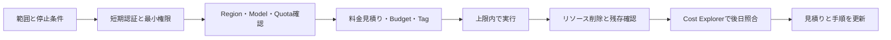

# AWSラボのアクセスとコスト管理の基礎: 理解と判断の補足

## このページの位置づけ

| 項目 | 内容 |
|---|---|
| 対応Task | [`PREP-02`](../../docs/tasks/README.md#prep-02-awsローカル統合ラボを準備する2時間) |
| 対応Skills | なし（試験学習を始めるための準備Task） |
| 対応する公式解説 | [`00-02-aws-lab-cost-and-access-basics.md`](../literal-pages/00-02-aws-lab-cost-and-access-basics.md) |
| この補足で身につける判断 | 認証情報、Region、Quota、料金、予算、Tag、削除を一つの実験計画として組み立て、実機で確かめる事項と設計比較で扱う事項を分ける |

## まず全体像

安全なAWS実験は「呼び出しに成功したら完了」ではない。実行前に権限、実行場所、利用上限、費用上限、終了方法を決め、実行中は手元の利用量を追跡し、終了後はリソース削除と請求データの後日確認まで行う。

AWS BudgetsとCost Explorerにはデータ反映の遅延がある。そのため、費用管理は次の二層に分けて考える。

- 実行中の制御: 最大Request数、Token数、実行時間、作成リソース数など、すぐ判定できる上限で止める
- 請求データでの検証: AWS BudgetsとCost ExplorerでActual／Forecastと内訳を後から確認する

前者は実験の暴走を抑え、後者は見積りと実績の差を見つける。どちらか一方では役割を満たせない。

## 一つの実験計画としてつなげる

次の図は、公式サービスの仕様を変更せず、学習実験の判断順序として整理したものである。

この順序では、削除は後片付けではなく、作成前に決める実験条件である。また、Cost Explorerの照合は実行直後だけで完了にせず、請求データが反映された後にも行う。

### 1. 範囲と停止条件

最初に、検証したい仮説と必要最小限の操作を決める。費用の上限だけでなく、最大Request数、最大Token数、最大実行時間を停止条件にすると、請求データがまだ反映されていなくても停止判断ができる。

### 2. 認証主体と権限

人がCLIを操作するなら、IAM Identity Centerなどから得た短期認証情報を使う。重要なのは「Access keyがあるか」ではなく、現在のProfileが意図したAccountとRoleを指し、そのRoleが実験に必要な最小権限だけを持つかである。

長期Access keyをRepositoryへ置く方式は、漏えい時に手動で失効させるまで有効であり、短期認証情報を優先する要件に合わない。管理権限を広く与える方式も、実験に不要な操作まで許すため除外する。

### 3. Region、Model、Quota

Regionを先に固定してからモデルを選ぶと、目的のモデルや推論方式が使えないことがある。反対に、モデルの利用可否だけでRegionを決めると、データ所在地や料金条件を見落とす。次の順で条件を交差させる。

1. データ所在地と利用可能な推論経路を確認する
2. その経路で目的のモデルとAPIが利用できるか確認する
3. 対象Account・Region・Endpointで適用済みQuotaが実験量を満たすか確認する
4. Model accessやIAM Permissionを含め、最小の呼び出しで利用可能性を確かめる

Quota増加申請が必要な構成は、承認と反映に時間がかかり得る。少量の学習実験であれば、まず実験量を下げられないかを検討する。性能や高負荷時の挙動そのものが検証目的なら、単に量を下げると仮説が変わるため、Quota増加または別の検証方法を計画する。

### 4. 料金、Budget、Tag

見積りでは、Model invocationだけでなく、検索用Store、Storage、Log、Data transfer、常時稼働Resourceなど、構成に含まれる課金項目を分ける。Bedrockの課金単位は機能やモデルごとに異なるため、「Token単価」だけで全体を見積もらない。

AWS BudgetsにはActualとForecastedの通知を設定できる。ただし、更新と通知に遅延があるため、Budgetのしきい値を実験中の唯一の停止条件にはしない。即時に近い停止判断にはRequest数などのローカルな上限を使い、BudgetはAccount全体の監視と早期警告に使う。

Tagは、作成したリソースの所有目的と費用を追跡しやすくする。費用分析に使うTag keyは、実験前に統一し、対応リソースへ付与し、Billing側でコスト配分タグとして有効化する。Tagに対応しないリソースや、Tagが費用へ反映されないサービスもあるため、Tagだけを作成リソース台帳の代わりにしない。

### 5. 実行、削除、後日照合

実行中はRequest数、Token使用量、開始・終了時刻、作成リソースを記録する。しきい値到達、想定外の課金対象発見、削除失敗のいずれかがあれば、新しい有料操作を止める。

実行後は作成一覧を基にリソースを削除し、ConsoleまたはAPIで残存を確認する。削除要求の成功と、課金対象がなくなったことは同じではない。非同期削除や、親リソースが作成した関連リソースがある場合は、最終状態まで確認する。

Cost Explorerのデータ反映後、Serviceと有効化したCost allocation tagで費用を絞り込み、事前見積りと照合する。差があれば、単価だけでなく、Request回数、Retry、出力Token、削除までの稼働時間、関連サービスの利用を調べる。

## 実機確認と設計比較を分ける

| 確認したいこと | 基本の確認方法 | その方法を選ぶ理由 | 別の方法へ切り替える条件 |
|---|---|---|---|
| CLI Profileが意図したAccount・Roleを使うか | AWS実機でCaller identityを確認 | ローカルの設定ファイルだけでは実際に採用された認証主体を確定できない | Account IDやARNを成果物へ保存せず、必要部分だけMaskして記録する |
| 対象RegionでModelを呼び出せるか | 最小1回の実機呼び出し | Model availabilityだけでなく、Model access、IAM、API形式をまとめて確認できる | 機密データしか用意できない場合は実行せず、架空データへ置き換える |
| Quota内で想定量を処理できるか | 適用済みQuotaを確認し、必要なら小規模実測 | QuotaはAccount・Region・Endpointなどの条件を持ち、実Accountの値が判断材料になる | 高負荷試験が予算や安全条件を超える場合は、設計上の計算と未実測事項を分けて残す |
| On-DemandとProvisionedの費用差 | 公式料金による設計比較 | 比較だけのために長時間のCapacityを確保する必要はない | 実ThroughputやLatencyの保証を検証する段階では実環境の測定が必要になる |
| Budget通知が届く経路 | 低い安全なしきい値または通知Testで実機確認 | Email／SNSの購読や権限は実際の配送経路で確認する必要がある | 通知を起こすための課金を目的にせず、安全な既存利用またはTest機能を使う |
| Cost allocation tagで費用を分けられるか | 少量実行後、反映を待ってCost Explorerで確認 | Tag対応、有効化、請求データ反映を含むEnd-to-endの結果だから | 反映前は作成台帳と手元の利用量で追跡し、即時表示を前提にしない |
| 大規模構成の削除順序 | 構成図とRunbookで先に設計し、作成した最小構成で検証 | 設計比較で依存関係を洗い出し、実機では実際の状態遷移を確認できる | 予算内で作成から削除まで完結しない構成は作成しない |

実機が必要なのは、Account固有の権限、Quota、Model access、実API response、課金反映、削除状態のように、文書だけではその環境の結果を確定できない事項である。一方、複数の高額なCapacity方式を比較するためだけに、すべてを作成する必要はない。公式料金と要件で候補を絞り、実測しない部分を明記する。

## 要件から選ぶ

| 要件・状況 | 選びやすい方式 | 判断理由 | 選ばない方式と条件 |
|---|---|---|---|
| 人がCLIで短時間のラボを行う | IAM Identity CenterのSSO Profileと短期認証情報 | 自動更新でき、有効期限とPermission SetでAccessを管理できる | Repositoryへ長期Access keyを保存する方式は除外する |
| 少量のModel invocationを試す | 実施日のOn-Demand料金とRequest上限を確認 | 使用量に応じた見積りを作りやすく、固定Capacityを持たない | Throughput保証や継続的な高負荷が要件なら、On-Demandだけで決めない |
| データを単一Region内に置く必要がある | 対応ModelのIn-Region inference | 指定Region外へ処理をルーティングしない条件に合う | Global cross-Region inferenceは地理的制約を満たさない |
| 予算超過前に警告したい | Forecasted通知とActual通知を併用 | 予測と発生済み費用を別々に監視できる | Actual通知だけでは事前警告にならない |
| 実行中に確実な停止線が必要 | Request・Token・時間の上限と手動停止手順 | Billing dataの更新を待たずに判定できる | Budget通知だけを即時停止装置として扱わない |
| 実験ごとの費用を後から分けたい | 一貫したResource tagとCost allocation tagの有効化 | Cost ExplorerでTagを条件に分析できる | 未有効化のResource tagだけではCost Explorerの分類に使えない |

## 理解用シナリオ

> これは理解のために作成した例であり、実際の認定試験問題ではない。

ある学習者が、Bedrock Modelへの少量のRequestと、短時間だけ使う検索用リソースを試す。月間Budgetは設定済みで、80%のForecasted通知もある。利用するModelは複数Regionで提供されるが、入力データは単一Region内で処理する必要がある。実験終了後は、実験分の費用をほかの利用と分けて確認したい。

### 判断

- 認証はIAM Identity CenterのSSO Profileなどから短期認証情報を取得し、対象Account、Role、Regionを実機で確認する。長期Access keyをRepositoryへ置く案は除外する。
- RegionはModel availabilityだけでなく、単一Region内処理の要件を満たすIn-Region inferenceの対応状況から選ぶ。Global cross-Region inferenceは要件と合わない。
- 80%のForecasted通知は早期警告に使えるが、実験中の停止を保証しない。最大Request、Token、時間を別に決める。
- 料金はModel invocationと検索用リソースを分けて見積もる。検索用リソースは作成前に削除順序と最長稼働時間を決める。
- 共通Tagを対応リソースへ付け、費用分析に使うKeyをコスト配分タグとして有効化する。ただし、Cost Explorerの反映は遅れるため、実行直後はRequest数と作成台帳で確認し、後日Tag Filterで実績を照合する。

## 横断的な注意点

- セキュリティ: 短期認証情報でも画面出力やLogへ露出させない。Caller identityの結果を共有するときはAccount IDとARNをMaskする。Tagにも機密情報を含めない。
- 可用性: Region変更でModel、Quota、推論方式が同じになるとは限らない。Fallback先も実施日に確認する。
- 性能: 小規模呼び出しの成功だけでは、高Concurrency時のQuotaやLatencyを検証したことにならない。実測範囲を明記する。
- コスト: BudgetとCost Explorerの遅延を前提に、安全余裕を残す。削除後も、請求データへ反映された実績を確認する。

## 理解を確認する

- AWS BudgetsのActual／Forecasted通知と、Request数による停止条件の役割の違いを説明できるか。
- Region、Model availability、Inference option、Quota、料金をどの順で照合するか説明できるか。
- Resource tagを付けるだけでは、なぜCost Explorerで費用を分類できない場合があるか説明できるか。
- 実機で確認すべきAccount固有の事項と、公式料金による設計比較でよい事項を分けられるか。
- 削除要求の成功後に、何を確認すれば実験完了と判断できるか。

## 根拠と補足の区別

- 公式情報: 短期認証情報の推奨、SSO Profile、BedrockのRegion／Inference option、Service Quotas、Bedrock料金の課金軸、Budgetsの通知と遅延、Budget action、Cost Explorerの反映時間、Cost allocation tagの有効化条件。
- 補助的な整理: 図に示した実験順序、実機確認と設計比較の分け方、停止条件の組み合わせ、理解用シナリオ、採用案と除外案。これらは公式仕様を基にした学習用の判断整理である。

## 公式資料

- [Security best practices in IAM](https://docs.aws.amazon.com/IAM/latest/UserGuide/best-practices.html) — 短期認証情報、IAM Identity Center、最小権限
- [Getting IAM Identity Center user credentials for the AWS CLI or AWS SDKs](https://docs.aws.amazon.com/singlesignon/latest/userguide/howtogetcredentials.html) — SSO Profileで取得する短期認証情報
- [Regional availability by models](https://docs.aws.amazon.com/bedrock/latest/userguide/models-region-compatibility.html) — ModelとInference optionのRegion条件
- [What is Service Quotas?](https://docs.aws.amazon.com/servicequotas/latest/userguide/intro.html) — Account／Region／Resourceに適用されるQuota
- [Quotas for Amazon Bedrock](https://docs.aws.amazon.com/bedrock/latest/userguide/quotas.html) — BedrockのToken quotaとEndpoint別Quota
- [Amazon Bedrock pricing](https://aws.amazon.com/bedrock/pricing/) — Model、推論方式、Bedrock各機能の課金条件
- [Managing your costs with AWS Budgets](https://docs.aws.amazon.com/cost-management/latest/userguide/budgets-managing-costs.html) — Actual／Forecasted通知と更新・通知の遅延
- [Configuring budget actions](https://docs.aws.amazon.com/cost-management/latest/userguide/budgets-controls.html) — しきい値に応じたAction
- [Analyzing your costs and usage with AWS Cost Explorer](https://docs.aws.amazon.com/cost-management/latest/userguide/ce-what-is.html) — Cost分析とデータ反映時間
- [Organizing and tracking costs using AWS cost allocation tags](https://docs.aws.amazon.com/awsaccountbilling/latest/aboutv2/cost-alloc-tags.html) — Tagの有効化と費用分類
- [Using user-defined cost allocation tags](https://docs.aws.amazon.com/awsaccountbilling/latest/aboutv2/custom-tags.html) — User-defined tagの条件とサービスごとの差

最終確認日: 2026-09-21
