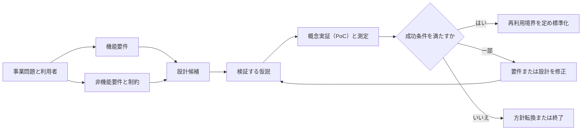

# 要件を分析し、生成AIソリューションを設計する: 理解と判断の補足

## このページの位置づけ

| 項目 | 内容 |
|---|---|
| 対応Task | `D1-01`: 要件を分析し、GenAIソリューションを設計する |
| 対応Skills | `1.1.1〜1.1.3` |
| 対応する公式解説 | [`01-01-requirements-and-solution-design.md`](../literal-pages/01-01-requirements-and-solution-design.md) |
| この補足で身につける判断 | 機能要件と非機能要件を読み分け、衝突する品質・レイテンシー・セキュリティ・コストへ優先順位を付ける。概念実証（PoC）を測定可能な仮説にし、どこまでを標準部品にするか判断する。 |

## まず全体像

設計判断は、次の順で行うと混同しにくい。

図の要点は、標準化や本格展開をPoCより先に確定しないことである。機能要件だけで設計候補を作らず、非機能要件と制約も同時に入力する。PoCの測定結果が成功条件を満たした部分だけを、共通化に適するか検討する。

## 機能要件と非機能要件を読み分ける

機能要件は「誰が、何を入力し、どの結果または処理を必要とするか」を表す。非機能要件は「その機能を、どの品質と制約の中で実現するか」を表す。

| 要件文に現れやすい内容 | 分類 | 設計で確認する問い |
|---|---|---|
| 社内文書を検索し、根拠付きで質問へ回答する | 機能要件 | 必要な入力、検索、生成、出典提示の流れは何か |
| 利用者の所属部門に応じて閲覧範囲を変える | 機能とセキュリティ制約の両方 | 認可判断をどこで行い、検索と出力へどう引き継ぐか |
| 95パーセンタイルの応答時間を合意した上限内にする | 非機能要件 | エンドツーエンドのどの処理へ時間を割り当てるか |
| 指定された場所の外へデータを保存・処理しない | 非機能要件・コンプライアンス制約 | 利用できるRegion、モデル、データストア、ログ保存先は何か |
| 1リクエスト当たりの費用を合意した上限内にする | 非機能要件 | 入力、出力、検索、Agent処理、基盤の費用をどう測るか |

一つの文が両方の性質を持つ場合がある。「部門別に回答する」は振る舞いだが、「権限のない文書を回答に使わない」はセキュリティ制約でもある。ラベルを一つ付けて終えるのではなく、機能の流れと守るべき境界の両方へ分解する。

## 衝突する要件へ優先順位を付ける

品質、レイテンシー、セキュリティ、コストを一つずつ最大化する設計はできない。まず変更できない制約を固定し、残った選択肢を測定して比較する。

| 衝突 | 優先する条件 | 採りやすい判断 | 除外する判断 |
|---|---|---|---|
| 品質とレイテンシー | 対話中の応答期限が厳しい | 同期経路の処理を絞り、期限内で品質を測る | 品質向上の可能性だけを理由に、無制限に検索・生成手順を増やす |
| 品質とコスト | 品質の最低水準と単位費用の上限がある | 候補を同じ評価データで測り、両方の閾値を満たす最小構成を選ぶ | 「大きい・高価な構成ほど常に良い」と仮定する |
| セキュリティと利便性 | 機密データとアクセス境界が明示されている | 最小権限、入出力検査、監査を満たす候補に限定する | 利用しやすさや出力率のために必須統制を外す |
| 可用性とコスト | 停止許容時間が短い | 必要な障害範囲に対応する冗長化を評価する | 可用性目標がないまま、最大規模の冗長構成を選ぶ |
| データ所在地とモデル選択 | 保存・処理場所が拘束条件である | 許可された場所で要件を満たす候補だけを比較する | 機能が高いという理由で、所在地条件を満たさない候補を残す |

セキュリティ、法令、データ所在地のような必須条件は、ほかの指標との加点比較に混ぜず、候補を除外する制約として先に適用する。その後、品質、レイテンシー、コストなどを同じ試験条件で測る。

## PoC仮説を測定可能にする

「生成AIで便利になる」は検証可能な仮説ではない。仮説には対象、変更、測る指標、合格条件、試験条件を含める。

> 対象となる利用者と業務に対し、候補の設計を使うと、代表的な評価データにおいて指標が事前合意した閾値を満たし、同時にセキュリティと費用の上限を守れる。

PoCの成功条件は、最低でも次の層をつなぐ。

| 検証層 | 仮説の例 | 証拠 |
|---|---|---|
| 事業価値 | 対象業務の完了時間または人手作業を減らせる | 現行手順との比較、利用者評価、業務KPI |
| データ準備状況 | 対象質問を評価できる、正確で代表的なデータを用意できる | 専門家が確認した評価データ、鮮度、対象範囲、欠損記録 |
| 技術的実現可能性 | 必要な統合、品質、レイテンシー、同時実行、可用性を実現できる | 同一条件の評価結果、負荷測定、失敗記録 |
| リスクと費用 | 必須のセキュリティ統制を維持し、単位費用を上限内にできる | 権限・監査の確認、入出力試験、リクエスト当たりの費用 |

合格条件だけでなく、停止条件も先に決める。たとえば、必須のデータ所在地を満たせない、代表データを準備できない、品質を上げると費用上限を継続して超える、といった条件である。これにより、測定後に都合よく基準を変えることを避けられる。

## 標準部品化する範囲

標準部品に向くのは、複数のユースケースで同じ契約、統制、観測方法を必要とする部分である。業務固有の意味やリスク許容度まで無理に共通化すると、利用側の要件を満たせなくなる。

| 関心事 | 標準化しやすい部分 | 利用側に残しやすい部分 | 避けるべき共通化 |
|---|---|---|---|
| 認証・認可 | 認証連携、最小権限の適用点、監査イベント形式 | 部門、役割、文書ごとの権限規則 | 全利用者へ同じ広い権限を与える |
| Model gateway | 統一API、モデルカタログ、利用上限、追跡ID | 用途ごとのモデル候補と切替条件 | 一つのモデルを全用途へ固定する |
| Prompt | 登録、版管理、承認、Rollbackの仕組み | 業務用語、出力様式、拒否条件 | 意味の異なる業務で同じPrompt本文を強制する |
| Retrieval | 検索インターフェース、メタデータ契約、認可フック | 文書、Chunking、検索設定、鮮度要件 | 権限や所在地が異なるデータを無条件に同じ索引へ入れる |
| Safety | Guardrailの適用点、評価・記録の仕組み | 用途のリスクに応じたポリシーと閾値 | リスクの異なる用途へ一律の閾値だけを適用する |
| Logging | 相関ID、監査項目、品質・レイテンシー・費用の共通Schema | 業務固有KPI、保持期間、機密情報の扱い | Promptや個人情報を必要性の確認なく記録する |
| Evaluation | 評価実行、結果追跡、版との関連付け | 評価データ、Rubric、合格閾値 | 一つの平均指標だけで全用途を合否判定する |

判断の目安は「変化の速度」と「責任主体」である。契約や統制が多くのチームで共通し、中央で変更・監査すべきなら標準部品に向く。業務知識、データ品質、リスク許容度のように利用部門が説明責任を持つ部分は、共通基盤から設定可能にするか、利用側へ残す。

## 理解用シナリオ

> これは理解のために作成した例であり、実際の認定試験問題ではない。以下の数値はすべて架空である。

ある企業は、従業員が社内規程を検索する時間を減らすため、根拠文書を示す生成AIヘルプデスクを検討している。人事文書は人事部だけが閲覧でき、データは指定された場所で処理する必要がある。PoCの合格条件は、専門家が確認した100件の質問で根拠付き回答の合格率90%以上、95パーセンタイル応答時間4秒以内、1質問当たりの費用上限内とする。

### 判断

機能要件は、質問を受け、許可された社内文書を検索し、根拠付きで回答することである。非機能要件は、文書単位の認可、データ所在地、品質、レイテンシー、費用である。認可と所在地は必須制約として先に候補を絞る。残った構成を同じ100件で評価し、平均値だけでなく合格率と95パーセンタイルのレイテンシーを確認する。

PoCが品質だけを満たしても成功とはしない。レイテンシーまたは費用が閾値を外れるなら、設計または要件を修正して再検証する。認可境界を満たせない構成は、品質が高くても除外する。

複数部門へ展開するときは、認証連携、Model gateway、監査Schema、評価実行基盤を共通化できる。一方、部門別の文書、権限、評価データ、合格閾値は利用側の要件に合わせる。こうすると、一貫した統制を保ちつつ、業務固有の意味を共通基盤へ埋め込みすぎずに済む。

## 横断的な注意点

- セキュリティ: 必須のアクセス境界、データ所在地、監査条件を候補選定の前提にする。PoCだからという理由で本番に必要な重大な統制を無視しない。
- 可用性: 必要な応答可能時間と障害範囲を定義してから冗長化を選ぶ。最大の可用性を無条件に目標にしない。
- 性能: 品質とエンドツーエンドのレイテンシーを同時に測る。モデル単体だけでなく、検索、Safety、外部連携を含める。
- コスト: モデル呼び出しだけでなく、Prompt、データアクセス、検索、Agent連携、ログ、評価も費用要因として扱う。

## 理解を確認する

- 利用者が必要とする振る舞いと、その振る舞いを制約する非機能要件を分けて説明できるか。
- セキュリティまたはデータ所在地を、品質やコストとの単純な加点比較ではなく、除外条件として扱うべき状況を説明できるか。
- PoC仮説に対象、指標、閾値、試験条件、停止条件を含められるか。
- PoCの結果が事業価値、データ準備状況、技術的実現可能性、リスク低減をどう裏付けるか説明できるか。
- 認証、Model gateway、Prompt、Retrieval、Safety、Logging、Evaluationについて、共通化する部分と利用側へ残す部分を説明できるか。

## 根拠と補足の区別

- 公式情報: Task 1.1の3 Skills、Generative AI Lensのスコーピングと設計原則、PoCで検証する四つの領域と終了条件、標準化された共通基盤の考え方。
- 補助的な整理: 要件を読み分ける表、必須制約を先に適用する判断順、PoC仮説の書式、標準化の境界表、架空の社内ヘルプデスクシナリオ。

## 公式資料

- [AIP-C01 Content Domain 1](https://docs.aws.amazon.com/aws-certification/latest/ai-professional-01/ai-professional-01-domain1.html) — Task 1.1とSkills 1.1.1〜1.1.3
- [AWS Well-Architected Generative AI Lens](https://docs.aws.amazon.com/wellarchitected/latest/generative-ai-lens/generative-ai-lens.html) — 6本の柱と生成AIワークロードの設計範囲
- [Design principles](https://docs.aws.amazon.com/wellarchitected/latest/generative-ai-lens/design-principles.html) — 測定、資源効率、標準化、安全な境界の判断根拠
- [Generative AI lifecycle](https://docs.aws.amazon.com/wellarchitected/latest/generative-ai-lens/generative-ai-lifecycle.html) — スコーピング、成功指標、技術・組織上の実現可能性
- [Architecting a successful generative AI proof of concept](https://docs.aws.amazon.com/prescriptive-guidance/latest/gen-ai-lifecycle-operational-excellence/dev-architecting.html) — 測定可能な成功条件、PoCの検証範囲、終了条件
- [Multi-tenant generative AI platform scenario](https://docs.aws.amazon.com/wellarchitected/latest/generative-ai-lens/multi-tenant-generative-ai-platform-scenario.html) — 共通基盤、標準部品、利用側との責務分担

最終確認日: 2026-09-21
