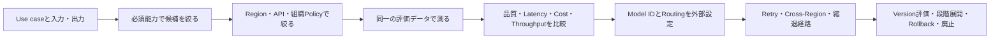
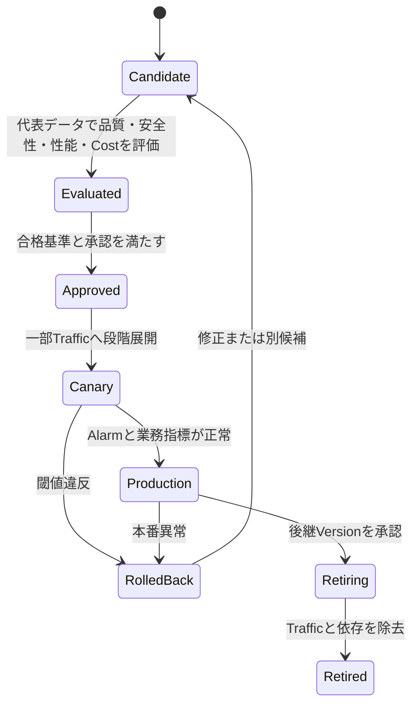

# Foundation Modelを選定・設定する: 理解と判断の補足

## このページの位置づけ

| 項目 | 内容 |
|---|---|
| 対応Task | `D1-02`: FMを選定・設定する |
| 対応Skills | `1.2.1〜1.2.4` |
| 対応する公式解説 | [`01-02-foundation-model-selection-and-configuration.md`](../literal-pages/01-02-foundation-model-selection-and-configuration.md) |
| この補足で身につける判断 | Use caseから必須のModality・Context・Tool use・Regionを先に絞り、品質・Latency・Costで比較する。Model routing、Cross-Region、Customization、SageMaker endpointを目的ごとに選び、切替とLifecycleを設計する。 |

## まず全体像

FM選定では、全候補を一つの総合点だけで順位付けしない。満たせなければ失格となる条件を先に適用し、残った候補を代表Promptで測定する。その後、障害時の経路と、将来のVersion移行までを設計する。



図の要点は、能力やコンプライアンスの必須条件を、価格の安さや平均品質で相殺しないことである。選定を一度きりの決定にせず、構成変更、障害対応、モデル廃止まで続くLifecycleとして扱う。

## Use caseから選定軸へ優先順位を付ける

### 1. 必須の入出力をModalityへ変換する

Use caseの「何を受け取り、何を返すか」を列挙する。画像を理解する必要があるならImage input、音声で対話するならAudio input/output、検索Indexを作るならEmbedding outputが必要になる。必要なModalityに対応しないモデルは、ほかの評価値が高くても候補から外す。

### 2. 1回の処理単位をContextへ変換する

System instruction、会話履歴、検索結果、Tool result、利用者Input、期待するOutputを合わせて必要Contextを見積もる。上限に入るかだけでなく、長いInputが品質、Latency、Token費用へ与える影響も同じ評価条件で測る。Context不足に対し、無条件に大Context modelへ移るとは限らない。履歴要約やRetrievalで必要部分だけを渡せるかも分けて検討する。

### 3. 外部Actionの必要性をTool useへ変換する

データ参照だけでなく、注文、予約、更新など外部Actionをモデルに選択させるならTool use対応を確認する。ただしモデル対応だけでは十分ではない。実行権限、Input validation、Timeout、重複実行防止、失敗時の扱いはアプリケーション側の責務として残る。

### 4. 処理可能な場所をRegionの除外条件にする

使用Region、データ所在地、SCP、IAM、利用可能なEndpointを先に確認する。Cross-Region inferenceを使う場合はSource Regionだけでなく、Profileの全Destination Regionを確認する。地理的境界が必須なら地理別Profileを検討し、Global Profileは除外する。

### 5. Costは単価だけでなく処理全体で比較する

入力・出力Token単価だけでなく、必要Context、平均Output長、再試行、複数Model呼出し、固定Capacity、CustomizationのTraining・Storageを含める。安いModelが再試行や人手修正を増やすなら、業務全体では安いとは限らない。反対に、すべてのRequestで高性能Modelが必要とも限らない。

| 順序 | 問い | 候補を除外する例 | 残った候補で測るもの |
|---:|---|---|---|
| 1 | 必須Modalityを扱えるか | Image inputが必須なのにText専用 | Modalityごとの品質 |
| 2 | 必要ContextとOutputを扱えるか | 必要な処理単位が上限を超える | 長いInputでの品質、Latency、Cost |
| 3 | Tool useと必要APIへ対応するか | Function callingが必須なのに非対応 | Tool選択精度、Schema遵守、失敗率 |
| 4 | Region、所在地、Policyを満たすか | 許可外RegionへRoutingされ得る | 可用性、処理Regionの監査 |
| 5 | 必要なThroughputを実現できるか | 必要Capacity方式がModel非対応 | p95 Latency、Throttling、同時実行 |
| 6 | 品質とCostの閾値を同時に満たすか | 最低品質または単位費用上限を外れる | 代表データでの品質、Latency、Token、概算費用 |

## 3候補を同じ尺度で評価する

次は判断方法を示すための架空例であり、モデル名、数値、評価結果はAWS公式値ではない。

| 候補 | 必須能力 | 品質 | p95 Latency | 1件の概算費用 | 制約 |
|---|---|---:|---:|---:|---|
| Model A | Text、Tool use | 93/100 | 4.8秒 | 4単位 | 高品質だが応答期限が厳しい用途には遅い |
| Model B | Text、Tool use | 86/100 | 1.4秒 | 1単位 | 品質下限が高い用途では不足 |
| Model C | Text、Image、Tool use | 90/100 | 2.6秒 | 2単位 | 必要RegionではCross-Region profile経由のみ |

理解用Use case 1が「画像付き問い合わせ、品質88以上、p95 3秒以内、許可された地理内で処理」であれば、必須ModalityからModel Cだけが残る。ただしCross-Region profileの全Destination Regionが許可範囲内か確認する。Model Aは品質が高くてもImage要件を満たさず、Model Bも同様に除外する。

理解用Use case 2が「Text分類、品質85以上、p95 2秒以内、費用上限2単位」であればModel Bが条件を満たす。Model AはLatencyとCost、Model CはLatencyで除外できる。総合点ではなく、Use caseごとの最低条件で結論が変わる。

## Model IDを外部設定へ分離する

コードに`if provider == ...`を増やし続けると、切替のたびにBuildとDeployが必要になる。変化する値と変換責務を分ける。

```text
Application
  -> Model policy（use case、primary、fallback、許可Region）
  -> AWS AppConfigなどの外部設定（Model ID / Profile ID / Router ARN）
  -> 共通Request契約
  -> Converse、またはProvider adapter
  -> Bedrock Runtime
```

この構成では、Model IDの変更は設定Deploymentとして扱える。AppConfigのValidatorで存在しない値や許可外Familyを拒否し、段階展開とAlarmによるRollbackを使える。ただしRequest契約が互換であることは別途保証する。たとえばText-onlyからMultimodalへ変える場合や、Tool schemaの対応が違う場合は、設定変更だけでは不十分である。

外部設定には少なくとも、論理的な用途名、Primary、Fallback、利用API、RegionまたはInference profile、許可するCapabilities、Configuration versionを関連付ける。アプリケーションLogには秘密情報ではなく、選択した論理用途、Model/Profile/Routerの識別子、Configuration versionを追跡可能な形で残す。

## 「Routing」の三つの意味を分ける

| 方式 | 何を選ぶか | 選択主体 | 選ぶ条件 | 選ばない条件 |
|---|---|---|---|---|
| Application model routing | ProviderやFamilyを含むModelまたは処理経路 | アプリケーションのPolicy | Tenant、Use case、必須能力、独自評価、障害状態で切り替えたい | Routing logicを管理せず、同一Family内の品質・Cost最適化だけをBedrockへ委ねたい |
| Intelligent prompt routing | 同じFamilyの2モデル | Bedrock Prompt router | 英語Promptで、対応モデル間を予測品質差に基づき振り分けたい | 異なるFamilyを選ぶ、独自Telemetryで判断する、2モデル以外を扱う、特殊用途で固定評価を優先する |
| Cross-Region inference | 同じModelを処理するDestination Region | Bedrock Inference profile | 複数Regionの計算資源を使いThroughputと可用性を高めたい | 指定地理外へ処理できない、対象Modelが非対応、Provisioned Throughputが必要 |

三つは併用できる。たとえばアプリケーションがUse caseに応じてPrompt routerを選び、そのRouterが選んだモデルをCross-Region inference profile経由で呼ぶ構成があり得る。ただし、対応表、IAM/SCP、データ所在地を各層で満たす必要がある。

## 障害ごとに継続方法を割り当てる

| 状況 | 最初に検討する制御 | 理由 | 避ける判断 |
|---|---|---|---|
| 短時間のThrottlingまたは一時エラー | 上限付きRetryとBackoff | 一過性なら同じ経路が回復し得る | 即時の無制限Retryで負荷を増やす |
| 同じ依存先で失敗が継続 | Circuit breaker | 失敗中の呼出しを止め、資源浪費と連鎖障害を抑える | 各RequestがTimeoutまで待ち続ける |
| 対応Modelの単一Region容量が不足 | Cross-Region inference | 同一ModelのRequestをProfile内の複数RegionへRoutingできる | 別Modelへの切替と誤認する |
| Region全体の障害で、対象がCross-Region非対応 | 別Regionに事前展開した経路へFailover | Application側で別Endpointを選べる | 障害後に初めて未検証Endpointを作る前提にする |
| Primary modelの停止またはEOL | 評価済みFallback modelへ設定切替 | Model IDを外部設定にしておけばコード変更を避けられる | 品質・Schema互換性を確認せず自動置換する |
| 代替Modelも要件を満たさない | Graceful degradation | 限定機能、検索結果のみ、受付と後処理などへ縮退できる | 不正確な生成結果を通常応答として返す |

Retry、Circuit breaker、Cross-Region、Fallback、Graceful degradationは代替関係ではない。短い一時障害から長期のモデル廃止まで、時間軸と障害範囲が異なるため、層として組み合わせる。

## Bedrock CustomizationとSageMaker endpointの選択境界

| 判断軸 | Amazon Bedrock Model customization | SageMaker AI endpoint |
|---|---|---|
| Modelの出発点 | BedrockがCustomization対象として掲載するBase model | 自社Model、JumpStartのModel、独自Containerを含む、より広いDeployment選択 |
| Training方式 | 対応ModelごとのSupervised fine-tuning、Reinforcement fine-tuning、Distillation | Training frameworkやPEFT方式を含め、利用者がPipelineとArtifactをより細かく管理 |
| Servingの管理 | 対象Base model、Customization実施日、Regionが対応するときはOn-demand Custom model deployment、それ以外は対応するProvisioned Throughputを確認 | Instance、Container、Network isolation、Auto Scalingなどを構成するEndpoint |
| Versionと承認 | Custom modelとDeploymentを管理し、Application側の設定・評価と結び付ける | Model RegistryでVersion、Metadata、Lineage、Stage、Approvalを管理できる |
| 運用責任 | 基盤管理をBedrockへ多く委譲する | Deployment構成、Capacity、Container互換性などの判断範囲が広い |
| 選ぶ境界 | 対象Model・Region・方式で要件を満たし、ManagedなBedrock Runtimeを維持したい | Bedrock非対応Model、独自Artifact/Container、細かなServing制御、SageMaker中心のMLOpsが必要 |

「Customizationが必要なら常にSageMaker」でも「Managed serviceなら常にBedrock」でもない。最初に対象Base modelと必要Training方式がBedrockの現行対応表にあるか確認する。対応し、Serving要件も満たすならBedrockが候補になる。非対応のModelや独自Container、Instance選択、SageMaker Model Registryを中心とする承認・展開が必要ならSageMaker AI endpointが候補になる。

## Version評価から廃止までを一つのLifecycleにする



これは理解のためのLifecycle整理であり、Bedrockの公式なモデル状態そのものではない。Bedrockの公式状態は`Active / Legacy / EOL`である。アプリケーション側では、その公式状態を監視しながら、候補、評価、承認、段階展開、Rollback、廃止を管理する。

新Versionは同じ代表データとPrompt versionで現行Versionと比較する。品質だけでなく、Safety、Schema遵守、Latency、Token、費用、Tool useを確認する。段階展開ではConfiguration versionとModel versionを対応付け、異常時に直前の評価済み組み合わせへ戻せるようにする。

Legacy通知は移行開始のSignalであり、EOLまで待つ理由ではない。EOLでRequestが失敗する前に、後継候補の互換性評価、Capacity確認、段階展開、切替、旧VersionへのTraffic停止を終える。EOL後の自動Migrationはない。

## 理解用シナリオ

> これは理解のために作成した例であり、実際の認定試験問題ではない。数値と会社要件は架空である。

ある企業は、英語の顧客問い合わせへ回答し、必要に応じて注文照会Toolを呼ぶ。Text input、Tool use、p95 3秒以内、1件当たりの費用上限が必須である。データはEU内だけで処理する。通常Promptでは低Cost modelを使い、難しいPromptでは同じFamilyの高品質Modelを使いたい。モデル障害時にも、注文状況の検索結果だけは返したい。

### 判断

まずText、Tool use、Context、EUでの利用とAPI互換性を満たすモデルだけを残す。EU内処理が必須なので、Cross-Regionを使うならEU地理別Profileの全Destination Regionを確認し、Global Profileは除外する。候補を同じ問い合わせデータで評価し、品質、p95 Latency、Token、費用、Tool選択精度を測る。

Promptごとの品質・Cost最適化には、対応する同一Familyの2モデルでIntelligent prompt routingが候補になる。英語以外のPromptや、企業独自TelemetryでRoutingしたい場合はこのRouterだけでは要件を満たさず、Application routingを選ぶ。

Model ID、Profile ID、Router ARNは外部設定へ置き、Validatorと段階展開を設定する。一時的なThrottlingには上限付きRetry、継続障害にはCircuit breakerを使う。生成を安全に継続できない場合は、注文照会Toolの検証済み結果だけを返すGraceful degradationへ移る。これにより「別Modelで生成を続けること」と「生成機能を縮退すること」を分けられる。

## 横断的な注意点

- セキュリティとコンプライアンス: Cross-Regionでは全Destination Region、SCP、IAM、Logの処理場所を確認する。Model切替後も最小権限と入出力Controlを保つ。
- 可用性: Retryだけで長期障害を解決しない。Circuit breaker、複数Region、評価済みFallback、Graceful degradationを障害範囲に合わせる。
- 性能: Model単体の平均Latencyだけでなく、Routing、Tool、Retryを含むEnd-to-endのp95またはp99を測る。
- コスト: Token単価だけでなく、入力長、出力長、再試行、Provisioned capacity、Training、Storage、人手修正を含める。
- Lifecycle: Model、Prompt、Adapter、評価データ、Application configurationのVersionを対応付け、どの組み合わせをRollbackするか明確にする。

## 理解を確認する

- Modality、Context、Tool use、Regionのうち、どれを除外条件にし、どれを測定比較にするかUse caseから説明できるか。
- Converse対応とModel IDの外部設定が、Provider切替のどの問題を解決し、どの互換性問題を解決しないか説明できるか。
- Application routing、Intelligent prompt routing、Cross-Region inferenceがそれぞれ何を選ぶ仕組みか説明できるか。
- Throttling、継続障害、Region障害、Model EOLへ、Retry、Circuit breaker、Cross-Region、Fallback、Graceful degradationを割り当てられるか。
- Bedrock CustomizationとSageMaker AI endpointを、対象Model、Training方式、Serving制御、MLOps責任から比較できるか。
- `Active / Legacy / EOL`と、アプリケーション側の評価・承認・段階展開・Rollback・廃止を区別できるか。

## 根拠と補足の区別

- 公式情報: Task 1.2の4 Skills、Bedrockのモデル選定軸とAPI互換性、Inference profile、Cross-Region inference、Intelligent prompt routing、Customization、SageMaker AIのDeployment選択肢とModel Registry、Bedrockの`Active / Legacy / EOL`。
- 補助的な整理: 選定順序、架空の3候補採点、Routing三方式の比較、障害別の制御割当、BedrockとSageMakerの選択境界、アプリケーション側Lifecycle図、架空シナリオ。

## 公式資料

- [AIP-C01 Content Domain 1](https://docs.aws.amazon.com/aws-certification/latest/ai-professional-01/ai-professional-01-domain1.html) — Skills 1.2.1〜1.2.4の判断範囲
- [Model availability and compatibility](https://docs.aws.amazon.com/bedrock/latest/userguide/models.html) — モデル選定軸と互換性確認の入口
- [API compatibility](https://docs.aws.amazon.com/bedrock/latest/userguide/models-api-compatibility.html) — 共通APIとモデル固有互換性の境界
- [Inference profiles](https://docs.aws.amazon.com/bedrock/latest/userguide/inference-profiles.html) — System-defined/Application profileの役割
- [Supported Regions and models for inference profiles](https://docs.aws.amazon.com/bedrock/latest/userguide/inference-profiles-support.html) — Model、Source Region、Destination Regionの確認
- [Cross-Region inference](https://docs.aws.amazon.com/bedrock/latest/userguide/cross-region-inference.html) — 地理別・Global Profile、データ所在地、SCP、監査
- [Intelligent prompt routing](https://docs.aws.amazon.com/bedrock/latest/userguide/prompt-routing.html) — 同一Familyの2モデル、Fallback、Routing criteria、制約
- [Customize your model](https://docs.aws.amazon.com/bedrock/latest/userguide/custom-models.html) — BedrockのCustomization方式
- [Model lifecycle](https://docs.aws.amazon.com/bedrock/latest/userguide/model-lifecycle.html) — Active、Legacy、EOLとMigration条件
- [AWS AppConfig](https://docs.aws.amazon.com/appconfig/latest/userguide/what-is-appconfig.html) — 設定分離、Validator、段階展開、Rollback
- [Handling errors in Step Functions workflows](https://docs.aws.amazon.com/step-functions/latest/dg/concepts-error-handling.html) — Retry、Backoff、Jitter、CatchによるFallback
- [Definitions - Agentic AI Lens](https://docs.aws.amazon.com/wellarchitected/latest/agentic-ai-lens/definitions.html) — Circuit breakerとGraceful degradationの判断根拠
- [Deploy models for inference in SageMaker AI](https://docs.aws.amazon.com/sagemaker/latest/dg/deploy-model.html) — EndpointとServing制御の選択肢
- [SageMaker Model Registry](https://docs.aws.amazon.com/sagemaker/latest/dg/model-registry.html) — Version、Lineage、Approval、CI/CD
- [Provisioned Throughput](https://docs.aws.amazon.com/bedrock/latest/userguide/prov-throughput.html) — 固定CapacityとInference profileの選択条件
- [Deploy a custom model for on-demand inference](https://docs.aws.amazon.com/bedrock/latest/userguide/deploy-custom-model-on-demand.html) — On-demand対応の対象Base model、Customization実施日、Region
- [Amazon Bedrock pricing](https://aws.amazon.com/bedrock/pricing/) — 価格比較時の現行情報

最終確認日: 2026-09-22
