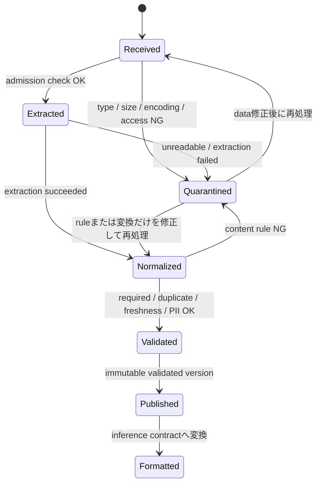

# FM入力用のデータ検証・処理Pipeline: 理解と判断の補足

## このページの位置づけ

| 項目 | 内容 |
|---|---|
| 対応Task | `D1-03`: FM入力用のデータ検証・処理Pipelineを実装する |
| 対応Skills | `1.3.1〜1.3.4` |
| 対応する公式解説 | [`01-03-data-validation-and-processing.md`](../literal-pages/01-03-data-validation-and-processing.md) |
| この補足で身につける判断 | モダリティごとの処理差を見分け、検証・正規化・隔離・再処理の順序を設計し、Converse、JSON Schema、SageMaker endpoint payloadを要件に応じて使い分ける。 |

## まず全体像

このTaskの判断軸は、「どのAWSサービスなら全部できるか」ではない。各段階で守る契約を分け、データの状態に合う処理を選ぶことである。

1. 受付契約: file type、size、encoding、権限を満たすか
2. 内容契約: 必須値、重複、鮮度、PII、言語などが用途に合うか
3. 推論契約: 呼び出すBedrock modelまたはSageMaker containerが読める形か
4. 出力契約: 下流systemがmodel応答を安全にparseできるか

この四つを一度の「validation」にまとめると、どこで失敗したか分からなくなる。原本と変換後dataを区別し、各gateの結果を残すと、修正すべきdataと規則を切り分けられる。

## Modality別Pipelineの共通点と差

全モダリティに共通するのは、原本を受け付け、内容を抽出し、用途に合わせて整え、品質を検証し、検証済み版を推論契約へ変換する流れである。異なるのは「内容を抽出する方法」と「失ってはいけないmetadata」である。

| モダリティ | 抽出で重要な処理 | 保持すべき情報 | 選びやすいAWS機能 | 選ばない条件 |
|---|---|---|---|---|
| Text・文書 | 文字・段落・表・fieldの抽出、encodingと言語の確認 | source、page、section、版、更新日 | BDA、Comprehend、Lambda | 視覚的類似そのものを検索したいのにtext化だけで済ませない |
| Image | OCR・caption化、または画像のままembedding | source image、座標・page、confidence | Knowledge BasesではBDA経路でtext表現を抽出、Nova Multimodal Embeddingsでimage類似検索 | OCR結果だけでは図形・配置の類似性が必要な要件を満たさない |
| Audio | transcription、話者・segment・timestampの関連付け | 元音声、開始・終了timestamp、言語 | BDAまたはTranscribe。検索目的によりmultimodal embedding | 発話内容をtext検索したいときに、speechを意味あるtextへ変換しない方式を選ばない |
| Tabular | schema、型、欠損、一意性、範囲、鮮度の検査 | row ID、schema version、変換履歴 | Glue Data Quality、Data Wrangler、SageMaker Processing | 表全体の品質検証をdocument抽出だけへ委ねない |

ImageとAudioでは、元dataをtextへ変換するか、native modalityのままembeddingにするかが大きな分岐になる。質問や回答がtext中心で、音声中の発話や画像中の文字を検索するならtext化がつながりやすい。image-to-image類似検索なら、OCR textだけに変換すると必要なvisual signalを失うため、native multimodal embeddingを検討する。

## 検証・正規化・隔離・再処理の順序

一つのvalidationを最後に置くのではなく、安価で確実な検査を前に、内容を理解しないとできない検査を後に置く。



図の要点は、隔離を終点にしないことである。再処理の入口は、失敗原因によって変える。原本のformatが壊れていれば受付からやり直す。正規化規則だけを直したなら、保存済みの抽出結果から再開できる。ただし、抽出modelや抽出設定を変えた場合は、古い抽出結果を使い回さず、その段階から再実行する。

### 正規化を検証の前後へ分ける

「検証してから正規化」か「正規化してから検証」かは二者択一ではない。

- 正規化前: file type、size、checksum、encoding、必須source metadataなどを検査する。処理不能なdataを早く落とす。
- 正規化後: 空白・大文字小文字・日付・単位をそろえた値に対して、重複、一意性、許容値、業務上の完全性を検査する。
- 正規化前後の両方: 原本と正規化値の対応を残す。PIIのように変換で位置や意味が変わり得る情報は、適用時点を明示する。

重複排除も同じである。file checksumはbyte単位の同一fileを見つける。正規化した業務IDは、表記が違う同一recordを見つける。両者は置き換えられない。

### 再処理可能にする最小情報

再処理には少なくとも、source ID、source versionまたはchecksum、処理規則version、抽出・正規化のversion、実行ID、状態、失敗理由、出力先が必要になる。これは特定サービスの必須schemaではなく、処理の冪等性と監査性を考えるための補助的な整理である。

同じsource versionと同じ規則versionの組み合わせを二重に公開しない識別子を持たせると、retryによる重複登録を避けやすい。一方、規則versionが変わった再処理は新しい検証結果として区別する。

## Converse・JSON Schema・Endpoint payloadを選ぶ条件

三つは同じ階層の選択肢ではない。最初に「どこで推論するか」と「会話形式が必要か」を決め、その後に「応答をschemaへ拘束するか」を決める。

| 要件・状況 | 選ぶ契約 | 判断理由 | 除外または追加確認する条件 |
|---|---|---|---|
| Bedrockのmessage対応modelでmulti-turn会話を作る | Converseの`messages` / `role` / `content` | 対応modelに共通の会話interfaceで履歴とmultimodal ContentBlockを表せる | modelが必要なContentBlockを支援しない場合は除外。会話履歴はrequest側で渡す |
| Bedrockの応答を下流systemが機械処理する | 対応APIにJSON Schemaのstructured outputsを追加 | 出力をschemaへ適合させ、独自parseやretryを減らせる | 対応modelとschema subsetを確認。これは入力transportの代替ではない |
| FMにtoolを選ばせ、tool引数を厳密にしたい | `toolConfig`のinput schemaと`strict: true` | tool名と引数を定義したschemaへ適合させる | 最終text応答のschema制約とは目的が異なる |
| SageMaker AIでcustom model/containerをhostする | `InvokeEndpoint`とcontainer固有payload | body bytes、`ContentType`、response schemaをcontainer実装に合わせられる | Converse形式をそのまま受けるとは限らない。endpoint方式ごとのpayload上限を確認 |
| 単にJSONをpromptで依頼する | promptだけではなくstructured outputsを検討 | 「JSONで答えて」というinstructionとschema適合保証は異なる | structured outputs非対応modelではapplication側validationとretryが必要 |

判断を短く表すと次のようになる。

```text
Bedrockのmessage対応modelか?
├─ はい: Converseを候補にする
│  └─ 下流が固定schemaを必要とするか?
│     ├─ はい: 対応modelならJSON Schemaのstructured outputsを追加
│     └─ いいえ: 通常のtext responseを扱う
└─ いいえ / custom modelをSageMakerでhost:
   └─ containerが定義するContentType・body・response契約を使う
```

JSON SchemaはConverseと競合する方式ではなく、Converse requestへ追加できる出力契約である。SageMaker endpointでもJSONをpayloadにできるが、それはcontainerが読む入力formatであり、Bedrock structured outputsの保証とは別である。

## 要件から検証手段を選ぶ

| 要件 | 選びやすい手段 | 理由 | 選ばない方式と条件 |
|---|---|---|---|
| Data Catalog上のdatasetを定期的に評価したい | Glue Data Quality for Data Catalog | 規則のrecommendation、schedule、継続monitoringに向く | 不合格rowを直接分けたい要件では、Data Catalog経路だけにしない |
| ETL中に不合格rowを隔離したい | Glue Data Quality for ETL jobs | row-level結果を取得し、load前にfilterできる | nested/listをflattenせずに直接評価しない |
| 任意fileの受付条件を軽量に判定したい | Lambdaなどのcustom validation | extension、MIME、size、metadataなどの契約を入口で判定できる | 大規模な表品質評価を全件Lambdaだけへ集約しない |
| document/image/audioからstructured fieldを抽出したい | BDA | modality別のstandard outputとblueprintによるcustom outputを使える | Tabular datasetの列品質管理をBDAだけで代替しない |
| textからentityやPII候補を検出したい | Amazon Comprehend | entity type、offset、confidenceを得られる | PII検出は英語またはスペイン語のtext文書が対象であり、entity検出と対応言語を同一視しない。sizeも確認し、検出結果を利用許可と同一視しない |

## 理解用シナリオ

> これは理解のために作成した例であり、実際の認定試験問題ではない。

ある社内assistantは、PDFの手順書、製品画像、support callの音声、製品masterの表を取り込む。利用者はtextで検索する。音声中の発話と画像内の文字も検索対象である。回答には、下流ticket systemが読む`answer`、`source_ids`、`needs_review`の三fieldが必要である。推論modelはAmazon BedrockのConverse対応modelを使う。

### 判断

PDFと画像はBDAで文字・field・visual descriptionを抽出し、音声はBDAまたはAmazon Transcribeでtranscriptとtimestampを得る。text queryで発話と画像内文字を検索する要件なので、native visual similarityだけを目的とする経路は中心にしない。表はGlue Data Qualityで必須列、主key、欠損、鮮度を検査する。

受付時にfile type、size、checksumを検査し、抽出後に必須field、PII、言語、業務IDの重複を検査する。不合格dataは理由とsource versionを付けて隔離する。元fileを修正した場合は受付から、抽出規則だけを修正した場合は保存済み原本から抽出をやり直す。

推論inputはConverseの`messages`とContentBlockへ整形する。ticket systemの三fieldを保証するため、対応modelでJSON Schemaのstructured outputsをConverse requestへ追加する。JSON Schemaを選んだからConverseをやめるのではない。SageMaker endpoint payloadは、custom containerでhostするという要件がないため選ばない。

## 横断的な注意点

- セキュリティ: 原本、隔離data、抽出結果、prompt、logへPIIが複製され得る。検出だけで完了とせず、暗号化、access control、保持、redaction、log内容を段階ごとに定める。
- Data residency: BDAはcross-Region処理を前提とする。保存場所だけでなく、requestと結果が処理中に移動し得るRegionを確認する。
- 可用性: 大量fileや外部service failureではretryが起きる。source versionと規則versionを識別し、同じ結果の二重公開を防ぐ。
- 性能: 受付時の安価な検査を先に行い、処理不能fileへOCRやtranscriptionを実行しない。structured outputsでは新しいschemaの初回compileに時間がかかり得る。
- コスト: Image・Audioの抽出、transcription、embedding、再処理は別々の費用要因になる。変更のない段階から再開できるよう中間結果とversionを管理する。
- 観測性: accepted、quarantined、reprocessedの件数、rule別failure、処理時間、retry、schema versionを記録する。全体scoreだけでは重大な一規則の失敗を見落とす。

## 理解を確認する

- Imageをtext化する経路とnative multimodal embeddingを使う経路を、query typeと保持したい情報から選べるか。
- Audioのtranscriptだけでなくtimestampとsource参照を保持する理由を説明できるか。
- format/size検査、正規化、内容検証をどの順で置き、失敗ごとにどこから再処理するか説明できるか。
- file checksumによる重複と、正規化した業務IDによる重複の違いを説明できるか。
- Converse、JSON Schemaのstructured outputs、SageMaker endpoint payloadが、どの層の契約か説明できるか。
- Glue Data QualityのData Catalog経路とETL job経路を、不合格rowの隔離要件から選べるか。

## 根拠と補足の区別

- 公式情報: Task 1.3の4 Skills、BDAとMultimodal Knowledge Basesの処理、Glue Data Qualityの規則と二つの入口、Converseのmessage形式、Bedrock structured outputs、SageMaker endpointのcontainer契約。
- 補助的な整理: 四層のdata契約、状態遷移図、前後二段階のvalidation、再処理用metadata、選定表と架空scenario。

## 公式資料

- [AIP-C01 Content Domain 1](https://docs.aws.amazon.com/aws-certification/latest/ai-professional-01/ai-professional-01-domain1.html) — Task 1.3とSkills 1.3.1〜1.3.4
- [What is Bedrock Data Automation?](https://docs.aws.amazon.com/bedrock/latest/userguide/bda.html) — multimodal抽出、structured output、API-driven processing
- [Prerequisites for using Bedrock Data Automation](https://docs.aws.amazon.com/bedrock/latest/userguide/bda-limits.html) — modality・API方式別の入力条件
- [Cross Region support required for Bedrock Data Automation](https://docs.aws.amazon.com/bedrock/latest/userguide/bda-cris.html) — cross-Region処理とdata residency判断
- [Build a knowledge base for multimodal content](https://docs.aws.amazon.com/bedrock/latest/userguide/kb-multimodal.html) — ingestionからretrievalまでの段階、metadata
- [Choosing your multimodal processing approach](https://docs.aws.amazon.com/bedrock/latest/userguide/kb-multimodal-choose-approach.html) — text変換とnative multimodal embeddingの比較
- [AWS Glue Data Quality](https://docs.aws.amazon.com/glue/latest/dg/glue-data-quality.html) — Data CatalogとETL jobの機能差、不合格data、monitoring
- [Evaluating data quality with AWS Glue Studio](https://docs.aws.amazon.com/glue/latest/dg/data-quality-gs-studio.html) — ruleとactionをETL jobへ組み込む手順
- [DQDL rule type reference](https://docs.aws.amazon.com/glue/latest/dg/dqdl-rule-types.html) — completeness、uniqueness、freshness、file検査
- [Inference using Converse API](https://docs.aws.amazon.com/bedrock/latest/userguide/conversation-inference.html) — 会話requestとContentBlock
- [Making inference requests](https://docs.aws.amazon.com/bedrock/latest/userguide/inference.html) — Bedrock Runtimeの推論APIの位置づけ
- [Get validated JSON results from models](https://docs.aws.amazon.com/bedrock/latest/userguide/structured-output.html) — JSON Schemaとstrict tool useの位置づけ
- [Model Hosting FAQs](https://docs.aws.amazon.com/sagemaker/latest/dg/hosting-faqs.html) — SageMaker endpointのpayloadとcontainer契約
- [Transform Data with SageMaker Data Wrangler](https://docs.aws.amazon.com/sagemaker/latest/dg/data-wrangler-transform.html) — 欠損・文字列・型の変換
- [Detecting PII entities](https://docs.aws.amazon.com/comprehend/latest/dg/how-pii.html) — PII検出とredaction

最終確認日: 2026-09-22
