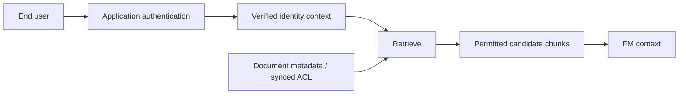
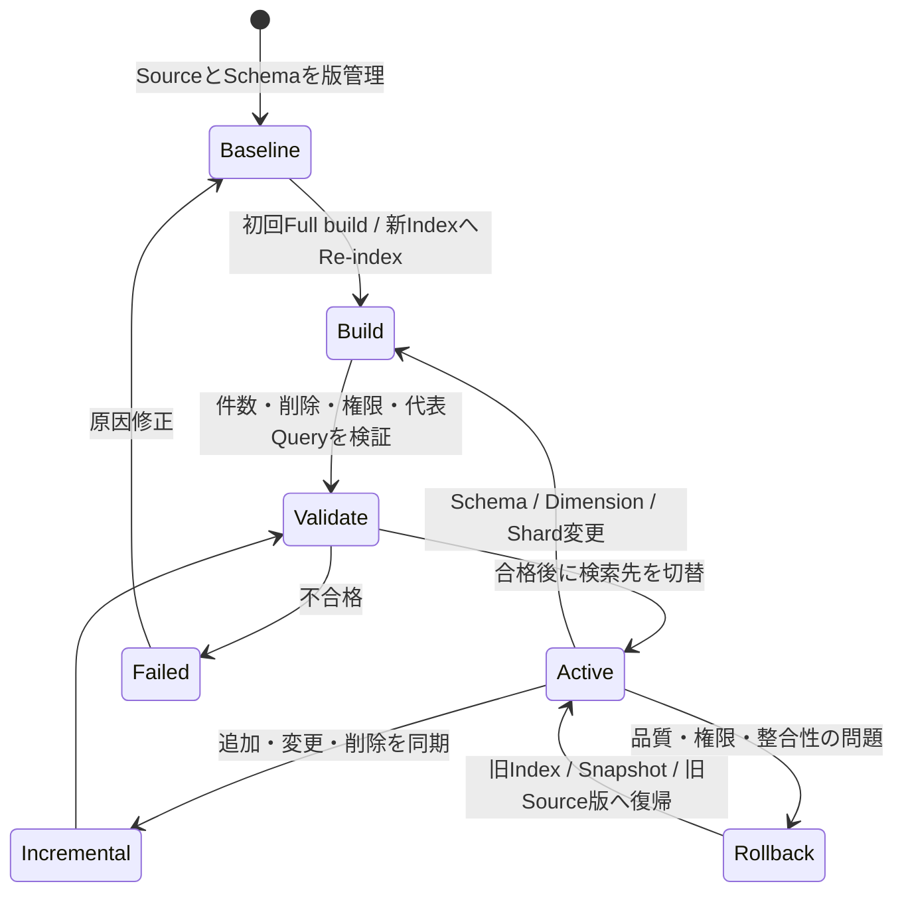

# Vector Storeを設計・実装する: 理解と判断の補足

## このページの位置づけ

| 項目 | 内容 |
|---|---|
| 対応Task | `D1-04`: Vector Storeを設計・実装する |
| 対応Skills | `1.4.1〜1.4.5` |
| 対応する公式解説 | [`01-04-vector-store-design.md`](../literal-pages/01-04-vector-store-design.md) |
| この補足で身につける判断 | 管理範囲、既存Data、Query、Metadataと認可、Scale、鮮度からStoreとIndex境界を選び、同期、削除、Re-index、RollbackまでのLifecycleを説明できるようにする。 |

## まず全体像

Vector Store設計では、検索速度だけを比較しない。次の四つの問いを順に結び付ける。

1. 誰がInfrastructure、Index schema、Capacity、Embeddingと同期を管理するか。
2. Vector検索と一緒に、どのMetadata、Keyword検索、Transaction、Graph関係を扱うか。
3. End userの権限を、取り込みと検索のどこで強制するか。
4. 更新や削除の失敗時に、どのVersionへ戻せるか。

この順序なら、「Vector検索ができる」という共通点だけでStoreを選ぶのを避けられる。

## Storeを管理範囲とQueryで比較する

| 選択肢 | 選びやすい条件 | 利用者が設計する主な部分 | 除外しやすい条件 |
|---|---|---|---|
| Bedrock Managed Knowledge Base | Ingestion、Storage、Indexing、Retrievalの運用をAWSへ委ねたい。Managed connector、Document-level ACL、Agentic retrievalを使いたい | Data source、IAM、検索利用側、必要なら独自Model | Physical Index、Shard、Engine parameterを細かく制御する必要がある |
| OpenSearch Serverless | Vector検索とMetadata／Keyword検索を使い、Server管理を減らしたい | Collection、Index mapping、Security policy、Capacity上限、検索設定 | 既存のRelational dataとTransactionを同じDatabaseで扱うことが主目的 |
| OpenSearch Managed Cluster | Node、Shard、Replica、Index、Vector engineをWorkloadに合わせて管理したい | Domain capacity、Shard、Replica、Index、Upgrade、Snapshot、Monitoring | Cluster運用を避けることが最優先 |
| Aurora PostgreSQL／pgvector | 既存のPostgreSQL data、SQL、TransactionとVectorを近くに置きたい | Aurora capacity、Schema、pgvector、HNSW／GIN Index、Data API、Secret | 検索専用Clusterの機能を優先し、Relational integrationが不要 |
| Amazon S3 Vectors | Query頻度が低く、InfrastructureをProvisioningせず大規模VectorをCost-efficientに保持したい | Vector bucket／Index、Metadata、IAM、対応Region | Binary Vectorが必要、または高頻度Queryで別Storeを測定済み要件として必要とする |

「Managed store」は単一のDatabase product名として扱わない。Bedrock Managed Knowledge BaseではStorageとIndexingの実装をBedrockが管理する。Customer-managed Knowledge Baseでは、OpenSearch、Auroraなど具体的なStoreを自分で選ぶ。この管理境界の違いが最初の分岐である。

## Metadataを検索条件と認可へつなげる

Metadata Schemaは、便利そうな属性を集める表ではない。検索時の判断へ使える形で、Data owner、更新元、型、欠損時の扱いを決める契約である。

| 属性例 | 主な用途 | Schemaで先に決めること | 失敗例 |
|---|---|---|---|
| `document_id` | 更新・削除・追跡 | Source内での一意性、Chunkとの対応 | File名変更で別文書として二重登録される |
| `version` | 現行版の選択、Rollback検証 | 比較可能な形式、現行版の決め方 | 新旧版が同時に検索される |
| `department` | Domain filter | 許容値、Owner、複数所属の扱い | 表記揺れでFilterから漏れる |
| `visibility`／`groups` | 検索候補の絞り込み | Identityとの対応、Default deny | 欠損値を公開扱いにしてしまう |
| `created_at`／`expires_at` | 鮮度、有効期限 | Date表現、Timezone、境界値 | 文字列順と時刻順を混同する |
| `source_uri` | Citation、監査 | 永続Identifier、閲覧権限 | Linkが存在しても利用者が開けない |

Metadata filterは候補集合を狭めるが、Applicationの認証を代替しない。安全な流れは、ApplicationがUserを認証し、確認済みの所属やRoleを検索条件へ変換し、StoreまたはManaged ACLが候補を絞り、取得後も出典のAccessを確認することである。

図の要点は、`department=finance`のような値をClientから無検証で受け取らないことである。Metadataは認可判断のInputになっても、Identityの正しさはApplication側で保証する。

## Approximate searchのTrade-offを読む

Exact searchはQuery Vectorを全候補と比較しやすいが、Data量とQuery量が増えると計算量が増える。Approximate nearest neighbor（ANN）はHNSWなどのIndexを使い、探索範囲を絞ってLatencyとThroughputを改善する代わりに、真の最近傍を常にすべて返す保証を緩める。

| 調整対象 | 強めたときに期待する効果 | 代償または確認事項 |
|---|---|---|
| Vector Dimension | Modelが表現できる情報量はModel仕様に従う | Storage、Memory、計算量。IndexとModelのDimension一致が必須 |
| ANNの探索量 | Recall改善の可能性 | Query latencyとCPU／Memory消費 |
| `k`／取得件数 | Relevant chunkを取りこぼしにくくする | Noise、Reranking／FM context量、Cost |
| Shard数 | DataとQueryをNodeへ分散 | 多すぎるShardのOverhead、Shardごとの候補統合、Recovery |
| Replica数 | Read capacityとAvailability | StorageとWrite cost |
| Multi-index | DomainごとのSchema、Lifecycle、Routingを分離 | 複数IndexへのQuery fan-out、運用対象の増加、横断検索の統合 |

Dimensionを大きくすることと検索精度を上げることを同義にしない。DimensionはEmbedding modelが対応する値から選び、代表QueryでRetrieval quality、p95 latency、Index size、Costを同時に測る。

## Single index、Shard、Multi-indexを混同しない

- Shardは一つのIndexを分散する単位であり、業務上の認可境界そのものではない。
- Multi-indexは複数のIndexを分けるArchitectureであり、Domain、Tenant、Schema、Embedding model、Lifecycleの独立性を作れる。
- Metadata filterは同じIndex内の候補を絞る。Filter可能な属性で十分なら、Indexを増やさずに済む場合がある。

Tenantごとに削除期限、Embedding model、Schema、運用担当が異なるならMulti-indexを検討しやすい。違いが`department`だけで、同じSchema、同じLifecycle、同じ認可実装ならMetadata filterで足りる可能性がある。どちらも常に正解ではなく、分離による安全性と、横断Query・運用の複雑さを比較する。

## Connectorと権限境界を選ぶ

| 要件・状況 | 選びやすい方式 | 判断理由 | 選ばない方式と条件 |
|---|---|---|---|
| S3の文書を標準的に同期する | S3 data source + Sync | 初回取り込み後は追加・変更・削除をIncrementalに処理できる | 変更を即時反映する必要があるならScheduleだけでは不足 |
| Applicationが文書変更Eventを持つ | S3またはCustom data sourceのDirect ingestion | APIで追加・更新・削除を一Actionで反映できる | S3をSource of truthにするならS3側を更新しない運用は除外 |
| SharePointの文書ACLを検索へ反映したい | Managed Knowledge Base + ACL-enabled SharePoint connector | Sync済みACLとQuery時確認を利用できる | Web CrawlerはDocument-level ACL非対応。Customer-managedの新規SharePoint connectorは2026-09-30以降作成不可予定 |
| 独自DMS／Wikiに標準Connectorがない | Custom data sourceまたは独自Ingestion component | Source APIから安定した文書ID、Content、Metadataを渡せる | CrawlerだけでSourceの権限や削除を正確に追跡できない場合 |

ConnectorのCredentialはSecrets Managerなどへ置き、Bedrock service roleには対象Source、Secret、KMS key、Vector Storeへの必要Actionだけを許可する。End userの検索権限は、このService-to-service権限と分けて設計する。

## 同期からRollbackまでをLifecycleにする

Lifecycleは「Sync jobが成功した」で終わらない。検索結果の鮮度と安全性まで検証し、戻す経路を用意する。

図では、Incremental syncと全面Re-indexを分けている。小さなContent変更はIncremental syncで扱える。一方、Embedding model、Dimension、Chunking、Schema、Primary shard数を変える場合は、別Indexを構築し直して比較する方が安全である。

Lifecycleごとの確認項目は次のとおりである。

| 段階 | 確認するEvidence | 失敗時のAction |
|---|---|---|
| Change detection | Source event、更新時刻、Connectorの差分検知、安定した文書ID | 未検知Sourceを再走査し、Connector設定を修正 |
| Incremental sync | Job status、追加／変更／削除件数、Warning、代表Query | 失敗文書だけ修正し再Sync。検索結果が旧版のままなら反映遅延とID重複を確認 |
| Tombstone／論理削除 | `active=false`や`deleted_at`を使う場合、全Queryが必ず除外すること | Filter漏れがあり得るなら物理削除を優先し、再Indexで残存Chunkを除去 |
| Re-index | 新旧の文書・Chunk件数、Metadata、Recall、Latency、権限Negative test | 新IndexをActiveにしない |
| Cutover | AliasまたはApplication設定が検証済みIndexを指すこと | 旧Indexへ戻す |
| Rollback | 旧Index、Snapshot、Source version、Embedding／Schema versionが対応すること | 対応関係が不明なら切替を進めない |

`tombstone`はこの補足で使う一般的な論理削除Patternであり、Bedrock Knowledge Basesが必須にする名称ではない。論理削除を使うなら、通常Query、Fallback Query、管理用Queryを含む全経路で除外されることをTestする。法令・権限上、削除済みContentが検索候補に残ることを許容できない場合は、物理削除と再検索による確認が必要になる。

## 理解用シナリオ

> これは理解のために作成した例であり、実際の認定試験問題ではない。数値は置かず、判断軸だけを示す。

ある企業は、既存のAurora PostgreSQLに製品MasterとAccess groupを持ち、S3のManualを検索する社内Assistantを作る。更新は一日数回で、Userは所属Groupの現行Manualだけを検索できる必要がある。将来Embedding modelを変更するとき、問題があれば旧検索へ戻したい。

### 判断

既存のRelational dataとのSQL連携とTransactionを重視するなら、Aurora PostgreSQL／pgvectorが候補になる。Vector専用検索の独立Scale、Shard制御、Keywordとの大規模Hybrid検索が主要件ならOpenSearchを比較に残す。Infrastructure運用を最小化し、Managed connectorとACLを優先するならBedrock Managed Knowledge Baseも候補になる。

どのStoreでも、`document_id`、`version`、`groups`、`effective_from`、`expires_at`、`source_uri`を一貫した型で持たせる。ApplicationがUserを認証し、確認済みのGroupをMetadata filterに使う。Document-level ACLを使う場合は、確認済みのUser identity contextを渡し、Connector側のACL filteringに委ねる。Clientが任意に指定したGroupをそのまま検索条件へ使わない。

日常更新はIncremental syncで処理し、削除した旧Manualが検索されないことをNegative testする。Embedding model変更時はDimensionとChunkingが変わり得るため、新Indexへ全面Re-indexする。代表Query、権限、件数、Latencyが合格してから検索先を切り替え、旧Indexを保持してRollback可能にする。旧Indexを先に上書きする方式は、比較と迅速な復帰が難しいため除外する。

## 横断的な注意点

- セキュリティ: Service roleの取込権限とEnd userの検索認可を分離する。Metadata欠損時は公開ではなく除外する設計を検討する。
- 可用性: ReplicaやMulti-AZだけでなく、Source再取得、Index再構築、旧IndexまたはSnapshotからの復帰時間を確認する。
- 性能: ANN、Shard、Filter、`k`、Rerankingを個別ではなくEnd-to-endで測る。Selective filterは候補不足を起こすことがある。
- コスト: Vector数、Dimension、Replica、常時Capacity、Sync頻度、Re-index時の二重保持、Query頻度を含める。
- 鮮度: Sync scheduleは最大許容Stalenessから決める。Job完了時刻とDataの最終更新時刻を別々に観測する。

## 理解を確認する

- Bedrock Managed Knowledge Base、OpenSearch、Aurora PostgreSQL／pgvectorを、管理範囲、Query、Metadata、Scale、Rollbackで比較できるか。
- Metadata filter、Document-level ACL、Application authenticationの責務の違いを説明できるか。
- Approximate searchがLatencyを改善する代わりに、RecallとResourceへどのTrade-offを持つか説明できるか。
- ShardとMulti-indexの違いを説明し、Metadata filterで足りる条件を示せるか。
- Full build、Incremental sync、Change detection、削除、Tombstone、Re-index、Cutover、Rollbackを一つのLifecycleとして説明できるか。
- Data source削除時の`RETAIN`と`DELETE`が検索結果へ与える違いを説明できるか。

## 根拠と補足の区別

- 公式情報: Task 1.4の5 Skills、Knowledge Basesの管理方式と対応Store／Connector、Metadata typeと上限、OpenSearchのk-NN／Shard、Aurora pgvector、Incremental sync、Direct ingestion、Data deletion policy、OpenSearchのRe-index／Alias／Snapshot機能。
- 補助的な整理: Store比較の除外条件、Metadata Schema例、ANN Trade-off表、Single indexとMulti-indexの選び方、Lifecycle図、Tombstone pattern、架空の社内Assistantシナリオ。

## 公式資料

- [AIP-C01 Content Domain 1](https://docs.aws.amazon.com/aws-certification/latest/ai-professional-01/ai-professional-01-domain1.html) — Task 1.4の判断範囲
- [Amazon Bedrock Knowledge Bases](https://docs.aws.amazon.com/bedrock/latest/userguide/knowledge-base.html) — Managed／Customer-managedの責任分担
- [Build a managed knowledge base](https://docs.aws.amazon.com/bedrock/latest/userguide/kb-build-managed.html) — Managed Knowledge Baseの管理範囲
- [Prerequisites for using a vector store](https://docs.aws.amazon.com/bedrock/latest/userguide/knowledge-base-setup.html) — Store別のDimension、Metadata、Index要件
- [Include metadata in a data source](https://docs.aws.amazon.com/bedrock/latest/userguide/kb-metadata.html) — Metadataの型と構成
- [Connect a data source](https://docs.aws.amazon.com/bedrock/latest/userguide/data-source-connectors.html) — Connector、削除Policy、提供変更
- [Document-level access controls](https://docs.aws.amazon.com/bedrock/latest/userguide/kb-managed-ds-sharepoint-acl.html) — ACL filteringとApplication認証の責務境界
- [Sync your data](https://docs.aws.amazon.com/bedrock/latest/userguide/kb-data-source-sync-ingest.html) — Incremental syncと結果確認
- [Ingest changes directly](https://docs.aws.amazon.com/bedrock/latest/userguide/kb-direct-ingestion.html) — Direct ingestionとS3 Source of truthの注意点
- [Vector search in Amazon OpenSearch Service](https://docs.aws.amazon.com/opensearch-service/latest/developerguide/vector-search.html) — Approximate k-NNとDistance metric
- [Choosing the number of shards](https://docs.aws.amazon.com/opensearch-service/latest/developerguide/bp-sharding.html) — ShardのTrade-off
- [Using Aurora PostgreSQL as a Knowledge Base](https://docs.aws.amazon.com/AmazonRDS/latest/AuroraUserGuide/AuroraPostgreSQL.VectorDB.html) — pgvector、HNSW、GIN、Schema
- [Importing and managing packages in OpenSearch Service](https://docs.aws.amazon.com/opensearch-service/latest/developerguide/custom-packages.html) — Re-indexとAlias切替
- [Restoring data from snapshots](https://docs.aws.amazon.com/opensearch-service/latest/developerguide/managedomains-snapshot-restore.html) — Snapshotからの復元

最終確認日: 2026-09-22
