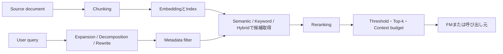

# FM拡張用のRetrievalを設計する: 理解と判断の補足

## このページの位置づけ

| 項目 | 内容 |
|---|---|
| 対応Task | `D1-05`: FM拡張用のRetrievalを設計する |
| 対応Skills | `1.5.1〜1.5.6` |
| 対応する公式解説 | [`01-05-retrieval-for-rag.md`](../literal-pages/01-05-retrieval-for-rag.md) |
| この補足で身につける判断 | Queryと文書の性質からChunking、Embedding、Store、検索方式、Filter、Reranking、Query変換を選び、検索不良を段階別に切り分け、Retrieval interfaceへ一貫した契約として表せるようにする。 |

## まず全体像

RAGの検索設計では、各機能を独立に「高性能そうな設定」へ変えるのではなく、どの段階でRelevantな情報を失ったかを追う。Filterは候補集合を制限し、検索はその集合から候補を集め、Rerankingは集めた候補の順序を変える。Rerankerは初段検索で取得されなかったChunkを復活させられないため、処理順序が判断の中心になる。



図の要点は、後段ほど扱える候補が限定されることである。正しい文書がFilterで除外された場合、検索方式やRerankerを調整しても直らない。必要な文がChunk境界で分断されていれば、Query rewriteだけでは十分なContextにならない。

## Chunking、Embedding、検索、Filter、Rerankingの関係

| 段階 | 決めるもの | 失敗すると見える症状 | 後段で補える範囲 |
|---|---|---|---|
| Chunking | 検索とContext投入の情報単位 | 必要な条件と結論が別Chunk、または無関係な話題が同じChunkに混在する | OverlapやParent contextで一部補えるが、再取り込みが必要な場合がある |
| Embedding | 意味を比較するVector空間とDimension | 言い換えや対象言語でRelevant chunkが近くならない | HybridのKeyword経路で一部補えるが、Model不適合はIndex再作成の対象 |
| Metadata filter | 検索してよい候補集合 | 正しい文書が常に0件、特定Tenant・日付・分類だけ欠落する | 後段では補えない。Metadata値、型、演算子、認可条件を直す |
| 初段検索 | Queryに対して広く候補を集める | Relevant chunkが候補に入らない、固有名詞または言い換えだけ弱い | Query変換やHybridでRecallを上げられる |
| Reranking | 候補集合内の優先順 | Relevant chunkは存在するが上位へ来ない | 初段候補数を増やし再評価できる。ただし候補外のChunkは扱えない |
| Threshold・Top-k | FMへ渡す量と最低関連度 | 厳しすぎて根拠不足、緩すぎてNoiseとTokenが増える | 評価Queryに基づく調整が必要 |

Chunk sizeを小さくすると、一つのChunkが一つの論点へ集中しやすい一方、回答に必要な前後関係が分かれることがある。大きくするとContextは増えるが、検索語と無関係な部分も含みやすく、FMへ渡すTokenも増える。Hierarchical chunkingは、小さいChildで照合し、広いParentを返すことでこの二つの目的を分ける。

EmbeddingのDimensionは単独で品質を決めない。Model、言語、文書領域、Vector type、StoreのDistance metricと一組で評価する。Dimension変更はIndex schemaとの互換性に関わるため、単なるQuery設定変更ではない。

## Chunking方式を選ぶ

| 文書・要件 | 選びやすい方式 | 判断理由 | 選ばない方式と条件 |
|---|---|---|---|
| 同程度の長さの独立した短文が並ぶ | DefaultまたはFixed-size | 単純な境界で検索単位を作りやすい | 意味境界ごとに長さが大きく違い、混在が評価で問題になるなら固定長だけにしない |
| 文を途中で切りたくない一般Text | 文境界を保つDefault | 約300トークンを目安に完全な文を保持する | 「Sentence chunking」という別設定があると誤認しない |
| Topicの切替位置が不規則 | Semantic | 意味の差を境界として扱える | 追加のFM費用や取り込み時間を許容できない場合、評価なしで採用しない |
| 小さい箇所を正確に見つけつつ、Section全体をFMへ渡したい | Hierarchical | Childで精密に検索しParentでContextを返せる | S3 vector bucketの制約、Metadata size、重複Parentによる結果数減少が要件と合わない場合は除外する |
| 文書を既に意味単位のFileへ前処理している | No chunking | 事前分割をそのまま検索単位にできる | Page citationやPage metadata filterが必要なら除外する |

同じ「Chunk size」でも、規程、FAQ、議事録、API referenceでは意味単位が違う。代表Queryごとに、必要な根拠が一つのChunkまたはParent contextへ収まるかを確認する。

## EmbeddingとStoreを選ぶ

Embeddingは、Dimensionだけでなく入力言語、Modality、Indexing量、Query latency、Batch対応を同時に見る。

| 要件 | 選定で重く見る軸 | 除外条件 |
|---|---|---|
| 日本語文書を日本語で検索 | 対応言語での実測Retrieval品質 | English最適化という説明だけからCross-language品質まで保証すると判断しない |
| ImageとTextを相互検索 | Multimodal inputと共通Vector空間 | Text-only embeddingを除外する |
| 大量文書を定期Indexing | Batch inference、RPM quota、取り込み費用 | Online低Latency呼び出しだけで大量Backfillする案は、Quotaと時間を満たさなければ除外する |
| Query時の応答期限が厳しい | Online latency、Store search latency、Reranking時間 | Offline Batch向け経路をQuery時に使う案を除外する |
| Storage量や検索費用を抑えたい | Dimension、Float／Binary、Store対応、品質低下 | StoreがVector typeを扱えない組み合わせを除外する |

Storeの判断は「Vectorを保存できるか」だけではない。

| 状況 | 選びやすい構成 | 判断理由 | 除外理由の例 |
|---|---|---|---|
| 検索専用機能、k-NN、Text検索を細かく制御したい | OpenSearch Service | Vector field、近似検索、Keyword／Vector検索の構成を扱える | PostgreSQLとの一体性が主要件なら追加Store運用になる |
| 既存のRelational dataとVectorをTransactionやSQLの近くで扱いたい | Aurora PostgreSQL + `pgvector` | Relational schema、Vector、Text、Metadata indexを同じDBで構成できる | 検索専用Clusterの機能を重視し、DB運用を増やしたくない場合は除外候補になる |
| Storage、Indexing、Retrieval infrastructureの運用を委譲したい | Managed Knowledge Base | Amazon Bedrockが基盤を管理し、既定のManaged embeddingとRerankingを提供する | Semantic-only、任意Dimension、Index内部の詳細制御が必須なら要件と合わない |

Managed方式を選ぶ判断は、単に「設定項目が少ない」ではなく、管理責務を委譲する代わりに検索方式やEmbedding変更の自由度が変わる、というTrade-offで捉える。

## 検索方式とQuery変換を選ぶ

### Semantic、Keyword、Hybrid

| Queryの特徴 | 検索方式 | 理由 | 注意点 |
|---|---|---|---|
| 言い換え、概念、自然文の類似性が中心 | Semantic | 表層語が一致しなくてもEmbeddingで意味を照合できる | 固有IDや完全一致語だけのQueryでは順位を評価する |
| 製品コード、エラーコード、固有名詞、条番号が中心 | Keyword経路 | Raw textの明示的な一致を利用できる | 同義語や説明文だけのQueryはRecallが不足し得る |
| 自然文と固有語が混在 | Hybrid | SemanticとRaw textの両方から候補を得られる | StoreとFilterable text fieldの対応が必要。Managed Knowledge Baseでは常にHybrid |

HybridはSemanticとKeywordの弱点を補い合えるが、候補数、融合、Reranking、Latencyを含めて評価する。Hybridという名前だけで関連度が保証されるわけではない。

### Expansion、Decomposition、Rewrite

| Queryの問題 | 変換 | 変換後に確認すること | Fallback |
|---|---|---|---|
| 同義語、略語、表記揺れで候補が少ない | Expansion | 元の意図を外す関連語が混ざっていないか | 元Queryでも検索し、結果を統合する |
| 比較、複数条件、複数対象を一文で尋ねている | Decomposition | 各Sub-queryが元Queryの必要論点を覆うか | 分解できない場合は元Queryを一回検索する |
| 会話代名詞、冗長表現、検索対象と異なる語彙がある | Rewrite | 制約、固有名詞、否定、期間が失われていないか | 原文を保持し、Rewrite失敗・低信頼時は原Queryへ戻す |

変換後のQueryだけを記録すると原因を追えない。元Query、変換種別、変換後Query、各検索結果、統合結果を相関IDで結び付ける。これは補助的な設計整理であり、特定のAWS APIがこのLog schemaを自動提供するという意味ではない。

## Filter、Reranking、Score thresholdの順序を決める

Metadata filterには二つの性質がある。Tenantや権限のような条件は、検索品質の調整ではなく検索してよい範囲を定める境界である。日付、製品、文書種別のような条件は、対象集合を狭めてPrecisionを上げる用途にも使える。

Filterを厳しくしすぎるとRelevant文書が候補集合から消える。まずFilter付きとFilterなしの結果を比較し、Metadataの値、型、演算子、同期状態を確認する。権限条件は品質向上のために緩めてはならない。

Rerankingは、初段でRecallを確保した候補を関連度順へ並べ直す。候補数を増やすとRerankerが正しいChunkを見る可能性は上がるが、Latencyと費用も増える。Reranking後にFMへ渡す件数を減らせれば、Context tokenと生成Latencyを抑えられる場合がある。

Knowledge Basesの`score`に対する業務共通の公式Thresholdはない。Thresholdは次のように決める。

1. AnswerableとUnanswerableを含む代表Queryを用意する。
2. Relevant chunkが候補に入る割合と、Irrelevant chunkを残す割合を測る。
3. Score分布を、Model、Store、検索方式、Reranking有無ごとに分ける。
4. 根拠不足なら回答しない動作を含め、用途のFalse positive／False negative許容度からThresholdを決める。
5. ModelやIndexを変えたら同じThresholdをそのまま流用せず再評価する。

## 検索不良を原因分離する

検索不良は、生成された回答を見る前に`Retrieve`結果を直接調べると分離しやすい。

| 症状 | 最初に確認する段階 | 確認する証拠 | 次の切り分け |
|---|---|---|---|
| 既知の文書が一件も出ない | Index freshness | Ingestion／Syncの状態、対象Source URI、削除・更新時刻 | 未同期なら再同期。同期済みならFilterへ進む |
| Filterを付けた時だけ0件 | Metadata／Filter | 取り込まれたKey、Value、Data type、演算子、Tenant条件 | Filterなし検索との比較。権限Filterは緩和せずデータを直す |
| 完全一致語では出るが言い換えで出ない | Embedding／Semantic検索 | QueryとDocumentの言語、Model、Dimension、Search type | Embedding候補比較、Hybrid、Expansionを評価する |
| 言い換えでは出るがコードや条番号で弱い | Keyword経路 | Raw text field、Hybrid対応Store、Tokenization | HybridまたはKeyword候補を評価する |
| Relevant文はあるが情報が途中で切れる | Chunking | Chunk text、境界、Overlap、Parent／Child関係 | Chunk設定を変えて再取り込みする |
| Relevant chunkはTop-k内だが順位が低い | Ranking | 初段順位、Score、Reranking前後の順位 | Rerankingと候補数を評価する |
| 単純質問は良いが比較質問だけ失敗 | Query handling | 元Query、Sub-query、各検索結果 | DecompositionまたはRewriteを評価する |
| 検索結果は正しいが回答が誤る | Retrieval以降 | FMへ渡したContext、Prompt、Citation、出力 | Prompt／Model／Context budgetの問題として分離する |

この表で重要なのは、Index freshnessをEmbedding品質と混同しないことである。古いIndexに存在しない文書は、検索設定を変えても取得できない。また、Relevant chunkが`Retrieve`の上位にあるなら、主原因はRetrievalより後のContext組立てや生成にある可能性が高い。

## Retrieval interfaceを設計する

REST、Function calling、MCPの違いがあっても、Core contractは共通にできる。

```text
Input:
  query, tenant/authorization context, filters,
  max_results, search_mode, correlation_id

Output:
  results[] = {content, source, score, metadata}
  applied_configuration, transformed_queries, warnings
```

これは理解のためのInterface例であり、AWS APIのRequestをそのまま転載したものではない。境界ごとの判断は次のとおりである。

- REST APIでは、HTTP status、Timeout、Pagination、Versioningを契約へ含める。
- Function callingでは、FMが選べるParameterをInput schemaで限定し、アプリケーションが認可と実行を担う。
- MCP toolでは、Tool discoveryと`tools/call`の標準契約を使う。Knowledge Base ID、権限Filter、上限値をAgentから変更させるか、管理者設定に固定するかを分ける。
- いずれの場合も、SourceとMetadataを落とさず、Citation、監査、障害調査へ引き継げるようにする。

Agentへ自由なFilterや結果数を公開すると柔軟性は上がるが、認可境界や費用上限もAgent入力へ依存する。Tenant filter、許可Source、最大候補数のような統制は、Tool callerが上書きできない管理側設定として扱う判断が必要になる。

## 理解用シナリオ

> これは理解のために作成した例であり、実際の認定試験問題ではない。数値は架空である。

社内サポートAgentが、日本語の製品Manualと障害Runbookを検索する。質問には自然文とエラーコードが混在する。利用者は所属製品の文書だけを閲覧でき、比較質問では複数の手順を参照する必要がある。応答時間には上限があり、根拠が弱い場合は回答せずSource候補だけを返す。

### 判断

自然文と言い換えにはSemantic、エラーコードにはKeywordが効くため、対応Store上のHybridを候補にする。所属製品はMetadata filterで検索前に制限する。このFilterは認可境界なので、0件だからといって別製品へ広げない。

比較質問はSub-queryへDecompositionし、元QueryもFallbackとして保持する。初段ではRelevant chunkを取り逃さない候補数を確保し、Rerankerで順序を整える。Thresholdは架空の固定値を決め打ちせず、既知のAnswerable／Unanswerable queryでScore分布と誤回答率を測って定める。

障害手順の前提と操作が別Chunkへ分断されるなら、Chunk sizeまたはHierarchical chunkingを比較する。Relevant chunkが`Retrieve`に出ているのに回答が誤る場合は、Embeddingを交換する前にPromptへ渡されたContextと生成処理を調べる。

## 横断的な注意点

- セキュリティ: Tenant、部署、文書ACLに由来するFilterは検索精度の調整値ではなく認可境界として扱う。Retrieved referenceにはGuardrailsが直接適用されないため、信頼できない文書Contentへの対策を別途設計する。
- 可用性: Store、Embedding、Reranker、Query transformationのどこが失敗したかを区別し、元Queryによる検索やReranking無効化など、許容できるFallbackを事前に定める。
- 性能: End-to-end latencyをQuery変換、初段検索、Reranking、生成へ分解する。候補数とChunk sizeはContext tokenにも影響する。
- コスト: Semantic chunking、Embedding、Vector Store、複数Sub-query、Reranking、生成を別々のCost driverとして測る。Batch embeddingは大量Indexingに、Online invocationはQuery時の低Latency処理に対応付ける。
- データ所在地: ModelとFeatureのRegion対応だけでなく、Cross-Region inferenceでDataがRegion間共有され得る条件を確認する。

## 理解を確認する

- 小さいChunkと大きいChunkのTrade-offを、Precision、Context、Tokenの観点で説明できるか。
- Defaultの文境界保持、Semantic、Hierarchical chunkingを文書構造から選び、除外理由を説明できるか。
- 固有ID中心、言い換え中心、両方が混在するQueryに、Keyword、Semantic、Hybridを対応付けられるか。
- Filterで消えた文書をRerankerが復活できない理由を説明できるか。
- Expansion、Decomposition、Rewriteの違いと、変換失敗時に元Queryへ戻す条件を説明できるか。
- 取得失敗をEmbedding、Chunking、Query、Filter、Index freshnessへ切り分けられるか。
- REST、Function calling、MCPで共通化するInput／Outputと、Agentに公開しない統制項目を説明できるか。

## 根拠と補足の区別

- 公式情報: Task 1.5のSkills、Knowledge BasesのChunking、Embedding、Search type、Metadata filter、Reranking、Query decomposition、Vector Store、Retrieval APIとMCP connectorの動作および制約。
- 補助的な整理: 各段階で失う情報の対応表、検索方式とQuery変換の選択表、Thresholdの評価手順、Fallback、検索不良の切り分け表、共通Retrieval contract、架空シナリオ。

## 公式資料

- [AIP-C01 Content Domain 1](https://docs.aws.amazon.com/aws-certification/latest/ai-professional-01/ai-professional-01-domain1.html) — Task 1.5とSkills 1.5.1〜1.5.6
- [Knowledge Base chunking and parsing](https://docs.aws.amazon.com/bedrock/latest/userguide/kb-chunking-parsing.html) — Chunking方式と取得時の挙動
- [Configure and customize queries and response generation](https://docs.aws.amazon.com/bedrock/latest/userguide/kb-test-config.html) — Hybrid／Semantic、Filter、Reranking、Decomposition
- [Include metadata in a data source](https://docs.aws.amazon.com/bedrock/latest/userguide/kb-metadata.html) — Metadata schemaとData type
- [Amazon Titan Text Embeddings models](https://docs.aws.amazon.com/bedrock/latest/userguide/titan-embedding-models.html) — Dimension、言語、Latency、Batch
- [Supported models and Regions for Knowledge Bases](https://docs.aws.amazon.com/bedrock/latest/userguide/knowledge-base-supported.html) — Model、Vector type、Region確認先
- [Prerequisites for a vector store](https://docs.aws.amazon.com/bedrock/latest/userguide/knowledge-base-setup.html) — StoreとEmbeddingの互換性
- [Using Aurora PostgreSQL as a Knowledge Base](https://docs.aws.amazon.com/AmazonRDS/latest/AuroraUserGuide/AuroraPostgreSQL.VectorDB.html) — Aurora `pgvector`構成
- [Create a managed knowledge base](https://docs.aws.amazon.com/bedrock/latest/userguide/kb-managed-create.html) — Managed方式の責務と制約
- [Query a knowledge base and retrieve data](https://docs.aws.amazon.com/bedrock/latest/userguide/kb-test-retrieve.html) — Managed search、Score、Reranking、取得結果
- [Improve query responses with a reranker model](https://docs.aws.amazon.com/bedrock/latest/userguide/rerank.html) — Rerankerの入力、出力、適用位置
- [Retrieving information using Knowledge Bases](https://docs.aws.amazon.com/bedrock/latest/userguide/kb-how-retrieval.html) — `Retrieve`、`RetrieveAndGenerate`、`AgenticRetrieveStream`
- [Use a tool to complete a model response](https://docs.aws.amazon.com/bedrock/latest/userguide/tool-use.html) — Function callingの責務分担
- [Managed Knowledge Bases as an AgentCore connector target](https://docs.aws.amazon.com/bedrock-agentcore/latest/devguide/gateway-target-connector-managed-kb.html) — MCP toolの公開設定とSchema

最終確認日: 2026-09-22
