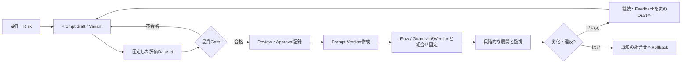
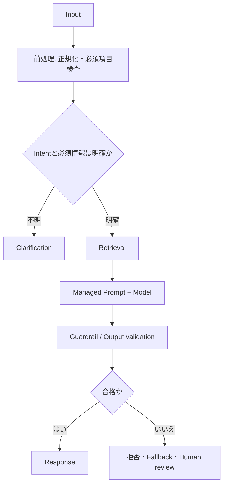

# Prompt engineeringとGovernanceを実装する: 理解と判断の補足

## このページの位置づけ

| 項目 | 内容 |
|---|---|
| 対応Task | `D1-06`: Prompt engineeringとGovernanceを実装する |
| 対応Skills | `1.6.1〜1.6.6` |
| 対応する公式解説 | [`01-06-prompt-engineering-and-governance.md`](../literal-pages/01-06-prompt-engineering-and-governance.md) |
| この補足で身につける判断 | Promptの構造、会話状態、Few-shot、構造化出力、Flow、Guardrailを要件から組み合わせる。Prompt変更をVersion、評価、承認、監査、Rollbackまで一つのLifecycleとして判断する。 |

## まず全体像

試験での中心は「良いPrompt文を選ぶ」ことではなく、失敗の種類ごとにControlを置き、変更を安全にProductionへ運ぶことである。

図の要点は、Prompt Versionを作ること自体を承認と見なさないことである。評価結果と承認記録を先にそろえ、その後にPrompt Versionと、対応するModel、推論設定、Guardrail Version、Flow Versionを展開単位として固定する。RollbackもPrompt本文だけでなく、動作確認済みの組合せへ戻す。

## Promptを「命令・材料・契約・停止条件」に分ける

Role、制約、Context、出力Schema、拒否条件を一続きの文章として書くと、どの部分が失敗したか切り分けにくい。次の四つへ分けると、TestとReviewの対象が明確になる。

| 区分 | 含めるもの | 失敗時に最初に疑うこと |
|---|---|---|
| 命令 | Role、Task、優先するInstruction、許可・禁止する行動 | Taskの曖昧さ、相反する指示、Model固有のPrompt形式 |
| 材料 | User input、Conversation summary、Retrieved context、Few-shot example | 古い履歴、不適切な検索結果、例の偏り、Context超過 |
| 出力契約 | JSON Schema、必須Field、列挙値、長さ、根拠の提示 | Promptだけの形式指定か、Structured outputsで強制しているか |
| 停止・拒否条件 | Intent不明、必須情報不足、根拠不足、Policy違反、Fallback | 無理な推測、Clarification不足、Guardrailと業務規則の混同 |

PromptはTaskの意味をModelへ伝えるControlである。Guardrailは有害ContentやSensitive informationなどのPolicyを一貫して評価するControlである。Application validationはSchema、業務規則、権限、Resource存在などを決定的に検査するControlである。三つは重なる部分があっても代替関係ではない。

## 会話状態を三層に分ける

会話履歴をすべて毎回Promptへ入れる設計は、Token、Latency、Privacy、古い情報の混入を増やす。状態を用途で分ける。

| 状態 | 例 | 扱い |
|---|---|---|
| 現在Turn | 今回の質問、添付Data、直前の確認回答 | 現在のRequestへ含める。入力検証とGuardrailの対象を明確にする |
| 短期会話状態 | 直近の決定、未回答の確認事項、Conversation summary | Sessionに紐付け、必要な範囲だけ次のRequestへ渡す |
| 長期業務状態 | User設定、承認済み注文、Case状態 | 会話文ではなくSystem of recordから取得し、認可と鮮度を検証する |

Intentが不明、複数の解釈が可能、不可逆な処理の対象が未確定、という場合はClarificationへ分岐する。Conversation summaryは長さを抑えられるが、要約で重要な制約を落とすRiskがある。したがって、重要Fieldは構造化した状態として保持し、自由文の要約だけに依存しない。

保存期間は「Modelが何Turn必要とするか」だけで決めない。業務上の必要性、Privacy、削除要件、監査要件から決め、期限切れの履歴をPromptへ再投入しない。Conversation storeへのAccessと、推論時に渡した内容も追跡できるようにする。

## Few-shotを選ぶ条件

| 状況 | 選びやすい方法 | 理由 | 選ばない方法と条件 |
|---|---|---|---|
| Taskと出力が単純で、明確なInstructionだけで安定する | Zero-shot | Promptを短く保ち、例による偏りを避ける | Few-shotは改善を測れずTokenだけ増えるなら除外する |
| Labelの境界、文体、例外処理を文章だけで伝えにくい | Few-shot | 入力と望ましい出力の組で期待を示せる | Fine-tuningを、少数例で解決できる段階から先に選ばない |
| 入力分布に複数の重要な型がある | 各型を代表するFew-shot | 一つの成功例だけへの過適合を減らす | 実データと無関係な例や、正解が曖昧な例を使わない |
| 厳密なMachine-readable outputが必要 | Structured outputsを主Controlにする | Schemaを推論機能で検証・強制できる | Few-shotだけをSchema保証として扱わない |

Few-shotの効果は対象ModelとDatasetで測る。同じ例でもModelが変われば効果が変わり、例を増やすとContextと費用が増える。評価では「v2の出力が好み」という印象ではなく、固定Datasetに対する形式遵守、正確性、拒否、Token、Latencyをv1と比較する。

## 構造化出力を使い分ける

| 必要な出力 | 選択 | 判断理由 | 除外条件 |
|---|---|---|---|
| 人が読む短い回答 | Promptで形式・長さを明示 | 自由文の表現力を保てる | 後続Programが厳密にParseするなら不足 |
| 対応Model／APIで、後続処理へ渡すJSON | Bedrock Structured outputs + Application validation | JSON Schemaに沿う生成を要求し、受信後も業務Ruleを検証できる | 非対応Model・API・Schema機能では選べない |
| Tool callの引数 | Strict tool definition + Tool側検証 | 呼出Schemaと実行前検証を分離できる | Schema一致だけで権限や副作用の承認を済ませない |
| Human reviewを要する高Risk判断 | 構造化した判断材料 + Human approval | 自動処理の境界と承認内容を記録しやすい | 自由文の「問題ありません」だけで承認を代替しない |

Schemaに従うことは、値が事実として正しいことを保証しない。たとえば`date`型に合っていても業務上許可された日付とは限らない。構文はStructured outputs、意味と権限はApplication validation、根拠不足やPolicy違反はPrompt／Guardrail／Human reviewを組み合わせて扱う。

## Prompt testを品質Gateへ変える

最低限、同じ評価Datasetに次の種類を含める。

| Testの種類 | 目的 | 判定例 |
|---|---|---|
| 正常 | 代表的なInputでTaskを完了できるか | 正解・関連性、根拠提示、Schema遵守 |
| 境界 | 空、最大長付近、曖昧、必須情報欠落、多言語など | Clarification、拒否、切詰めの扱い |
| Adversarial／Safety | Instruction override、禁止Topic、Sensitive informationなど | GuardrailのAction、漏えいなし、意図したBlocked message |
| Regression | 過去に成功した重要Caseが新Versionでも保たれるか | v1に対する非劣化条件、既知Bugの再発なし |
| 非決定性 | 同一Inputを複数回実行したときの変動 | 合格率、Schema遵守率、禁止結果の発生率 |

評価条件にはPrompt Version候補、Model ID、推論Parameter、Guardrail Version、Flow draft／Version、Dataset Versionを含める。一つでも変えるなら、結果差をPrompt変更だけの効果と断定しない。ProductionへのGateは、平均Scoreだけでなく、SafetyやSchemaなど「一件でも重大失敗なら不合格」にする項目と、統計的に比較する項目を分ける。

## Lifecycleで責務を分ける

| 段階 | 主な責務 | 必要なEvidence |
|---|---|---|
| OwnerがDraftを作る | 要件、対象User、Risk、Prompt変数、変更理由を定義 | Change request、Draft／Variant ID、想定する出力契約 |
| Test | 固定Datasetで旧版と候補版を同条件比較 | Dataset Version、実行条件、Case別結果、費用・Latency |
| Review | Prompt injection、Privacy、権限、例の偏り、Failure pathを確認 | Review記録、指摘と対応、未解決Risk |
| Approval | Gate合格とResidual riskを受け入れる | Approver、日時、採用するResource Versionの組合せ |
| Version／Deploy | Immutable snapshotを作り、Production参照を更新 | Prompt／Flow／Guardrail／Modelの識別子、展開記録 |
| Audit／Monitor | 管理操作とRuntime品質を追跡 | CloudTrail event、Application log、品質・Safety指標 |
| Rollback | Triggerに従い既知の良好な組合せへ戻す | Trigger、戻し先、実行者、影響範囲、再評価結果 |

CloudTrailは「誰がAPI操作をしたか」の証拠を提供する。評価に合格した理由や承認者の業務判断までは表さない。逆に、Ticketや承認文書だけでは、実際にどのVersionが展開されたかを証明できない。両方をResource IDとVersionで結び付ける。

Prompt ManagementにはFlowのようなAlias routingが説明されていないため、PromptのRollbackではApplication設定またはPromptを参照するFlowを、以前に検証したPrompt Versionへ戻す。FlowはAliasの参照先を以前のImmutable Versionへ変更できる。いずれも「前の番号なら安全」と仮定せず、組合せ全体の既知の良好版を記録する。

## Flowへ配置する責務

図は責務の順序を示す。前処理で決定的に検査できることをFMへ任せず、Intent不足はClarificationへ送る。Retrieval結果をPromptのContextへ渡し、生成後にSafetyと出力契約を確認する。失敗時は無条件Retryではなく、拒否、Fallback、Human reviewのどれかへ明示的に分岐する。

Bedrock FlowsのCondition nodeは、確定したString、Number、Booleanを比較する分岐に向く。自由文のModel応答をそのまま重要なConditionへ使う場合は、先にStructured outputsまたはValidationで判定値を安定させる。Structured outputsの対応API／機能の一覧にはBedrock Flowsが含まれないため、FlowのPrompt nodeで直接使えると仮定しない。Flow内でこの分岐を行うなら、Applicationまたは前段のLambdaなどで検証済みの値を渡す。単一のModel callだけならFlowを導入する必然性は弱い。複数Nodeの順序、Branch、Version／Aliasによる展開が必要なときに選ぶ。

## 要件から選ぶ

| 要件・状況 | 選びやすい方式 | 判断理由 | 選ばない方式と条件 |
|---|---|---|---|
| 同じTemplateを複数Applicationで再利用し、版を固定したい | Prompt Management | Variable、Variant、Test、Versionを管理できる | Code内へのPrompt直書きは中央管理と追跡が必要なら除外 |
| 有害Content、Denied topic、PII、Groundingなどを共通Policyで評価したい | Guardrails | 入出力へ一貫したSafety controlを適用できる | Prompt上の拒否文だけを強制的なSafety controlとして扱わない |
| Prompt、Retrieval、Lambda、条件分岐を一つのWorkflowとしてVersion化したい | Bedrock Flows | Node接続、Condition、Immutable Version、Aliasを使える | 単一呼出しだけで、追加のOrchestrationが不要なら過剰 |
| Intent不明時にUserへ確認し、再開したい | Clarification state machine／Multi-turn Agent node | 不足情報を推測せず、状態を保って再開できる | 何でもFMの自由文回答だけで処理しない |
| 厳密なJSONを後続Systemへ渡す | Structured outputs + Validation | Schema準拠と業務検査を分離できる | Promptの例だけでParse可能性を保証しない |
| Prompt変更の説明責任が必要 | Version + 評価 + 承認記録 + CloudTrail | 内容、品質判断、操作主体をつなげられる | Version番号だけを承認・監査証跡と見なさない |

## 理解用シナリオ

> これは理解のために作成した例であり、実際の認定試験問題ではない。数値と組織名は架空である。

社内Support assistantは、社員の質問からIntentと対象SystemをJSONで抽出し、社内Knowledge Baseの根拠だけを使って回答する。Intentまたは対象Systemが不明ならUserへ確認する。個人情報を出力してはならず、高Riskの操作依頼は担当者へEscalateする。Prompt v2候補はFew-shotを追加して分類精度を改善したが、Promptが長くなった。

### 判断

Intent抽出には、対応ModelでStructured outputsを使い、`intent`、`target_system`、`needs_clarification`などのFieldをSchemaで固定する。Schema適合だけでは対象Systemの実在やUser権限を保証しないため、Application validationを残す。対応する推論APIの結果を検証してから、Booleanの`needs_clarification`と必須Fieldの有無をFlowへ渡す。その値によりCondition nodeから確認経路へ分岐する。

Knowledge Baseの結果をContextとしてManaged promptへ渡し、回答生成にGuardrailを適用する。個人情報のFilterに加え、業務上の高Risk操作はApplication ruleでHuman reviewへ送る。Guardrailだけで権限や承認を判断させない。

v2は、正常、曖昧、対象外、Prompt injection、PII、過去のRegression caseを含む固定Datasetでv1と比較する。分類精度だけでなく、Schema遵守、Clarification率、禁止出力、Token、Latencyを測る。Gateに合格してReviewとApprovalを記録した後、Prompt Versionを作り、Flow／Guardrail／Modelとの組合せを固定して展開する。TokenまたはLatencyが上限を超えるなら、Few-shotを増やし続ける案は除外し、例の選択やInstructionを見直す。

## 横断的な注意点

- セキュリティ: Conversation historyとTest datasetにも機密情報を入れ得る。保存、Access、Mask、削除を設計し、Prompt VersionやLogへSecretを埋め込まない。
- 可用性: Flow内のKnowledge Base、Model、Lambdaなど各依存先の失敗経路を定める。Failureを隠して根拠なし回答を返さない。
- 性能: 履歴、Few-shot、Retrieved contextを増やすとTokenとLatencyが増える。品質改善と同じDataset・負荷条件で比較する。
- コスト: Prompt／Output tokenだけでなく、Flowが呼ぶModel、Knowledge Base、Lambdaなどの利用費用も含める。Flows自体の費用は使用Resourceに依存する。
- Governance: Prompt、Flow、Guardrailを個別に最新版へするのではなく、評価済みの互換性があるVersion組合せを展開する。

## 理解を確認する

- Role、Context、Few-shot、出力契約、拒否条件を分け、失敗原因を対応付けられるか。
- Prompt、Guardrail、Application validationの責務と、互いに代替できない条件を説明できるか。
- 会話状態を現在Turn、短期会話状態、長期業務状態へ分け、保存期間とClarification条件を説明できるか。
- Zero-shot、Few-shot、Structured outputsを選ぶ条件と、選ばない理由を説明できるか。
- Prompt VersionだけではApproval evidenceにならない理由を説明できるか。
- Prompt、Model、推論設定、Guardrail、Flow、DatasetのVersionを固定してRegressionを比較できるか。
- 以前のPromptだけでなく、検証済みResourceの組合せへRollbackすべき理由を説明できるか。

## 根拠と補足の区別

- 公式情報: Task 1.6の6 Skills、Promptの構成要素とFew-shot、Prompt ManagementのVariable／Variant／Version、ModelがRequest間の履歴を自動記憶しないこと、Structured outputs、FlowsのNode／Condition／Version／Alias、GuardrailsのFilter／Version、CloudTrailのBedrock API event。
- 補助的な整理: Promptを四区分に分ける表、会話状態の三層、Test分類と品質Gate、OwnerからRollbackまでの責務表、Version組合せを展開単位にする判断、架空のSupport assistantシナリオ。

## 公式資料

- [AIP-C01 Content Domain 1](https://docs.aws.amazon.com/aws-certification/latest/ai-professional-01/ai-professional-01-domain1.html) — Task 1.6とSkills 1.6.1〜1.6.6
- [Prompt engineering concepts](https://docs.aws.amazon.com/bedrock/latest/userguide/prompt-engineering-guidelines.html) — Promptの構成、Few-shot、会話履歴の扱い
- [Design a prompt](https://docs.aws.amazon.com/bedrock/latest/userguide/design-a-prompt.html) — Instruction、Output indicator、Prompt改善
- [Prompt Management](https://docs.aws.amazon.com/bedrock/latest/userguide/prompt-management.html) — Variable、Variant、Test、Version
- [Test a prompt](https://docs.aws.amazon.com/bedrock/latest/userguide/prompt-management-test.html) — TestとManaged promptのRuntime制約
- [Deploy a prompt using versions](https://docs.aws.amazon.com/bedrock/latest/userguide/prompt-management-deploy.html) — DraftとVersion snapshot
- [Structured outputs](https://docs.aws.amazon.com/bedrock/latest/userguide/structured-output.html) — JSON Schemaによる出力、対応条件、制約
- [Amazon Bedrock Flows](https://docs.aws.amazon.com/bedrock/latest/userguide/flows.html) — Workflow、Test、Version、Alias
- [Node types for flows](https://docs.aws.amazon.com/bedrock/latest/userguide/flows-nodes.html) — Condition、Prompt、Agent、Knowledge Base、Lambda node
- [Deploy a flow using versions and aliases](https://docs.aws.amazon.com/bedrock/latest/userguide/flows-deploy.html) — Immutable Version、Alias、Rollback
- [Amazon Bedrock Guardrails](https://docs.aws.amazon.com/bedrock/latest/userguide/guardrails.html) — Safety filter、Version、適用方法
- [Monitor Amazon Bedrock API calls using CloudTrail](https://docs.aws.amazon.com/bedrock/latest/userguide/logging-using-cloudtrail.html) — API操作の監査情報

最終確認日: 2026-09-22
