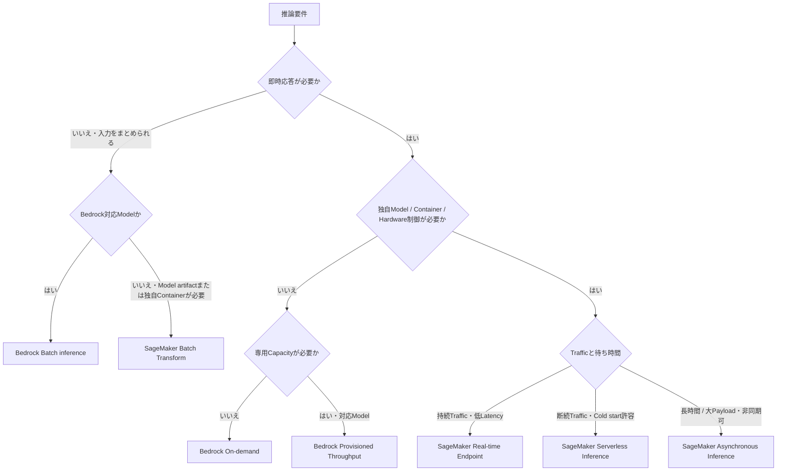
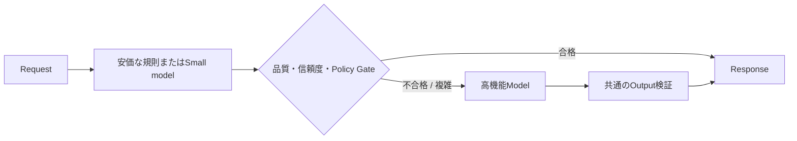
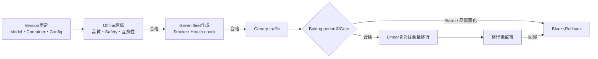

# Foundation Modelのデプロイ戦略を実装する: 理解と判断の補足

## このページの位置づけ

| 項目 | 内容 |
|---|---|
| 対応Task | `D2-02`: Model deployment strategyを実装する |
| 対応Skills | `2.2.1〜2.2.3` |
| 対応する公式解説 | [`02-02-model-deployment-strategies.md`](../literal-pages/02-02-model-deployment-strategies.md) |
| この補足で身につける判断 | Traffic、Model customization、Service Level Objective（SLO）、CostからBedrock On-demand／Provisioned Throughput／Batch inferenceとSageMaker AIの推論方式を選ぶ。LLM固有の制約を切り分け、品質GateとRollbackを含む段階リリースを設計する。 |

## まず全体像

デプロイ先を決めるときは、「BedrockかSageMaker AIか」を最初の二択にしない。次の順で要件を絞る。

1. 即時応答が必要か、結果を後から受け取れるかを決める。
2. AWSが管理するBedrockの対応Modelでよいか、独自Model artifact・Serving container・Accelerator設定が必要かを決める。
3. 平均ではなくPeak時のTraffic、Prompt長、出力長、Concurrency、TTFTとEnd-to-end latencyを定義する。
4. Idle capacity、Token、Job、Endpoint instanceを含む課金単位を比較する。
5. Model・Region・推論方式・Optimizationの対応を公式表で確認する。
6. Production trafficを移す前に、品質と運用MetricのGate、監視時間、Rollback条件を定める。

この図は候補を絞る入口であり、最終決定ではない。たとえば、BedrockのCustom modelにはProvisioned Throughputが必要であり、Bedrock Batch inferenceは対応ModelとRegionが限定される。SageMaker Serverless Inferenceも、Model size、必要機能、Cold start許容度が合わなければ候補から外れる。必ず現行の対応表と実測で確定する。

## Skill 2.2.1: 四つの軸でHosting方式を選ぶ

### 1. Traffic: 到着の仕方と待てる時間

「1日1万Request」のような合計量だけでは方式を選べない。同じ件数でも、営業時間中に均等到着する場合、正午に集中する場合、夜間に全件をまとめられる場合では必要Capacityが異なる。

| Trafficの形 | 第一候補になりやすい方式 | 除外または再確認する条件 |
|---|---|---|
| 少量・変動大・即時応答 | Bedrock On-demand | 対応Model・QuotaでPeakとSLOを満たさないならCapacityまたは別方式を再検討 |
| 予測可能な持続高負荷・即時応答 | Bedrock Provisioned Throughput | 対応Modelでない、必要期間に対してCommitmentとIdle costが合わない場合は除外 |
| 断続的な独自Model推論 | SageMaker Serverless Inference | Modelと必要機能が非対応、Cold startを許容できない場合は除外 |
| 持続Traffic・独自Model・厳しいLatency | SageMaker Real-time Endpoint | InstanceのIdle costやContainer運用を受け入れられない場合は不向き |
| Requestごとに大きい入力または長い処理、即時応答不要 | SageMaker Asynchronous Inference | InteractiveなStreaming応答が必要なら不向き |
| 入力を事前にまとめられ、完了時刻で管理 | Bedrock Batch inference / SageMaker Batch Transform | Requestごとの即時応答が必要なら除外 |

Lambdaはこの表と同じ階層のHosting方式ではない。Lambdaを使う構成では、Lambdaが認証、入力検証、Routingなどを行い、Bedrock Runtime APIまたはSageMaker Runtime APIを呼ぶ。大きいFMをLambdaへ配置するという意味ではない。

### 2. Customization: 何を自分で制御する必要があるか

Customizationという言葉を、Promptの変更、BedrockのModel customization、独自WeightとContainerのHostingに分ける。

| 必要な制御 | 候補 | 境界 |
|---|---|---|
| Prompt・Inference parameter・RAGをApplication側で変更 | Bedrock On-demandまたはProvisioned Throughput | Model serving infrastructureはBedrockが管理する |
| Bedrockの対応方式で作成したCustom modelを呼び出す | Bedrock Provisioned Throughput | 2026-09-22時点ではCustom modelの利用にProvisioned Throughputが必要 |
| 独自Model artifact、独自Inference code、Serving engine、Precision、GPU構成を制御 | SageMaker AI EndpointまたはBatch Transform | Model load、Container health、Instance sizing、Scalingの責任が増える |

「Custom modelだから常にSageMaker AI」ではない。Bedrockが対応するCustomizationとModelで、提供方式の制約を受け入れられるならBedrockも候補になる。反対に、独自Containerや対応表にないOptimizationが必須なら、BedrockのManaged model invocationではその制御を行えない。

### 3. SLO: 平均Latencyだけを見ない

生成AIの対話用途では、次の指標を分ける。

- TTFT: 利用者が最初の反応を得るまでの時間
- Inter-token latencyまたは生成速度: 最初のToken以後の読み進めやすさ
- End-to-end latency: Retrieval、Guardrail、Tool、Model、Post-processingを含む完了時間
- Token throughput: 一定時間に処理・生成できるToken量
- Queueing delay: Capacity不足時に処理開始まで待つ時間
- Error・Throttling率: 成功率とRetryによる追加Latency

Provisioned capacityやEndpoint instanceを増やしても、Applicationの直列処理が長ければEnd-to-end SLOは満たせない。逆に、Modelの平均Latencyが良くても、長いPrompt、長い出力、高ConcurrencyのPeakでP95/P99が悪化すればProduction SLOには不足する。同じInput/Output Token分布とConcurrencyで候補を負荷試験する。

### 4. Cost: 「Request単価」と「待機Capacity」を分ける

| 方式 | Costを左右する主な量 | 見落としやすい点 |
|---|---|---|
| Bedrock On-demand | Model、入力・出力Tokenなど | Retry、長いSystem prompt、不要な出力もToken消費を増やす |
| Bedrock Provisioned Throughput | Model、MU数、Commitment、稼働時間 | Trafficが少ない時間も購入CapacityのCostが発生し、削除まで課金が続く |
| Bedrock Batch inference | 対象ModelのBatch処理量 | 対応Model・Region、S3、Job管理を含めて確認する |
| SageMaker Real-time / Async Endpoint | Instance type、台数、稼働時間、関連Storage・Data processing | Idle instance、Blue/green中の一時的な二重Capacity、Scale-out時間 |
| SageMaker Serverless Inference | 使用したCompute時間、処理Data量、構成 | Cold startと対応機能をCostだけでなくSLOと照合する |
| SageMaker Batch Transform | JobのInstance type、台数、実行時間、Storage | Jobの並列度を上げると完了は速くなるが同時使用資源が増える |

Cost比較は月額だけでなく、品質合格Request当たりのCostで行う。安い方式でも品質不足で再実行や大きいModelへのEscalationが増えれば、End-to-endのCostは逆転し得る。

## Skill 2.2.2: LLMのResource制約を順番に切り分ける

LLM Hostingの問題は、次の順で確認すると混同しにくい。

### 1. ModelがMemoryへ収まるか

最初にModel weightのParameter数とPrecisionを確認する。次にActivation、Runtime overhead、KV cacheを加える。KV cacheはContext長、出力長、同時Request数などで増えるため、「WeightがGPU memoryに入る」だけでは十分ではない。

収まらない場合の候補は、Small model、Quantization、ContextまたはConcurrencyの見直し、より大きいAccelerator、複数GPUへのShardingである。Shardingは配置可能性を上げるが、GPU間通信を増やすのでLatencyとThroughputを再測定する。

### 2. ModelをSLO内でLoadできるか

大きいModelは、Artifact download、Host memoryへのLoad、GPUへの転送、Sharding、Runtime初期化に時間がかかる。この時間は初回Deploymentだけでなく、Auto ScalingのScale-out、障害交換、Scale-to-zeroからの復帰にも現れる。

Fast model loading、事前にWarmなCapacityを持つReal-time Endpoint、Scale-outの先行設定などは、異なる方法でこの問題を扱う。Bedrockでは内部のModel loadを利用者が管理しないが、Quota、Throttling、呼び出しLatencyをApplication SLOとして観測する必要は残る。

### 3. Token処理能力が足りるか

Request/secondだけでなく、Input Token、Output Token、Concurrencyを測る。長いPromptを読むPrefillと、Tokenを順次生成するDecodeでは負荷特性が異なる。同じ10 Requests/secondでも、短文分類と長文生成では必要Capacityが違う。

Dynamic batchingはAccelerator利用率とThroughputを上げられるが、RequestをBatchへまとめる待ち時間がLatencyへ加わる。Batch sizeを最大化するのではなく、TTFTとToken throughputの両方を測る。

### 4. ContainerがHealthyか

SageMaker AIのCustom containerでは、ModelがLoad済みで`/ping`へ応答でき、`/invocations`を処理できる必要がある。Health check失敗は「GPUが足りない」だけでなく、Artifact、起動Script、依存関係、Port、Timeout、Out-of-memoryなど複数原因を含む。CloudWatch LogsとContainerのLocal testで切り分ける。

Bedrock On-demandやProvisioned Throughputでは、利用者がServing containerの`/ping`を運用しない。この違いが、BedrockとSageMaker AIの運用負荷の大きな境界になる。

## Skill 2.2.3: 最適化を「どの制約を緩めるか」で選ぶ

| 手段 | 主に緩める制約 | 品質・性能の確認 | 選ばない条件 |
|---|---|---|---|
| Small model | Weight memory、Compute、Latency、Cost | 対象Taskの評価Dataで品質Gateを満たすか | 複雑なRequestで最低品質を満たさない |
| Model cascading | Routine requestのCostとLatency | Routing誤り、Escalation率、全体品質、二段呼出し時のLatency | 全Requestが結局Large modelへ進む、誤RoutingのRiskが高い |
| Batch | Online capacity、単位処理Cost | 完了期限、失敗Recordの再処理、順序・対応付け | 利用者が即時またはStreaming応答を必要とする |
| Quantization | Weight/Activation memory、必要GPU、Cost | 元Modelに対するTask品質とLatency/Throughput | Accuracy低下がQuality gateを外れる、Model・形式が非対応 |
| Compilation | Hardware上のLatency/Throughput、起動時Compile | 対象Hardwareでの実測と互換性 | Hardwareを頻繁に変える、対象Model/Hardwareが非対応 |
| Speculative decoding | Decode latency | Draft候補の受理率、TTFT、生成速度、Cost | 対応Modelでない、追加構成に対して改善が小さい |
| Fast model loading | DeploymentとScale-outのModel load時間 | Cold start、Scale-out完了時間、定常性能 | Model・Instanceが非対応、定常推論が主要なBottleneck |

Small modelとSpeculative decodingの「小さいModel」は役割が異なる。Small modelを単独採用する場合は、そのModelの出力が最終結果になる。Model cascadingでは軽量Modelの結果または判定によって別ModelへRoutingする。Speculative decodingではDraft modelの候補TokenをTarget modelが検証し、Target modelの出力を高速化する。

### Model cascadingの最小構成

この図の要点は、軽量経路を置くだけで最適化にならないことである。Gateが誤って難しいRequestを通せば品質が下がり、ほぼ全件をEscalateすれば二段分のLatencyとCostが加わる。軽量経路の合格率、Escalation率、最終品質、総Costを一緒に測る。

## 段階リリースを設計する

Model、Prompt、Container、Precision、Instanceを変更すると、APIが成功しても回答品質、TTFT、Token throughput、Memory、Error率が悪化し得る。Release gateをOfflineとOnlineへ分ける。

SageMaker AIのDeployment guardrailsは、Real-time/Asynchronous Endpointについて、Blue/greenのAll at once、Canary、Linear、またはRolling updateとCloudWatch AlarmによるAuto rollbackを提供する。一方、生成内容の正確性や業務適合性を自動で理解するわけではない。Applicationは、VersionとRequestを関連付け、品質評価をRelease判断へ加える。

| Gate | 確認するもの | 失敗時 |
|---|---|---|
| Offline quality gate | 代表Evaluation dataでの品質、Safety、Schema、Model/Prompt互換性 | Production trafficを送らない |
| Deployment health gate | Model load、`/ping`、Smoke request、Dependency、権限 | Green fleetを破棄し、Blueを維持 |
| Canary operational gate | Error、Latency、TTFT、Token throughput、GPU/Memory、Queue | AlarmでBlueへRollback |
| Canary quality gate | Sampled outputの自動評価または人手評価、拒否率、業務KPI | Traffic拡大を停止しRollbackまたは調査 |
| Post-deployment gate | 全TrafficでのSLO、Cost、品質Drift | 旧Versionへ戻すか新Deploymentで修正 |

Rollbackを可能にするには、旧Modelだけでなく、Container image、Model artifact、Endpoint configuration、Prompt、Routing、Evaluation条件をVersionとして対応付ける。Data schemaやApplication APIに後方互換性がなければ、Model Endpointだけ戻しても復旧しない。

## 理解用シナリオ

> これは理解のために作成した例であり、実際の認定試験問題ではない。数値目標は架空である。

### シナリオ1: 低頻度の社内要約API

平日の利用は少なく変動し、対話的に数秒以内の応答を求める。Bedrockで提供されるModelの品質で要件を満たし、独自WeightやContainerは不要である。

#### 判断

第一候補はBedrock On-demandである。専用Endpoint instanceやMUの待機Capacityを持たず、LambdaなどのApplication層からRuntime APIを呼ぶ。Provisioned Throughputは、予測可能な高負荷やCustom model要件がなく、購入Capacityを継続利用する根拠がないため初期候補から外す。BatchはInteractive応答を返せないため外す。SageMaker AI Endpointは独自Hosting制御が不要なのにContainer、Instance、Healthの運用責任を増やす。

ただし、採用前に使用ModelとRegion、On-demandのQuota、Peak時のThrottling、P95/P99 latencyを確認する。

### シナリオ2: 予測可能な高負荷とBedrock Custom model

毎営業日に高いTrafficが継続し、BedrockでカスタマイズしたModelを低Latencyで呼び出す。必要CapacityをToken分布とConcurrencyから見積もれる。

#### 判断

Bedrock Custom modelの呼び出しにはProvisioned Throughputが必要である。必要MU、対応Region、ModelのThroughput、Commitmentを確認する。On-demandはCustom modelを直接呼び出す方式ではないため除外する。BatchはInteractive SLOを満たさない。SageMaker AIへ移す案は、独自ContainerやHardware制御が必要なら比較対象になるが、Bedrock Custom modelをそのままSageMaker Endpointへ配置する案ではない。

平均Trafficではなく、入出力Token/分、Peak、Throttling、TTFTを測る。長期Commitmentを選ぶ前に、需要期間とModel lifecycleが期間に合うか確認する。

### シナリオ3: 独自LLMで夜間文書処理と日中APIを提供

独自Model artifactとServing engineが必要である。夜間はS3上の文書を翌朝までに処理し、日中は利用者へ低Latency APIを提供する。

#### 判断

一つの方式に統一せず、日中はSageMaker Real-time Endpoint、夜間はSageMaker Batch Transformを候補にする。Real-time側はModel/Container/Instanceを固定して負荷試験し、Auto Scalingを設定する。Batch側は永続Endpointを増設せず、締切からInstance数と並列度を決める。

SageMaker Serverless InferenceはCold startとModel/機能対応がSLOに合う場合だけ候補になる。Bedrockは、この独自ArtifactとServing engineをそのまま配置するHosting先ではない。日中Endpointの更新は、Offline quality gateの後にCanaryとBaking periodを設け、CloudWatch Alarmと品質悪化の両方をRollback条件にする。

## 横断的な注意点

- セキュリティ: Bedrockでは呼び出しRoleと推論先資源、BatchのService roleとS3を最小権限にする。SageMaker AIではExecution role、Model artifact、Container image、Endpoint network、Runtime呼び出し権限を分ける。
- 可用性: On-demandであることと無制限Capacityは同義ではない。Quota、Throttling、Retry、Region障害を含める。EndpointではMinimum capacity、Scale-out時間、Rollback中のCapacityも確認する。
- 性能: Model単体の平均Latencyだけでなく、Token長分布、Concurrency、TTFT、Queueing、P95/P99、End-to-end latencyを同じWorkloadで測る。
- コスト: Token課金とCapacity課金を混同しない。Blue/green、Warm capacity、Retry、Log、S3、Data transfer、評価処理も総Costへ含める。
- 品質: Small model、Quantization、Cascading、Model更新の前後を、同じ代表Evaluation dataとVersion化したGateで比較する。

## 理解を確認する

- Lambda、Bedrock On-demand、SageMaker AI Endpointの役割を、「呼び出し元」「Managed model inference」「利用者構成のModel hosting」に分けて説明できるか。
- Bedrock Custom model、独自Model artifact、Prompt/RAGの変更について、それぞれ候補となるHosting方式を区別できるか。
- 低頻度、予測可能な高負荷、Offline batchの三つで、採用案と少なくとも一つの除外案を説明できるか。
- Model weightがGPUへ収まっても、長いContextとConcurrencyによってKV cacheが不足する理由を説明できるか。
- Requests/secondだけでなく、TTFT、Input/Output Token、Token throughputを測る理由を説明できるか。
- Small model、Model cascading、Speculative decodingで、小さいModelが果たす役割の違いを説明できるか。
- CanaryのCloudWatch Alarmだけでは回答品質の回帰を完全には検知できない理由と、追加すべきQuality gateを説明できるか。

## 根拠と補足の区別

- 公式情報: Task 2.2のSkills、Bedrockの推論方式とProvisioned Throughput条件、Batch job、SageMaker AIの四推論オプション、LLMのMemory・Token特性、SageMaker AIのInference optimizationとDeployment guardrails。
- 補助的な整理: 六段階の判断順、Hosting選定Decision tree、四つの比較軸、Resource制約の切り分け順、Optimizationの除外条件、Release gate、三つの架空シナリオ。

## 公式資料

- [AIP-C01 Content Domain 2](https://docs.aws.amazon.com/aws-certification/latest/ai-professional-01/ai-professional-01-domain2.html) — Skills 2.2.1〜2.2.3とLambda、Provisioned Throughput、SageMaker AI Endpoint、Small model、Model cascadingの例
- [Making inference requests](https://docs.aws.amazon.com/bedrock/latest/userguide/inference.html) — Bedrock Runtime APIと推論先
- [Provisioned Throughput](https://docs.aws.amazon.com/bedrock/latest/userguide/prov-throughput.html) — MU、Custom model、Commitment、削除と課金
- [Create a batch inference job](https://docs.aws.amazon.com/bedrock/latest/userguide/batch-inference-create.html) — Bedrock Batch inferenceのS3入出力とJob構造
- [Supported Regions and models for batch inference](https://docs.aws.amazon.com/bedrock/latest/userguide/batch-inference-supported.html) — Batch inferenceの対応条件
- [Amazon Bedrock pricing](https://aws.amazon.com/bedrock/pricing/) — 推論方式別の料金体系
- [Deploy models for inference](https://docs.aws.amazon.com/sagemaker/latest/dg/deploy-model.html) — JumpStart、ModelBuilder、IaCとEndpoint deployment
- [Inference options in Amazon SageMaker AI](https://docs.aws.amazon.com/sagemaker/latest/dg/deploy-model-options.html) — Real-time、Serverless、Batch Transform、Asynchronousの選択条件
- [Right-sizing and auto-scaling an inference system](https://docs.aws.amazon.com/prescriptive-guidance/latest/gen-ai-inference-architecture-and-best-practices-on-aws/right-sizing-and-auto-scaling.html) — Workload定義、Memory、KV cache、Sharding、TTFT、Throughput
- [Inference optimization for Amazon SageMaker AI models](https://docs.aws.amazon.com/sagemaker/latest/dg/model-optimize.html) — Quantization、Compilation、Speculative decoding、Fast model loading
- [Troubleshoot Amazon SageMaker AI model deployments](https://docs.aws.amazon.com/sagemaker/latest/dg/deploy-model-troubleshoot.html) — Container healthとCloudWatch Logs
- [Deployment guardrails](https://docs.aws.amazon.com/sagemaker/latest/dg/deployment-guardrails.html) — Blue/green、Canary、Linear、Rolling、Auto rollback
- [SageMaker AI pricing](https://aws.amazon.com/sagemaker/ai/pricing/) — Endpoint、Serverless、BatchのCost確認

最終確認日: 2026-09-22
